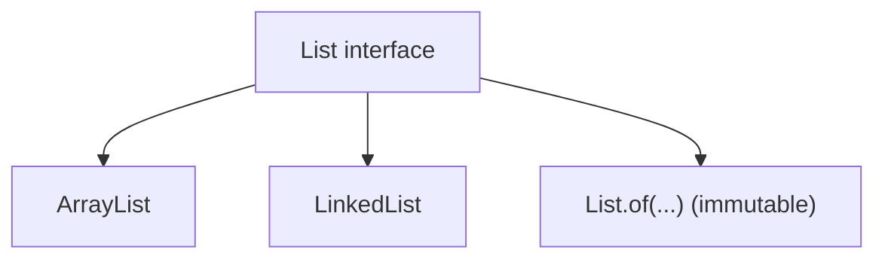

## Java List — Design, Internals, and Usage Guide (Java 8–21)

---

## 1. Purpose & Audience

- **Purpose**: Provide a production-style guide to Java `List` that explains:
  - **What `List` is and how it behaves** (ordering, indexing, mutability, equality).
  - **How core implementations work internally** (`ArrayList`, `LinkedList`).
  - **How to use List APIs from basic to enterprise scenarios**, including Java 8 streams and Java 21 `SequencedCollection` features.
  - **How to choose between `ArrayList`, `LinkedList`, immutable lists, and other variants**.
- **Audience**:
  - Java developers who use lists daily and want deeper understanding.
  - Engineers preparing for interviews (data structures, collections, streams).
  - Teams writing or reviewing production code that heavily relies on lists.

---

## 2. Overview of `List`

- **`List<E>`** is an **ordered, index-based collection** that can contain duplicate elements.
- Extends **`Collection<E>`** and **`Iterable<E>`**.
- Guarantees:
  - Elements have a **well-defined order** (typically insertion order).
  - Each element has an **integer index** from `0` to `size()-1`.
  - Equality and hash codes depend on element order and values.

### 2.1 Common implementations

- **`ArrayList<E>`**
  - Backed by a resizable array.
  - **Fast random access** (`get`, `set` ~ O(1)).
  - Adding/removing at the end is amortized **O(1)**.
  - Inserting/removing in the middle requires shifting elements (**O(n)**).
  - Most common general-purpose `List` implementation.

- **`LinkedList<E>`**
  - Doubly-linked list (nodes with `prev`/`next` pointers).
  - **Fast insertion/removal** at head/tail and known nodes (**O(1)**).
  - Access by index requires traversing from head or tail (**O(n)**).
  - Implements both `List` and `Deque` (queue/stack operations).

- **Immutable lists**
  - `List.of(...)` (Java 9+), `List.copyOf(...)`.
  - **Unmodifiable**: no `add`, `remove`, `set`; operations throw `UnsupportedOperationException`.
  - Do not allow `null` elements (`NullPointerException`).
  - Good for constants, safe sharing, and defensive copies.

- **`Arrays.asList(...)`**
  - Fixed-size **view** over an array.
  - Changes in the list reflect in the underlying array and vice versa.
  - Structural modifications (add/remove) are not allowed.

### 2.2 Behavior & fail-fast iterators

- All modifiable `List` implementations in `java.util` provide **fail-fast** iterators:
  - If the list is structurally modified after creating an iterator (except through the iterator itself), a `ConcurrentModificationException` may be thrown.
  - This is for debugging, not a concurrency guarantee.

---

## 3. Internal Design: ArrayList vs LinkedList

### 3.1 ArrayList internals (dynamic array)

- Fields (conceptually):
  - `Object[] elementData` — backing array.
  - `int size` — number of elements.
- Operations:
  - `get(index)`, `set(index, value)` → direct index into array (**O(1)**).
  - `add(value)` (append) → place at `elementData[size]`, increment `size`, grow array if needed.
  - `add(index, value)`, `remove(index)` → shift a section of the array with `System.arraycopy` (**O(n)**).
  - Resizing: when array is full, allocate a bigger array (e.g., 1.5x) and copy elements.

### 3.2 LinkedList internals (doubly-linked list)

- Node structure:
  - `E item`
  - `Node<E> prev`
  - `Node<E> next`
- Fields:
  - `Node<E> first`, `Node<E> last`
  - `int size`
- Operations:
  - `addFirst`, `addLast`, `removeFirst`, `removeLast` → adjust node pointers (**O(1)**).
  - `add(index, value)`, `remove(index)`:
    - Traverse from head or tail to index (**O(n)**).
    - Relink nodes to insert/remove (**O(1)** once node found).

### 3.3 Conceptual diagram



---

## 4. Construction & Basic Usage

```java
// Mutable lists
List<String> arrayList = new ArrayList<>();
List<String> linkedList = new LinkedList<>();

// Immutable lists (Java 9+)
List<String> immutable = List.of("a", "b", "c");

// Fixed-size view
List<String> fromArray = Arrays.asList("x", "y", "z");
```

Common guidelines:
- Prefer **`ArrayList`** for general-purpose use.
- Use **`LinkedList`** primarily when you need frequent insertions/removals at ends and are not indexing often.
- Use **`List.of` / `List.copyOf`** for read-only collections.

---

## 5. API Overview by Category

> The sections below summarize the `List` API. For **complete, method-by-method examples and outputs**, see **Appendix A**, which includes the full “Java List — Complete Guide (Java 8, Java 21)” reference.

### 5.1 Core operations

- **Add / insert**:
  - `boolean add(E e)`
  - `void add(int index, E e)`
  - `boolean addAll(Collection<? extends E> c)`
  - `boolean addAll(int index, Collection<? extends E> c)`

- **Access / modify**:
  - `E get(int index)`
  - `E set(int index, E element)`
  - `int size()`
  - `boolean isEmpty()`
  - `void clear()`

- **Remove**:
  - `E remove(int index)`
  - `boolean remove(Object o)`
  - `boolean removeAll(Collection<?> c)`
  - `boolean retainAll(Collection<?> c)`
  - `boolean removeIf(Predicate<? super E> filter)` (Java 8, via `Collection` default)

### 5.2 Search & containment

- `boolean contains(Object o)`
- `boolean containsAll(Collection<?> c)`
- `int indexOf(Object o)`
- `int lastIndexOf(Object o)`

### 5.3 Views, iterators, sublists

- `List<E> subList(int fromIndex, int toIndex)` — view; writes reflect in the original list.
- Iteration:
  - `Iterator<E> iterator()`
  - `ListIterator<E> listIterator()`
  - `ListIterator<E> listIterator(int index)`

### 5.4 Array conversion & equality

- `Object[] toArray()`
- `<T> T[] toArray(T[] a)`
- `boolean equals(Object o)` — element-wise equality with order.
- `int hashCode()` — consistent with `equals`.

### 5.5 Java 8 enhancements

- `void replaceAll(UnaryOperator<E> operator)`
- `void sort(Comparator<? super E> c)`

### 5.6 Java 21: `SequencedCollection` features

`List` extends `SequencedCollection` in Java 21, adding:

- `E getFirst()`
- `E getLast()`
- `void addFirst(E e)`
- `void addLast(E e)`
- `E removeFirst()`
- `E removeLast()`
- `List<E> reversed()` — a reversed view of the list.

These are implemented by `ArrayList`, `LinkedList`, and other standard list types.

---

## 6. Transformations & Data Pipelines

### 6.1 Basic transformations

- In-place transformation:

```java
List<String> list = new ArrayList<>(List.of("apple", "banana", "mango"));
list.replaceAll(String::toUpperCase);  // [APPLE, BANANA, MANGO]
```

- Creating a new transformed list (Java 8):

```java
List<String> upper = list.stream()
        .map(String::toUpperCase)
        .collect(Collectors.toList());
```

### 6.2 Filtering, searching, and sorting

- Filtering:

```java
List<String> filtered = list.stream()
        .filter(s -> s.startsWith("a"))
        .collect(Collectors.toList());
```

- Searching:

```java
Optional<String> first = list.stream()
        .filter(s -> s.length() > 3)
        .findFirst();
```

- Sorting:

```java
list.sort(Comparator.naturalOrder());         // ascending
list.sort(Comparator.reverseOrder());         // descending
```

### 6.3 Conversions: List ↔ Map

- List → Map (unique keys):

```java
List<String> words = List.of("apple", "banana", "mango");
Map<String, Integer> lengths = words.stream()
        .collect(Collectors.toMap(Function.identity(), String::length));
```

- List → Map (handling duplicates with merge):

```java
List<String> words = List.of("a", "b", "a", "c");
Map<String, Integer> freq = words.stream()
        .collect(Collectors.toMap(Function.identity(), w -> 1, Integer::sum));
```

See **Appendix A §5–8** for many more patterns (grouping, partitioning, etc.).

---

## 7. Enterprise Usage Patterns

### 7.1 DTO collections and pipelines

**Use case**: Convert domain objects to DTOs and return sorted, filtered lists from a service.

```java
public class UserService {

    private final UserRepository repository;

    public UserService(UserRepository repository) {
        this.repository = repository;
    }

    public List<UserDto> getActiveUsersSortedByName() {
        return repository.findAll().stream()
                .filter(User::isActive)
                .sorted(Comparator.comparing(User::getName))
                .map(user -> new UserDto(user.getId(), user.getName()))
                .collect(Collectors.toList());
    }
}
```

### 7.2 Grouping for reporting

**Use case**: Group records by status, type, or other attributes for dashboards or reporting.

```java
public Map<Status, List<Order>> groupOrdersByStatus(List<Order> orders) {
    return orders.stream()
            .collect(Collectors.groupingBy(Order::getStatus));
}
```

### 7.3 Partition for feature flags or segmentation

**Use case**: Split users into two lists based on a predicate (e.g., feature enabled).

```java
public Map<Boolean, List<User>> partitionByFeature(List<User> users) {
    return users.stream()
            .collect(Collectors.partitioningBy(User::hasNewFeature));
}
```

### 7.4 Chunking for batch processing

**Use case**: Break a large list into smaller batches to send to downstream systems.

```java
public static <T> List<List<T>> chunk(List<T> list, int chunkSize) {
    List<List<T>> chunks = new ArrayList<>();
    for (int i = 0; i < list.size(); i += chunkSize) {
        chunks.add(list.subList(i, Math.min(i + chunkSize, list.size())));
    }
    return chunks;
}
```

---

## 8. Performance & Pitfalls

### 8.1 Choosing the right implementation

- Prefer **`ArrayList`** when:
  - Most operations are reads, appends, or occasional middle insert/removal.
  - You need **O(1)** random access by index.

- Consider **`LinkedList`** when:
  - You frequently add/remove at the beginning or end.
  - You don’t often access by index.

- Prefer **immutable lists (`List.of`, `List.copyOf`)** when:
  - Data is read-only after construction.
  - You want to prevent accidental modifications and ease reasoning.

### 8.2 Common pitfalls

- **Modifying a list while iterating with for-each**:
  - Can cause `ConcurrentModificationException`.
  - Use `Iterator.remove()` or collect elements to remove in a temporary list.

- **Relying on `Arrays.asList` for mutability**:
  - It’s fixed-size. `add`/`remove` will throw `UnsupportedOperationException`.

- **Ignoring complexity of `LinkedList.get(index)`**:
  - It’s **O(n)**; do not use `LinkedList` when indexing is common.

- **Confusing immutable with unmodifiable views**:
  - `Collections.unmodifiableList` returns a view; original can still change.
  - `List.of` and `List.copyOf` create truly immutable lists (source changes do not affect them).

---

## 9. Quick Reference Cheat Sheet

- **Construction**:
  - `new ArrayList<>()`, `new LinkedList<>()`
  - `List.of(e1, e2, ...)`, `List.copyOf(collection)`

- **Core operations**:
  - Add: `add(e)`, `add(index, e)`, `addAll(c)`, `addAll(index, c)`
  - Access: `get(i)`, `set(i, e)`, `size()`, `isEmpty()`
  - Remove: `remove(i)`, `remove(o)`, `removeIf(pred)`, `clear()`

- **Search & containment**:
  - `contains(o)`, `containsAll(c)`, `indexOf(o)`, `lastIndexOf(o)`

- **Views & iteration**:
  - `subList(from, to)`, `iterator()`, `listIterator()`, `listIterator(index)`

- **Java 8 features**:
  - `replaceAll(UnaryOperator)`, `sort(Comparator)`
  - Streams: `list.stream()` → `filter`, `map`, `flatMap`, `collect`, etc.

- **Java 21 features (SequencedCollection)**:
  - `getFirst()`, `getLast()`, `addFirst()`, `addLast()`, `removeFirst()`, `removeLast()`, `reversed()`

---

## Appendix A: Java List — Complete Guide (Java 8, Java 21)

The following reference content provides a comprehensive, method-by-method view of `List` with examples and outputs, including transformations, List → Map, grouping, partitioning, and Java 8 / Java 21 examples.

---

## Java List — Complete Guide (Java 8, Java 21)

Introduction to `List`, all its methods with examples and output, transformations, List → Map, groupBy, partition, and Java 8 / Java 21 examples.

---

## Table of Contents

- [1. List introduction](#1-list-introduction)
- [2. All List methods with examples and output](#2-all-list-methods-with-examples-and-output)
  - [2.1 add, addAll](#2-1-add-addall)
  - [2.2 get, set, size, isEmpty, clear](#2-2-get-set-size-isempty-clear)
  - [2.3 remove](#2-3-remove)
  - [2.4 removeAll, retainAll](#2-4-removeall-retainall)
  - [2.5 contains, containsAll, indexOf, lastIndexOf](#2-5-contains-containsall-indexof-lastindexof)
  - [2.6 subList](#2-6-sublist)
  - [2.7 iterator, listIterator](#2-7-iterator-listiterator)
  - [2.8 toArray](#2-8-toarray)
  - [2.9 equals, hashCode](#2-9-equals-hashcode)
  - [2.10 replaceAll (Java 8)](#2-10-replaceall-java-8)
  - [2.11 sort (Java 8)](#2-11-sort-java-8)
  - [2.12 Java 21: reversed, getFirst, getLast, removeFirst, removeLast (SequencedCollection)](#2-12-java-21-reversed-getfirst-getlast-removefirst-removelast-sequencedcollection)
- [3. Transform: List of String to uppercase](#3-transform-list-of-string-to-uppercase)
- [4. Remove, replace, search, sort (asc/desc), add](#4-remove-replace-search-sort-asc-desc-add)
  - [4.1 Remove](#4-1-remove)
  - [4.2 Replace](#4-2-replace)
  - [4.3 Search](#4-3-search)
  - [4.4 Sort ascending and descending](#4-4-sort-ascending-and-descending)
  - [4.5 Add (recap)](#4-5-add-recap)
- [5. List to Map (Java 8)](#5-list-to-map-java-8)
  - [5.1 List to Map (key = element, value = something)](#5-1-list-to-map-key-element-value-something)
  - [5.2 List to Map with duplicate keys (merge)](#5-2-list-to-map-with-duplicate-keys-merge)
  - [5.3 List to Map with custom key and value](#5-3-list-to-map-with-custom-key-and-value)
- [6. groupBy (Java 8)](#6-groupby-java-8)
  - [6.1 groupingBy(classifier)](#6-1-groupingby-classifier)
  - [6.2 groupingBy(classifier, downstream)](#6-2-groupingby-classifier-downstream)
  - [6.3 groupingBy(classifier, mapFactory, downstream)](#6-3-groupingby-classifier-mapfactory-downstream)
- [7. Partition by (Java 8)](#7-partition-by-java-8)
- [8. Java 8 Stream + List — full coverage](#8-java-8-stream-list-full-coverage)
  - [8.1 filter, map, flatMap](#8-1-filter-map-flatmap)
  - [8.2 takeWhile, dropWhile (Java 9+)](#8-2-takewhile-dropwhile-java-9)
  - [8.3 distinct, sorted, limit, skip](#8-3-distinct-sorted-limit-skip)
  - [8.4 peek, forEach](#8-4-peek-foreach)
  - [8.5 reduce](#8-5-reduce)
  - [8.6 collect — toList, toSet, toMap, joining](#8-6-collect-tolist-toset-tomap-joining)
  - [8.7 summarizingInt / Double / Long](#8-7-summarizingint-double-long)
  - [8.8 mapping, filtering, flatMapping (downstream)](#8-8-mapping-filtering-flatmapping-downstream)
  - [8.9 minBy, maxBy (Collectors)](#8-9-minby-maxby-collectors)
  - [8.10 collectingAndThen](#8-10-collectingandthen)
  - [8.11 teeing (Java 12+)](#8-11-teeing-java-12)
  - [8.12 Optional from Stream](#8-12-optional-from-stream)
- [9. Java 8 interview-style examples](#9-java-8-interview-style-examples)
  - [9.1 Count frequency of each element](#9-1-count-frequency-of-each-element)
  - [9.2 First non-repeated character (from list of chars / strings)](#9-2-first-non-repeated-character-from-list-of-chars-strings)
  - [9.3 Sort by frequency then by value](#9-3-sort-by-frequency-then-by-value)
  - [9.4 List of lists → flat list](#9-4-list-of-lists-flat-list)
  - [9.5 Two lists → Map (key from first, value from second)](#9-5-two-lists-map-key-from-first-value-from-second)
  - [9.6 Chunk list into sublists of size n](#9-6-chunk-list-into-sublists-of-size-n)
  - [9.7 Remove duplicates preserving order](#9-7-remove-duplicates-preserving-order)
  - [9.8 Second largest / nth element](#9-8-second-largest-nth-element)
  - [9.9 List to Map with list index as value](#9-9-list-to-map-with-list-index-as-value)
  - [9.10 Partition by predicate (two lists)](#9-10-partition-by-predicate-two-lists)
- [10. Java 21 changes relevant to List](#10-java-21-changes-relevant-to-list)
  - [10.1 SequencedCollection (reversed, getFirst, getLast, addFirst, addLast, removeFirst, removeLast)](#10-1-sequencedcollection-reversed-getfirst-getlast-addfirst-addlast-removefirst-removelast)
  - [10.2 toList() returns unmodifiable (Java 16+)](#10-2-tolist-returns-unmodifiable-java-16)
  - [10.3 List.of / List.copyOf](#10-3-list-of-list-copyof)
  - [10.4 Pattern matching for switch (Java 21)](#10-4-pattern-matching-for-switch-java-21)
  - [10.5 SequencedCollections.reversed() and new collection types](#10-5-sequencedcollections-reversed-and-new-collection-types)
- [11. Quick reference table](#11-quick-reference-table)


---


## 1. List introduction

- **`List`** is an ordered, index-based collection that allows duplicates. It extends **`Collection`** and **`Iterable`**.
- Common implementations:
  - **`ArrayList`** — resizable array; fast get/set by index; add at end is O(1) amortized.
  - **`LinkedList`** — doubly linked list; fast add/remove at head/tail; get by index is O(n).
  - **`List.of(...)`** (Java 9+) — immutable list; fixed size; no nulls (throws NPE).
  - **`Arrays.asList(...)`** — fixed-size view over array; changes to list reflect in array; no structural change (no add/remove).

```java
List<String> arrayList = new ArrayList<>();
List<String> linkedList = new LinkedList<>();
List<String> immutable = List.of("a", "b", "c");
List<String> fromArray = Arrays.asList("x", "y", "z");
```

---

## 2. All List methods with examples and output

### 2.1 add, addAll

| Method | Description |
|--------|-------------|
| `boolean add(E e)` | Appends element; returns true |
| `void add(int index, E e)` | Inserts at index |
| `boolean addAll(Collection<? extends E> c)` | Appends all |
| `boolean addAll(int index, Collection<? extends E> c)` | Inserts all at index |

```java
List<String> list = new ArrayList<>();
list.add("apple");           // [apple]
list.add("banana");           // [apple, banana]
list.add(1, "mango");         // [apple, mango, banana]
list.addAll(List.of("x", "y")); // [apple, mango, banana, x, y]
list.addAll(0, List.of("first")); // [first, apple, mango, banana, x, y]
```

**Output:** `[first, apple, mango, banana, x, y]`

---

### 2.2 get, set, size, isEmpty, clear

| Method | Description |
|--------|-------------|
| `E get(int index)` | Element at index |
| `E set(int index, E e)` | Replaces at index; returns old element |
| `int size()` | Number of elements |
| `boolean isEmpty()` | true if size is 0 |
| `void clear()` | Removes all elements |

```java
List<String> list = new ArrayList<>(List.of("a", "b", "c"));
String el = list.get(1);        // "b"
String old = list.set(1, "B"); // old = "b", list = [a, B, c]
int n = list.size();            // 3
boolean empty = list.isEmpty(); // false
list.clear();                   // list = []
```

**Output:** `el = "b"`, `old = "b"`, `n = 3`, `empty = false`, after clear `list = []`

---

### 2.3 remove

| Method | Description |
|--------|-------------|
| `E remove(int index)` | Removes at index; returns removed element |
| `boolean remove(Object o)` | Removes first occurrence of o (equals); returns true if removed |

```java
List<String> list = new ArrayList<>(List.of("a", "b", "c", "b"));
String removed = list.remove(1);     // removed = "b", list = [a, c, b]
boolean removed2 = list.remove("b"); // removed2 = true, list = [a, c]
boolean removed3 = list.remove("z");  // removed3 = false
```

**Output:** `removed = "b"`, then `list = [a, c]`, `removed2 = true`, `removed3 = false`

---

### 2.4 removeAll, retainAll

| Method | Description |
|--------|-------------|
| `boolean removeAll(Collection<?> c)` | Removes all elements that are in c |
| `boolean retainAll(Collection<?> c)` | Keeps only elements that are in c |

```java
List<Integer> list = new ArrayList<>(List.of(1, 2, 3, 4, 5));
list.removeAll(List.of(2, 4));   // [1, 3, 5]
list.retainAll(List.of(1, 3));   // [1, 3]
```

**Output:** after removeAll `[1, 3, 5]`, after retainAll `[1, 3]`

---

### 2.5 contains, containsAll, indexOf, lastIndexOf

| Method | Description |
|--------|-------------|
| `boolean contains(Object o)` | true if list contains o (equals) |
| `boolean containsAll(Collection<?> c)` | true if list contains every element of c |
| `int indexOf(Object o)` | Index of first occurrence, or -1 |
| `int lastIndexOf(Object o)` | Index of last occurrence, or -1 |

```java
List<String> list = List.of("a", "b", "c", "b");
boolean has = list.contains("b");           // true
boolean hasAll = list.containsAll(List.of("a", "c")); // true
int first = list.indexOf("b");              // 1
int last = list.lastIndexOf("b");           // 3
int notFound = list.indexOf("z");          // -1
```

**Output:** `has = true`, `hasAll = true`, `first = 1`, `last = 3`, `notFound = -1`

---

### 2.6 subList

| Method | Description |
|--------|-------------|
| `List<E> subList(int fromIndex, int toIndex)` | View of range [fromIndex, toIndex); changes in subList reflect in original |

```java
List<String> list = new ArrayList<>(List.of("a", "b", "c", "d"));
List<String> sub = list.subList(1, 3);  // [b, c]
sub.set(0, "B");                         // list = [a, B, c, d]
```

**Output:** `sub = [b, c]`, after set: `list = [a, B, c, d]`

---

### 2.7 iterator, listIterator

| Method | Description |
|--------|-------------|
| `Iterator<E> iterator()` | Iterator over elements |
| `ListIterator<E> listIterator()` | ListIterator from start |
| `ListIterator<E> listIterator(int index)` | ListIterator from index (next() returns element at index) |

```java
List<String> list = List.of("a", "b", "c");
ListIterator<String> it = list.listIterator(1);
String next = it.next();    // "b"
String prev = it.previous(); // "b" (moved back)
int idx = it.nextIndex();   // 1
```

**Output:** `next = "b"`, `prev = "b"`, `idx = 1`

---

### 2.8 toArray

| Method | Description |
|--------|-------------|
| `Object[] toArray()` | New array of elements |
| `T[] toArray(T[] a)` | Elements into given array (or new array of same type if too small) |

```java
List<String> list = List.of("a", "b", "c");
Object[] arr1 = list.toArray();
String[] arr2 = list.toArray(new String[0]);
String[] arr3 = list.toArray(String[]::new);  // Java 11+
```

**Output:** `arr1 = ["a", "b", "c"]`, same for `arr2` and `arr3`

---

### 2.9 equals, hashCode

- **`equals`** — true if other is a List, same size, and corresponding elements are equal (equals).
- **`hashCode`** — consistent with equals.

```java
List.of(1, 2).equals(List.of(1, 2));   // true
List.of(1, 2).equals(List.of(2, 1));   // false
```

---

### 2.10 replaceAll (Java 8)

| Method | Description |
|--------|-------------|
| `void replaceAll(UnaryOperator<E> operator)` | Replaces each element with result of operator |

```java
List<Integer> list = new ArrayList<>(List.of(1, 2, 3));
list.replaceAll(x -> x * 2);
// list = [2, 4, 6]
```

**Output:** `[2, 4, 6]`

---

### 2.11 sort (Java 8)

| Method | Description |
|--------|-------------|
| `void sort(Comparator<? super E> c)` | Sorts list in place using comparator |

```java
List<Integer> list = new ArrayList<>(List.of(3, 1, 2));
list.sort(Comparator.naturalOrder());   // [1, 2, 3]
list.sort(Comparator.reverseOrder());  // [3, 2, 1]
```

**Output:** after naturalOrder `[1, 2, 3]`, after reverseOrder `[3, 2, 1]`

---

### 2.12 Java 21: reversed, getFirst, getLast, removeFirst, removeLast (SequencedCollection)

`List` extends **`SequencedCollection`** in Java 21. New methods:

| Method | Description |
|--------|-------------|
| `List<E> reversed()` | Read-only view in reverse order |
| `E getFirst()` | First element |
| `E getLast()` | Last element |
| `void addFirst(E e)` | Add at beginning (only if list supports it) |
| `void addLast(E e)` | Add at end |
| `E removeFirst()` | Remove and return first |
| `E removeLast()` | Remove and return last |

```java
List<String> list = new ArrayList<>(List.of("a", "b", "c"));
List<String> rev = list.reversed();  // view: [c, b, a]
String first = list.getFirst();      // "a"
String last = list.getLast();        // "c"
list.addFirst("0");                  // [0, a, b, c]
list.removeLast();                   // [0, a, b]
```

**Output:** `rev` is reversed view; `first = "a"`, `last = "c"`; after addFirst/removeLast: `[0, a, b]`

---

## 3. Transform: List of String to uppercase

Using **loop**, **replaceAll**, and **Stream (Java 8)**:

```java
List<String> list = new ArrayList<>(List.of("apple", "banana", "mango"));

// 1. Loop
for (int i = 0; i < list.size(); i++) {
    list.set(i, list.get(i).toUpperCase());
}

// 2. replaceAll (in-place)
list.replaceAll(String::toUpperCase);

// 3. Stream — new list (original unchanged)
List<String> upper = list.stream()
        .map(String::toUpperCase)
        .collect(Collectors.toList());  // Java 8
// Java 16+: .toList() returns unmodifiable list
```

**Output:** `[APPLE, BANANA, MANGO]`

---

## 4. Remove, replace, search, sort (asc/desc), add

### 4.1 Remove

```java
List<String> list = new ArrayList<>(List.of("a", "b", "c", "b", "a"));

// By index
list.remove(1);                    // [a, c, b, a]

// By object (first occurrence)
list.remove("b");                  // [a, c, a]

// Remove all matching (Java 8)
list.removeIf(s -> s.equals("a")); // [c]

// Remove all in collection
list = new ArrayList<>(List.of("a", "b", "c", "d"));
list.removeAll(List.of("b", "d")); // [a, c]
```

**Output:** after each step as commented.

---

### 4.2 Replace

```java
List<String> list = new ArrayList<>(List.of("a", "b", "c"));

// By index
list.set(1, "B");                  // [a, B, c]

// Replace all matching (Java 8)
list.replaceAll(s -> s.equals("B") ? "b" : s);

// Replace all with function
list.replaceAll(String::toUpperCase);  // [A, B, C]
```

---

### 4.3 Search

```java
List<String> list = List.of("apple", "banana", "mango", "berry");

// contains
boolean has = list.contains("mango");  // true

// indexOf / lastIndexOf
int idx = list.indexOf("banana");       // 1
int last = list.lastIndexOf("berry");   // 3

// Stream: find first match
Optional<String> first = list.stream()
        .filter(s -> s.startsWith("b"))
        .findFirst();                   // Optional["banana"]

// Stream: find any
Optional<String> any = list.stream()
        .filter(s -> s.length() > 5)
        .findAny();

// Stream: match any/all/none
boolean anyMatch = list.stream().anyMatch(s -> s.endsWith("e"));   // true
boolean allMatch = list.stream().allMatch(s -> s.length() >= 5);   // true
boolean noneMatch = list.stream().noneMatch(s -> s.isEmpty());     // true
```

---

### 4.4 Sort ascending and descending

```java
List<Integer> list = new ArrayList<>(List.of(3, 1, 4, 1, 5));

// Ascending (natural order)
list.sort(Comparator.naturalOrder());   // [1, 1, 3, 4, 5]

// Descending
list.sort(Comparator.reverseOrder());   // [5, 4, 3, 1, 1]

// Custom: by string length
List<String> words = new ArrayList<>(List.of("hi", "hello", "a"));
words.sort(Comparator.comparingInt(String::length));  // [a, hi, hello]

// Then by natural order for same length
words.sort(Comparator.comparingInt(String::length).thenComparing(Comparator.naturalOrder()));

// Reverse custom
words.sort(Comparator.comparingInt(String::length).reversed());
```

**Output:** as in comments.

---

### 4.5 Add (recap)

```java
List<String> list = new ArrayList<>();
list.add("a");
list.add(0, "first");
list.addAll(List.of("x", "y"));
list.addAll(1, List.of("p", "q"));
// [first, p, q, a, x, y]
```

---

## 5. List to Map (Java 8)

### 5.1 List to Map (key = element, value = something)

```java
List<String> list = List.of("a", "b", "c");

// key = element, value = length
Map<String, Integer> map = list.stream()
        .collect(Collectors.toMap(Function.identity(), String::length));
// {a=1, b=1, c=1}

// key = element, value = element (identity)
Map<String, String> identity = list.stream()
        .collect(Collectors.toMap(s -> s, s -> s));
// {a=a, b=b, c=c}
```

**Output:** `map = {a=1, b=1, c=1}`, `identity = {a=a, b=b, c=c}`

---

### 5.2 List to Map with duplicate keys (merge)

```java
List<String> list = List.of("a", "b", "a", "c");

// Duplicate key: keep first
Map<String, Integer> first = list.stream()
        .collect(Collectors.toMap(Function.identity(), s -> 1, (v1, v2) -> v1));
// {a=1, b=1, c=1}

// Duplicate key: sum (e.g. count)
Map<String, Integer> count = list.stream()
        .collect(Collectors.toMap(Function.identity(), s -> 1, Integer::sum));
// {a=2, b=1, c=1}
```

**Output:** `first = {a=1, b=1, c=1}`, `count = {a=2, b=1, c=1}`

---

### 5.3 List to Map with custom key and value

```java
List<String> list = List.of("apple", "banana", "mango");

// key = first char, value = string
Map<Character, String> byFirst = list.stream()
        .collect(Collectors.toMap(s -> s.charAt(0), Function.identity(), (a, b) -> a));
// {a=apple, b=banana, m=mango}

// key = length, value = list of strings (see groupBy)
Map<Integer, List<String>> byLength = list.stream()
        .collect(Collectors.groupingBy(String::length));
// {5=[apple, mango], 6=[banana]}
```

---

## 6. groupBy (Java 8)

**`Collectors.groupingBy`** — group list elements by a classifier; value is a list (or custom downstream).

### 6.1 groupingBy(classifier)

```java
List<String> list = List.of("apple", "apricot", "banana", "berry", "mango");

// Group by first character
Map<Character, List<String>> byFirst = list.stream()
        .collect(Collectors.groupingBy(s -> s.charAt(0)));
// {a=[apple, apricot], b=[banana, berry], m=[mango]}
```

**Output:** `{a=[apple, apricot], b=[banana, berry], m=[mango]}`

---

### 6.2 groupingBy(classifier, downstream)

```java
List<String> list = List.of("apple", "apricot", "banana", "berry", "mango");

// Group by first char, value = count
Map<Character, Long> countByFirst = list.stream()
        .collect(Collectors.groupingBy(s -> s.charAt(0), Collectors.counting()));
// {a=2, b=2, m=1}

// Group by length, value = set (no duplicates)
Map<Integer, Set<String>> setByLength = list.stream()
        .collect(Collectors.groupingBy(String::length, Collectors.toSet()));

// Group by first char, value = joined string
Map<Character, String> joined = list.stream()
        .collect(Collectors.groupingBy(s -> s.charAt(0),
                Collectors.mapping(String::toUpperCase, Collectors.joining(", "))));
// {a=APPLE, APRICOT, b=BANANA, BERRY, m=MANGO}
```

---

### 6.3 groupingBy(classifier, mapFactory, downstream)

```java
List<String> list = List.of("a", "b", "a", "c");

// Group by identity, store in LinkedHashMap (insertion order)
Map<String, List<String>> ordered = list.stream()
        .collect(Collectors.groupingBy(Function.identity(), LinkedHashMap::new, Collectors.toList()));
// {a=[a, a], b=[b], c=[c]}  (keys in encounter order)
```

---

## 7. Partition by (Java 8)

**`Collectors.partitioningBy(Predicate)`** — splits into two groups: keys are `true` and `false`.

```java
List<Integer> list = List.of(1, 2, 3, 4, 5, 6);

// Partition by even/odd
Map<Boolean, List<Integer>> evenOdd = list.stream()
        .collect(Collectors.partitioningBy(n -> n % 2 == 0));
// {false=[1, 3, 5], true=[2, 4, 6]}
```

**Output:** `{false=[1, 3, 5], true=[2, 4, 6]}`

```java
// With downstream: count per partition
Map<Boolean, Long> count = list.stream()
        .collect(Collectors.partitioningBy(n -> n % 2 == 0, Collectors.counting()));
// {false=3, true=3}
```

---

## 8. Java 8 Stream + List — full coverage

**Typical imports for examples below:**
```java
import java.util.*;
import java.util.stream.*;
import java.util.function.*;
```

### 8.1 filter, map, flatMap

```java
List<String> list = List.of("apple", "banana", "apricot", "berry");

List<String> filtered = list.stream()
        .filter(s -> s.startsWith("a"))
        .collect(Collectors.toList());
// [apple, apricot]

List<Integer> lengths = list.stream()
        .map(String::length)
        .collect(Collectors.toList());
// [5, 6, 7, 5]

// flatMap: list of lists to single list
List<List<Integer>> nested = List.of(List.of(1, 2), List.of(3, 4));
List<Integer> flat = nested.stream()
        .flatMap(List::stream)
        .collect(Collectors.toList());
// [1, 2, 3, 4]
```

---

### 8.2 takeWhile, dropWhile (Java 9+)

```java
List<Integer> list = List.of(1, 2, 3, 4, 5, 2, 1);
// takeWhile: take elements while predicate is true, then stop
List<Integer> taken = list.stream().takeWhile(n -> n < 4).collect(Collectors.toList());
// [1, 2, 3]

// dropWhile: skip elements while predicate is true, then take the rest
List<Integer> dropped = list.stream().dropWhile(n -> n < 4).collect(Collectors.toList());
// [4, 5, 2, 1]
```

**Output:** `taken = [1, 2, 3]`, `dropped = [4, 5, 2, 1]`

---

### 8.3 distinct, sorted, limit, skip

```java
List<Integer> list = List.of(3, 1, 2, 1, 3);
List<Integer> distinct = list.stream().distinct().collect(Collectors.toList());   // [3, 1, 2]
List<Integer> sorted = list.stream().sorted().collect(Collectors.toList());        // [1, 1, 2, 3, 3]
List<Integer> limited = list.stream().limit(2).collect(Collectors.toList());       // [3, 1]
List<Integer> skipped = list.stream().skip(2).collect(Collectors.toList());         // [2, 1, 3]
```

---

### 8.4 peek, forEach

```java
List<String> list = new ArrayList<>(List.of("a", "b", "c"));
List<String> result = list.stream()
        .peek(s -> System.out.println("element: " + s))
        .map(String::toUpperCase)
        .collect(Collectors.toList());
// peek: side-effect (e.g. debug); forEach: terminal, no return
list.forEach(System.out::println);
```

---

### 8.5 reduce

```java
List<Integer> list = List.of(1, 2, 3, 4, 5);
Optional<Integer> sum = list.stream().reduce(Integer::sum);        // Optional[15]
Integer sumWithIdentity = list.stream().reduce(0, Integer::sum);  // 15
Optional<Integer> product = list.stream().reduce((a, b) -> a * b); // Optional[120]
```

---

### 8.6 collect — toList, toSet, toMap, joining

```java
List<String> list = List.of("a", "b", "c");
List<String> toList = list.stream().collect(Collectors.toList());  // Java 8; Java 16+: .toList()
Set<String> toSet = list.stream().collect(Collectors.toSet());
Map<String, Integer> toMap = list.stream()
        .collect(Collectors.toMap(Function.identity(), String::length));
String joined = list.stream().collect(Collectors.joining(", "));  // "a, b, c"
String joinedWithPrefixSuffix = list.stream()
        .collect(Collectors.joining(", ", "[", "]"));  // "[a, b, c]"
```

---

### 8.7 summarizingInt / Double / Long

```java
List<Integer> list = List.of(10, 20, 30, 40, 50);
IntSummaryStatistics stats = list.stream()
        .collect(Collectors.summarizingInt(Integer::intValue));
// count=5, sum=150, min=10, max=50, average=30.0
```

---

### 8.8 mapping, filtering, flatMapping (downstream)

Use **`Collectors.mapping`** (or **`filtering`**, **`flatMapping`**) as a **downstream** collector to transform the elements in each group before collecting them.

```java
List<String> list = List.of("apple", "banana", "apricot");
Map<Integer, List<Character>> lengthToFirstChars = list.stream()
        .collect(Collectors.groupingBy(String::length,
                Collectors.mapping(s -> s.charAt(0), Collectors.toList())));
```

**Output:** `{5=[a, a], 6=[b]}`

- **groupingBy(String::length)** — groups by length: length 5 → ["apple", "apricot"], length 6 → ["banana"].
- **Collectors.mapping(s -> s.charAt(0), Collectors.toList())** — for each group, maps each string to its first character, then collects those characters into a list. So length 5 → [a, a], length 6 → [b].

**Explanation:** The **downstream** collector says “after grouping, don’t just collect the strings in a list; first map each string to its first character, then collect those characters.” So the map’s values are `List<Character>` (first letter of each word in that length group), not `List<String>`.

---

### 8.9 minBy, maxBy (Collectors)

```java
List<String> list = List.of("apple", "banana", "apricot");
Optional<String> min = list.stream().collect(Collectors.minBy(Comparator.naturalOrder()));
// Optional["apple"]
Optional<String> maxByLength = list.stream()
        .collect(Collectors.maxBy(Comparator.comparingInt(String::length)));
// Optional["banana"]
```

---

### 8.10 collectingAndThen

Apply a final function to the result of a collector:

```java
List<String> list = List.of("a", "b", "c");
List<String> unmodifiable = list.stream()
        .collect(Collectors.collectingAndThen(Collectors.toList(), Collections::unmodifiableList));
```

---

### 8.11 teeing (Java 12+)

Combine two collectors into one:

```java
List<Integer> list = List.of(1, 2, 3, 4, 5);
Map<String, Object> teed = list.stream()
        .collect(Collectors.teeing(
                Collectors.summingInt(Integer::intValue),
                Collectors.averagingDouble(Integer::doubleValue),
                (sum, avg) -> Map.of("sum", sum, "avg", avg)
        ));
// {sum=15, avg=3.0}
```

---

### 8.12 Optional from Stream

```java
List<String> list = List.of("a", "bb", "ccc");
Optional<String> firstLong = list.stream()
        .filter(s -> s.length() > 2)
        .findFirst();
Optional<String> any = list.stream().filter(s -> s.length() > 1).findAny();
Optional<String> max = list.stream().max(Comparator.comparingInt(String::length));
Optional<String> min = list.stream().min(Comparator.naturalOrder());
```

---

## 9. Java 8 interview-style examples

### 9.1 Count frequency of each element

```java
List<String> list = List.of("a", "b", "a", "c", "b", "a");
Map<String, Long> freq = list.stream()
        .collect(Collectors.groupingBy(Function.identity(), Collectors.counting()));
// {a=3, b=2, c=1}
```

---

### 9.2 First non-repeated character (from list of chars / strings)

```java
List<String> list = List.of("a", "b", "a", "c", "b");
Optional<String> firstNonRepeated = list.stream()
        .collect(Collectors.groupingBy(Function.identity(), Collectors.counting()))
        .entrySet().stream()
        .filter(e -> e.getValue() == 1)
        .map(Map.Entry::getKey)
        .findFirst();
// Optional["c"]
```

---

### 9.3 Sort by frequency then by value

```java
List<String> list = List.of("a", "b", "a", "c", "b", "a");
Map<String, Long> freq = list.stream()
        .collect(Collectors.groupingBy(Function.identity(), Collectors.counting()));
List<String> sorted = list.stream()
        .distinct()
        .sorted(Comparator.comparing(freq::get).reversed().thenComparing(Function.identity()))
        .collect(Collectors.toList());
// [a, b, c]  (a=3, b=2, c=1)
```

---

### 9.4 List of lists → flat list

```java
List<List<Integer>> lists = List.of(List.of(1, 2), List.of(3, 4), List.of(5));
List<Integer> flat = lists.stream().flatMap(List::stream).collect(Collectors.toList());
// [1, 2, 3, 4, 5]
```

---

### 9.5 Two lists → Map (key from first, value from second)

```java
List<String> keys = List.of("a", "b", "c");
List<Integer> values = List.of(1, 2, 3);
Map<String, Integer> map = IntStream.range(0, keys.size())
        .boxed()
        .collect(Collectors.toMap(keys::get, values::get));
// {a=1, b=2, c=3}
```

---

### 9.6 Chunk list into sublists of size n

```java
List<Integer> list = List.of(1, 2, 3, 4, 5, 6);
int chunkSize = 2;
List<List<Integer>> chunks = new ArrayList<>();
for (int i = 0; i < list.size(); i += chunkSize) {
    chunks.add(list.subList(i, Math.min(i + chunkSize, list.size())));
}
// [[1, 2], [3, 4], [5, 6]]

// Java 8 with streams (custom collector or iterate):
List<List<Integer>> chunks2 = IntStream.range(0, (list.size() + chunkSize - 1) / chunkSize)
        .mapToObj(i -> list.subList(i * chunkSize, Math.min((i + 1) * chunkSize, list.size())))
        .collect(Collectors.toList());
```

---

### 9.7 Remove duplicates preserving order

```java
List<String> list = List.of("a", "b", "a", "c", "b");
List<String> distinct = list.stream().distinct().collect(Collectors.toList());
// [a, b, c]
```

---

### 9.8 Second largest / nth element

```java
List<Integer> list = List.of(5, 2, 8, 1, 9);
Optional<Integer> secondLargest = list.stream()
        .sorted(Comparator.reverseOrder())
        .skip(1)
        .findFirst();
// Optional[8]
```

---

### 9.9 List to Map with list index as value

```java
List<String> list = List.of("a", "b", "c");
Map<String, Integer> indexMap = IntStream.range(0, list.size())
        .boxed()
        .collect(Collectors.toMap(list::get, i -> i));
// {a=0, b=1, c=2}
```

---

### 9.10 Partition by predicate (two lists)

```java
List<Integer> list = List.of(1, 2, 3, 4, 5);
Map<Boolean, List<Integer>> partition = list.stream()
        .collect(Collectors.partitioningBy(n -> n % 2 == 0));
List<Integer> evens = partition.get(true);   // [2, 4]
List<Integer> odds = partition.get(false);  // [1, 3, 5]
```

---

## 10. Java 21 changes relevant to List

### 10.1 SequencedCollection (reversed, getFirst, getLast, addFirst, addLast, removeFirst, removeLast)

Already shown in **§2.12**. `ArrayList` and `LinkedList` support these.

### 10.2 toList() returns unmodifiable (Java 16+)

`Stream.toList()` returns an **unmodifiable** list (Java 16+). For a modifiable list use:

```java
List<String> modifiable = stream.collect(Collectors.toCollection(ArrayList::new));
```

### 10.3 List.of / List.copyOf

- **`List.of(...)`** — immutable, no nulls, fixed size.
- **`List.copyOf(Collection)`** — immutable copy; nulls throw NPE.

```java
List<String> copy = List.copyOf(someList);
```

### 10.4 Pattern matching for switch (Java 21)

```java
Object obj = List.of(1, 2, 3);
String result = switch (obj) {
    case List<?> l -> "List with size " + l.size();
    default -> "other";
};
```

### 10.5 SequencedCollections.reversed() and new collection types

- **`reversed()`** — read-only reverse view.
- **`LinkedHashSet`** / **`ArrayList`** implement **`SequencedCollection`**; **`LinkedHashMap`** implements **`SequencedMap`**.

---

## 11. Quick reference table

| Topic | Java 8 / 21 API |
|-------|------------------|
| Transform (e.g. uppercase) | `list.replaceAll(String::toUpperCase)` or `stream().map(String::toUpperCase).toList()` |
| Remove by condition | `list.removeIf(predicate)` |
| Replace | `list.set(i, e)` or `list.replaceAll(UnaryOperator)` |
| Search | `list.contains`, `indexOf`, `lastIndexOf`, `stream().filter().findFirst()` |
| Sort asc | `list.sort(Comparator.naturalOrder())` |
| Sort desc | `list.sort(Comparator.reverseOrder())` |
| List → Map | `stream().collect(Collectors.toMap(k, v))` or `toMap(k, v, merge)` |
| Group by | `Collectors.groupingBy(classifier)` or `groupingBy(classifier, downstream)` |
| Partition | `Collectors.partitioningBy(predicate)` |
| Java 21 List | `getFirst()`, `getLast()`, `reversed()`, `addFirst`, `addLast`, `removeFirst`, `removeLast` |

---

All examples use **Java 8** streams and collectors; Java 16+ `toList()` and Java 21 **SequencedCollection** are called out where they apply.

