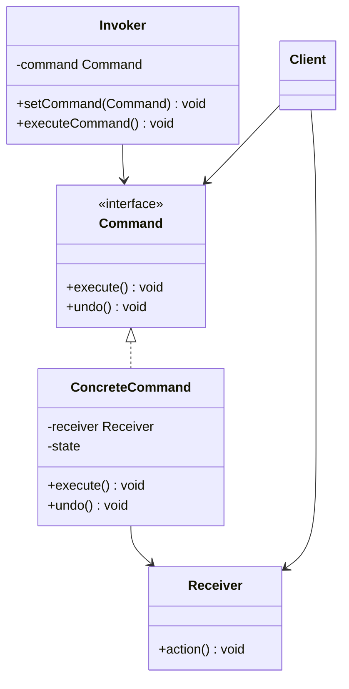
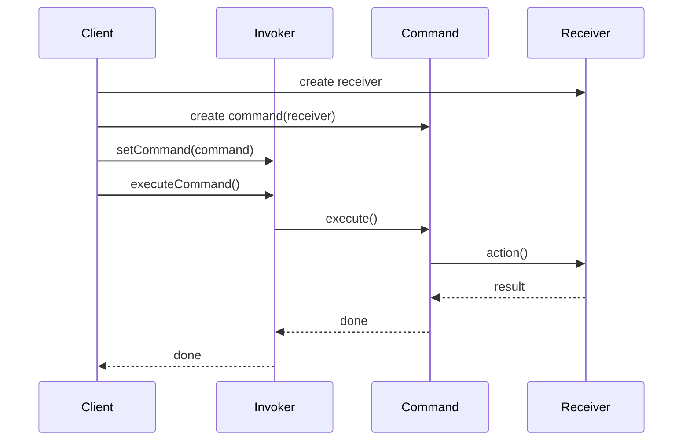
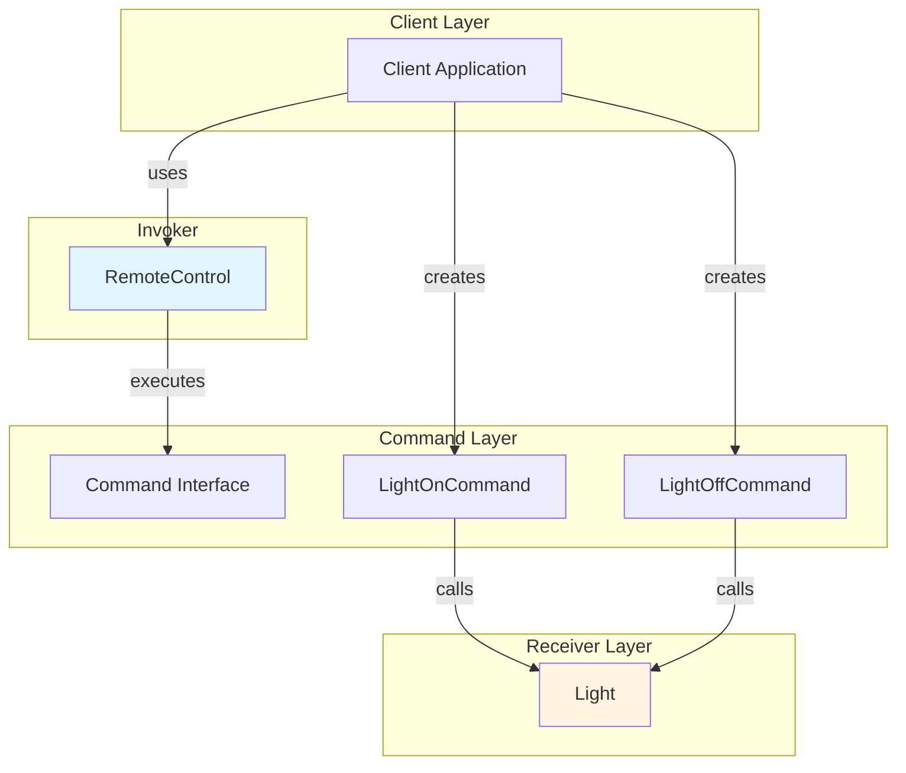

# Command Pattern


## Table of Contents

- [Overview](#overview)
- [Diagram Images](#diagram-images)
- [Intent](#intent)
- [Type](#type)
- [Problem](#problem)
- [Solution](#solution)
- [UML Class Diagram](#uml-class-diagram)
- [Sequence Diagram](#sequence-diagram)
- [Structure](#structure)
  - [Components](#components)
- [When to Use](#when-to-use)
- [Examples in This Repository](#examples-in-this-repository)
  - [Example 1: Remote Control](#example-1-remote-control)
  - [Example 2: Text Editor Commands](#example-2-text-editor-commands)
- [System Architecture](#system-architecture)
- [Pros](#pros)
- [Cons](#cons)
- [Real-World Applications](#real-world-applications)
  - [Software Development](#software-development)
  - [Specific Examples](#specific-examples)
- [Related Patterns](#related-patterns)
- [Implementation Variations](#implementation-variations)
  - [Simple Command](#simple-command)
  - [Undoable Command](#undoable-command)
  - [Macro Command](#macro-command)
- [Code Example](#code-example)
- [Undo Functionality](#undo-functionality)
- [Best Practices](#best-practices)
- [Source Code](#source-code)
  - [`Command.java`](#command-java)
  - [`CommandDemo.java`](#commanddemo-java)
  - [`DeleteCommand.java`](#deletecommand-java)
  - [`Light.java`](#light-java)
  - [`LightOffCommand.java`](#lightoffcommand-java)
  - [`LightOnCommand.java`](#lightoncommand-java)
  - [`RemoteControl.java`](#remotecontrol-java)
  - [`TextEditor.java`](#texteditor-java)
  - [`WriteCommand.java`](#writecommand-java)


---

## Overview

## Diagram Images


The Command pattern encapsulates a request as an object, allowing you to parameterize clients with different requests, queue requests, and support undo operations.

## Intent

- Encapsulate a request as an object
- Parameterize objects with operations
- Queue operations
- Support undoable operations
- Log requests

## Type

**Behavioral Pattern** - Encapsulates requests and operations.

## Problem

You need to issue requests to objects without knowing anything about the operation being requested or the receiver of the request. You want to parameterize objects with operations, queue operations, and support undo.

## Solution

Turn the request into an object that can be stored and passed around. This object includes the operation to perform and all necessary parameters.

## UML Class Diagram



## Sequence Diagram



## Structure

### Components

1. **Command** - Declares an interface for executing an operation
2. **ConcreteCommand** - Defines a binding between a Receiver and an action, implements execute()
3. **Client** - Creates a ConcreteCommand and sets its receiver
4. **Invoker** - Asks the command to carry out the request
5. **Receiver** - Knows how to perform the operations associated with carrying out a request

## When to Use

- Parameterize objects by an action to perform
- Specify, queue, and execute requests at different times
- Support undo
- Support logging changes
- Structure a system around high-level operations built on primitives

## Examples in This Repository

### Example 1: Remote Control
- **Command**: `Command` interface
- **ConcreteCommands**: `LightOnCommand`, `LightOffCommand`
- **Receiver**: `Light` class
- **Invoker**: `RemoteControl` class
- **Use Case**: Remote control that can execute commands without knowing device details

### Example 2: Text Editor Commands
- **Command**: `Command` interface
- **ConcreteCommands**: `WriteCommand`, `DeleteCommand`
- **Receiver**: `TextEditor` class
- **Use Case**: Text editor with undo/redo functionality

## System Architecture



## Pros

- **Decoupling**: Decouples object that invokes operation from object that performs it
- **Undo/Redo**: Easy to implement undo/redo functionality
- **Macro Commands**: Can compose commands into macro commands
- **Queuing**: Can queue and log requests
- **Extensibility**: Easy to add new commands

## Cons

- **Increased Objects**: Creates many command objects
- **Complexity**: Can increase code complexity
- **Memory**: May require storing command history

## Real-World Applications

### Software Development
- **Text Editors**: Undo/redo functionality
- **GUI Frameworks**: Menu commands, button actions
- **Transaction Systems**: Database transactions
- **Remote Procedure Calls**: Encapsulating remote requests

### Specific Examples
- **Remote Controls**: Home automation systems
- **Game Development**: Game actions and replay
- **Workflow Systems**: Task execution and rollback
- **Version Control**: Git commands

## Related Patterns

- **Composite**: Can compose commands into macro commands
- **Memento**: Used to implement undo functionality
- **Prototype**: Can clone commands for queuing

## Implementation Variations

### Simple Command
- Just executes an operation
- No undo functionality

### Undoable Command
- Stores state for undo
- Implements undo() method

### Macro Command
- Composed of multiple commands
- Executes all commands in sequence

## Code Example

```java
// Command Interface
public interface Command {
    void execute();
}

// Concrete Command
public class LightOnCommand implements Command {
    private Light light;
    
    public LightOnCommand(Light light) {
        this.light = light;
    }
    
    @Override
    public void execute() {
        light.turnOn();
    }
}

// Receiver
public class Light {
    public void turnOn() {
        System.out.println("Light is ON");
    }
    
    public void turnOff() {
        System.out.println("Light is OFF");
    }
}

// Invoker
public class RemoteControl {
    private Command command;
    
    public void setCommand(Command command) {
        this.command = command;
    }
    
    public void pressButton() {
        command.execute();
    }
}
```

## Undo Functionality

To support undo, commands need to:
1. Store previous state
2. Implement undo() method
3. Maintain command history in invoker

## Best Practices

1. **Immutable Commands**: Make commands immutable when possible
2. **Command History**: Store command history for undo
3. **Validation**: Validate commands before execution
4. **Error Handling**: Handle command execution errors gracefully

## Source Code

### `Command.java`

```java
package com.cursor.designpatterns.behavioral.command;

/**
 * Command interface.
 * 
 * <p>The Command pattern encapsulates a request as an object, allowing you to
 * parameterize clients with different requests, queue requests, and support undo operations.</p>
 * 
 * @author Design Patterns
 * @version 1.0
 * @since 1.0
 */
public interface Command {
    
    /**
     * Executes the command.
     */
    void execute();
}
```

### `CommandDemo.java`

```java
package com.cursor.designpatterns.behavioral.command;

/**
 * Demo class to demonstrate Command pattern.
 * 
 * <p>This demo shows two examples:</p>
 * <ol>
 *   <li>Remote Control - Using commands to control devices</li>
 *   <li>Text Editor - Using commands for text operations</li>
 * </ol>
 * 
 * <p><strong>Command Pattern Benefits:</strong></p>
 * <ul>
 *   <li>Encapsulates requests as objects</li>
 *   <li>Supports undo/redo operations</li>
 *   <li>Allows queuing and logging of requests</li>
 * </ul>
 * 
 * @author Design Patterns
 * @version 1.0
 * @since 1.0
 */
public class CommandDemo {
    
    public static void main(String[] args) {
        System.out.println("=== Command Pattern Demo ===\n");
        
        // Example 1: Remote Control
        System.out.println("Example 1: Remote Control");
        System.out.println("---------------------------");
        
        Light light = new Light();
        Command lightOn = new LightOnCommand(light);
        Command lightOff = new LightOffCommand(light);
        
        RemoteControl remote = new RemoteControl();
        
        remote.setCommand(lightOn);
        remote.pressButton();
        
        remote.setCommand(lightOff);
        remote.pressButton();
        
        System.out.println();
        
        // Example 2: Text Editor
        System.out.println("Example 2: Text Editor");
        System.out.println("------------------------");
        
        TextEditor editor = new TextEditor();
        Command writeHello = new WriteCommand(editor, "Hello ");
        Command writeWorld = new WriteCommand(editor, "World");
        Command delete = new DeleteCommand(editor, 5);
        
        writeHello.execute();
        writeWorld.execute();
        delete.execute();
    }
}
```

### `DeleteCommand.java`

```java
package com.cursor.designpatterns.behavioral.command;

/**
 * Delete Command (Concrete Command for second example).
 * 
 * @author Design Patterns
 * @version 1.0
 * @since 1.0
 */
public class DeleteCommand implements Command {
    
    private TextEditor editor;
    private int length;
    
    public DeleteCommand(TextEditor editor, int length) {
        this.editor = editor;
        this.length = length;
    }
    
    @Override
    public void execute() {
        editor.delete(length);
    }
}
```

### `Light.java`

```java
package com.cursor.designpatterns.behavioral.command;

/**
 * Light class (Receiver).
 * 
 * @author Design Patterns
 * @version 1.0
 * @since 1.0
 */
public class Light {
    
    public void turnOn() {
        System.out.println("Light is ON");
    }
    
    public void turnOff() {
        System.out.println("Light is OFF");
    }
}
```

### `LightOffCommand.java`

```java
package com.cursor.designpatterns.behavioral.command;

/**
 * Light Off Command (Concrete Command).
 * 
 * @author Design Patterns
 * @version 1.0
 * @since 1.0
 */
public class LightOffCommand implements Command {
    
    private Light light;
    
    public LightOffCommand(Light light) {
        this.light = light;
    }
    
    @Override
    public void execute() {
        light.turnOff();
    }
}
```

### `LightOnCommand.java`

```java
package com.cursor.designpatterns.behavioral.command;

/**
 * Light On Command (Concrete Command).
 * 
 * @author Design Patterns
 * @version 1.0
 * @since 1.0
 */
public class LightOnCommand implements Command {
    
    private Light light;
    
    public LightOnCommand(Light light) {
        this.light = light;
    }
    
    @Override
    public void execute() {
        light.turnOn();
    }
}
```

### `RemoteControl.java`

```java
package com.cursor.designpatterns.behavioral.command;

/**
 * Remote Control class (Invoker).
 * 
 * <p>This invoker class holds a command and can execute it when needed.</p>
 * 
 * @author Design Patterns
 * @version 1.0
 * @since 1.0
 */
public class RemoteControl {
    
    private Command command;
    
    /**
     * Sets the command to execute.
     * 
     * @param command the command to set
     */
    public void setCommand(Command command) {
        this.command = command;
    }
    
    /**
     * Presses the button, which executes the command.
     */
    public void pressButton() {
        command.execute();
    }
}
```

### `TextEditor.java`

```java
package com.cursor.designpatterns.behavioral.command;

/**
 * Text Editor class (Receiver for second example).
 * 
 * @author Design Patterns
 * @version 1.0
 * @since 1.0
 */
public class TextEditor {
    
    private StringBuilder text = new StringBuilder();
    
    public void write(String text) {
        this.text.append(text);
        System.out.println("Text written: " + text);
        System.out.println("Current text: " + this.text.toString());
    }
    
    public void delete(int length) {
        if (length <= text.length()) {
            text.delete(text.length() - length, text.length());
            System.out.println("Deleted " + length + " characters");
            System.out.println("Current text: " + text.toString());
        }
    }
    
    public String getText() {
        return text.toString();
    }
}
```

### `WriteCommand.java`

```java
package com.cursor.designpatterns.behavioral.command;

/**
 * Write Command (Concrete Command for second example).
 * 
 * @author Design Patterns
 * @version 1.0
 * @since 1.0
 */
public class WriteCommand implements Command {
    
    private TextEditor editor;
    private String text;
    
    public WriteCommand(TextEditor editor, String text) {
        this.editor = editor;
        this.text = text;
    }
    
    @Override
    public void execute() {
        editor.write(text);
    }
}
```
