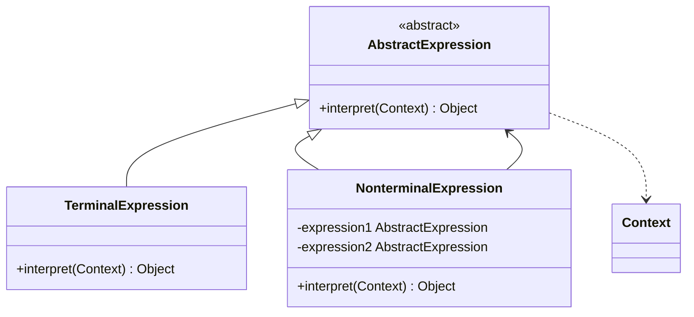

# Interpreter Pattern


## Table of Contents

- [Overview](#overview)
- [Diagram Images](#diagram-images)
- [Intent](#intent)
- [Type](#type)
- [Problem](#problem)
- [Solution](#solution)
- [UML Class Diagram](#uml-class-diagram)
- [When to Use](#when-to-use)
- [Examples in This Repository](#examples-in-this-repository)
  - [Expression Interpreter](#expression-interpreter)
- [Pros](#pros)
- [Cons](#cons)
- [Code Example](#code-example)
- [Source Code](#source-code)
  - [`AddExpression.java`](#addexpression-java)
  - [`Context.java`](#context-java)
  - [`Expression.java`](#expression-java)
  - [`InterpreterDemo.java`](#interpreterdemo-java)
  - [`NumberExpression.java`](#numberexpression-java)
  - [`SubtractExpression.java`](#subtractexpression-java)


---

## Overview

## Diagram Images


The Interpreter pattern defines a grammatical representation for a language and provides an interpreter to deal with this grammar.

## Intent

- Define grammar for a language
- Represent grammar rules as classes
- Interpret sentences in the language
- Build interpreters for domain-specific languages

## Type

**Behavioral Pattern** - Implements language interpretation.

## Problem

You need to implement a simple language or grammar. Writing a full parser is overkill, but you need to interpret expressions.

## Solution

Represent each grammar rule as a class. Use composite structure to represent sentences. Evaluate expressions recursively.

## UML Class Diagram



## When to Use

- Grammar is simple
- Efficiency is not critical
- Want to represent language as parse trees

## Examples in This Repository

### Expression Interpreter
- **Expression**: Interface for expressions
- **Terminal**: NumberExpression
- **Non-terminal**: AddExpression, SubtractExpression
- **Use Case**: Evaluate arithmetic expressions

## Pros

- **Easy to Implement**: Simple grammars are easy to implement
- **Extensibility**: Easy to extend with new expressions
- **Clear Structure**: Grammar rules map to classes

## Cons

- **Complex Grammars**: Complex grammars require many classes
- **Performance**: Interpreters can be slow
- **Maintenance**: Hard to maintain for complex languages

## Code Example

```java
// Expression Interface
public interface Expression {
    int interpret(Context context);
}

// Terminal Expression
public class NumberExpression implements Expression {
    private int number;
    
    public NumberExpression(int number) {
        this.number = number;
    }
    
    @Override
    public int interpret(Context context) {
        return number;
    }
}

// Non-terminal Expression
public class AddExpression implements Expression {
    private Expression left;
    private Expression right;
    
    public AddExpression(Expression left, Expression right) {
        this.left = left;
        this.right = right;
    }
    
    @Override
    public int interpret(Context context) {
        return left.interpret(context) + right.interpret(context);
    }
}
```

## Source Code

### `AddExpression.java`

```java
package com.cursor.designpatterns.behavioral.interpreter;

/**
 * Add Expression (Non-terminal Expression).
 * 
 * @author Design Patterns
 * @version 1.0
 * @since 1.0
 */
public class AddExpression implements Expression {
    
    private Expression left;
    private Expression right;
    
    public AddExpression(Expression left, Expression right) {
        this.left = left;
        this.right = right;
    }
    
    @Override
    public int interpret(Context context) {
        return left.interpret(context) + right.interpret(context);
    }
}
```

### `Context.java`

```java
package com.cursor.designpatterns.behavioral.interpreter;

/**
 * Context class for Interpreter pattern.
 * 
 * @author Design Patterns
 * @version 1.0
 * @since 1.0
 */
public class Context {
    // Context data if needed
}
```

### `Expression.java`

```java
package com.cursor.designpatterns.behavioral.interpreter;

/**
 * Expression interface for Interpreter pattern.
 * 
 * <p>The Interpreter pattern defines a grammatical representation for a language
 * and provides an interpreter to deal with this grammar.</p>
 * 
 * @author Design Patterns
 * @version 1.0
 * @since 1.0
 */
public interface Expression {
    
    /**
     * Interprets and evaluates the expression.
     * 
     * @param context the context for interpretation
     * @return the result of interpretation
     */
    int interpret(Context context);
}
```

### `InterpreterDemo.java`

```java
package com.cursor.designpatterns.behavioral.interpreter;

/**
 * Demo class to demonstrate Interpreter pattern.
 * 
 * <p><strong>Interpreter Pattern Benefits:</strong></p>
 * <ul>
 *   <li>Easy to implement simple grammars</li>
 *   <li>Useful for language parsing</li>
 *   <li>Can be extended easily</li>
 * </ul>
 * 
 * @author Design Patterns
 * @version 1.0
 * @since 1.0
 */
public class InterpreterDemo {
    
    public static void main(String[] args) {
        System.out.println("=== Interpreter Pattern Demo ===\n");
        
        // Expression: (5 + 3) - 2 = 6
        Context context = new Context();
        Expression expression = new SubtractExpression(
            new AddExpression(new NumberExpression(5), new NumberExpression(3)),
            new NumberExpression(2)
        );
        
        int result = expression.interpret(context);
        System.out.println("Result: " + result);
        
        // Expression: 10 - 4 + 2 = 8
        Expression expression2 = new AddExpression(
            new SubtractExpression(new NumberExpression(10), new NumberExpression(4)),
            new NumberExpression(2)
        );
        
        int result2 = expression2.interpret(context);
        System.out.println("Result: " + result2);
    }
}
```

### `NumberExpression.java`

```java
package com.cursor.designpatterns.behavioral.interpreter;

/**
 * Number Expression (Terminal Expression).
 * 
 * @author Design Patterns
 * @version 1.0
 * @since 1.0
 */
public class NumberExpression implements Expression {
    
    private int number;
    
    public NumberExpression(int number) {
        this.number = number;
    }
    
    @Override
    public int interpret(Context context) {
        return number;
    }
}
```

### `SubtractExpression.java`

```java
package com.cursor.designpatterns.behavioral.interpreter;

/**
 * Subtract Expression (Non-terminal Expression).
 * 
 * @author Design Patterns
 * @version 1.0
 * @since 1.0
 */
public class SubtractExpression implements Expression {
    
    private Expression left;
    private Expression right;
    
    public SubtractExpression(Expression left, Expression right) {
        this.left = left;
        this.right = right;
    }
    
    @Override
    public int interpret(Context context) {
        return left.interpret(context) - right.interpret(context);
    }
}
```
