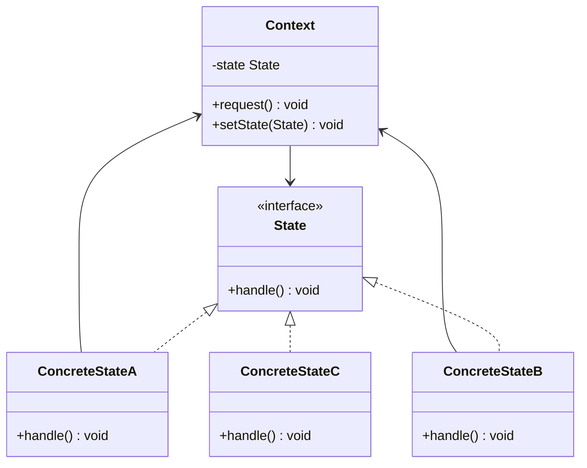
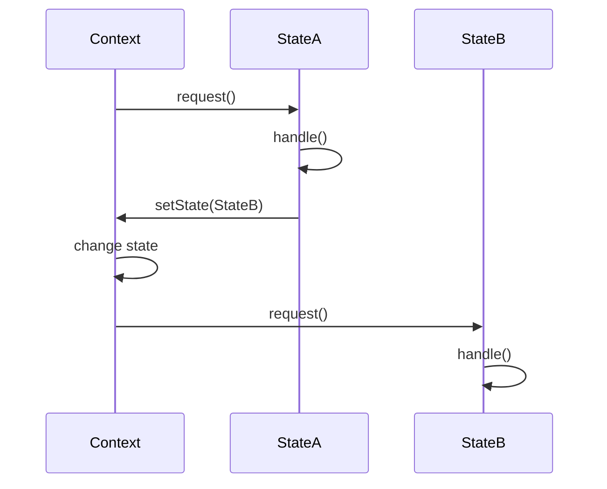
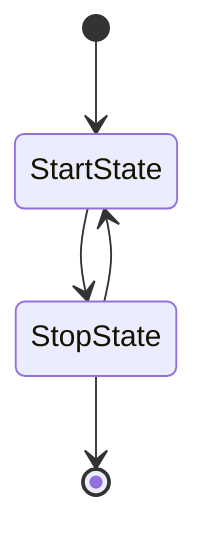
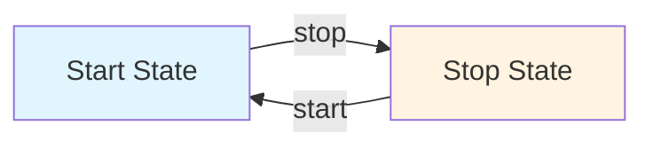

# State Pattern


## Table of Contents

- [Overview](#overview)
- [Diagram Images](#diagram-images)
- [Intent](#intent)
- [Type](#type)
- [Problem](#problem)
- [Solution](#solution)
- [UML Class Diagram](#uml-class-diagram)
- [Sequence Diagram](#sequence-diagram)
- [Structure](#structure)
  - [Components](#components)
- [When to Use](#when-to-use)
- [Examples in This Repository](#examples-in-this-repository)
  - [Example: Player States](#example-player-states)
- [System Architecture](#system-architecture)
- [State Transition Diagram](#state-transition-diagram)
- [Pros](#pros)
- [Cons](#cons)
- [Real-World Applications](#real-world-applications)
  - [Software Development](#software-development)
  - [Specific Examples](#specific-examples)
- [Related Patterns](#related-patterns)
- [Code Example](#code-example)
- [State Machine Patterns](#state-machine-patterns)
  - [State-Driven Transitions](#state-driven-transitions)
  - [Context-Driven Transitions](#context-driven-transitions)
- [Best Practices](#best-practices)
- [Source Code](#source-code)
  - [`Context.java`](#context-java)
  - [`StartState.java`](#startstate-java)
  - [`State.java`](#state-java)
  - [`StateDemo.java`](#statedemo-java)
  - [`StopState.java`](#stopstate-java)


---

## Overview

## Diagram Images


The State pattern allows an object to alter its behavior when its internal state changes. The object will appear to change its class.

## Intent

- Allow an object to alter its behavior when its internal state changes
- Object appears to change its class
- Encapsulate state-specific behavior
- Make state transitions explicit

## Type

**Behavioral Pattern** - Manages state and state transitions.

## Problem

An object's behavior depends on its state, and it must change its behavior at runtime depending on that state. Using conditionals for state-specific behavior leads to complex, unmaintainable code.

## Solution

Encapsulate each state in a separate class and let the context delegate state-specific behavior to the current state object.

## UML Class Diagram



## Sequence Diagram



## Structure

### Components

1. **Context** - Maintains an instance of a ConcreteState subclass that defines the current state
2. **State** - Defines an interface for encapsulating behavior associated with a particular state
3. **ConcreteState** - Each subclass implements a behavior associated with a state of the Context

## When to Use

- Object's behavior depends on its state
- Operations have large, multipart conditional statements that depend on object's state
- State-specific behavior changes frequently
- State transitions need to be explicit

## Examples in This Repository

### Example: Player States
- **Context**: `Context` class
- **States**: `StartState`, `StopState`
- **Use Case**: Media player with different states (playing, stopped, paused)

## System Architecture



## State Transition Diagram



## Pros

- **Localizes State-Specific Behavior**: Each state's behavior is localized in its class
- **State Transitions**: Makes state transitions explicit
- **Eliminates Conditionals**: Eliminates large conditional statements
- **Extensibility**: Easy to add new states
- **Organization**: Organizes code related to particular states

## Cons

- **Increased Objects**: Creates many state objects
- **Complexity**: Can be overkill for simple state machines
- **State Management**: Requires careful management of state transitions

## Real-World Applications

### Software Development
- **Game Development**: Character states (idle, running, jumping)
- **Vending Machines**: State-based behavior
- **TCP Connections**: Connection states (listen, established, closed)
- **Workflow Systems**: Process states

### Specific Examples
- **Media Players**: Play, pause, stop states
- **Traffic Lights**: Red, yellow, green states
- **Order Processing**: Pending, processing, shipped states
- **User Interface**: Enabled, disabled, loading states

## Related Patterns

- **Strategy**: Similar structure but State changes automatically, Strategy selected by client
- **Flyweight**: State objects can be flyweights if stateless
- **Singleton**: State objects are often singletons

## Code Example

```java
// State Interface
public interface State {
    void doAction(Context context);
}

// Concrete State
public class StartState implements State {
    @Override
    public void doAction(Context context) {
        System.out.println("Player is in start state");
        context.setState(this);
    }
}

// Context
public class Context {
    private State state;
    
    public Context() {
        state = null;
    }
    
    public void setState(State state) {
        this.state = state;
    }
    
    public State getState() {
        return state;
    }
}
```

## State Machine Patterns

### State-Driven Transitions
- States define next state
- Context just delegates

### Context-Driven Transitions
- Context determines next state
- States are passive

## Best Practices

1. **State Immutability**: Consider making states immutable
2. **State Creation**: Use factory or singleton for states
3. **Transition Logic**: Keep transition logic clear
4. **State Validation**: Validate state transitions

## Source Code

### `Context.java`

```java
package com.cursor.designpatterns.behavioral.state;

/**
 * Context class.
 * 
 * @author Design Patterns
 * @version 1.0
 * @since 1.0
 */
public class Context {
    
    private State state;
    
    public Context() {
        state = null;
    }
    
    public void setState(State state) {
        this.state = state;
    }
    
    public State getState() {
        return state;
    }
}
```

### `StartState.java`

```java
package com.cursor.designpatterns.behavioral.state;

/**
 * Start State (Concrete State).
 * 
 * @author Design Patterns
 * @version 1.0
 * @since 1.0
 */
public class StartState implements State {
    
    @Override
    public void doAction(Context context) {
        System.out.println("Player is in start state");
        context.setState(this);
    }
    
    @Override
    public String toString() {
        return "Start State";
    }
}
```

### `State.java`

```java
package com.cursor.designpatterns.behavioral.state;

/**
 * State interface.
 * 
 * <p>The State pattern allows an object to alter its behavior when its internal
 * state changes. The object will appear to change its class.</p>
 * 
 * @author Design Patterns
 * @version 1.0
 * @since 1.0
 */
public interface State {
    
    void doAction(Context context);
}
```

### `StateDemo.java`

```java
package com.cursor.designpatterns.behavioral.state;

/**
 * Demo class to demonstrate State pattern.
 * 
 * <p><strong>State Pattern Benefits:</strong></p>
 * <ul>
 *   <li>Organizes state-specific code</li>
 *   <li>Makes state transitions explicit</li>
 *   <li>Eliminates large conditional statements</li>
 * </ul>
 * 
 * @author Design Patterns
 * @version 1.0
 * @since 1.0
 */
public class StateDemo {
    
    public static void main(String[] args) {
        System.out.println("=== State Pattern Demo ===\n");
        
        Context context = new Context();
        
        StartState startState = new StartState();
        startState.doAction(context);
        System.out.println(context.getState().toString());
        System.out.println();
        
        StopState stopState = new StopState();
        stopState.doAction(context);
        System.out.println(context.getState().toString());
    }
}
```

### `StopState.java`

```java
package com.cursor.designpatterns.behavioral.state;

/**
 * Stop State (Concrete State).
 * 
 * @author Design Patterns
 * @version 1.0
 * @since 1.0
 */
public class StopState implements State {
    
    @Override
    public void doAction(Context context) {
        System.out.println("Player is in stop state");
        context.setState(this);
    }
    
    @Override
    public String toString() {
        return "Stop State";
    }
}
```
