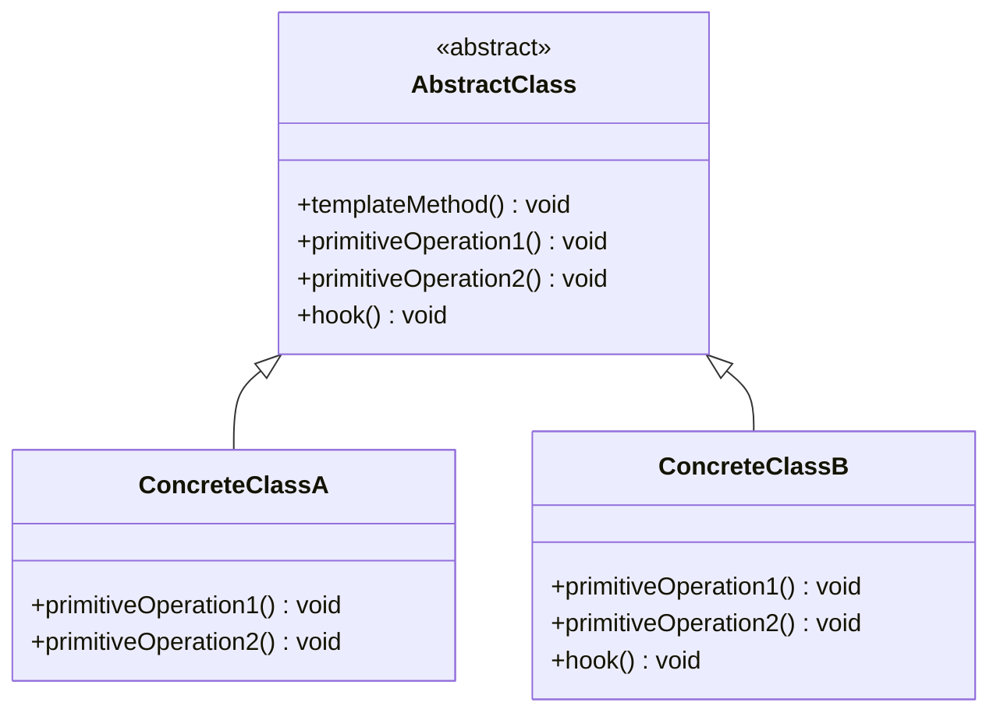
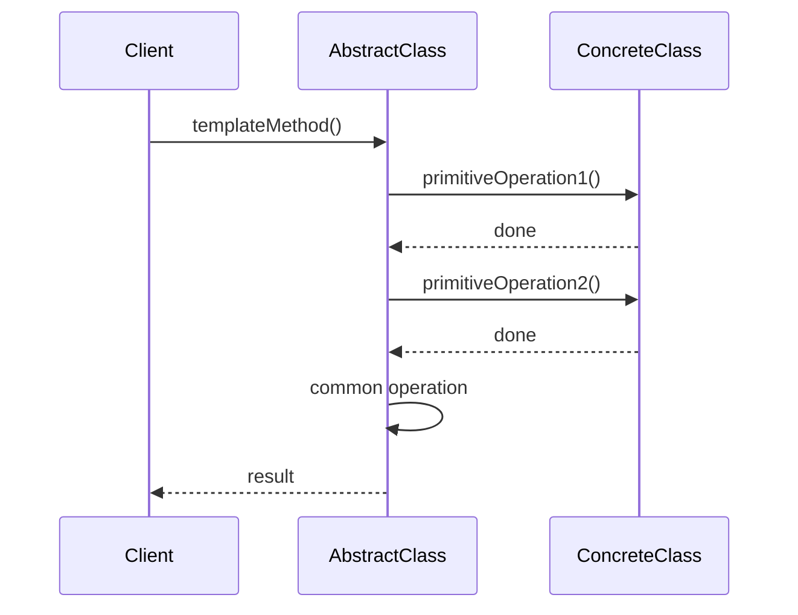
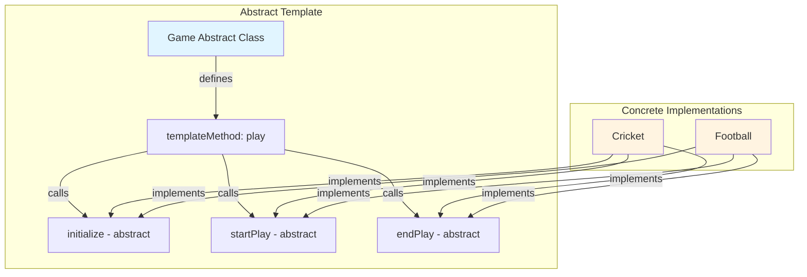

# Template Method Pattern


## Table of Contents

- [Overview](#overview)
- [Diagram Images](#diagram-images)
- [Intent](#intent)
- [Type](#type)
- [Problem](#problem)
- [Solution](#solution)
- [UML Class Diagram](#uml-class-diagram)
- [Sequence Diagram](#sequence-diagram)
- [Structure](#structure)
  - [Components](#components)
  - [Method Types](#method-types)
- [When to Use](#when-to-use)
- [Examples in This Repository](#examples-in-this-repository)
  - [Example: Game Template](#example-game-template)
- [System Architecture](#system-architecture)
- [Pros](#pros)
- [Cons](#cons)
- [Real-World Applications](#real-world-applications)
  - [Software Development](#software-development)
  - [Specific Examples](#specific-examples)
- [Related Patterns](#related-patterns)
- [Code Example](#code-example)
- [Hook Methods](#hook-methods)
- [Best Practices](#best-practices)
- [Source Code](#source-code)
  - [`Cricket.java`](#cricket-java)
  - [`Football.java`](#football-java)
  - [`Game.java`](#game-java)
  - [`TemplateMethodDemo.java`](#templatemethoddemo-java)


---

## Overview

## Diagram Images


The Template Method pattern defines the skeleton of an algorithm in a method, deferring some steps to subclasses. Template Method lets subclasses redefine certain steps of an algorithm without changing the algorithm's structure.

## Intent

- Define skeleton of algorithm in operation
- Defer some steps to subclasses
- Let subclasses redefine certain steps
- Keep algorithm structure fixed

## Type

**Behavioral Pattern** - Defines algorithm structure with variable steps.

## Problem

You have an algorithm with multiple steps. Some steps are common, but others vary. You want to define the algorithm structure once and let subclasses implement the variable steps.

## Solution

Define a template method that calls abstract methods for variable steps. Subclasses implement these methods to provide specific behavior.

## UML Class Diagram



## Sequence Diagram



## Structure

### Components

1. **AbstractClass** - Defines abstract primitive operations and implements template method
2. **ConcreteClass** - Implements primitive operations to carry out subclass-specific steps

### Method Types

- **Template Method**: Defines algorithm skeleton
- **Primitive Operations**: Abstract methods implemented by subclasses
- **Hook Methods**: Optional methods subclasses can override
- **Concrete Operations**: Methods with default implementation

## When to Use

- Implement invariant parts of algorithm once
- Common behavior among subclasses should be factored and localized
- Control subclasses extensions
- Avoid code duplication

## Examples in This Repository

### Example: Game Template
- **AbstractClass**: `Game` abstract class with `play()` template method
- **ConcreteClasses**: `Cricket`, `Football`
- **Use Case**: Different games with same overall structure (initialize, start, end)

## System Architecture



## Pros

- **Code Reuse**: Eliminates code duplication
- **Control**: Controls algorithm structure
- **Consistency**: Ensures consistent algorithm structure
- **Inversion of Control**: Follows Hollywood principle (don't call us, we'll call you)

## Cons

- **Inheritance**: Requires inheritance (composition might be better)
- **Limited Flexibility**: Template structure is fixed
- **Debugging**: Can be harder to debug template methods

## Real-World Applications

### Software Development
- **Framework Development**: Framework defines structure, applications fill in details
- **Data Processing**: Common processing pipeline with variable steps
- **Build Systems**: Build process with configurable steps
- **Test Frameworks**: Test execution with setup/teardown

### Specific Examples
- **JDBC Templates**: Spring JDBC template methods
- **Servlet Framework**: Service method template
- **Game Development**: Game loop templates
- **Compilers**: Compilation process templates

## Related Patterns

- **Factory Method**: Template methods often call factory methods
- **Strategy**: Template method uses inheritance, Strategy uses composition
- **Hook Method**: Part of Template Method pattern

## Code Example

```java
// Abstract Class
public abstract class Game {
    public final void play() {
        initialize();
        startPlay();
        endPlay();
    }
    
    protected abstract void initialize();
    protected abstract void startPlay();
    protected abstract void endPlay();
}

// Concrete Class
public class Cricket extends Game {
    @Override
    protected void initialize() {
        System.out.println("Cricket Game Initialized");
    }
    
    @Override
    protected void startPlay() {
        System.out.println("Cricket Game Started");
    }
    
    @Override
    protected void endPlay() {
        System.out.println("Cricket Game Finished");
    }
}
```

## Hook Methods

Hook methods are optional methods that subclasses can override:
- Provide default behavior
- Subclasses can override if needed
- Allow flexible extension points

## Best Practices

1. **Final Template**: Make template method final to prevent overriding
2. **Clear Steps**: Make each step clear and focused
3. **Documentation**: Document what each step does
4. **Minimal Steps**: Keep number of primitive operations minimal

## Source Code

### `Cricket.java`

```java
package com.cursor.designpatterns.behavioral.templatemethod;

/**
 * Cricket game (Concrete Class).
 * 
 * @author Design Patterns
 * @version 1.0
 * @since 1.0
 */
public class Cricket extends Game {
    
    @Override
    protected void initialize() {
        System.out.println("Cricket Game Initialized! Start playing.");
    }
    
    @Override
    protected void startPlay() {
        System.out.println("Cricket Game Started. Enjoy the game!");
    }
    
    @Override
    protected void endPlay() {
        System.out.println("Cricket Game Finished!");
    }
}
```

### `Football.java`

```java
package com.cursor.designpatterns.behavioral.templatemethod;

/**
 * Football game (Concrete Class).
 * 
 * @author Design Patterns
 * @version 1.0
 * @since 1.0
 */
public class Football extends Game {
    
    @Override
    protected void initialize() {
        System.out.println("Football Game Initialized! Start playing.");
    }
    
    @Override
    protected void startPlay() {
        System.out.println("Football Game Started. Enjoy the game!");
    }
    
    @Override
    protected void endPlay() {
        System.out.println("Football Game Finished!");
    }
}
```

### `Game.java`

```java
package com.cursor.designpatterns.behavioral.templatemethod;

/**
 * Game abstract class (Abstract Class with Template Method).
 * 
 * <p>The Template Method pattern defines the skeleton of an algorithm in a method,
 * deferring some steps to subclasses. It lets subclasses redefine certain steps
 * without changing the algorithm's structure.</p>
 * 
 * @author Design Patterns
 * @version 1.0
 * @since 1.0
 */
public abstract class Game {
    
    /**
     * Template method that defines the algorithm skeleton.
     */
    public final void play() {
        initialize();
        startPlay();
        endPlay();
    }
    
    protected abstract void initialize();
    protected abstract void startPlay();
    protected abstract void endPlay();
}
```

### `TemplateMethodDemo.java`

```java
package com.cursor.designpatterns.behavioral.templatemethod;

/**
 * Demo class to demonstrate Template Method pattern.
 * 
 * <p><strong>Template Method Pattern Benefits:</strong></p>
 * <ul>
 *   <li>Code reuse through inheritance</li>
 *   <li>Controls the algorithm structure</li>
 *   <li>Reduces code duplication</li>
 * </ul>
 * 
 * @author Design Patterns
 * @version 1.0
 * @since 1.0
 */
public class TemplateMethodDemo {
    
    public static void main(String[] args) {
        System.out.println("=== Template Method Pattern Demo ===\n");
        
        Game game = new Cricket();
        game.play();
        System.out.println();
        
        game = new Football();
        game.play();
    }
}
```
