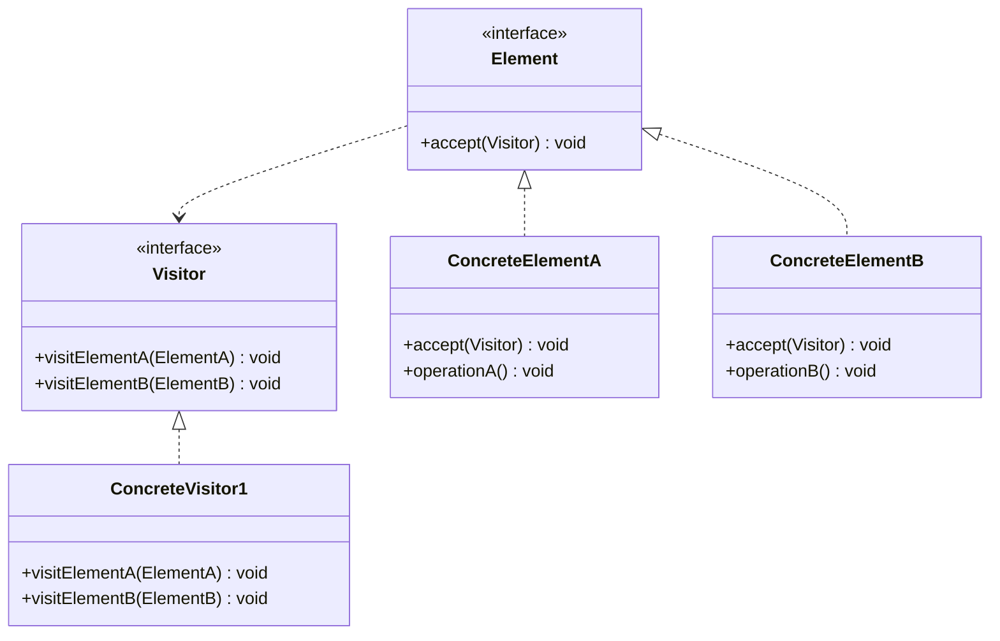
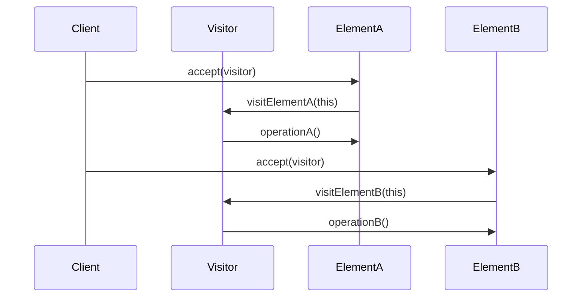

# Visitor Pattern


## Table of Contents

- [Overview](#overview)
- [Diagram Images](#diagram-images)
- [Intent](#intent)
- [Type](#type)
- [Problem](#problem)
- [Solution](#solution)
- [UML Class Diagram](#uml-class-diagram)
- [Sequence Diagram](#sequence-diagram)
- [When to Use](#when-to-use)
- [Examples in This Repository](#examples-in-this-repository)
  - [Computer Part Visitor](#computer-part-visitor)
- [Pros](#pros)
- [Cons](#cons)
- [Code Example](#code-example)
- [Source Code](#source-code)
  - [`Computer.java`](#computer-java)
  - [`ComputerPart.java`](#computerpart-java)
  - [`ComputerPartDisplayVisitor.java`](#computerpartdisplayvisitor-java)
  - [`ComputerPartVisitor.java`](#computerpartvisitor-java)
  - [`Keyboard.java`](#keyboard-java)
  - [`Monitor.java`](#monitor-java)
  - [`Mouse.java`](#mouse-java)
  - [`VisitorDemo.java`](#visitordemo-java)


---

## Overview

## Diagram Images


The Visitor pattern represents an operation to be performed on elements of an object structure. It lets you define a new operation without changing the classes of the elements on which it operates.

## Intent

- Separate algorithms from object structure
- Add new operations without modifying classes
- Perform operations on object structures
- Double dispatch mechanism

## Type

**Behavioral Pattern** - Separates algorithms from object structure.

## Problem

You have a complex object structure and need to perform various operations on it. Adding operations would require modifying all element classes.

## Solution

Define operations in visitor classes. Each element accepts a visitor, which performs the operation on that element.

## UML Class Diagram



## Sequence Diagram



## When to Use

- Object structure has many classes with different interfaces
- Need to perform operations on all elements
- Operations need to be added without changing element classes
- Structure is stable but operations change frequently

## Examples in This Repository

### Computer Part Visitor
- **Element**: ComputerPart interface
- **ConcreteElements**: Keyboard, Mouse, Monitor, Computer
- **Visitor**: ComputerPartVisitor interface
- **ConcreteVisitor**: ComputerPartDisplayVisitor
- **Use Case**: Display computer parts without modifying part classes

## Pros

- **Easy to Add Operations**: Easy to add new operations
- **Separation**: Separates unrelated operations
- **Open/Closed**: Open for new visitors, closed for modification
- **Visitor Accumulation**: Visitors can accumulate state

## Cons

- **Hard to Add Elements**: Hard to add new element types
- **Encapsulation**: May break encapsulation
- **Complexity**: Can be complex to understand

## Code Example

```java
// Element Interface
public interface ComputerPart {
    void accept(ComputerPartVisitor visitor);
}

// Concrete Element
public class Keyboard implements ComputerPart {
    @Override
    public void accept(ComputerPartVisitor visitor) {
        visitor.visit(this);
    }
}

// Visitor Interface
public interface ComputerPartVisitor {
    void visit(Keyboard keyboard);
    void visit(Mouse mouse);
    void visit(Monitor monitor);
}

// Concrete Visitor
public class ComputerPartDisplayVisitor implements ComputerPartVisitor {
    @Override
    public void visit(Keyboard keyboard) {
        System.out.println("Displaying Keyboard");
    }
    
    @Override
    public void visit(Mouse mouse) {
        System.out.println("Displaying Mouse");
    }
}
```

## Source Code

### `Computer.java`

```java
package com.cursor.designpatterns.behavioral.visitor;

import java.util.ArrayList;
import java.util.List;

/**
 * Computer (Concrete Element).
 * 
 * @author Design Patterns
 * @version 1.0
 * @since 1.0
 */
public class Computer implements ComputerPart {
    
    private List<ComputerPart> parts;
    
    public Computer() {
        parts = new ArrayList<>();
        parts.add(new Mouse());
        parts.add(new Keyboard());
        parts.add(new Monitor());
    }
    
    @Override
    public void accept(ComputerPartVisitor visitor) {
        for (ComputerPart part : parts) {
            part.accept(visitor);
        }
        visitor.visit(this);
    }
}
```

### `ComputerPart.java`

```java
package com.cursor.designpatterns.behavioral.visitor;

/**
 * Computer Part interface (Element).
 * 
 * <p>The Visitor pattern represents an operation to be performed on elements
 * of an object structure. It lets you define a new operation without changing
 * the classes of the elements on which it operates.</p>
 * 
 * @author Design Patterns
 * @version 1.0
 * @since 1.0
 */
public interface ComputerPart {
    
    void accept(ComputerPartVisitor visitor);
}
```

### `ComputerPartDisplayVisitor.java`

```java
package com.cursor.designpatterns.behavioral.visitor;

/**
 * Computer Part Display Visitor (Concrete Visitor).
 * 
 * @author Design Patterns
 * @version 1.0
 * @since 1.0
 */
public class ComputerPartDisplayVisitor implements ComputerPartVisitor {
    
    @Override
    public void visit(Keyboard keyboard) {
        System.out.println("Displaying Keyboard.");
    }
    
    @Override
    public void visit(Mouse mouse) {
        System.out.println("Displaying Mouse.");
    }
    
    @Override
    public void visit(Monitor monitor) {
        System.out.println("Displaying Monitor.");
    }
    
    @Override
    public void visit(Computer computer) {
        System.out.println("Displaying Computer.");
    }
}
```

### `ComputerPartVisitor.java`

```java
package com.cursor.designpatterns.behavioral.visitor;

/**
 * Computer Part Visitor interface (Visitor).
 * 
 * @author Design Patterns
 * @version 1.0
 * @since 1.0
 */
public interface ComputerPartVisitor {
    
    void visit(Keyboard keyboard);
    void visit(Mouse mouse);
    void visit(Monitor monitor);
    void visit(Computer computer);
}
```

### `Keyboard.java`

```java
package com.cursor.designpatterns.behavioral.visitor;

/**
 * Keyboard (Concrete Element).
 * 
 * @author Design Patterns
 * @version 1.0
 * @since 1.0
 */
public class Keyboard implements ComputerPart {
    
    @Override
    public void accept(ComputerPartVisitor visitor) {
        visitor.visit(this);
    }
}
```

### `Monitor.java`

```java
package com.cursor.designpatterns.behavioral.visitor;

/**
 * Monitor (Concrete Element).
 * 
 * @author Design Patterns
 * @version 1.0
 * @since 1.0
 */
public class Monitor implements ComputerPart {
    
    @Override
    public void accept(ComputerPartVisitor visitor) {
        visitor.visit(this);
    }
}
```

### `Mouse.java`

```java
package com.cursor.designpatterns.behavioral.visitor;

/**
 * Mouse (Concrete Element).
 * 
 * @author Design Patterns
 * @version 1.0
 * @since 1.0
 */
public class Mouse implements ComputerPart {
    
    @Override
    public void accept(ComputerPartVisitor visitor) {
        visitor.visit(this);
    }
}
```

### `VisitorDemo.java`

```java
package com.cursor.designpatterns.behavioral.visitor;

/**
 * Demo class to demonstrate Visitor pattern.
 * 
 * <p><strong>Visitor Pattern Benefits:</strong></p>
 * <ul>
 *   <li>Separates algorithms from object structure</li>
 *   <li>Adds new operations without changing classes</li>
 *   <li>Visits different types in a structure uniformly</li>
 * </ul>
 * 
 * @author Design Patterns
 * @version 1.0
 * @since 1.0
 */
public class VisitorDemo {
    
    public static void main(String[] args) {
        System.out.println("=== Visitor Pattern Demo ===\n");
        
        ComputerPart computer = new Computer();
        computer.accept(new ComputerPartDisplayVisitor());
    }
}
```
