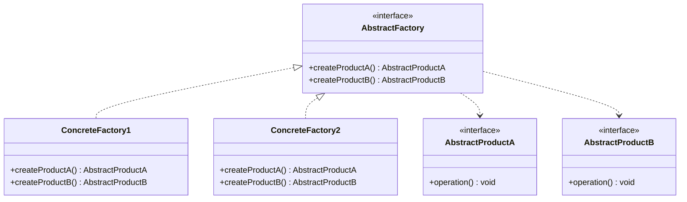

# Abstract Factory Pattern


## Table of Contents

- [Overview](#overview)
- [Diagram Images](#diagram-images)
- [Intent](#intent)
- [UML Class Diagram](#uml-class-diagram)
- [Structure](#structure)
- [When to Use](#when-to-use)
- [Examples in This Repository](#examples-in-this-repository)
- [Pros](#pros)
- [Cons](#cons)
- [Real-World Applications](#real-world-applications)
- [Related Patterns](#related-patterns)
- [Source Code](#source-code)
  - [`AbstractFactoryDemo.java`](#abstractfactorydemo-java)
  - [`Button.java`](#button-java)
  - [`Checkbox.java`](#checkbox-java)
  - [`Connection.java`](#connection-java)
  - [`DatabaseFactory.java`](#databasefactory-java)
  - [`GUIFactory.java`](#guifactory-java)
  - [`MacOSButton.java`](#macosbutton-java)
  - [`MacOSCheckbox.java`](#macoscheckbox-java)
  - [`MacOSFactory.java`](#macosfactory-java)
  - [`MySQLConnection.java`](#mysqlconnection-java)
  - [`MySQLFactory.java`](#mysqlfactory-java)
  - [`MySQLStatement.java`](#mysqlstatement-java)
  - [`PostgreSQLConnection.java`](#postgresqlconnection-java)
  - [`PostgreSQLFactory.java`](#postgresqlfactory-java)
  - [`PostgreSQLStatement.java`](#postgresqlstatement-java)
  - [`Statement.java`](#statement-java)
  - [`WindowsButton.java`](#windowsbutton-java)
  - [`WindowsCheckbox.java`](#windowscheckbox-java)
  - [`WindowsFactory.java`](#windowsfactory-java)


---

## Overview

## Diagram Images


The Abstract Factory pattern provides an interface for creating families of related or dependent objects without specifying their concrete classes.

## Intent

- Provide an interface for creating families of related objects
- Encapsulate object creation
- Ensure products from same family are used together

## UML Class Diagram



## Structure

1. **AbstractFactory**: Interface for creating abstract products
2. **ConcreteFactory**: Implements operations to create concrete products
3. **AbstractProduct**: Interface for a type of product
4. **ConcreteProduct**: Implements AbstractProduct interface

## When to Use

- System should be independent of how products are created
- System needs to work with multiple families of products
- Products from same family must be used together
- You want to provide a library of products

## Examples in This Repository

1. **GUI Factory** - Creating platform-specific UI components (Windows, macOS)
2. **Database Factory** - Creating database-specific components (MySQL, PostgreSQL)

## Pros

- Isolates concrete classes
- Makes exchanging product families easy
- Promotes consistency among products
- Supports Open/Closed Principle

## Cons

- Difficult to support new kinds of products
- May require many interfaces and classes

## Real-World Applications

- UI frameworks (platform-specific components)
- Database abstraction layers
- Cross-platform applications
- Theme systems

## Related Patterns

- **Factory Method**: Abstract Factory often uses factory methods
- **Singleton**: Factories are often singletons
- **Prototype**: Can be used with Abstract Factory

## Source Code

### `AbstractFactoryDemo.java`

```java
package com.cursor.designpatterns.creational.abstractfactory;

/**
 * Demo class to demonstrate Abstract Factory pattern.
 * 
 * <p>This demo shows two examples of Abstract Factory pattern:</p>
 * <ol>
 *   <li>GUI Factory - Creating platform-specific UI components</li>
 *   <li>Database Factory - Creating database-specific components</li>
 * </ol>
 * 
 * <p><strong>Abstract Factory Pattern Benefits:</strong></p>
 * <ul>
 *   <li>Ensures products from the same family are used together</li>
 *   <li>Isolates concrete classes from clients</li>
 *   <li>Makes exchanging product families easy</li>
 *   <li>Promotes consistency among products</li>
 * </ul>
 * 
 * @author Design Patterns
 * @version 1.0
 * @since 1.0
 */
public class AbstractFactoryDemo {
    
    public static void main(String[] args) {
        System.out.println("=== Abstract Factory Pattern Demo ===\n");
        
        // Example 1: GUI Factory
        System.out.println("Example 1: GUI Factory");
        System.out.println("----------------------");
        
        // Create Windows UI
        System.out.println("\nCreating Windows UI:");
        GUIFactory windowsFactory = new WindowsFactory();
        Button windowsButton = windowsFactory.createButton();
        Checkbox windowsCheckbox = windowsFactory.createCheckbox();
        windowsButton.render();
        windowsButton.onClick();
        windowsCheckbox.render();
        windowsCheckbox.onCheck();
        
        // Create macOS UI
        System.out.println("\nCreating macOS UI:");
        GUIFactory macFactory = new MacOSFactory();
        Button macButton = macFactory.createButton();
        Checkbox macCheckbox = macFactory.createCheckbox();
        macButton.render();
        macButton.onClick();
        macCheckbox.render();
        macCheckbox.onCheck();
        
        System.out.println();
        
        // Example 2: Database Factory
        System.out.println("Example 2: Database Factory");
        System.out.println("----------------------------");
        
        // Create MySQL components
        System.out.println("\nUsing MySQL:");
        DatabaseFactory mysqlFactory = new MySQLFactory();
        Connection mysqlConnection = mysqlFactory.createConnection();
        Statement mysqlStatement = mysqlFactory.createStatement();
        mysqlConnection.connect();
        mysqlStatement.prepare("SELECT * FROM users");
        mysqlConnection.executeQuery("SELECT * FROM products");
        mysqlConnection.disconnect();
        
        // Create PostgreSQL components
        System.out.println("\nUsing PostgreSQL:");
        DatabaseFactory postgresFactory = new PostgreSQLFactory();
        Connection postgresConnection = postgresFactory.createConnection();
        Statement postgresStatement = postgresFactory.createStatement();
        postgresConnection.connect();
        postgresStatement.prepare("SELECT * FROM users");
        postgresConnection.executeQuery("SELECT * FROM products");
        postgresConnection.disconnect();
    }
}
```

### `Button.java`

```java
package com.cursor.designpatterns.creational.abstractfactory;

/**
 * Button interface for Abstract Factory pattern example.
 * 
 * <p>Represents a button UI component. Different platforms will have
 * different implementations (WindowsButton, MacOSButton).</p>
 * 
 * @author Design Patterns
 * @version 1.0
 * @since 1.0
 */
public interface Button {
    
    /**
     * Renders the button.
     */
    void render();
    
    /**
     * Handles button click event.
     */
    void onClick();
}
```

### `Checkbox.java`

```java
package com.cursor.designpatterns.creational.abstractfactory;

/**
 * Checkbox interface for Abstract Factory pattern example.
 * 
 * <p>Represents a checkbox UI component. Different platforms will have
 * different implementations (WindowsCheckbox, MacOSCheckbox).</p>
 * 
 * @author Design Patterns
 * @version 1.0
 * @since 1.0
 */
public interface Checkbox {
    
    /**
     * Renders the checkbox.
     */
    void render();
    
    /**
     * Handles checkbox check/uncheck event.
     */
    void onCheck();
}
```

### `Connection.java`

```java
package com.cursor.designpatterns.creational.abstractfactory;

/**
 * Connection interface for Abstract Factory pattern example (Database).
 * 
 * <p>Represents a database connection. Different database types will have
 * different implementations (MySQLConnection, PostgreSQLConnection).</p>
 * 
 * @author Design Patterns
 * @version 1.0
 * @since 1.0
 */
public interface Connection {
    
    /**
     * Connects to the database.
     */
    void connect();
    
    /**
     * Executes a query.
     * 
     * @param query the SQL query to execute
     * @return query result
     */
    String executeQuery(String query);
    
    /**
     * Closes the connection.
     */
    void disconnect();
}
```

### `DatabaseFactory.java`

```java
package com.cursor.designpatterns.creational.abstractfactory;

/**
 * Abstract Database Factory (Abstract Factory interface).
 * 
 * <p>This interface defines methods to create families of related database components.
 * Ensures that all database components (Connection, Statement) are from the same
 * database type (MySQL or PostgreSQL).</p>
 * 
 * @author Design Patterns
 * @version 1.0
 * @since 1.0
 */
public interface DatabaseFactory {
    
    /**
     * Creates a database connection.
     * 
     * @return a Connection instance
     */
    Connection createConnection();
    
    /**
     * Creates a database statement.
     * 
     * @return a Statement instance
     */
    Statement createStatement();
}
```

### `GUIFactory.java`

```java
package com.cursor.designpatterns.creational.abstractfactory;

/**
 * Abstract GUI Factory (Abstract Factory interface).
 * 
 * <p>This interface defines methods to create families of related UI components.
 * The Abstract Factory pattern provides an interface for creating families of
 * related objects without specifying their concrete classes.</p>
 * 
 * <p><strong>Abstract Factory Pattern:</strong></p>
 * <ul>
 *   <li>Abstract Factory: GUIFactory (this interface)</li>
 *   <li>Concrete Factories: WindowsFactory, MacOSFactory</li>
 *   <li>Abstract Products: Button, Checkbox</li>
 *   <li>Concrete Products: WindowsButton, WindowsCheckbox, MacOSButton, MacOSCheckbox</li>
 * </ul>
 * 
 * @author Design Patterns
 * @version 1.0
 * @since 1.0
 */
public interface GUIFactory {
    
    /**
     * Creates a button appropriate for the platform.
     * 
     * @return a Button instance
     */
    Button createButton();
    
    /**
     * Creates a checkbox appropriate for the platform.
     * 
     * @return a Checkbox instance
     */
    Checkbox createCheckbox();
}
```

### `MacOSButton.java`

```java
package com.cursor.designpatterns.creational.abstractfactory;

/**
 * macOS Button implementation.
 * 
 * <p>Concrete product for macOS platform in the Abstract Factory pattern.</p>
 * 
 * @author Design Patterns
 * @version 1.0
 * @since 1.0
 */
public class MacOSButton implements Button {
    
    @Override
    public void render() {
        System.out.println("Rendering macOS style button");
    }
    
    @Override
    public void onClick() {
        System.out.println("macOS button clicked!");
    }
}
```

### `MacOSCheckbox.java`

```java
package com.cursor.designpatterns.creational.abstractfactory;

/**
 * macOS Checkbox implementation.
 * 
 * <p>Concrete product for macOS platform in the Abstract Factory pattern.</p>
 * 
 * @author Design Patterns
 * @version 1.0
 * @since 1.0
 */
public class MacOSCheckbox implements Checkbox {
    
    @Override
    public void render() {
        System.out.println("Rendering macOS style checkbox");
    }
    
    @Override
    public void onCheck() {
        System.out.println("macOS checkbox toggled!");
    }
}
```

### `MacOSFactory.java`

```java
package com.cursor.designpatterns.creational.abstractfactory;

/**
 * macOS Factory (Concrete Factory).
 * 
 * <p>Creates macOS-style UI components. This factory ensures that all
 * created components follow the macOS design guidelines.</p>
 * 
 * @author Design Patterns
 * @version 1.0
 * @since 1.0
 */
public class MacOSFactory implements GUIFactory {
    
    @Override
    public Button createButton() {
        return new MacOSButton();
    }
    
    @Override
    public Checkbox createCheckbox() {
        return new MacOSCheckbox();
    }
}
```

### `MySQLConnection.java`

```java
package com.cursor.designpatterns.creational.abstractfactory;

/**
 * MySQL Connection implementation.
 * 
 * <p>Concrete product for MySQL database in the Abstract Factory pattern.</p>
 * 
 * @author Design Patterns
 * @version 1.0
 * @since 1.0
 */
public class MySQLConnection implements Connection {
    
    @Override
    public void connect() {
        System.out.println("Connected to MySQL database");
    }
    
    @Override
    public String executeQuery(String query) {
        System.out.println("Executing MySQL query: " + query);
        return "MySQL Result";
    }
    
    @Override
    public void disconnect() {
        System.out.println("Disconnected from MySQL database");
    }
}
```

### `MySQLFactory.java`

```java
package com.cursor.designpatterns.creational.abstractfactory;

/**
 * MySQL Factory (Concrete Factory).
 * 
 * <p>Creates MySQL database components. Ensures that all created components
 * are compatible with MySQL database.</p>
 * 
 * @author Design Patterns
 * @version 1.0
 * @since 1.0
 */
public class MySQLFactory implements DatabaseFactory {
    
    @Override
    public Connection createConnection() {
        return new MySQLConnection();
    }
    
    @Override
    public Statement createStatement() {
        return new MySQLStatement();
    }
}
```

### `MySQLStatement.java`

```java
package com.cursor.designpatterns.creational.abstractfactory;

/**
 * MySQL Statement implementation.
 * 
 * <p>Concrete product for MySQL database in the Abstract Factory pattern.</p>
 * 
 * @author Design Patterns
 * @version 1.0
 * @since 1.0
 */
public class MySQLStatement implements Statement {
    
    private String sql;
    
    @Override
    public void prepare(String sql) {
        this.sql = sql;
        System.out.println("Preparing MySQL statement: " + sql);
    }
    
    @Override
    public void execute(String sql) {
        System.out.println("Executing MySQL statement: " + sql);
    }
}
```

### `PostgreSQLConnection.java`

```java
package com.cursor.designpatterns.creational.abstractfactory;

/**
 * PostgreSQL Connection implementation.
 * 
 * <p>Concrete product for PostgreSQL database in the Abstract Factory pattern.</p>
 * 
 * @author Design Patterns
 * @version 1.0
 * @since 1.0
 */
public class PostgreSQLConnection implements Connection {
    
    @Override
    public void connect() {
        System.out.println("Connected to PostgreSQL database");
    }
    
    @Override
    public String executeQuery(String query) {
        System.out.println("Executing PostgreSQL query: " + query);
        return "PostgreSQL Result";
    }
    
    @Override
    public void disconnect() {
        System.out.println("Disconnected from PostgreSQL database");
    }
}
```

### `PostgreSQLFactory.java`

```java
package com.cursor.designpatterns.creational.abstractfactory;

/**
 * PostgreSQL Factory (Concrete Factory).
 * 
 * <p>Creates PostgreSQL database components. Ensures that all created components
 * are compatible with PostgreSQL database.</p>
 * 
 * @author Design Patterns
 * @version 1.0
 * @since 1.0
 */
public class PostgreSQLFactory implements DatabaseFactory {
    
    @Override
    public Connection createConnection() {
        return new PostgreSQLConnection();
    }
    
    @Override
    public Statement createStatement() {
        return new PostgreSQLStatement();
    }
}
```

### `PostgreSQLStatement.java`

```java
package com.cursor.designpatterns.creational.abstractfactory;

/**
 * PostgreSQL Statement implementation.
 * 
 * <p>Concrete product for PostgreSQL database in the Abstract Factory pattern.</p>
 * 
 * @author Design Patterns
 * @version 1.0
 * @since 1.0
 */
public class PostgreSQLStatement implements Statement {
    
    private String sql;
    
    @Override
    public void prepare(String sql) {
        this.sql = sql;
        System.out.println("Preparing PostgreSQL statement: " + sql);
    }
    
    @Override
    public void execute(String sql) {
        System.out.println("Executing PostgreSQL statement: " + sql);
    }
}
```

### `Statement.java`

```java
package com.cursor.designpatterns.creational.abstractfactory;

/**
 * Statement interface for Abstract Factory pattern example (Database).
 * 
 * <p>Represents a database statement. Different database types will have
 * different implementations (MySQLStatement, PostgreSQLStatement).</p>
 * 
 * @author Design Patterns
 * @version 1.0
 * @since 1.0
 */
public interface Statement {
    
    /**
     * Executes the statement.
     * 
     * @param sql the SQL statement
     */
    void execute(String sql);
    
    /**
     * Prepares the statement.
     * 
     * @param sql the SQL statement
     */
    void prepare(String sql);
}
```

### `WindowsButton.java`

```java
package com.cursor.designpatterns.creational.abstractfactory;

/**
 * Windows Button implementation.
 * 
 * <p>Concrete product for Windows platform in the Abstract Factory pattern.</p>
 * 
 * @author Design Patterns
 * @version 1.0
 * @since 1.0
 */
public class WindowsButton implements Button {
    
    @Override
    public void render() {
        System.out.println("Rendering Windows style button");
    }
    
    @Override
    public void onClick() {
        System.out.println("Windows button clicked!");
    }
}
```

### `WindowsCheckbox.java`

```java
package com.cursor.designpatterns.creational.abstractfactory;

/**
 * Windows Checkbox implementation.
 * 
 * <p>Concrete product for Windows platform in the Abstract Factory pattern.</p>
 * 
 * @author Design Patterns
 * @version 1.0
 * @since 1.0
 */
public class WindowsCheckbox implements Checkbox {
    
    @Override
    public void render() {
        System.out.println("Rendering Windows style checkbox");
    }
    
    @Override
    public void onCheck() {
        System.out.println("Windows checkbox toggled!");
    }
}
```

### `WindowsFactory.java`

```java
package com.cursor.designpatterns.creational.abstractfactory;

/**
 * Windows Factory (Concrete Factory).
 * 
 * <p>Creates Windows-style UI components. This factory ensures that all
 * created components follow the Windows design guidelines.</p>
 * 
 * @author Design Patterns
 * @version 1.0
 * @since 1.0
 */
public class WindowsFactory implements GUIFactory {
    
    @Override
    public Button createButton() {
        return new WindowsButton();
    }
    
    @Override
    public Checkbox createCheckbox() {
        return new WindowsCheckbox();
    }
}
```
