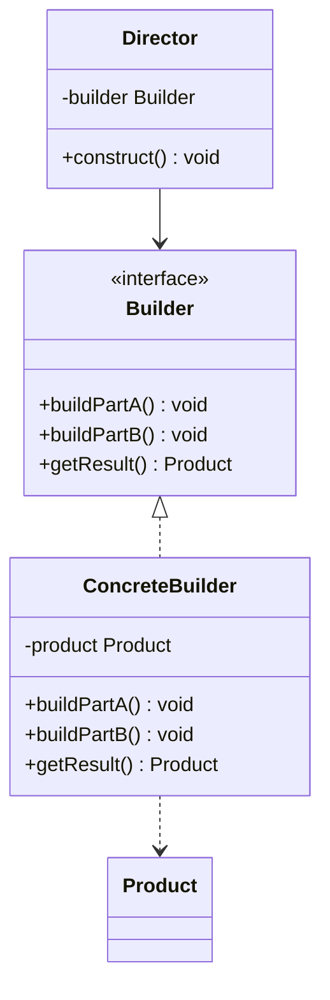

# Builder Pattern


## Table of Contents

- [Overview](#overview)
- [Diagram Images](#diagram-images)
- [Intent](#intent)
- [UML Class Diagram](#uml-class-diagram)
- [Structure](#structure)
- [When to Use](#when-to-use)
- [Examples in This Repository](#examples-in-this-repository)
- [Pros](#pros)
- [Cons](#cons)
- [Real-World Applications](#real-world-applications)
- [Related Patterns](#related-patterns)
- [Source Code](#source-code)
  - [`BuilderDemo.java`](#builderdemo-java)
  - [`Computer.java`](#computer-java)
  - [`Pizza.java`](#pizza-java)


---

## Overview

## Diagram Images


The Builder pattern separates the construction of a complex object from its representation, allowing the same construction process to create different representations.

## Intent

- Separate object construction from representation
- Allow step-by-step construction
- Reuse construction process for different representations

## UML Class Diagram



## Structure

1. **Builder**: Interface for creating parts of a product
2. **ConcreteBuilder**: Constructs and assembles parts
3. **Director**: Constructs object using Builder interface
4. **Product**: Complex object being constructed

## When to Use

- Algorithm for creating object should be independent of parts
- Construction process must allow different representations
- Need to create objects with many optional parameters
- Want to avoid constructor with many parameters

## Examples in This Repository

1. **Computer Builder** - Building computers with various components
2. **Pizza Builder** - Building pizzas with multiple toppings

## Pros

- Allows step-by-step construction
- Reuses construction code
- Isolates complex construction code
- Provides control over construction process

## Cons

- Increases overall complexity
- Requires creating separate ConcreteBuilder for each product type

## Real-World Applications

- Complex object construction (SQL queries, HTTP requests)
- Configuration builders
- Test data builders
- Object creation with many optional parameters

## Related Patterns

- **Abstract Factory**: Both create complex objects
- **Composite**: Builder can build Composite structures
- **Prototype**: Can use Prototype in Builder

## Source Code

### `BuilderDemo.java`

```java
package com.cursor.designpatterns.creational.builder;

import java.util.Arrays;

/**
 * Demo class to demonstrate Builder pattern.
 * 
 * <p>This demo shows two examples of Builder pattern:</p>
 * <ol>
 *   <li>Computer Builder - Building complex computer configurations</li>
 *   <li>Pizza Builder - Building customizable pizzas</li>
 * </ol>
 * 
 * <p><strong>Builder Pattern Benefits:</strong></p>
 * <ul>
 *   <li>Handles complex object construction step by step</li>
 *   <li>Provides flexibility to construct different representations</li>
 *   <li>Eliminates the need for multiple constructors</li>
 *   <li>Makes code more readable and maintainable</li>
 * </ul>
 * 
 * @author Design Patterns
 * @version 1.0
 * @since 1.0
 */
public class BuilderDemo {
    
    public static void main(String[] args) {
        System.out.println("=== Builder Pattern Demo ===\n");
        
        // Example 1: Computer Builder
        System.out.println("Example 1: Computer Builder");
        System.out.println("----------------------------");
        
        // Basic computer
        Computer basicComputer = new Computer.ComputerBuilder("Intel i5", "8GB DDR4")
                .build();
        System.out.println("Basic Computer: " + basicComputer);
        System.out.println();
        
        // Gaming computer with all features
        Computer gamingComputer = new Computer.ComputerBuilder("Intel i9", "32GB DDR4")
                .storage("1TB NVMe SSD")
                .graphicsCard("NVIDIA RTX 4090")
                .motherboard("ASUS ROG Strix")
                .hasBluetooth(true)
                .hasWifi(true)
                .build();
        System.out.println("Gaming Computer: " + gamingComputer);
        System.out.println();
        
        // Office computer
        Computer officeComputer = new Computer.ComputerBuilder("AMD Ryzen 7", "16GB DDR4")
                .storage("512GB SSD")
                .hasWifi(true)
                .build();
        System.out.println("Office Computer: " + officeComputer);
        System.out.println();
        
        // Example 2: Pizza Builder
        System.out.println("Example 2: Pizza Builder");
        System.out.println("------------------------");
        
        // Basic pizza
        Pizza basicPizza = new Pizza.PizzaBuilder()
                .build();
        System.out.println("Basic Pizza: " + basicPizza);
        System.out.println();
        
        // Custom pizza with multiple toppings
        Pizza customPizza = new Pizza.PizzaBuilder()
                .size("Large")
                .crust("Thick")
                .addTopping("Pepperoni")
                .addTopping("Bell Peppers")
                .addTopping("Onions")
                .addToppings(Arrays.asList("Olives", "Jalapeños"))
                .extraCheese(true)
                .pepperoni(true)
                .mushrooms(true)
                .build();
        System.out.println("Custom Pizza: " + customPizza);
        System.out.println();
        
        // Vegetarian pizza
        Pizza vegPizza = new Pizza.PizzaBuilder()
                .size("Medium")
                .crust("Thin")
                .addTopping("Bell Peppers")
                .addTopping("Onions")
                .addTopping("Mushrooms")
                .addTopping("Olives")
                .mushrooms(true)
                .extraCheese(true)
                .build();
        System.out.println("Vegetarian Pizza: " + vegPizza);
    }
}
```

### `Computer.java`

```java
package com.cursor.designpatterns.creational.builder;

/**
 * Computer class for Builder pattern example.
 * 
 * <p>Represents a complex object (Computer) that is built using the Builder pattern.
 * This object has many optional and required parameters, making it a good candidate
 * for the Builder pattern instead of a constructor with many parameters.</p>
 * 
 * <p>The Builder pattern separates the construction of a complex object from its
 * representation, allowing the same construction process to create different representations.</p>
 * 
 * @author Design Patterns
 * @version 1.0
 * @since 1.0
 */
public class Computer {
    
    // Required parameters
    private final String cpu;
    private final String ram;
    
    // Optional parameters
    private final String storage;
    private final String graphicsCard;
    private final String motherboard;
    private final boolean hasBluetooth;
    private final boolean hasWifi;
    
    /**
     * Private constructor that takes a Builder.
     * 
     * @param builder the builder containing all parameters
     */
    private Computer(ComputerBuilder builder) {
        this.cpu = builder.cpu;
        this.ram = builder.ram;
        this.storage = builder.storage;
        this.graphicsCard = builder.graphicsCard;
        this.motherboard = builder.motherboard;
        this.hasBluetooth = builder.hasBluetooth;
        this.hasWifi = builder.hasWifi;
    }
    
    // Getters
    public String getCpu() {
        return cpu;
    }
    
    public String getRam() {
        return ram;
    }
    
    public String getStorage() {
        return storage;
    }
    
    public String getGraphicsCard() {
        return graphicsCard;
    }
    
    public String getMotherboard() {
        return motherboard;
    }
    
    public boolean hasBluetooth() {
        return hasBluetooth;
    }
    
    public boolean hasWifi() {
        return hasWifi;
    }
    
    @Override
    public String toString() {
        return "Computer{" +
                "cpu='" + cpu + '\'' +
                ", ram='" + ram + '\'' +
                ", storage='" + storage + '\'' +
                ", graphicsCard='" + graphicsCard + '\'' +
                ", motherboard='" + motherboard + '\'' +
                ", hasBluetooth=" + hasBluetooth +
                ", hasWifi=" + hasWifi +
                '}';
    }
    
    /**
     * Builder class for Computer.
     * 
     * <p>This inner class provides a fluent interface for building Computer objects.
     * It allows for step-by-step construction of complex objects.</p>
     */
    public static class ComputerBuilder {
        
        // Required parameters
        private final String cpu;
        private final String ram;
        
        // Optional parameters - initialized to default values
        private String storage = "256GB SSD";
        private String graphicsCard = "Integrated";
        private String motherboard = "Standard";
        private boolean hasBluetooth = false;
        private boolean hasWifi = true;
        
        /**
         * Constructor with required parameters.
         * 
         * @param cpu the CPU model
         * @param ram the RAM specification
         */
        public ComputerBuilder(String cpu, String ram) {
            this.cpu = cpu;
            this.ram = ram;
        }
        
        /**
         * Sets the storage specification.
         * 
         * @param storage the storage specification
         * @return this builder instance for method chaining
         */
        public ComputerBuilder storage(String storage) {
            this.storage = storage;
            return this;
        }
        
        /**
         * Sets the graphics card.
         * 
         * @param graphicsCard the graphics card model
         * @return this builder instance for method chaining
         */
        public ComputerBuilder graphicsCard(String graphicsCard) {
            this.graphicsCard = graphicsCard;
            return this;
        }
        
        /**
         * Sets the motherboard.
         * 
         * @param motherboard the motherboard model
         * @return this builder instance for method chaining
         */
        public ComputerBuilder motherboard(String motherboard) {
            this.motherboard = motherboard;
            return this;
        }
        
        /**
         * Enables or disables Bluetooth.
         * 
         * @param hasBluetooth true to enable Bluetooth
         * @return this builder instance for method chaining
         */
        public ComputerBuilder hasBluetooth(boolean hasBluetooth) {
            this.hasBluetooth = hasBluetooth;
            return this;
        }
        
        /**
         * Enables or disables WiFi.
         * 
         * @param hasWifi true to enable WiFi
         * @return this builder instance for method chaining
         */
        public ComputerBuilder hasWifi(boolean hasWifi) {
            this.hasWifi = hasWifi;
            return this;
        }
        
        /**
         * Builds and returns the Computer object.
         * 
         * @return a Computer instance built with the specified parameters
         */
        public Computer build() {
            return new Computer(this);
        }
    }
}
```

### `Pizza.java`

```java
package com.cursor.designpatterns.creational.builder;

import java.util.ArrayList;
import java.util.List;

/**
 * Pizza class for Builder pattern example.
 * 
 * <p>Represents a Pizza that can be customized with various toppings, size, and crust type.
 * This demonstrates the Builder pattern for constructing objects with many optional parameters.</p>
 * 
 * @author Design Patterns
 * @version 1.0
 * @since 1.0
 */
public class Pizza {
    
    private final String size;
    private final String crust;
    private final List<String> toppings;
    private final boolean extraCheese;
    private final boolean pepperoni;
    private final boolean mushrooms;
    
    /**
     * Private constructor that takes a Builder.
     * 
     * @param builder the builder containing all parameters
     */
    private Pizza(PizzaBuilder builder) {
        this.size = builder.size;
        this.crust = builder.crust;
        this.toppings = new ArrayList<>(builder.toppings);
        this.extraCheese = builder.extraCheese;
        this.pepperoni = builder.pepperoni;
        this.mushrooms = builder.mushrooms;
    }
    
    // Getters
    public String getSize() {
        return size;
    }
    
    public String getCrust() {
        return crust;
    }
    
    public List<String> getToppings() {
        return new ArrayList<>(toppings);
    }
    
    public boolean hasExtraCheese() {
        return extraCheese;
    }
    
    public boolean hasPepperoni() {
        return pepperoni;
    }
    
    public boolean hasMushrooms() {
        return mushrooms;
    }
    
    @Override
    public String toString() {
        return "Pizza{" +
                "size='" + size + '\'' +
                ", crust='" + crust + '\'' +
                ", toppings=" + toppings +
                ", extraCheese=" + extraCheese +
                ", pepperoni=" + pepperoni +
                ", mushrooms=" + mushrooms +
                '}';
    }
    
    /**
     * Builder class for Pizza.
     */
    public static class PizzaBuilder {
        
        private String size = "Medium";
        private String crust = "Thin";
        private List<String> toppings = new ArrayList<>();
        private boolean extraCheese = false;
        private boolean pepperoni = false;
        private boolean mushrooms = false;
        
        /**
         * Sets the pizza size.
         * 
         * @param size the size (Small, Medium, Large)
         * @return this builder instance
         */
        public PizzaBuilder size(String size) {
            this.size = size;
            return this;
        }
        
        /**
         * Sets the crust type.
         * 
         * @param crust the crust type (Thin, Thick, Stuffed)
         * @return this builder instance
         */
        public PizzaBuilder crust(String crust) {
            this.crust = crust;
            return this;
        }
        
        /**
         * Adds a topping to the pizza.
         * 
         * @param topping the topping to add
         * @return this builder instance
         */
        public PizzaBuilder addTopping(String topping) {
            this.toppings.add(topping);
            return this;
        }
        
        /**
         * Adds multiple toppings to the pizza.
         * 
         * @param toppings the list of toppings to add
         * @return this builder instance
         */
        public PizzaBuilder addToppings(List<String> toppings) {
            this.toppings.addAll(toppings);
            return this;
        }
        
        /**
         * Sets extra cheese option.
         * 
         * @param extraCheese true to add extra cheese
         * @return this builder instance
         */
        public PizzaBuilder extraCheese(boolean extraCheese) {
            this.extraCheese = extraCheese;
            return this;
        }
        
        /**
         * Sets pepperoni option.
         * 
         * @param pepperoni true to add pepperoni
         * @return this builder instance
         */
        public PizzaBuilder pepperoni(boolean pepperoni) {
            this.pepperoni = pepperoni;
            return this;
        }
        
        /**
         * Sets mushrooms option.
         * 
         * @param mushrooms true to add mushrooms
         * @return this builder instance
         */
        public PizzaBuilder mushrooms(boolean mushrooms) {
            this.mushrooms = mushrooms;
            return this;
        }
        
        /**
         * Builds and returns the Pizza object.
         * 
         * @return a Pizza instance built with the specified parameters
         */
        public Pizza build() {
            return new Pizza(this);
        }
    }
}
```
