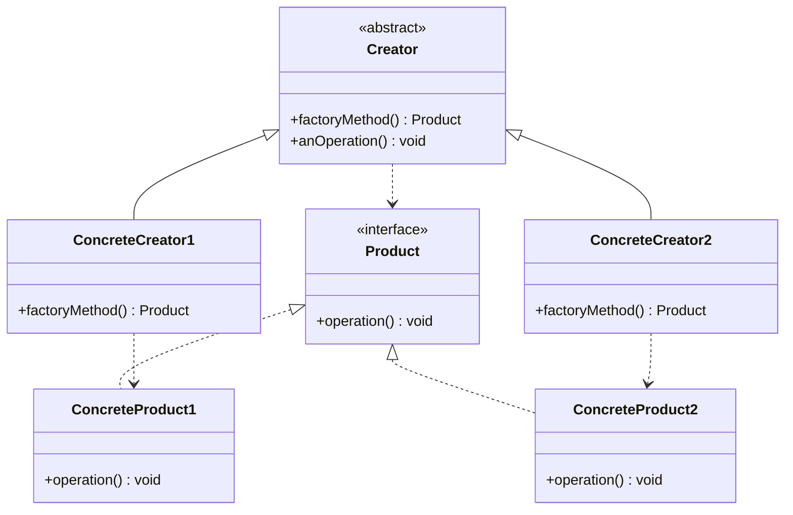
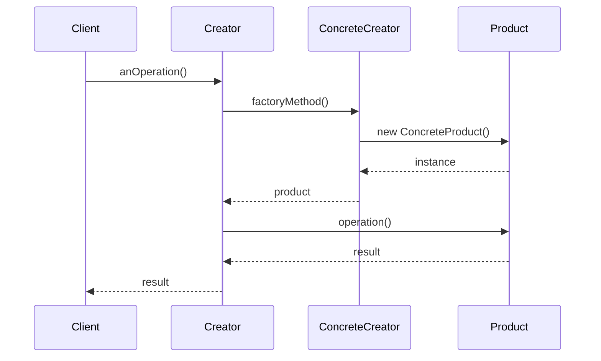
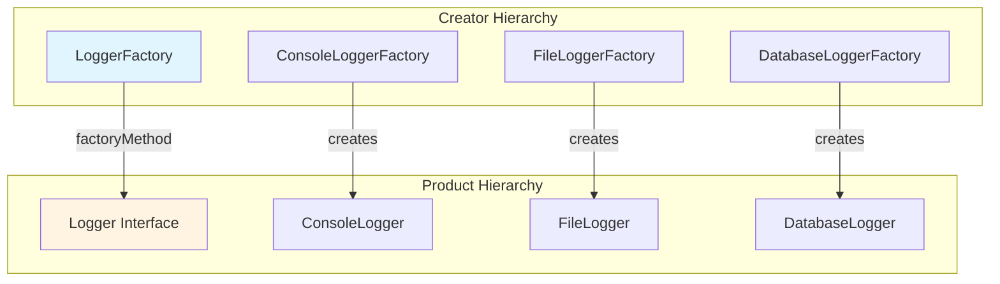

# Factory Method Pattern


## Table of Contents

- [Overview](#overview)
- [Diagram Images](#diagram-images)
- [Intent](#intent)
- [Type](#type)
- [Problem](#problem)
- [Solution](#solution)
- [UML Class Diagram](#uml-class-diagram)
- [Sequence Diagram](#sequence-diagram)
- [Structure](#structure)
  - [Components](#components)
- [When to Use](#when-to-use)
- [Examples in This Repository](#examples-in-this-repository)
- [System Architecture](#system-architecture)
- [Detailed Code Flow](#detailed-code-flow)
  - [Logger Factory Example](#logger-factory-example)
- [Pros](#pros)
- [Cons](#cons)
- [Real-World Applications](#real-world-applications)
- [Related Patterns](#related-patterns)
- [Implementation Variations](#implementation-variations)
  - [Simple Factory Method](#simple-factory-method)
  - [Parameterized Factory Method](#parameterized-factory-method)
  - [Registry-Based Factory](#registry-based-factory)
- [Code Example](#code-example)
- [Comparison with Simple Factory](#comparison-with-simple-factory)
- [Best Practices](#best-practices)
- [Source Code](#source-code)
  - [`Car.java`](#car-java)
  - [`CarFactory.java`](#carfactory-java)
  - [`ConsoleLogger.java`](#consolelogger-java)
  - [`ConsoleLoggerFactory.java`](#consoleloggerfactory-java)
  - [`DatabaseLogger.java`](#databaselogger-java)
  - [`DatabaseLoggerFactory.java`](#databaseloggerfactory-java)
  - [`FactoryMethodDemo.java`](#factorymethoddemo-java)
  - [`FileLogger.java`](#filelogger-java)
  - [`FileLoggerFactory.java`](#fileloggerfactory-java)
  - [`Logger.java`](#logger-java)
  - [`LoggerFactory.java`](#loggerfactory-java)
  - [`Motorcycle.java`](#motorcycle-java)
  - [`MotorcycleFactory.java`](#motorcyclefactory-java)
  - [`Truck.java`](#truck-java)
  - [`TruckFactory.java`](#truckfactory-java)
  - [`Vehicle.java`](#vehicle-java)
  - [`VehicleFactory.java`](#vehiclefactory-java)


---

## Overview

## Diagram Images


The Factory Method pattern defines an interface for creating an object, but lets subclasses decide which class to instantiate. Factory Method lets a class defer instantiation to subclasses.

## Intent

- Define an interface for creating objects
- Let subclasses decide which class to instantiate
- Encapsulate object creation
- Defer instantiation to subclasses

## Type

**Creational Pattern** - Focuses on object creation.

## Problem

A class needs to create objects, but it doesn't know which specific classes to instantiate. It only knows the general interface or abstract class.

## Solution

Define an abstract method for creating objects (factory method). Subclasses implement this method to create specific types of objects.

## UML Class Diagram



## Sequence Diagram



## Structure

### Components

1. **Product** - Defines the interface for objects created by the factory method
2. **ConcreteProduct** - Implements the Product interface
3. **Creator** - Declares the factory method that returns a Product
4. **ConcreteCreator** - Overrides the factory method to return a ConcreteProduct

## When to Use

- A class can't anticipate the class of objects it must create
- A class wants its subclasses to specify the objects it creates
- Classes delegate responsibility to helper subclasses
- You want to localize knowledge of which class gets instantiated

## Examples in This Repository

1. **Logger Factory** - Creating different types of loggers (Console, File, Database)
2. **Vehicle Factory** - Creating different types of vehicles (Car, Motorcycle, Truck)

## System Architecture



## Detailed Code Flow

### Logger Factory Example

```
1. Client creates ConsoleLoggerFactory (ConcreteCreator)
2. Client calls factory.createLogger()
3. Factory method creates ConsoleLogger (ConcreteProduct)
4. Client uses Logger interface without knowing concrete type
5. Different factories create different logger implementations
```

## Pros

- **Flexibility**: Eliminates need to bind application-specific classes into code
- **Extensibility**: Easy to add new product types
- **Hooks**: Provides hooks for subclasses
- **Parallel Hierarchies**: Connects parallel class hierarchies
- **Open/Closed Principle**: Open for extension, closed for modification

## Cons

- **Subclass Requirement**: Requires creating new subclass for each product type
- **Complexity**: Can make code more complex with many subclasses
- **Overhead**: May require more code than direct instantiation

## Real-World Applications

- **Framework Development**: UI frameworks creating platform-specific components
- **Logger Systems**: Different logger implementations
- **Database Drivers**: Creating database-specific connections
- **Plugin Architectures**: Creating plugin instances

## Related Patterns

- **Abstract Factory**: Often uses factory methods
- **Prototype**: Can be used with factory methods
- **Template Method**: Factory methods are often called within template methods

## Implementation Variations

### Simple Factory Method
- Creator is abstract class with abstract factory method
- ConcreteCreators implement factory method

### Parameterized Factory Method
- Factory method takes parameter to decide which product to create
- Single factory method handles multiple product types

### Registry-Based Factory
- Maintains registry of available products
- Factory method looks up product in registry

## Code Example

```java
// Product
public interface Logger {
    void info(String message);
    void error(String message);
}

// Creator
public abstract class LoggerFactory {
    public abstract Logger createLogger();
    
    public void log(String message) {
        Logger logger = createLogger();
        logger.info(message);
    }
}

// Concrete Creator
public class ConsoleLoggerFactory extends LoggerFactory {
    @Override
    public Logger createLogger() {
        return new ConsoleLogger();
    }
}

// Concrete Product
public class ConsoleLogger implements Logger {
    @Override
    public void info(String message) {
        System.out.println("[INFO] " + message);
    }
    
    @Override
    public void error(String message) {
        System.err.println("[ERROR] " + message);
    }
}
```

## Comparison with Simple Factory

| Aspect | Factory Method | Simple Factory |
|--------|---------------|----------------|
| Structure | Uses inheritance | Single factory class |
| Flexibility | More flexible | Less flexible |
| Complexity | More complex | Simpler |
| Extensibility | Easy to extend | Harder to extend |

## Best Practices

1. **Clear Interface**: Define clear Product interface
2. **Naming**: Use descriptive names for factory methods
3. **Documentation**: Document what each factory creates
4. **Error Handling**: Handle cases where product can't be created

## Source Code

### `Car.java`

```java
package com.cursor.designpatterns.creational.factorymethod;

/**
 * Car implementation of Vehicle.
 * 
 * <p>Represents a car vehicle. This is a concrete product in the Factory Method pattern.</p>
 * 
 * @author Design Patterns
 * @version 1.0
 * @since 1.0
 */
public class Car implements Vehicle {
    
    @Override
    public void start() {
        System.out.println("Car engine started. Vroom vroom!");
    }
    
    @Override
    public void stop() {
        System.out.println("Car stopped.");
    }
    
    @Override
    public String getType() {
        return "Car";
    }
}
```

### `CarFactory.java`

```java
package com.cursor.designpatterns.creational.factorymethod;

/**
 * Car Factory (Concrete Creator).
 * 
 * <p>This factory creates Car instances.
 * It implements the factory method to return a Car.</p>
 * 
 * @author Design Patterns
 * @version 1.0
 * @since 1.0
 */
public class CarFactory extends VehicleFactory {
    
    @Override
    public Vehicle createVehicle() {
        return new Car();
    }
}
```

### `ConsoleLogger.java`

```java
package com.cursor.designpatterns.creational.factorymethod;

/**
 * Console Logger implementation.
 * 
 * <p>Logs messages to the console/standard output.
 * This is a concrete product in the Factory Method pattern.</p>
 * 
 * @author Design Patterns
 * @version 1.0
 * @since 1.0
 */
public class ConsoleLogger implements Logger {
    
    @Override
    public void info(String message) {
        System.out.println("[INFO] " + message);
    }
    
    @Override
    public void error(String message) {
        System.err.println("[ERROR] " + message);
    }
    
    @Override
    public void warn(String message) {
        System.out.println("[WARN] " + message);
    }
}
```

### `ConsoleLoggerFactory.java`

```java
package com.cursor.designpatterns.creational.factorymethod;

/**
 * Console Logger Factory (Concrete Creator).
 * 
 * <p>This factory creates ConsoleLogger instances.
 * It implements the factory method to return a ConsoleLogger.</p>
 * 
 * @author Design Patterns
 * @version 1.0
 * @since 1.0
 */
public class ConsoleLoggerFactory extends LoggerFactory {
    
    @Override
    public Logger createLogger() {
        return new ConsoleLogger();
    }
}
```

### `DatabaseLogger.java`

```java
package com.cursor.designpatterns.creational.factorymethod;

/**
 * Database Logger implementation.
 * 
 * <p>Logs messages to a database. This is a concrete product in the Factory Method pattern.
 * In a real implementation, this would write to a database table.</p>
 * 
 * @author Design Patterns
 * @version 1.0
 * @since 1.0
 */
public class DatabaseLogger implements Logger {
    
    private final String connectionString;
    
    /**
     * Creates a DatabaseLogger with the specified connection string.
     * 
     * @param connectionString the database connection string
     */
    public DatabaseLogger(String connectionString) {
        this.connectionString = connectionString;
        System.out.println("Database logger initialized with: " + connectionString);
    }
    
    @Override
    public void info(String message) {
        logToDatabase("INFO", message);
    }
    
    @Override
    public void error(String message) {
        logToDatabase("ERROR", message);
    }
    
    @Override
    public void warn(String message) {
        logToDatabase("WARN", message);
    }
    
    /**
     * Simulates writing a log entry to the database.
     * 
     * @param level the log level
     * @param message the message to log
     */
    private void logToDatabase(String level, String message) {
        // In a real implementation, this would insert into a database table
        System.out.println("[DATABASE LOG] [" + level + "] " + message);
        System.out.println("  -> Inserted into log table via: " + connectionString);
    }
}
```

### `DatabaseLoggerFactory.java`

```java
package com.cursor.designpatterns.creational.factorymethod;

/**
 * Database Logger Factory (Concrete Creator).
 * 
 * <p>This factory creates DatabaseLogger instances with a specified connection string.
 * It implements the factory method to return a DatabaseLogger.</p>
 * 
 * @author Design Patterns
 * @version 1.0
 * @since 1.0
 */
public class DatabaseLoggerFactory extends LoggerFactory {
    
    private final String connectionString;
    
    /**
     * Creates a DatabaseLoggerFactory that will create loggers using the specified connection string.
     * 
     * @param connectionString the database connection string
     */
    public DatabaseLoggerFactory(String connectionString) {
        this.connectionString = connectionString;
    }
    
    @Override
    public Logger createLogger() {
        return new DatabaseLogger(connectionString);
    }
}
```

### `FactoryMethodDemo.java`

```java
package com.cursor.designpatterns.creational.factorymethod;

/**
 * Demo class to demonstrate Factory Method pattern.
 * 
 * <p>
 * This demo shows two examples of Factory Method pattern:
 * </p>
 * <ol>
 * <li>Logger Factory - Creating different types of loggers</li>
 * <li>Vehicle Factory - Creating different types of vehicles</li>
 * </ol>
 * 
 * <p>
 * <strong>Factory Method Pattern Benefits:</strong>
 * </p>
 * <ul>
 * <li>Decouples object creation from object usage</li>
 * <li>Provides flexibility for adding new product types</li>
 * <li>Follows Open/Closed Principle</li>
 * </ul>
 * 
 * @author Design Patterns
 * @version 1.0
 * @since 1.0
 */
public class FactoryMethodDemo {

    public static void main(String[] args) {
        System.out.println("=== Factory Method Pattern Demo ===\n");

        // Example 1: Logger Factory
        System.out.println("Example 1: Logger Factory");
        System.out.println("--------------------------");

        // Console Logger
        // Add the logs which is creatro or which is concrete creator or which is
        // product or which is concrete product
        // consoleFactory is creator or concrete creator
        // consoleLogger is product or concrete product
        // fileFactory is creator or concrete creator
        // fileLogger is product or concrete product
        // dbFactory is creator or concrete creator
        // dbLogger is product or concrete product

        LoggerFactory consoleFactory = new ConsoleLoggerFactory();
        Logger consoleLogger = consoleFactory.createLogger();
        consoleLogger.info("Application started");
        consoleLogger.warn("Low memory warning");
        consoleLogger.error("File not found");

        // File Logger
        LoggerFactory fileFactory = new FileLoggerFactory("app.log");
        Logger fileLogger = fileFactory.createLogger();
        fileLogger.info("Logged to file");
        fileLogger.error("Error logged to file");

        // Database Logger
        LoggerFactory dbFactory = new DatabaseLoggerFactory("jdbc:mysql://localhost/logs");
        Logger dbLogger = dbFactory.createLogger();
        dbLogger.info("Logged to database");
        dbLogger.warn("Warning logged to database");

        System.out.println();

        // Example 2: Vehicle Factory
        System.out.println("Example 2: Vehicle Factory");
        System.out.println("---------------------------");

        // Create different vehicles using their factories
        VehicleFactory carFactory = new CarFactory();
        Vehicle car = carFactory.orderVehicle();
        car.stop();
        System.out.println();

        VehicleFactory motorcycleFactory = new MotorcycleFactory();
        Vehicle motorcycle = motorcycleFactory.orderVehicle();
        motorcycle.stop();
        System.out.println();

        VehicleFactory truckFactory = new TruckFactory();
        Vehicle truck = truckFactory.orderVehicle();
        truck.stop();
    }
}
```

### `FileLogger.java`

```java
package com.cursor.designpatterns.creational.factorymethod;

import java.io.FileWriter;
import java.io.IOException;
import java.time.LocalDateTime;
import java.time.format.DateTimeFormatter;

/**
 * File Logger implementation.
 * 
 * <p>Logs messages to a file. This is a concrete product in the Factory Method pattern.</p>
 * 
 * @author Design Patterns
 * @version 1.0
 * @since 1.0
 */
public class FileLogger implements Logger {
    
    private final String filename;
    private FileWriter fileWriter;
    
    /**
     * Creates a FileLogger that writes to the specified file.
     * 
     * @param filename the name of the log file
     */
    public FileLogger(String filename) {
        this.filename = filename;
        try {
            this.fileWriter = new FileWriter(filename, true);
        } catch (IOException e) {
            System.err.println("Failed to create file logger: " + e.getMessage());
        }
    }
    
    @Override
    public void info(String message) {
        log("INFO", message);
    }
    
    @Override
    public void error(String message) {
        log("ERROR", message);
    }
    
    @Override
    public void warn(String message) {
        log("WARN", message);
    }
    
    /**
     * Writes a log entry to the file.
     * 
     * @param level the log level
     * @param message the message to log
     */
    private void log(String level, String message) {
        if (fileWriter != null) {
            try {
                String timestamp = LocalDateTime.now()
                    .format(DateTimeFormatter.ofPattern("yyyy-MM-dd HH:mm:ss"));
                fileWriter.write(String.format("[%s] [%s] %s%n", timestamp, level, message));
                fileWriter.flush();
            } catch (IOException e) {
                System.err.println("Failed to write to log file: " + e.getMessage());
            }
        }
    }
    
    /**
     * Closes the file writer.
     */
    public void close() {
        if (fileWriter != null) {
            try {
                fileWriter.close();
            } catch (IOException e) {
                System.err.println("Failed to close file writer: " + e.getMessage());
            }
        }
    }
}
```

### `FileLoggerFactory.java`

```java
package com.cursor.designpatterns.creational.factorymethod;

/**
 * File Logger Factory (Concrete Creator).
 * 
 * <p>This factory creates FileLogger instances with a specified filename.
 * It implements the factory method to return a FileLogger.</p>
 * 
 * @author Design Patterns
 * @version 1.0
 * @since 1.0
 */
public class FileLoggerFactory extends LoggerFactory {
    
    private final String filename;
    
    /**
     * Creates a FileLoggerFactory that will create loggers writing to the specified file.
     * 
     * @param filename the filename for the log file
     */
    public FileLoggerFactory(String filename) {
        this.filename = filename;
    }
    
    @Override
    public Logger createLogger() {
        return new FileLogger(filename);
    }
}
```

### `Logger.java`

```java
package com.cursor.designpatterns.creational.factorymethod;

/**
 * Logger interface for Factory Method pattern example.
 * 
 * <p>This interface defines the contract for all logger implementations.
 * Different concrete loggers (FileLogger, ConsoleLogger, DatabaseLogger) will
 * implement this interface.</p>
 * 
 * @author Design Patterns
 * @version 1.0
 * @since 1.0
 */
public interface Logger {
    
    /**
     * Logs an informational message.
     * 
     * @param message the message to log
     */
    void info(String message);
    
    /**
     * Logs an error message.
     * 
     * @param message the error message to log
     */
    void error(String message);
    
    /**
     * Logs a warning message.
     * 
     * @param message the warning message to log
     */
    void warn(String message);
}
```

### `LoggerFactory.java`

```java
package com.cursor.designpatterns.creational.factorymethod;

/**
 * Abstract Logger Factory (Creator in Factory Method pattern).
 * 
 * <p>This abstract class defines the factory method that subclasses will implement
 * to create specific types of logger instances. The Factory Method pattern allows
 * subclasses to decide which class to instantiate.</p>
 * 
 * <p><strong>Factory Method Pattern:</strong></p>
 * <ul>
 *   <li>Creator: LoggerFactory (this class)</li>
 *   <li>Concrete Creators: ConsoleLoggerFactory, FileLoggerFactory, DatabaseLoggerFactory</li>
 *   <li>Product: Logger (interface)</li>
 *   <li>Concrete Products: ConsoleLogger, FileLogger, DatabaseLogger</li>
 * </ul>
 * 
 * @author Design Patterns
 * @version 1.0
 * @since 1.0
 */
public abstract class LoggerFactory {
    
    /**
     * Factory method that creates a Logger instance.
     * Subclasses must implement this method to create specific logger types.
     * 
     * @return a Logger instance
     */
    public abstract Logger createLogger();
    
    /**
     * Template method that uses the factory method.
     * This demonstrates how the factory method is used in a common operation.
     * 
     * @param message the message to log
     */
    public void log(String message) {
        Logger logger = createLogger();
        logger.info(message);
    }
}
```

### `Motorcycle.java`

```java
package com.cursor.designpatterns.creational.factorymethod;

/**
 * Motorcycle implementation of Vehicle.
 * 
 * <p>Represents a motorcycle vehicle. This is a concrete product in the Factory Method pattern.</p>
 * 
 * @author Design Patterns
 * @version 1.0
 * @since 1.0
 */
public class Motorcycle implements Vehicle {
    
    @Override
    public void start() {
        System.out.println("Motorcycle engine started. Zoom!");
    }
    
    @Override
    public void stop() {
        System.out.println("Motorcycle stopped.");
    }
    
    @Override
    public String getType() {
        return "Motorcycle";
    }
}
```

### `MotorcycleFactory.java`

```java
package com.cursor.designpatterns.creational.factorymethod;

/**
 * Motorcycle Factory (Concrete Creator).
 * 
 * <p>This factory creates Motorcycle instances.
 * It implements the factory method to return a Motorcycle.</p>
 * 
 * @author Design Patterns
 * @version 1.0
 * @since 1.0
 */
public class MotorcycleFactory extends VehicleFactory {
    
    @Override
    public Vehicle createVehicle() {
        return new Motorcycle();
    }
}
```

### `Truck.java`

```java
package com.cursor.designpatterns.creational.factorymethod;

/**
 * Truck implementation of Vehicle.
 * 
 * <p>Represents a truck vehicle. This is a concrete product in the Factory Method pattern.</p>
 * 
 * @author Design Patterns
 * @version 1.0
 * @since 1.0
 */
public class Truck implements Vehicle {
    
    @Override
    public void start() {
        System.out.println("Truck engine started. Grrrr!");
    }
    
    @Override
    public void stop() {
        System.out.println("Truck stopped.");
    }
    
    @Override
    public String getType() {
        return "Truck";
    }
}
```

### `TruckFactory.java`

```java
package com.cursor.designpatterns.creational.factorymethod;

/**
 * Truck Factory (Concrete Creator).
 * 
 * <p>This factory creates Truck instances.
 * It implements the factory method to return a Truck.</p>
 * 
 * @author Design Patterns
 * @version 1.0
 * @since 1.0
 */
public class TruckFactory extends VehicleFactory {
    
    @Override
    public Vehicle createVehicle() {
        return new Truck();
    }
}
```

### `Vehicle.java`

```java
package com.cursor.designpatterns.creational.factorymethod;

/**
 * Vehicle interface for Factory Method pattern example.
 * 
 * <p>This interface represents a vehicle product. Different concrete vehicles
 * (Car, Motorcycle, Truck) will implement this interface.</p>
 * 
 * @author Design Patterns
 * @version 1.0
 * @since 1.0
 */
public interface Vehicle {
    
    /**
     * Starts the vehicle.
     */
    void start();
    
    /**
     * Stops the vehicle.
     */
    void stop();
    
    /**
     * Gets the type of the vehicle.
     * 
     * @return the vehicle type
     */
    String getType();
}
```

### `VehicleFactory.java`

```java
package com.cursor.designpatterns.creational.factorymethod;

/**
 * Abstract Vehicle Factory (Creator in Factory Method pattern).
 * 
 * <p>This abstract class defines the factory method for creating vehicles.
 * Subclasses will implement this to create specific vehicle types.</p>
 * 
 * @author Design Patterns
 * @version 1.0
 * @since 1.0
 */
public abstract class VehicleFactory {
    
    /**
     * Factory method that creates a Vehicle instance.
     * Subclasses must implement this method to create specific vehicle types.
     * 
     * @return a Vehicle instance
     */
    public abstract Vehicle createVehicle();
    
    /**
     * Template method that uses the factory method.
     * Demonstrates a common operation using the created vehicle.
     * 
     * @return the created vehicle
     */
    public Vehicle orderVehicle() {
        Vehicle vehicle = createVehicle();
        System.out.println("Manufacturing " + vehicle.getType() + "...");
        vehicle.start();
        return vehicle;
    }
}
```
