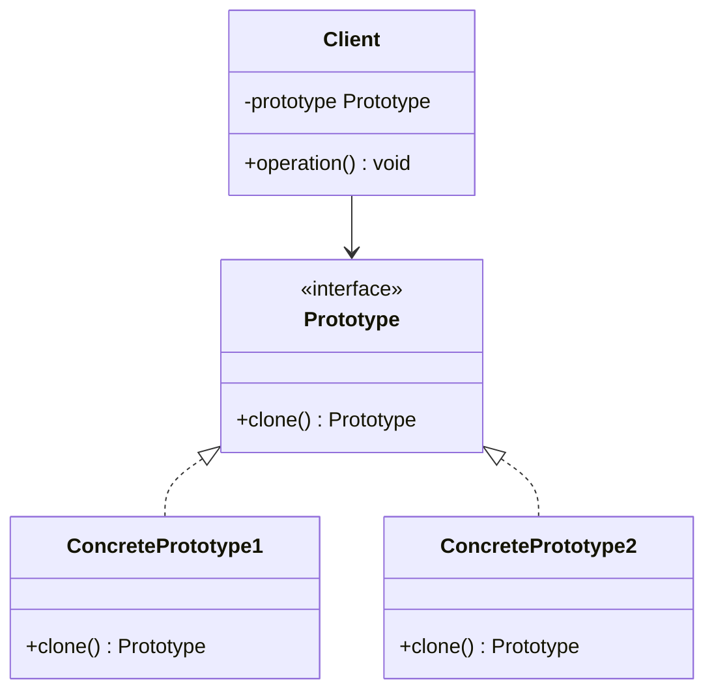

# Prototype Pattern


## Table of Contents

- [Overview](#overview)
- [Diagram Images](#diagram-images)
- [Intent](#intent)
- [UML Class Diagram](#uml-class-diagram)
- [Structure](#structure)
- [When to Use](#when-to-use)
- [Examples in This Repository](#examples-in-this-repository)
- [Pros](#pros)
- [Cons](#cons)
- [Real-World Applications](#real-world-applications)
- [Related Patterns](#related-patterns)
- [Source Code](#source-code)
  - [`Circle.java`](#circle-java)
  - [`Document.java`](#document-java)
  - [`PrototypeDemo.java`](#prototypedemo-java)
  - [`Rectangle.java`](#rectangle-java)
  - [`Shape.java`](#shape-java)
  - [`ShapeCache.java`](#shapecache-java)


---

## Overview

## Diagram Images


The Prototype pattern specifies the kinds of objects to create using a prototypical instance, and creates new objects by copying this prototype.

## Intent

- Specify objects to create using prototypical instances
- Create new objects by copying prototypes
- Reduce object creation cost

## UML Class Diagram



## Structure

1. **Prototype**: Declares cloning interface
2. **ConcretePrototype**: Implements cloning operation
3. **Client**: Creates objects by cloning prototypes

## When to Use

- Classes to instantiate are specified at runtime
- Avoiding building a class hierarchy parallel to product hierarchy
- Instances can have only a few different state combinations
- Object creation is expensive

## Examples in This Repository

1. **Shape Prototype** - Cloning shapes (Circle, Rectangle)
2. **Document Prototype** - Cloning document templates

## Pros

- Reduces object creation cost
- Hides complexity of creating new instances
- Allows adding/removing objects at runtime
- Specifies new objects by varying values

## Cons

- Implementing clone can be difficult
- Deep cloning may be complex
- Circular references can be problematic

## Real-World Applications

- Object copying in GUI frameworks
- Cloning database records
- Prototype-based programming
- Configuration cloning

## Related Patterns

- **Abstract Factory**: May store prototypes
- **Composite**: Prototypes can be used with Composite
- **Decorator**: Prototypes can be decorated

## Source Code

### `Circle.java`

```java
package com.cursor.designpatterns.creational.prototype;

/**
 * Circle class implementing Shape (Prototype pattern).
 * 
 * <p>Represents a circle shape that can be cloned to create new instances.
 * This demonstrates the Prototype pattern where objects are created by
 * cloning existing instances rather than instantiating from classes.</p>
 * 
 * @author Design Patterns
 * @version 1.0
 * @since 1.0
 */
public class Circle implements Shape {
    
    private String color;
    private int radius;
    
    /**
     * Creates a new Circle.
     * 
     * @param color the color of the circle
     * @param radius the radius of the circle
     */
    public Circle(String color, int radius) {
        this.color = color;
        this.radius = radius;
    }
    
    @Override
    public void draw() {
        System.out.println("Drawing a " + color + " circle with radius " + radius);
    }
    
    @Override
    public Shape clone() throws CloneNotSupportedException {
        return (Shape) super.clone();
    }
    
    @Override
    public String getType() {
        return "Circle";
    }
    
    public String getColor() {
        return color;
    }
    
    public void setColor(String color) {
        this.color = color;
    }
    
    public int getRadius() {
        return radius;
    }
    
    public void setRadius(int radius) {
        this.radius = radius;
    }
    
    @Override
    public String toString() {
        return "Circle{color='" + color + "', radius=" + radius + '}';
    }
}
```

### `Document.java`

```java
package com.cursor.designpatterns.creational.prototype;

import java.util.ArrayList;
import java.util.List;

/**
 * Document class for Prototype pattern example.
 * 
 * <p>Represents a document that can be cloned. This demonstrates how the Prototype
 * pattern can be used for complex objects that are expensive to create but can be
 * easily duplicated.</p>
 * 
 * @author Design Patterns
 * @version 1.0
 * @since 1.0
 */
public class Document implements Cloneable {
    
    private String title;
    private String content;
    private List<String> tags;
    private String author;
    
    /**
     * Creates a new Document.
     * 
     * @param title the document title
     * @param content the document content
     * @param author the document author
     */
    public Document(String title, String content, String author) {
        this.title = title;
        this.content = content;
        this.author = author;
        this.tags = new ArrayList<>();
    }
    
    /**
     * Adds a tag to the document.
     * 
     * @param tag the tag to add
     */
    public void addTag(String tag) {
        this.tags.add(tag);
    }
    
    @Override
    public Document clone() throws CloneNotSupportedException {
        Document cloned = (Document) super.clone();
        // Deep copy the tags list
        cloned.tags = new ArrayList<>(this.tags);
        return cloned;
    }
    
    // Getters and Setters
    public String getTitle() {
        return title;
    }
    
    public void setTitle(String title) {
        this.title = title;
    }
    
    public String getContent() {
        return content;
    }
    
    public void setContent(String content) {
        this.content = content;
    }
    
    public List<String> getTags() {
        return new ArrayList<>(tags);
    }
    
    public String getAuthor() {
        return author;
    }
    
    public void setAuthor(String author) {
        this.author = author;
    }
    
    @Override
    public String toString() {
        return "Document{" +
                "title='" + title + '\'' +
                ", content='" + content + '\'' +
                ", tags=" + tags +
                ", author='" + author + '\'' +
                '}';
    }
}
```

### `PrototypeDemo.java`

```java
package com.cursor.designpatterns.creational.prototype;

/**
 * Demo class to demonstrate Prototype pattern.
 * 
 * <p>This demo shows two examples of Prototype pattern:</p>
 * <ol>
 *   <li>Shape Prototype - Cloning shapes from a cache</li>
 *   <li>Document Prototype - Cloning document templates</li>
 * </ol>
 * 
 * <p><strong>Prototype Pattern Benefits:</strong></p>
 * <ul>
 *   <li>Reduces object creation cost by cloning existing instances</li>
 *   <li>Hides complexity of creating new instances from clients</li>
 *   <li>Allows adding/removing objects at runtime</li>
 *   <li>Useful when object creation is expensive</li>
 * </ul>
 * 
 * @author Design Patterns
 * @version 1.0
 * @since 1.0
 */
public class PrototypeDemo {
    
    public static void main(String[] args) {
        System.out.println("=== Prototype Pattern Demo ===\n");
        
        // Example 1: Shape Prototype
        System.out.println("Example 1: Shape Prototype");
        System.out.println("---------------------------");
        
        // Load shape cache with prototypes
        ShapeCache.loadCache();
        System.out.println();
        
        // Clone shapes from cache
        Shape redCircle = ShapeCache.getShape("RedCircle");
        if (redCircle != null) {
            System.out.println("Cloned Red Circle: " + redCircle);
            redCircle.draw();
            System.out.println("Is same object? " + (redCircle == ShapeCache.getShape("RedCircle")));
        }
        System.out.println();
        
        Shape blueCircle = ShapeCache.getShape("BlueCircle");
        if (blueCircle != null) {
            System.out.println("Cloned Blue Circle: " + blueCircle);
            blueCircle.draw();
        }
        System.out.println();
        
        Shape greenRectangle = ShapeCache.getShape("GreenRectangle");
        if (greenRectangle != null) {
            System.out.println("Cloned Green Rectangle: " + greenRectangle);
            greenRectangle.draw();
            
            // Modify cloned shape
            if (greenRectangle instanceof Rectangle) {
                Rectangle rect = (Rectangle) greenRectangle;
                rect.setColor("Yellow");
                rect.setWidth(50);
                System.out.println("Modified Rectangle: " + rect);
                rect.draw();
            }
        }
        System.out.println();
        
        // Example 2: Document Prototype
        System.out.println("Example 2: Document Prototype");
        System.out.println("------------------------------");
        
        // Create a template document
        Document template = new Document("Template", "This is a template document.", "Admin");
        template.addTag("template");
        template.addTag("document");
        template.addTag("base");
        
        System.out.println("Original Template: " + template);
        System.out.println();
        
        try {
            // Clone the template
            Document doc1 = template.clone();
            doc1.setTitle("Document 1");
            doc1.setContent("This is document 1 created from template.");
            doc1.setAuthor("John Doe");
            doc1.addTag("report");
            System.out.println("Cloned Document 1: " + doc1);
            System.out.println();
            
            // Clone again for another document
            Document doc2 = template.clone();
            doc2.setTitle("Document 2");
            doc2.setContent("This is document 2 created from template.");
            doc2.setAuthor("Jane Smith");
            doc2.addTag("memo");
            System.out.println("Cloned Document 2: " + doc2);
            System.out.println();
            
            // Verify they are different objects
            System.out.println("Template and doc1 are different objects: " + (template != doc1));
            System.out.println("doc1 and doc2 are different objects: " + (doc1 != doc2));
            
        } catch (CloneNotSupportedException e) {
            System.err.println("Cloning failed: " + e.getMessage());
        }
    }
}
```

### `Rectangle.java`

```java
package com.cursor.designpatterns.creational.prototype;

/**
 * Rectangle class implementing Shape (Prototype pattern).
 * 
 * <p>Represents a rectangle shape that can be cloned to create new instances.</p>
 * 
 * @author Design Patterns
 * @version 1.0
 * @since 1.0
 */
public class Rectangle implements Shape {
    
    private String color;
    private int width;
    private int height;
    
    /**
     * Creates a new Rectangle.
     * 
     * @param color the color of the rectangle
     * @param width the width of the rectangle
     * @param height the height of the rectangle
     */
    public Rectangle(String color, int width, int height) {
        this.color = color;
        this.width = width;
        this.height = height;
    }
    
    @Override
    public void draw() {
        System.out.println("Drawing a " + color + " rectangle (" + width + "x" + height + ")");
    }
    
    @Override
    public Shape clone() throws CloneNotSupportedException {
        return (Shape) super.clone();
    }
    
    @Override
    public String getType() {
        return "Rectangle";
    }
    
    public String getColor() {
        return color;
    }
    
    public void setColor(String color) {
        this.color = color;
    }
    
    public int getWidth() {
        return width;
    }
    
    public void setWidth(int width) {
        this.width = width;
    }
    
    public int getHeight() {
        return height;
    }
    
    public void setHeight(int height) {
        this.height = height;
    }
    
    @Override
    public String toString() {
        return "Rectangle{color='" + color + "', width=" + width + ", height=" + height + '}';
    }
}
```

### `Shape.java`

```java
package com.cursor.designpatterns.creational.prototype;

/**
 * Shape interface for Prototype pattern example.
 * 
 * <p>This interface extends Cloneable to support cloning functionality.
 * The Prototype pattern allows creating new objects by copying existing instances
 * rather than creating them from scratch.</p>
 * 
 * @author Design Patterns
 * @version 1.0
 * @since 1.0
 */
public interface Shape extends Cloneable {
    
    /**
     * Draws the shape.
     */
    void draw();
    
    /**
     * Clones the shape.
     * 
     * @return a clone of this shape
     * @throws CloneNotSupportedException if cloning is not supported
     */
    Shape clone() throws CloneNotSupportedException;
    
    /**
     * Gets the type of the shape.
     * 
     * @return the shape type
     */
    String getType();
}
```

### `ShapeCache.java`

```java
package com.cursor.designpatterns.creational.prototype;

import java.util.HashMap;
import java.util.Map;

/**
 * Shape Cache for Prototype pattern.
 * 
 * <p>This class maintains a registry of prototype shapes that can be cloned
 * to create new instances. This is a common use of the Prototype pattern where
 * expensive-to-create objects are cloned instead of being created from scratch.</p>
 * 
 * @author Design Patterns
 * @version 1.0
 * @since 1.0
 */
public class ShapeCache {
    
    private static Map<String, Shape> shapeMap = new HashMap<>();
    
    /**
     * Loads prototype shapes into the cache.
     * In a real application, these might be loaded from a database or configuration.
     */
    public static void loadCache() {
        Circle circle = new Circle("Red", 10);
        shapeMap.put("RedCircle", circle);
        
        Circle blueCircle = new Circle("Blue", 15);
        shapeMap.put("BlueCircle", blueCircle);
        
        Rectangle rectangle = new Rectangle("Green", 20, 30);
        shapeMap.put("GreenRectangle", rectangle);
        
        System.out.println("Shape cache loaded with " + shapeMap.size() + " prototypes");
    }
    
    /**
     * Gets a cloned shape from the cache.
     * 
     * @param shapeId the ID of the shape to clone
     * @return a clone of the shape, or null if not found
     */
    public static Shape getShape(String shapeId) {
        Shape cachedShape = shapeMap.get(shapeId);
        if (cachedShape != null) {
            try {
                return cachedShape.clone();
            } catch (CloneNotSupportedException e) {
                System.err.println("Cloning failed: " + e.getMessage());
                return null;
            }
        }
        return null;
    }
    
    /**
     * Gets all shape IDs in the cache.
     * 
     * @return array of shape IDs
     */
    public static String[] getShapeIds() {
        return shapeMap.keySet().toArray(new String[0]);
    }
}
```
