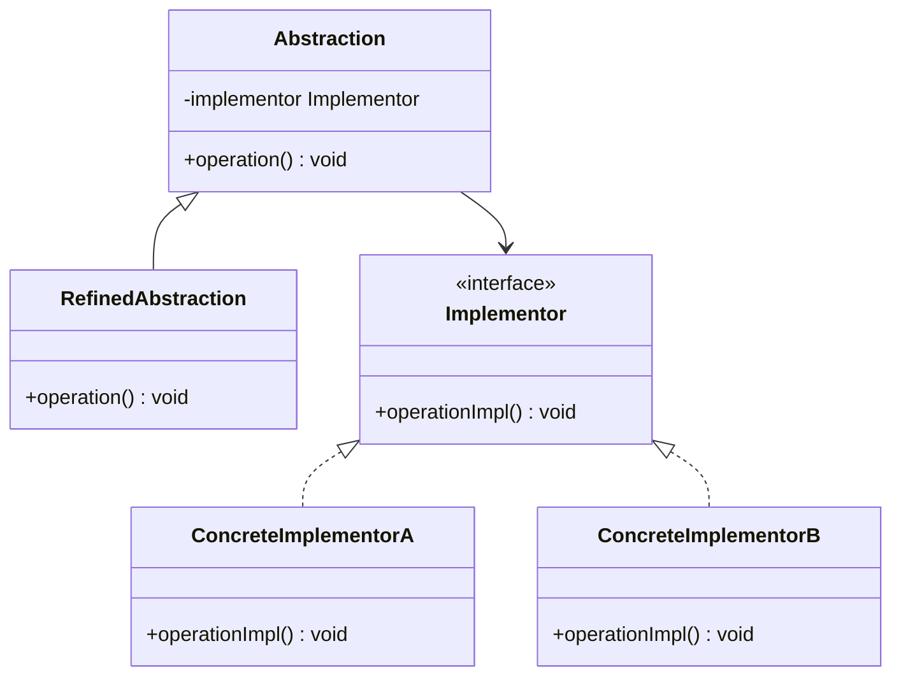
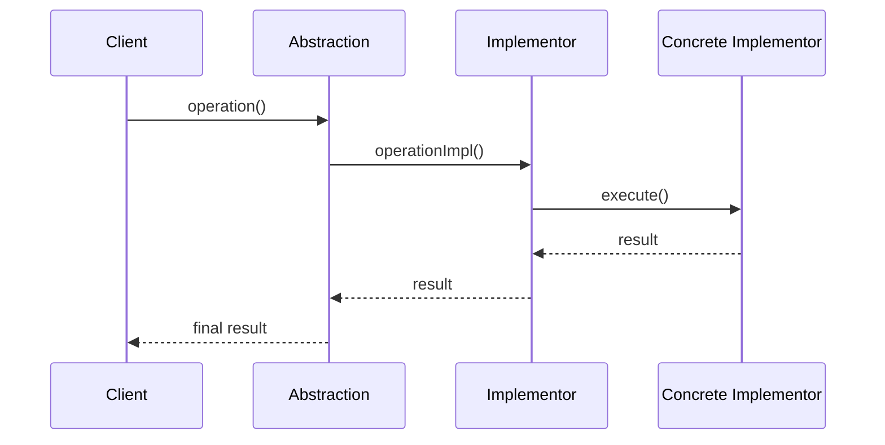
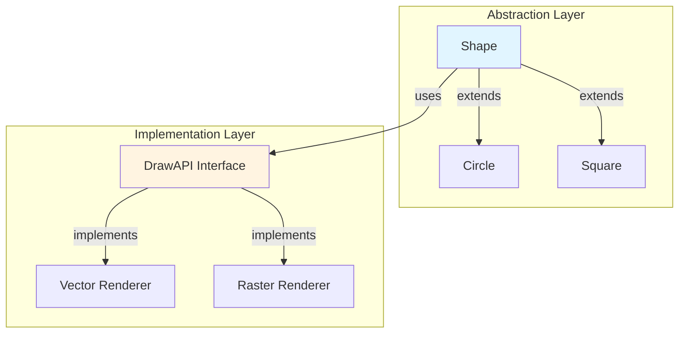

# Bridge Pattern


## Table of Contents

- [Overview](#overview)
- [Diagram Images](#diagram-images)
- [Intent](#intent)
- [Type](#type)
- [Problem](#problem)
- [Solution](#solution)
- [UML Class Diagram](#uml-class-diagram)
- [Sequence Diagram](#sequence-diagram)
- [Structure](#structure)
  - [Components](#components)
- [When to Use](#when-to-use)
- [Examples in This Repository](#examples-in-this-repository)
  - [Example 1: Shape Drawing Bridge](#example-1-shape-drawing-bridge)
  - [Example 2: Device Remote Control Bridge](#example-2-device-remote-control-bridge)
- [Detailed Code Flow](#detailed-code-flow)
  - [Shape Drawing Example](#shape-drawing-example)
- [System Architecture](#system-architecture)
- [Pros](#pros)
- [Cons](#cons)
- [Real-World Applications](#real-world-applications)
  - [Software Development](#software-development)
  - [Specific Examples](#specific-examples)
- [Related Patterns](#related-patterns)
- [Comparison with Similar Patterns](#comparison-with-similar-patterns)
- [Implementation Considerations](#implementation-considerations)
  - [Best Practices](#best-practices)
  - [Common Pitfalls](#common-pitfalls)
- [Code Example](#code-example)
- [Source Code](#source-code)
  - [`BasicRemote.java`](#basicremote-java)
  - [`BridgeDemo.java`](#bridgedemo-java)
  - [`Circle.java`](#circle-java)
  - [`Device.java`](#device-java)
  - [`DrawAPI.java`](#drawapi-java)
  - [`GreenCircle.java`](#greencircle-java)
  - [`Radio.java`](#radio-java)
  - [`RedCircle.java`](#redcircle-java)
  - [`RemoteControl.java`](#remotecontrol-java)
  - [`Shape.java`](#shape-java)
  - [`TV.java`](#tv-java)


---

## Overview

## Diagram Images


The Bridge pattern decouples an abstraction from its implementation so that the two can vary independently. It uses composition instead of inheritance to separate what varies from what stays the same.

## Intent

- Decouple an abstraction from its implementation
- Allow abstraction and implementation to vary independently
- Hide implementation details from clients
- Improve extensibility without modifying existing code

## Type

**Structural Pattern** - Separates interface hierarchy from implementation hierarchy.

## Problem

When you have a class hierarchy that multiplies due to multiple dimensions of variation, you end up with a combinatorial explosion of classes. For example, if you have shapes (Circle, Square) and renderers (Vector, Raster), you'd need CircleVector, CircleRaster, SquareVector, SquareRaster classes.

## Solution

Split the monolithic class into two separate hierarchies: abstraction (interface) and implementation. Use composition to combine them at runtime rather than compile-time.

## UML Class Diagram



## Sequence Diagram



## Structure

### Components

1. **Abstraction** - Defines the abstraction's interface and maintains a reference to an Implementor
2. **RefinedAbstraction** - Extends the abstraction interface
3. **Implementor** - Defines the interface for implementation classes
4. **ConcreteImplementor** - Implements the Implementor interface

## When to Use

- You want to avoid a permanent binding between abstraction and implementation
- Both abstractions and implementations should be extensible via subclassing
- Changes to implementation should not affect clients
- You want to hide implementation details from clients
- You have a proliferation of classes due to multiple dimensions of variation

## Examples in This Repository

### Example 1: Shape Drawing Bridge
- **Abstraction**: `Shape` abstract class
- **RefinedAbstraction**: `Circle` class
- **Implementor**: `DrawAPI` interface
- **ConcreteImplementors**: `RedCircle`, `GreenCircle`
- **Use Case**: Separate shape definition from drawing implementation, allowing different drawing APIs

### Example 2: Device Remote Control Bridge
- **Abstraction**: `RemoteControl` abstract class
- **RefinedAbstraction**: `BasicRemote` class
- **Implementor**: `Device` interface
- **ConcreteImplementors**: `TV`, `Radio`
- **Use Case**: Decouple remote control interface from device implementation

## Detailed Code Flow

### Shape Drawing Example

```
1. Client creates Circle with RedCircle DrawAPI
2. Client calls circle.draw()
3. Circle internally calls drawAPI.drawCircle()
4. RedCircle executes drawing logic
5. Result is returned
```

## System Architecture



## Pros

- **Separation of Concerns**: Abstraction and implementation can evolve independently
- **Extensibility**: Easy to extend both hierarchies independently
- **Implementation Hiding**: Implementation details are hidden from clients
- **Runtime Binding**: Can switch implementations at runtime
- **Prevents Explosion**: Avoids combinatorial explosion of classes

## Cons

- **Complexity**: Adds complexity to the design
- **Double Indirection**: Might have slight performance overhead
- **Learning Curve**: Can be confusing for developers new to the pattern

## Real-World Applications

### Software Development
- **Database Drivers**: Abstract database operations from specific database implementations
- **GUI Frameworks**: Separate UI components from platform-specific rendering
- **Operating Systems**: Separate OS API from hardware-specific implementations

### Specific Examples
- **Graphics Libraries**: Drawing abstractions with different rendering engines
- **Device Drivers**: Hardware abstraction layers
- **Remote Controls**: Different remotes for different devices
- **Cross-platform Applications**: Platform-independent code with platform-specific implementations

## Related Patterns

- **Adapter**: Makes unrelated classes work together, Bridge designed up-front
- **State**: Similar structure but Bridge focuses on separation of concerns
- **Strategy**: Encapsulates algorithms, Bridge separates abstraction from implementation

## Comparison with Similar Patterns

| Pattern | Purpose | Relationship Type |
|---------|---------|-------------------|
| **Bridge** | Decouple abstraction from implementation | Composition |
| **Adapter** | Make incompatible interfaces work | Wrapper |
| **Strategy** | Encapsulate algorithms | Composition |

## Implementation Considerations

### Best Practices

1. **Use Composition**: Prefer composition over inheritance
2. **Clear Interface**: Define clear boundaries between abstraction and implementation
3. **Avoid Leaking**: Don't expose implementation details through abstraction
4. **Document Separation**: Clearly document what belongs to abstraction vs implementation

### Common Pitfalls

1. **Over-engineering**: Don't use Bridge for simple cases
2. **Tight Coupling**: Avoid creating dependencies between abstraction and implementation
3. **Performance**: Consider performance implications of double indirection

## Code Example

```java
// Implementor
public interface DrawAPI {
    void drawCircle(int x, int y, int radius);
}

// Abstraction
public abstract class Shape {
    protected DrawAPI drawAPI;
    
    protected Shape(DrawAPI drawAPI) {
        this.drawAPI = drawAPI;
    }
    
    public abstract void draw();
}

// Refined Abstraction
public class Circle extends Shape {
    private int x, y, radius;
    
    public Circle(int x, int y, int radius, DrawAPI drawAPI) {
        super(drawAPI);
        this.x = x;
        this.y = y;
        this.radius = radius;
    }
    
    @Override
    public void draw() {
        drawAPI.drawCircle(x, y, radius);
    }
}

// Concrete Implementor
public class RedCircle implements DrawAPI {
    @Override
    public void drawCircle(int x, int y, int radius) {
        System.out.println("Drawing Red Circle");
    }
}
```

## Source Code

### `BasicRemote.java`

```java
package com.cursor.designpatterns.structural.bridge;

/**
 * Basic Remote Control (Refined Abstraction).
 * 
 * @author Design Patterns
 * @version 1.0
 * @since 1.0
 */
public class BasicRemote extends RemoteControl {
    
    /**
     * Creates a BasicRemote for the specified device.
     * 
     * @param device the device to control
     */
    public BasicRemote(Device device) {
        super(device);
    }
}
```

### `BridgeDemo.java`

```java
package com.cursor.designpatterns.structural.bridge;

/**
 * Demo class to demonstrate Bridge pattern.
 * 
 * <p>This demo shows two examples of Bridge pattern:</p>
 * <ol>
 *   <li>Shape Drawing - Separating shape abstraction from drawing implementation</li>
 *   <li>Remote Control - Separating remote control from device implementation</li>
 * </ol>
 * 
 * <p><strong>Bridge Pattern Benefits:</strong></p>
 * <ul>
 *   <li>Decouples abstraction from implementation</li>
 *   <li>Allows implementation and abstraction to vary independently</li>
 *   <li>Improves extensibility</li>
 * </ul>
 * 
 * @author Design Patterns
 * @version 1.0
 * @since 1.0
 */
public class BridgeDemo {
    
    public static void main(String[] args) {
        System.out.println("=== Bridge Pattern Demo ===\n");
        
        // Example 1: Shape Drawing
        System.out.println("Example 1: Shape Drawing");
        System.out.println("-------------------------");
        
        Shape redCircle = new Circle(10, 10, 5, new RedCircle());
        Shape greenCircle = new Circle(20, 20, 10, new GreenCircle());
        
        redCircle.draw();
        greenCircle.draw();
        
        System.out.println();
        
        // Example 2: Remote Control
        System.out.println("Example 2: Remote Control");
        System.out.println("--------------------------");
        
        Device tv = new TV();
        RemoteControl tvRemote = new BasicRemote(tv);
        tvRemote.togglePower();
        tvRemote.channelUp();
        tvRemote.channelDown();
        
        System.out.println();
        
        Device radio = new Radio();
        RemoteControl radioRemote = new BasicRemote(radio);
        radioRemote.togglePower();
        radioRemote.channelUp();
        radioRemote.channelUp();
        radioRemote.togglePower();
    }
}
```

### `Circle.java`

```java
package com.cursor.designpatterns.structural.bridge;

/**
 * Circle class (Refined Abstraction).
 * 
 * <p>This extends the Shape abstraction and uses the DrawAPI to draw circles.</p>
 * 
 * @author Design Patterns
 * @version 1.0
 * @since 1.0
 */
public class Circle extends Shape {
    
    private int x, y, radius;
    
    /**
     * Creates a Circle with the specified drawing API and parameters.
     * 
     * @param x the x coordinate
     * @param y the y coordinate
     * @param radius the radius
     * @param drawAPI the drawing API implementation
     */
    public Circle(int x, int y, int radius, DrawAPI drawAPI) {
        super(drawAPI);
        this.x = x;
        this.y = y;
        this.radius = radius;
    }
    
    @Override
    public void draw() {
        drawAPI.drawCircle(x, y, radius);
    }
}
```

### `Device.java`

```java
package com.cursor.designpatterns.structural.bridge;

/**
 * Device interface (Implementation interface for second example).
 * 
 * @author Design Patterns
 * @version 1.0
 * @since 1.0
 */
public interface Device {
    
    /**
     * Turns the device on.
     */
    void turnOn();
    
    /**
     * Turns the device off.
     */
    void turnOff();
    
    /**
     * Checks if the device is on.
     * 
     * @return true if device is on
     */
    boolean isOn();
    
    /**
     * Sets the channel.
     * 
     * @param channel the channel number
     */
    void setChannel(int channel);
    
    /**
     * Gets the current channel.
     * 
     * @return the current channel
     */
    int getChannel();
}
```

### `DrawAPI.java`

```java
package com.cursor.designpatterns.structural.bridge;

/**
 * Draw API interface (Implementation interface).
 * 
 * <p>The Bridge pattern separates abstraction from implementation so they can
 * vary independently. This interface defines the implementation hierarchy.</p>
 * 
 * @author Design Patterns
 * @version 1.0
 * @since 1.0
 */
public interface DrawAPI {
    
    /**
     * Draws a circle with the specified parameters.
     * 
     * @param x the x coordinate
     * @param y the y coordinate
     * @param radius the radius of the circle
     */
    void drawCircle(int x, int y, int radius);
}
```

### `GreenCircle.java`

```java
package com.cursor.designpatterns.structural.bridge;

/**
 * Green Circle implementation (Concrete Implementation).
 * 
 * @author Design Patterns
 * @version 1.0
 * @since 1.0
 */
public class GreenCircle implements DrawAPI {
    
    @Override
    public void drawCircle(int x, int y, int radius) {
        System.out.println("Drawing Green Circle at (" + x + "," + y + ") with radius " + radius);
    }
}
```

### `Radio.java`

```java
package com.cursor.designpatterns.structural.bridge;

/**
 * Radio implementation (Concrete Implementation).
 * 
 * @author Design Patterns
 * @version 1.0
 * @since 1.0
 */
public class Radio implements Device {
    
    private boolean on = false;
    private int channel = 101;
    
    @Override
    public void turnOn() {
        on = true;
        System.out.println("Radio is now ON");
    }
    
    @Override
    public void turnOff() {
        on = false;
        System.out.println("Radio is now OFF");
    }
    
    @Override
    public boolean isOn() {
        return on;
    }
    
    @Override
    public void setChannel(int channel) {
        this.channel = channel;
        System.out.println("Radio frequency set to " + channel);
    }
    
    @Override
    public int getChannel() {
        return channel;
    }
}
```

### `RedCircle.java`

```java
package com.cursor.designpatterns.structural.bridge;

/**
 * Red Circle implementation (Concrete Implementation).
 * 
 * @author Design Patterns
 * @version 1.0
 * @since 1.0
 */
public class RedCircle implements DrawAPI {
    
    @Override
    public void drawCircle(int x, int y, int radius) {
        System.out.println("Drawing Red Circle at (" + x + "," + y + ") with radius " + radius);
    }
}
```

### `RemoteControl.java`

```java
package com.cursor.designpatterns.structural.bridge;

/**
 * Remote Control abstract class (Abstraction for second example).
 * 
 * @author Design Patterns
 * @version 1.0
 * @since 1.0
 */
public abstract class RemoteControl {
    
    protected Device device;
    
    /**
     * Creates a RemoteControl for the specified device.
     * 
     * @param device the device to control
     */
    public RemoteControl(Device device) {
        this.device = device;
    }
    
    /**
     * Toggles the device power.
     */
    public void togglePower() {
        if (device.isOn()) {
            device.turnOff();
        } else {
            device.turnOn();
        }
    }
    
    /**
     * Changes to the next channel.
     */
    public void channelUp() {
        device.setChannel(device.getChannel() + 1);
    }
    
    /**
     * Changes to the previous channel.
     */
    public void channelDown() {
        device.setChannel(device.getChannel() - 1);
    }
}
```

### `Shape.java`

```java
package com.cursor.designpatterns.structural.bridge;

/**
 * Shape abstract class (Abstraction).
 * 
 * <p>This is the abstraction that uses the DrawAPI implementation.
 * The Bridge pattern decouples the abstraction from its implementation.</p>
 * 
 * @author Design Patterns
 * @version 1.0
 * @since 1.0
 */
public abstract class Shape {
    
    protected DrawAPI drawAPI;
    
    /**
     * Creates a Shape with the specified drawing API.
     * 
     * @param drawAPI the drawing API implementation
     */
    protected Shape(DrawAPI drawAPI) {
        this.drawAPI = drawAPI;
    }
    
    /**
     * Draws the shape.
     */
    public abstract void draw();
}
```

### `TV.java`

```java
package com.cursor.designpatterns.structural.bridge;

/**
 * TV implementation (Concrete Implementation).
 * 
 * @author Design Patterns
 * @version 1.0
 * @since 1.0
 */
public class TV implements Device {
    
    private boolean on = false;
    private int channel = 1;
    
    @Override
    public void turnOn() {
        on = true;
        System.out.println("TV is now ON");
    }
    
    @Override
    public void turnOff() {
        on = false;
        System.out.println("TV is now OFF");
    }
    
    @Override
    public boolean isOn() {
        return on;
    }
    
    @Override
    public void setChannel(int channel) {
        this.channel = channel;
        System.out.println("TV channel set to " + channel);
    }
    
    @Override
    public int getChannel() {
        return channel;
    }
}
```
