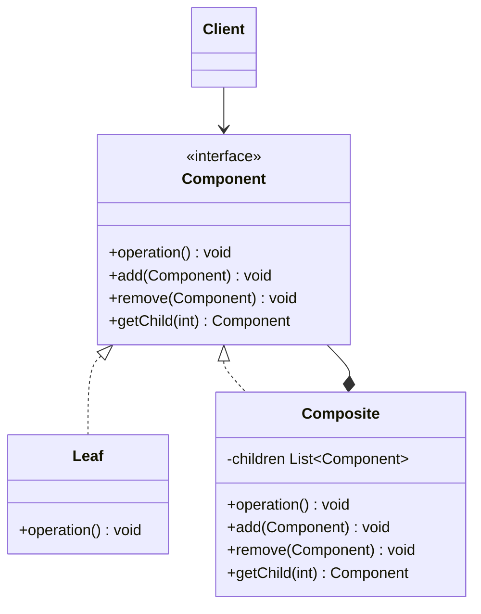
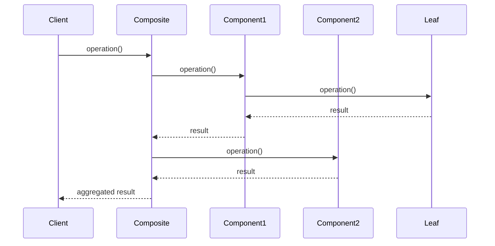
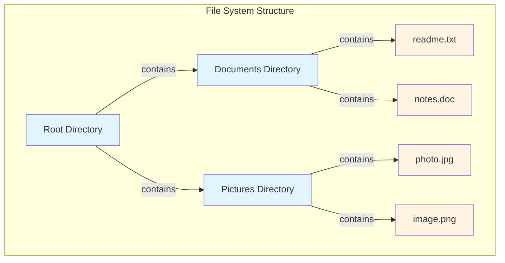

# Composite Pattern


## Table of Contents

- [Overview](#overview)
- [Diagram Images](#diagram-images)
- [Intent](#intent)
- [Type](#type)
- [Problem](#problem)
- [Solution](#solution)
- [UML Class Diagram](#uml-class-diagram)
- [Sequence Diagram](#sequence-diagram)
- [Structure](#structure)
  - [Components](#components)
- [When to Use](#when-to-use)
- [Examples in This Repository](#examples-in-this-repository)
  - [Example 1: File System Composite](#example-1-file-system-composite)
  - [Example 2: Organization Hierarchy](#example-2-organization-hierarchy)
- [Detailed Code Flow](#detailed-code-flow)
  - [File System Example](#file-system-example)
- [System Architecture](#system-architecture)
- [Pros](#pros)
- [Cons](#cons)
- [Real-World Applications](#real-world-applications)
  - [Software Development](#software-development)
  - [Specific Examples](#specific-examples)
- [Related Patterns](#related-patterns)
- [Implementation Considerations](#implementation-considerations)
  - [Best Practices](#best-practices)
  - [Common Pitfalls](#common-pitfalls)
- [Code Example](#code-example)
- [Source Code](#source-code)
  - [`CompositeDemo.java`](#compositedemo-java)
  - [`Directory.java`](#directory-java)
  - [`Employee.java`](#employee-java)
  - [`File.java`](#file-java)
  - [`FileSystemComponent.java`](#filesystemcomponent-java)


---

## Overview

## Diagram Images


The Composite pattern composes objects into tree structures to represent part-whole hierarchies. It lets clients treat individual objects and compositions uniformly.

## Intent

- Compose objects into tree structures
- Represent part-whole hierarchies
- Allow clients to treat individual objects and compositions uniformly
- Simplify client code when dealing with tree structures

## Type

**Structural Pattern** - Deals with object composition to form larger structures.

## Problem

You need to represent part-whole hierarchies where individual objects and compositions of objects need to be treated uniformly. Without this pattern, clients must distinguish between leaf nodes and composite nodes.

## Solution

Define a common interface for both individual objects (leaves) and their containers (composites). Composites can contain leaves and other composites recursively.

## UML Class Diagram



## Sequence Diagram



## Structure

### Components

1. **Component** - Declares the interface for objects in the composition and implements default behavior
2. **Leaf** - Represents leaf objects (no children) in the composition
3. **Composite** - Defines behavior for components having children and stores child components
4. **Client** - Manipulates objects in the composition through the Component interface

## When to Use

- You want to represent part-whole hierarchies
- You want clients to ignore the difference between compositions and individual objects
- The structure can have any level of nesting and is dynamic
- You want to apply the same operations over both individual objects and compositions

## Examples in This Repository

### Example 1: File System Composite
- **Component**: `FileSystemComponent` interface
- **Leaf**: `File` class (represents individual files)
- **Composite**: `Directory` class (can contain files and subdirectories)
- **Use Case**: Represent file system structure where directories can contain files and other directories

### Example 2: Organization Hierarchy
- **Component**: `Employee` class
- **Leaf**: Individual employees (no subordinates)
- **Composite**: Managers (have subordinates)
- **Use Case**: Represent organizational structure where managers have subordinates

## Detailed Code Flow

### File System Example

```
1. Client creates Directory (composite)
2. Client adds File (leaf) to directory
3. Client adds another Directory (composite) to directory
4. Client calls display() on root directory
5. Root directory calls display() on all children
6. Each child processes and returns result
7. Results are aggregated and returned
```

## System Architecture



## Pros

- **Uniform Treatment**: Simplifies client code - treats compositions and individual objects uniformly
- **Easy to Add**: Easy to add new kinds of components
- **Flexible Structure**: Can build complex tree structures recursively
- **Open/Closed Principle**: Can add new component types without modifying existing code

## Cons

- **Design Restriction**: Makes it harder to restrict the components of a composite
- **Type Safety**: Can make it harder to ensure type safety
- **Performance**: May impact performance with deep hierarchies

## Real-World Applications

### Software Development
- **File Systems**: Directories and files
- **GUI Frameworks**: Components and containers
- **Document Structure**: Sections, paragraphs, sentences
- **Organizational Charts**: Employees and departments

### Specific Examples
- **Graphics Editors**: Shapes and groups of shapes
- **Menu Systems**: Menu items and submenus
- **Expression Trees**: Expressions and subexpressions
- **XML/HTML Parsers**: Elements and nested elements

## Related Patterns

- **Decorator**: Often used together with Composite
- **Flyweight**: Can be used to share leaf nodes
- **Iterator**: Can be used to traverse composite structures
- **Visitor**: Can be used to apply operations over composite structures

## Implementation Considerations

### Best Practices

1. **Child Management**: Implement child management operations in Component base class
2. **Default Behavior**: Provide default implementations that may be overridden
3. **Type Safety**: Consider type safety trade-offs
4. **Parent Reference**: Consider adding parent reference for traversal

### Common Pitfalls

1. **Too Many Operations**: Don't add operations that don't make sense for leaves
2. **Performance**: Be careful with deep hierarchies
3. **Type Safety**: Consider using separate interfaces for leaves and composites if needed

## Code Example

```java
// Component
public interface FileSystemComponent {
    void display(String indent);
    long getSize();
}

// Leaf
public class File implements FileSystemComponent {
    private String name;
    private long size;
    
    @Override
    public void display(String indent) {
        System.out.println(indent + "File: " + name);
    }
    
    @Override
    public long getSize() {
        return size;
    }
}

// Composite
public class Directory implements FileSystemComponent {
    private String name;
    private List<FileSystemComponent> children;
    
    @Override
    public void display(String indent) {
        System.out.println(indent + "Directory: " + name);
        for (FileSystemComponent child : children) {
            child.display(indent + "  ");
        }
    }
    
    @Override
    public long getSize() {
        long total = 0;
        for (FileSystemComponent child : children) {
            total += child.getSize();
        }
        return total;
    }
}
```

## Source Code

### `CompositeDemo.java`

```java
package com.cursor.designpatterns.structural.composite;

/**
 * Demo class to demonstrate Composite pattern.
 * 
 * <p>This demo shows two examples of Composite pattern:</p>
 * <ol>
 *   <li>File System - Representing files and directories hierarchically</li>
 *   <li>Organization Hierarchy - Representing employees and managers</li>
 * </ol>
 * 
 * <p><strong>Composite Pattern Benefits:</strong></p>
 * <ul>
 *   <li>Treats individual objects and compositions uniformly</li>
 *   <li>Simplifies client code by treating complex structures and single objects the same way</li>
 *   <li>Makes it easy to add new kinds of components</li>
 * </ul>
 * 
 * @author Design Patterns
 * @version 1.0
 * @since 1.0
 */
public class CompositeDemo {
    
    public static void main(String[] args) {
        System.out.println("=== Composite Pattern Demo ===\n");
        
        // Example 1: File System
        System.out.println("Example 1: File System");
        System.out.println("-----------------------");
        
        Directory root = new Directory("Root");
        Directory documents = new Directory("Documents");
        Directory pictures = new Directory("Pictures");
        
        File file1 = new File("readme.txt", 1024);
        File file2 = new File("notes.doc", 2048);
        File file3 = new File("photo.jpg", 4096);
        File file4 = new File("image.png", 8192);
        
        documents.add(file1);
        documents.add(file2);
        pictures.add(file3);
        pictures.add(file4);
        
        root.add(documents);
        root.add(pictures);
        
        root.display("");
        System.out.println("Total size: " + root.getSize() + " bytes");
        System.out.println();
        
        // Example 2: Organization Hierarchy
        System.out.println("Example 2: Organization Hierarchy");
        System.out.println("----------------------------------");
        
        Employee ceo = new Employee("John CEO", "CEO");
        Employee manager1 = new Employee("Alice Manager", "Manager");
        Employee manager2 = new Employee("Bob Manager", "Manager");
        
        Employee dev1 = new Employee("Charlie Dev", "Developer");
        Employee dev2 = new Employee("Diana Dev", "Developer");
        Employee dev3 = new Employee("Eve Dev", "Developer");
        
        ceo.addSubordinate(manager1);
        ceo.addSubordinate(manager2);
        
        manager1.addSubordinate(dev1);
        manager1.addSubordinate(dev2);
        manager2.addSubordinate(dev3);
        
        ceo.display("");
    }
}
```

### `Directory.java`

```java
package com.cursor.designpatterns.structural.composite;

import java.util.ArrayList;
import java.util.List;

/**
 * Directory class (Composite).
 * 
 * <p>Represents a composite node in the composite structure. A directory can
 * contain both files and subdirectories.</p>
 * 
 * @author Design Patterns
 * @version 1.0
 * @since 1.0
 */
public class Directory implements FileSystemComponent {
    
    private String name;
    private List<FileSystemComponent> children;
    
    /**
     * Creates a new Directory.
     * 
     * @param name the directory name
     */
    public Directory(String name) {
        this.name = name;
        this.children = new ArrayList<>();
    }
    
    /**
     * Adds a component (file or directory) to this directory.
     * 
     * @param component the component to add
     */
    public void add(FileSystemComponent component) {
        children.add(component);
    }
    
    /**
     * Removes a component from this directory.
     * 
     * @param component the component to remove
     */
    public void remove(FileSystemComponent component) {
        children.remove(component);
    }
    
    @Override
    public void display(String indent) {
        System.out.println(indent + "Directory: " + name);
        for (FileSystemComponent component : children) {
            component.display(indent + "  ");
        }
    }
    
    @Override
    public long getSize() {
        long totalSize = 0;
        for (FileSystemComponent component : children) {
            totalSize += component.getSize();
        }
        return totalSize;
    }
    
    @Override
    public String getName() {
        return name;
    }
}
```

### `Employee.java`

```java
package com.cursor.designpatterns.structural.composite;

import java.util.ArrayList;
import java.util.List;

/**
 * Employee class for Composite pattern example (Organization hierarchy).
 * 
 * <p>Represents both individual employees and managers who can have subordinates.
 * This demonstrates the Composite pattern for organizational structures.</p>
 * 
 * @author Design Patterns
 * @version 1.0
 * @since 1.0
 */
public class Employee {
    
    private String name;
    private String position;
    private List<Employee> subordinates;
    
    /**
     * Creates a new Employee.
     * 
     * @param name the employee name
     * @param position the employee position
     */
    public Employee(String name, String position) {
        this.name = name;
        this.position = position;
        this.subordinates = new ArrayList<>();
    }
    
    /**
     * Adds a subordinate to this employee.
     * 
     * @param employee the subordinate employee
     */
    public void addSubordinate(Employee employee) {
        subordinates.add(employee);
    }
    
    /**
     * Removes a subordinate from this employee.
     * 
     * @param employee the subordinate to remove
     */
    public void removeSubordinate(Employee employee) {
        subordinates.remove(employee);
    }
    
    /**
     * Displays the employee hierarchy.
     * 
     * @param indent the indentation string
     */
    public void display(String indent) {
        System.out.println(indent + name + " - " + position);
        for (Employee subordinate : subordinates) {
            subordinate.display(indent + "  ");
        }
    }
    
    public String getName() {
        return name;
    }
    
    public String getPosition() {
        return position;
    }
    
    public List<Employee> getSubordinates() {
        return new ArrayList<>(subordinates);
    }
}
```

### `File.java`

```java
package com.cursor.designpatterns.structural.composite;

/**
 * File class (Leaf).
 * 
 * <p>Represents a leaf node in the composite structure. A file has no children.</p>
 * 
 * @author Design Patterns
 * @version 1.0
 * @since 1.0
 */
public class File implements FileSystemComponent {
    
    private String name;
    private long size;
    
    /**
     * Creates a new File.
     * 
     * @param name the file name
     * @param size the file size in bytes
     */
    public File(String name, long size) {
        this.name = name;
        this.size = size;
    }
    
    @Override
    public void display(String indent) {
        System.out.println(indent + "File: " + name + " (" + size + " bytes)");
    }
    
    @Override
    public long getSize() {
        return size;
    }
    
    @Override
    public String getName() {
        return name;
    }
}
```

### `FileSystemComponent.java`

```java
package com.cursor.designpatterns.structural.composite;

/**
 * File System Component interface (Component).
 * 
 * <p>The Composite pattern allows you to compose objects into tree structures
 * to represent part-whole hierarchies. This interface represents both individual
 * objects and compositions of objects uniformly.</p>
 * 
 * @author Design Patterns
 * @version 1.0
 * @since 1.0
 */
public interface FileSystemComponent {
    
    /**
     * Displays the component name.
     * 
     * @param indent the indentation string
     */
    void display(String indent);
    
    /**
     * Gets the size of the component.
     * 
     * @return the size in bytes
     */
    long getSize();
    
    /**
     * Gets the name of the component.
     * 
     * @return the component name
     */
    String getName();
}
```
