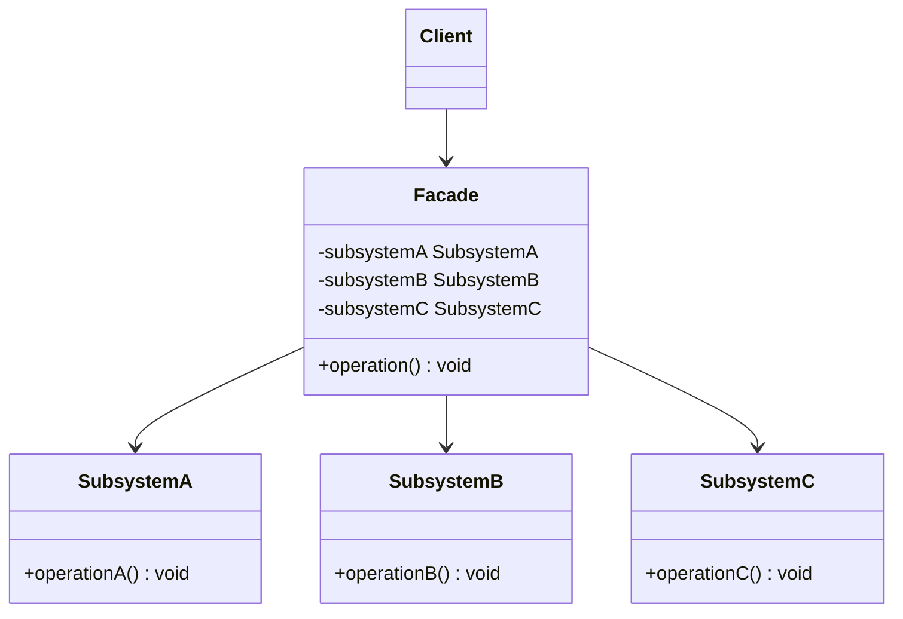
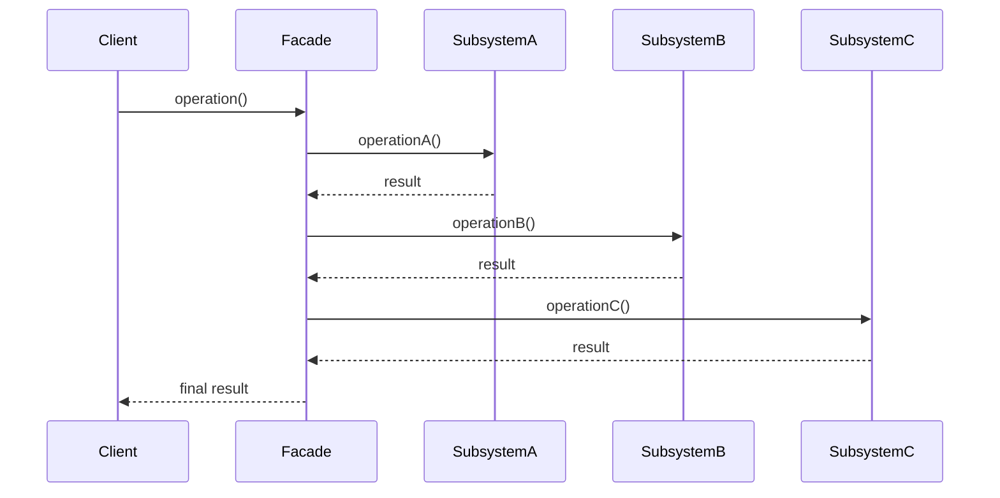
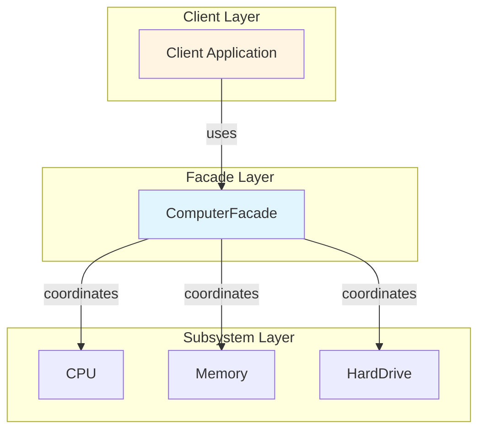

# Facade Pattern


## Table of Contents

- [Overview](#overview)
- [Diagram Images](#diagram-images)
- [Intent](#intent)
- [Type](#type)
- [Problem](#problem)
- [Solution](#solution)
- [UML Class Diagram](#uml-class-diagram)
- [Sequence Diagram](#sequence-diagram)
- [Structure](#structure)
  - [Components](#components)
- [When to Use](#when-to-use)
- [Examples in This Repository](#examples-in-this-repository)
  - [Example 1: Computer Facade](#example-1-computer-facade)
  - [Example 2: Order Processing Facade](#example-2-order-processing-facade)
- [System Architecture](#system-architecture)
- [Pros](#pros)
- [Cons](#cons)
- [Real-World Applications](#real-world-applications)
  - [Software Development](#software-development)
  - [Specific Examples](#specific-examples)
- [Related Patterns](#related-patterns)
- [Code Example](#code-example)
- [Source Code](#source-code)
  - [`ComputerFacade.java`](#computerfacade-java)
  - [`CPU.java`](#cpu-java)
  - [`FacadeDemo.java`](#facadedemo-java)
  - [`HardDrive.java`](#harddrive-java)
  - [`InventoryService.java`](#inventoryservice-java)
  - [`Memory.java`](#memory-java)
  - [`OrderProcessingFacade.java`](#orderprocessingfacade-java)
  - [`PaymentService.java`](#paymentservice-java)
  - [`ShippingService.java`](#shippingservice-java)


---

## Overview

## Diagram Images


The Facade pattern provides a unified interface to a set of interfaces in a subsystem. It defines a higher-level interface that makes the subsystem easier to use by hiding its complexity.

## Intent

- Provide a unified interface to a set of interfaces in a subsystem
- Define a higher-level interface that makes the subsystem easier to use
- Reduce dependencies between clients and subsystem classes
- Wrap a complex subsystem with a simpler interface

## Type

**Structural Pattern** - Provides a simplified interface to a complex subsystem.

## Problem

A subsystem consists of many classes with complex interdependencies. Clients need to interact with multiple classes and understand their relationships, making the subsystem hard to use.

## Solution

Create a facade class that provides a simple, unified interface to the subsystem. The facade delegates client requests to appropriate subsystem objects.

## UML Class Diagram



## Sequence Diagram



## Structure

### Components

1. **Facade** - Knows which subsystem classes are responsible for a request and delegates client requests
2. **Subsystem Classes** - Implement subsystem functionality and handle work assigned by the facade
3. **Client** - Communicates with the subsystem by sending requests to the facade

## When to Use

- Provide a simple interface to a complex subsystem
- Decouple clients from subsystem classes
- Layer your subsystems and create facades for each layer
- Reduce dependencies between clients and implementation classes

## Examples in This Repository

### Example 1: Computer Facade
- **Facade**: `ComputerFacade` class
- **Subsystem**: `CPU`, `Memory`, `HardDrive` classes
- **Use Case**: Simplify computer startup/shutdown process by hiding subsystem complexity

### Example 2: Order Processing Facade
- **Facade**: `OrderProcessingFacade` class
- **Subsystem**: `InventoryService`, `PaymentService`, `ShippingService`
- **Use Case**: Simplify order processing workflow by coordinating multiple services

## System Architecture



## Pros

- **Simplifies Interface**: Provides a simple interface to complex subsystem
- **Decouples**: Decouples clients from subsystem components
- **Easier to Use**: Makes subsystem easier to use and learn
- **Reduces Coupling**: Reduces coupling between clients and subsystem

## Cons

- **Limited Functionality**: May not expose all functionality
- **God Object**: Can become a god object if too much functionality
- **Tight Coupling**: Tight coupling between facade and subsystem

## Real-World Applications

### Software Development
- **Operating Systems**: System call interfaces
- **Frameworks**: Simplified APIs for complex frameworks
- **Libraries**: Wrapper libraries that simplify complex APIs
- **Microservices**: API gateways that aggregate multiple services

### Specific Examples
- **Home Automation**: Single interface to control lights, HVAC, security
- **Order Processing**: Coordinate inventory, payment, shipping
- **Database Access**: Simplified interface to complex database operations
- **Compiler APIs**: Simplified interfaces to complex compiler subsystems

## Related Patterns

- **Adapter**: Makes existing classes work together, Facade simplifies interface
- **Mediator**: Centralizes communication, Facade simplifies interface
- **Singleton**: Facades are often singletons

## Code Example

```java
// Subsystem classes
public class CPU {
    public void start() { /* ... */ }
}

public class Memory {
    public void load() { /* ... */ }
}

public class HardDrive {
    public void read() { /* ... */ }
}

// Facade
public class ComputerFacade {
    private CPU cpu;
    private Memory memory;
    private HardDrive hardDrive;
    
    public ComputerFacade() {
        this.cpu = new CPU();
        this.memory = new Memory();
        this.hardDrive = new HardDrive();
    }
    
    public void startComputer() {
        cpu.start();
        memory.load();
        hardDrive.read();
    }
}
```

## Source Code

### `ComputerFacade.java`

```java
package com.cursor.designpatterns.structural.facade;

/**
 * Computer Facade class.
 * 
 * <p>The Facade pattern provides a simplified interface to a complex subsystem.
 * This facade class hides the complexity of the CPU, Memory, and HardDrive
 * subsystems behind a simple interface.</p>
 * 
 * <p><strong>Facade Pattern Benefits:</strong></p>
 * <ul>
 *   <li>Simplifies complex subsystem interactions</li>
 *   <li>Provides a higher-level interface</li>
 *   <li>Reduces dependencies on subsystem classes</li>
 * </ul>
 * 
 * @author Design Patterns
 * @version 1.0
 * @since 1.0
 */
public class ComputerFacade {
    
    private CPU cpu;
    private Memory memory;
    private HardDrive hardDrive;
    
    /**
     * Creates a ComputerFacade and initializes subsystems.
     */
    public ComputerFacade() {
        this.cpu = new CPU();
        this.memory = new Memory();
        this.hardDrive = new HardDrive();
    }
    
    /**
     * Starts the computer (simplified interface).
     * This method coordinates the complex startup process.
     */
    public void startComputer() {
        System.out.println("Starting computer...");
        cpu.start();
        memory.load();
        hardDrive.read();
        cpu.execute();
        System.out.println("Computer started successfully!\n");
    }
    
    /**
     * Shuts down the computer (simplified interface).
     */
    public void shutDownComputer() {
        System.out.println("Shutting down computer...");
        cpu.shutdown();
        memory.clear();
        System.out.println("Computer shut down successfully!\n");
    }
}
```

### `CPU.java`

```java
package com.cursor.designpatterns.structural.facade;

/**
 * CPU subsystem class.
 * 
 * <p>Part of the complex subsystem that the Facade pattern simplifies.</p>
 * 
 * @author Design Patterns
 * @version 1.0
 * @since 1.0
 */
public class CPU {
    
    public void start() {
        System.out.println("CPU is starting...");
    }
    
    public void execute() {
        System.out.println("CPU is executing instructions...");
    }
    
    public void shutdown() {
        System.out.println("CPU is shutting down...");
    }
}
```

### `FacadeDemo.java`

```java
package com.cursor.designpatterns.structural.facade;

/**
 * Demo class to demonstrate Facade pattern.
 * 
 * <p>This demo shows two examples of Facade pattern:</p>
 * <ol>
 *   <li>Computer Facade - Simplifying computer startup/shutdown</li>
 *   <li>Order Processing Facade - Simplifying order processing workflow</li>
 * </ol>
 * 
 * <p><strong>Facade Pattern Benefits:</strong></p>
 * <ul>
 *   <li>Provides a simple interface to complex subsystems</li>
 *   <li>Reduces coupling between clients and subsystems</li>
 *   <li>Makes subsystems easier to use</li>
 * </ul>
 * 
 * @author Design Patterns
 * @version 1.0
 * @since 1.0
 */
public class FacadeDemo {
    
    public static void main(String[] args) {
        System.out.println("=== Facade Pattern Demo ===\n");
        
        // Example 1: Computer Facade
        System.out.println("Example 1: Computer Facade");
        System.out.println("---------------------------");
        
        ComputerFacade computer = new ComputerFacade();
        computer.startComputer();
        computer.shutDownComputer();
        
        // Example 2: Order Processing Facade
        System.out.println("Example 2: Order Processing Facade");
        System.out.println("-----------------------------------");
        
        OrderProcessingFacade orderFacade = new OrderProcessingFacade();
        orderFacade.processOrder("PROD001", 2, 99.99, "Credit Card", "123 Main St");
        orderFacade.processOrder("PROD002", 1, 49.99, "PayPal", "456 Oak Ave");
    }
}
```

### `HardDrive.java`

```java
package com.cursor.designpatterns.structural.facade;

/**
 * Hard Drive subsystem class.
 * 
 * @author Design Patterns
 * @version 1.0
 * @since 1.0
 */
public class HardDrive {
    
    public void read() {
        System.out.println("Hard Drive is reading data...");
    }
    
    public void write() {
        System.out.println("Hard Drive is writing data...");
    }
}
```

### `InventoryService.java`

```java
package com.cursor.designpatterns.structural.facade;

/**
 * Inventory Service (Subsystem for second example).
 * 
 * @author Design Patterns
 * @version 1.0
 * @since 1.0
 */
public class InventoryService {
    
    public boolean checkAvailability(String productId, int quantity) {
        System.out.println("Checking inventory for product: " + productId);
        // Simulate inventory check
        return true;
    }
    
    public void updateInventory(String productId, int quantity) {
        System.out.println("Updating inventory: " + productId + " - " + quantity);
    }
}
```

### `Memory.java`

```java
package com.cursor.designpatterns.structural.facade;

/**
 * Memory subsystem class.
 * 
 * @author Design Patterns
 * @version 1.0
 * @since 1.0
 */
public class Memory {
    
    public void load() {
        System.out.println("Memory is loading data...");
    }
    
    public void clear() {
        System.out.println("Memory is clearing data...");
    }
}
```

### `OrderProcessingFacade.java`

```java
package com.cursor.designpatterns.structural.facade;

/**
 * Order Processing Facade.
 * 
 * <p>Simplifies the complex order processing workflow by providing
 * a single interface to coordinate multiple services.</p>
 * 
 * @author Design Patterns
 * @version 1.0
 * @since 1.0
 */
public class OrderProcessingFacade {
    
    private InventoryService inventoryService;
    private PaymentService paymentService;
    private ShippingService shippingService;
    
    /**
     * Creates an OrderProcessingFacade and initializes services.
     */
    public OrderProcessingFacade() {
        this.inventoryService = new InventoryService();
        this.paymentService = new PaymentService();
        this.shippingService = new ShippingService();
    }
    
    /**
     * Processes an order (simplified interface).
     * 
     * @param productId the product ID
     * @param quantity the quantity
     * @param amount the payment amount
     * @param paymentMethod the payment method
     * @param address the shipping address
     * @return true if order processed successfully
     */
    public boolean processOrder(String productId, int quantity, double amount,
                                String paymentMethod, String address) {
        System.out.println("Processing order...");
        
        // Check inventory
        if (!inventoryService.checkAvailability(productId, quantity)) {
            System.out.println("Product not available");
            return false;
        }
        
        // Process payment
        if (!paymentService.processPayment(amount, paymentMethod)) {
            System.out.println("Payment failed");
            return false;
        }
        
        // Update inventory
        inventoryService.updateInventory(productId, quantity);
        
        // Ship order
        String orderId = "ORD-" + System.currentTimeMillis();
        shippingService.shipOrder(orderId, address);
        
        System.out.println("Order processed successfully! Order ID: " + orderId + "\n");
        return true;
    }
}
```

### `PaymentService.java`

```java
package com.cursor.designpatterns.structural.facade;

/**
 * Payment Service (Subsystem for second example).
 * 
 * @author Design Patterns
 * @version 1.0
 * @since 1.0
 */
public class PaymentService {
    
    public boolean processPayment(double amount, String paymentMethod) {
        System.out.println("Processing payment of $" + amount + " via " + paymentMethod);
        // Simulate payment processing
        return true;
    }
}
```

### `ShippingService.java`

```java
package com.cursor.designpatterns.structural.facade;

/**
 * Shipping Service (Subsystem for second example).
 * 
 * @author Design Patterns
 * @version 1.0
 * @since 1.0
 */
public class ShippingService {
    
    public void shipOrder(String orderId, String address) {
        System.out.println("Shipping order " + orderId + " to " + address);
    }
}
```
