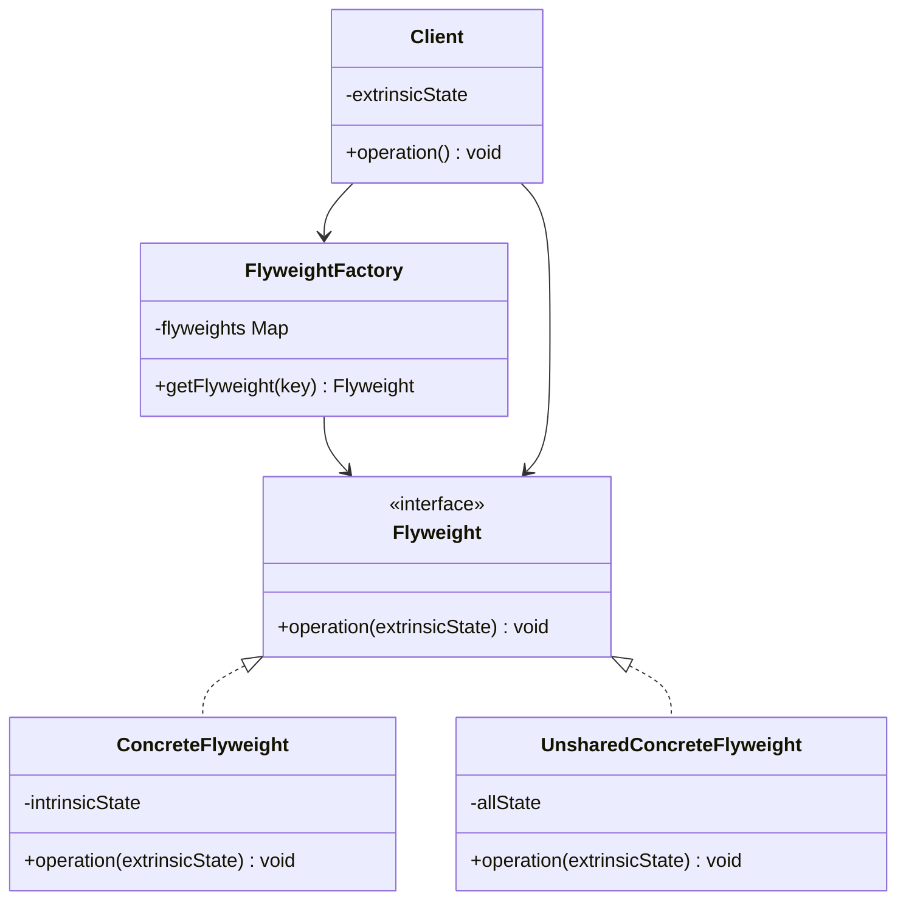
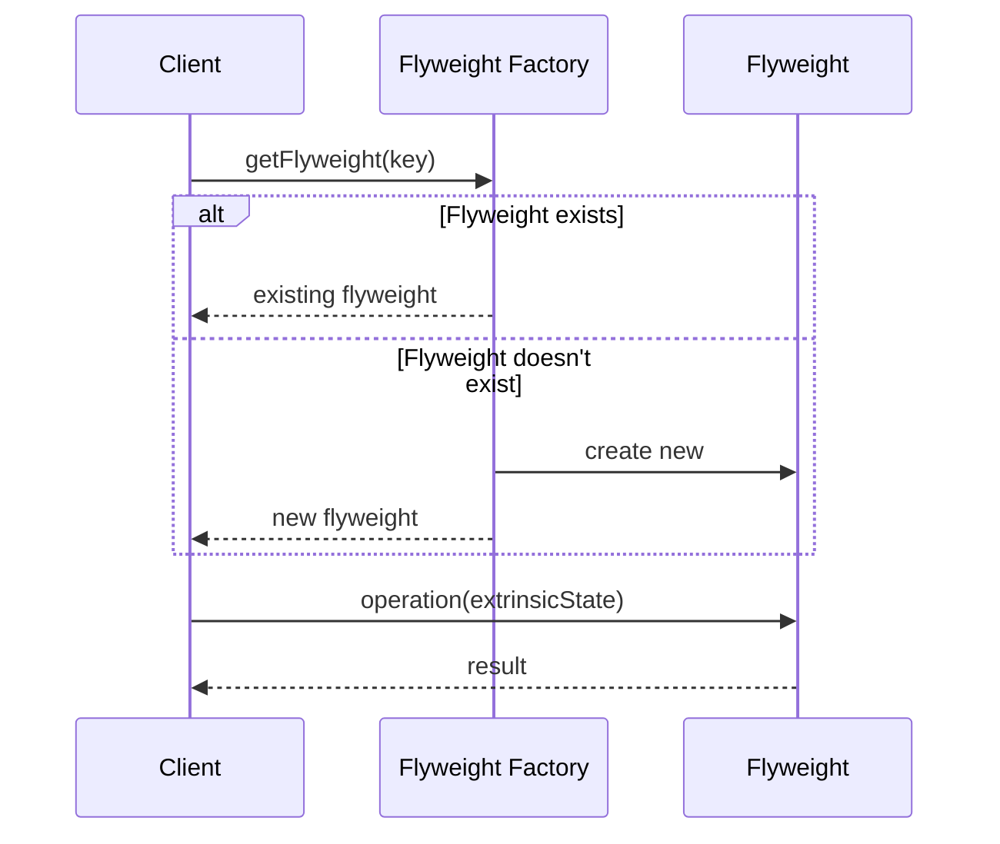
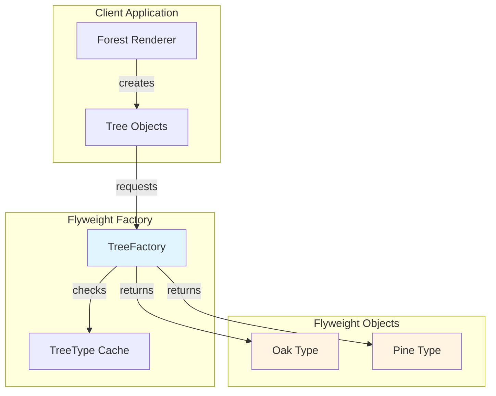

# Flyweight Pattern


## Table of Contents

- [Overview](#overview)
- [Diagram Images](#diagram-images)
- [Intent](#intent)
- [Type](#type)
- [Problem](#problem)
- [Solution](#solution)
- [UML Class Diagram](#uml-class-diagram)
- [Sequence Diagram](#sequence-diagram)
- [Structure](#structure)
  - [Components](#components)
  - [State Classification](#state-classification)
- [When to Use](#when-to-use)
- [Examples in This Repository](#examples-in-this-repository)
  - [Example 1: Character Flyweight](#example-1-character-flyweight)
  - [Example 2: Tree Type Flyweight](#example-2-tree-type-flyweight)
- [System Architecture](#system-architecture)
- [Pros](#pros)
- [Cons](#cons)
- [Real-World Applications](#real-world-applications)
  - [Software Development](#software-development)
  - [Specific Examples](#specific-examples)
- [Related Patterns](#related-patterns)
- [Code Example](#code-example)
- [Source Code](#source-code)
  - [`Character.java`](#character-java)
  - [`CharacterFactory.java`](#characterfactory-java)
  - [`FlyweightDemo.java`](#flyweightdemo-java)
  - [`Tree.java`](#tree-java)
  - [`TreeFactory.java`](#treefactory-java)
  - [`TreeType.java`](#treetype-java)


---

## Overview

## Diagram Images


The Flyweight pattern uses sharing to support large numbers of fine-grained objects efficiently. It minimizes memory usage by sharing as much data as possible with similar objects.

## Intent

- Use sharing to support large numbers of fine-grained objects efficiently
- Reduce memory usage by sharing common state
- Separate intrinsic (shared) state from extrinsic (unique) state
- Optimize memory-intensive applications

## Type

**Structural Pattern** - Focuses on efficient memory usage through object sharing.

## Problem

An application uses a large number of objects that have some shared state and some unique state. Creating all these objects consumes too much memory.

## Solution

Separate intrinsic (shared) state from extrinsic (context-specific) state. Store intrinsic state in flyweight objects and pass extrinsic state as parameters.

## UML Class Diagram



## Sequence Diagram



## Structure

### Components

1. **Flyweight** - Declares an interface through which flyweights can receive extrinsic state
2. **ConcreteFlyweight** - Implements the Flyweight interface and stores intrinsic state
3. **FlyweightFactory** - Creates and manages flyweight objects
4. **Client** - Maintains references to flyweights and computes or stores extrinsic state

### State Classification

- **Intrinsic State** - Stored in the flyweight; shared across objects
- **Extrinsic State** - Stored or computed by client; passed to flyweight when needed

## When to Use

- Application uses a large number of objects
- Storage costs are high because of the sheer quantity of objects
- Most object state can be made extrinsic
- Groups of objects may be replaced by relatively few shared objects
- Application doesn't depend on object identity

## Examples in This Repository

### Example 1: Character Flyweight
- **Flyweight**: `Character` class (stores character value - intrinsic)
- **Factory**: `CharacterFactory` (manages character instances)
- **Extrinsic State**: Position (passed as parameter)
- **Use Case**: Render text where each character position is unique but character values repeat

### Example 2: Tree Type Flyweight
- **Flyweight**: `TreeType` class (stores name, color, texture - intrinsic)
- **Factory**: `TreeFactory` (manages tree type instances)
- **Extrinsic State**: Position (x, y coordinates)
- **Use Case**: Render forest where many trees share the same type but have different positions

## System Architecture



## Pros

- **Memory Efficiency**: Reduces memory usage significantly
- **Performance**: Can improve performance by reducing object creation
- **Scalability**: Allows handling of large numbers of objects
- **Separation**: Clear separation of shared and unique state

## Cons

- **Complexity**: Increases code complexity
- **Identity Issues**: Flyweights may not be suitable if object identity matters
- **Thread Safety**: Need to ensure thread safety in factory
- **State Management**: Must carefully manage intrinsic vs extrinsic state

## Real-World Applications

### Software Development
- **Text Editors**: Character objects in text rendering
- **Game Development**: Trees, bullets, particles in games
- **GUI Frameworks**: Icon objects, font objects
- **Compiler Design**: AST nodes, symbol table entries

### Specific Examples
- **Word Processors**: Character glyphs (font, size shared; position unique)
- **Video Games**: Bullet types, enemy types, terrain tiles
- **Web Browsers**: Font rendering, image caching
- **Graphics Libraries**: Shape types, texture objects

## Related Patterns

- **Composite**: Flyweights can be leaves in composite structures
- **State**: State objects can be flyweights
- **Strategy**: Strategy objects can be flyweights

## Code Example

```java
// Flyweight
public class Character {
    private final char character; // Intrinsic state
    
    public Character(char character) {
        this.character = character;
    }
    
    public void display(int position) { // Extrinsic state as parameter
        System.out.println("Character '" + character + "' at position " + position);
    }
}

// Flyweight Factory
public class CharacterFactory {
    private static Map<Character, Character> characters = new HashMap<>();
    
    public static Character getCharacter(char c) {
        Character key = Character.valueOf(c);
        Character character = characters.get(key);
        if (character == null) {
            character = new Character(c);
            characters.put(key, character);
        }
        return character;
    }
}
```

## Source Code

### `Character.java`

```java
package com.cursor.designpatterns.structural.flyweight;

/**
 * Character class (Concrete Flyweight).
 * 
 * <p>The Flyweight pattern minimizes memory usage by sharing as much data
 * as possible with similar objects. Character objects share intrinsic state
 * (the character itself) and have extrinsic state (position).</p>
 * 
 * @author Design Patterns
 * @version 1.0
 * @since 1.0
 */
public class Character {
    
    private final char character; // Intrinsic state (shared)
    
    /**
     * Creates a Character with the specified character value.
     * 
     * @param character the character value
     */
    public Character(char character) {
        this.character = character;
    }
    
    /**
     * Displays the character at the specified position.
     * Position is extrinsic state (passed as parameter, not stored).
     * 
     * @param position the position to display at
     */
    public void display(int position) {
        System.out.println("Character '" + character + "' at position " + position);
    }
    
    public char getCharacter() {
        return character;
    }
}
```

### `CharacterFactory.java`

```java
package com.cursor.designpatterns.structural.flyweight;

import java.util.HashMap;
import java.util.Map;

/**
 * Character Factory (Flyweight Factory).
 * 
 * <p>This factory creates and manages Character flyweight objects.
 * It ensures that each character is only created once and reused.</p>
 * 
 * @author Design Patterns
 * @version 1.0
 * @since 1.0
 */
public class CharacterFactory {
    
    private static Map<java.lang.Character, Character> characters = new HashMap<>();
    
    /**
     * Gets a Character flyweight object.
     * Creates a new one if it doesn't exist, otherwise returns the existing one.
     * 
     * @param c the character value
     * @return the Character flyweight object
     */
    public static Character getCharacter(char c) {
        java.lang.Character key = java.lang.Character.valueOf(c);
        Character character = characters.get(key);
        if (character == null) {
            character = new Character(c);
            characters.put(key, character);
            System.out.println("Creating new character: " + c);
        } else {
            System.out.println("Reusing existing character: " + c);
        }
        return character;
    }
    
    /**
     * Gets the number of unique characters created.
     * 
     * @return the number of unique characters
     */
    public static int getCharacterCount() {
        return characters.size();
    }
}
```

### `FlyweightDemo.java`

```java
package com.cursor.designpatterns.structural.flyweight;

/**
 * Demo class to demonstrate Flyweight pattern.
 * 
 * <p>This demo shows two examples of Flyweight pattern:</p>
 * <ol>
 *   <li>Character Flyweight - Sharing character objects in text rendering</li>
 *   <li>Tree Flyweight - Sharing tree type information in a forest</li>
 * </ol>
 * 
 * <p><strong>Flyweight Pattern Benefits:</strong></p>
 * <ul>
 *   <li>Reduces memory usage by sharing common state</li>
 *   <li>Useful when you need many objects with similar properties</li>
 *   <li>Improves performance by reducing object creation</li>
 * </ul>
 * 
 * @author Design Patterns
 * @version 1.0
 * @since 1.0
 */
public class FlyweightDemo {
    
    public static void main(String[] args) {
        System.out.println("=== Flyweight Pattern Demo ===\n");
        
        // Example 1: Character Flyweight
        System.out.println("Example 1: Character Flyweight");
        System.out.println("-------------------------------");
        
        String text = "HELLO";
        Character[] characters = new Character[text.length()];
        
        for (int i = 0; i < text.length(); i++) {
            characters[i] = CharacterFactory.getCharacter(text.charAt(i));
            characters[i].display(i);
        }
        
        System.out.println("\nTotal unique characters created: " + 
                          CharacterFactory.getCharacterCount());
        System.out.println("Total characters displayed: " + text.length());
        System.out.println();
        
        // Example 2: Tree Flyweight
        System.out.println("Example 2: Tree Flyweight");
        System.out.println("--------------------------");
        
        // Create a forest with many trees
        Tree[] forest = new Tree[10];
        
        // Create trees (some will share the same TreeType)
        for (int i = 0; i < forest.length; i++) {
            TreeType treeType;
            if (i % 2 == 0) {
                treeType = TreeFactory.getTreeType("Oak", "Green", "Rough");
            } else {
                treeType = TreeFactory.getTreeType("Pine", "Dark Green", "Smooth");
            }
            forest[i] = new Tree(i * 10, i * 5, treeType);
        }
        
        System.out.println("\nDrawing forest:");
        for (Tree tree : forest) {
            tree.draw();
        }
        
        System.out.println("\nTotal unique tree types created: " + 
                          TreeFactory.getTreeTypeCount());
        System.out.println("Total trees in forest: " + forest.length);
    }
}
```

### `Tree.java`

```java
package com.cursor.designpatterns.structural.flyweight;

/**
 * Tree class (Context using Flyweight).
 * 
 * <p>Tree objects have extrinsic state (position) and reference
 * shared intrinsic state (TreeType).</p>
 * 
 * @author Design Patterns
 * @version 1.0
 * @since 1.0
 */
public class Tree {
    
    private int x, y; // Extrinsic state (unique to each tree)
    private TreeType treeType; // Intrinsic state (shared)
    
    /**
     * Creates a Tree at the specified position with the given tree type.
     * 
     * @param x the x coordinate
     * @param y the y coordinate
     * @param treeType the tree type (flyweight)
     */
    public Tree(int x, int y, TreeType treeType) {
        this.x = x;
        this.y = y;
        this.treeType = treeType;
    }
    
    /**
     * Draws the tree.
     */
    public void draw() {
        treeType.draw(x, y);
    }
}
```

### `TreeFactory.java`

```java
package com.cursor.designpatterns.structural.flyweight;

import java.util.HashMap;
import java.util.Map;

/**
 * Tree Factory (Flyweight Factory for second example).
 * 
 * @author Design Patterns
 * @version 1.0
 * @since 1.0
 */
public class TreeFactory {
    
    private static Map<String, TreeType> treeTypes = new HashMap<>();
    
    /**
     * Gets a TreeType flyweight object.
     * Creates a new one if it doesn't exist, otherwise returns the existing one.
     * 
     * @param name the tree name
     * @param color the tree color
     * @param texture the tree texture
     * @return the TreeType flyweight object
     */
    public static TreeType getTreeType(String name, String color, String texture) {
        String key = name + "_" + color + "_" + texture;
        TreeType treeType = treeTypes.get(key);
        if (treeType == null) {
            treeType = new TreeType(name, color, texture);
            treeTypes.put(key, treeType);
            System.out.println("Creating new tree type: " + key);
        } else {
            System.out.println("Reusing existing tree type: " + key);
        }
        return treeType;
    }
    
    /**
     * Gets the number of unique tree types created.
     * 
     * @return the number of unique tree types
     */
    public static int getTreeTypeCount() {
        return treeTypes.size();
    }
}
```

### `TreeType.java`

```java
package com.cursor.designpatterns.structural.flyweight;

/**
 * Tree Type class (Concrete Flyweight for second example).
 * 
 * <p>Represents the intrinsic (shared) state of a tree.
 * Many Tree objects can share the same TreeType.</p>
 * 
 * @author Design Patterns
 * @version 1.0
 * @since 1.0
 */
public class TreeType {
    
    private final String name;
    private final String color;
    private final String texture;
    
    /**
     * Creates a TreeType with the specified properties.
     * 
     * @param name the tree name
     * @param color the tree color
     * @param texture the tree texture
     */
    public TreeType(String name, String color, String texture) {
        this.name = name;
        this.color = color;
        this.texture = texture;
    }
    
    /**
     * Draws the tree at the specified position (extrinsic state).
     * 
     * @param x the x coordinate
     * @param y the y coordinate
     */
    public void draw(int x, int y) {
        System.out.println("Drawing " + name + " tree (color: " + color + 
                          ", texture: " + texture + ") at (" + x + ", " + y + ")");
    }
    
    public String getName() {
        return name;
    }
}
```
