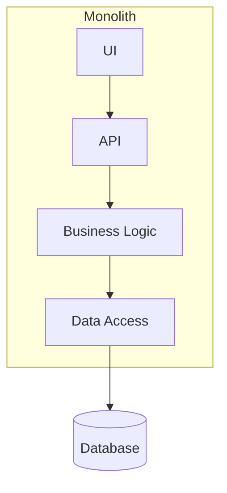
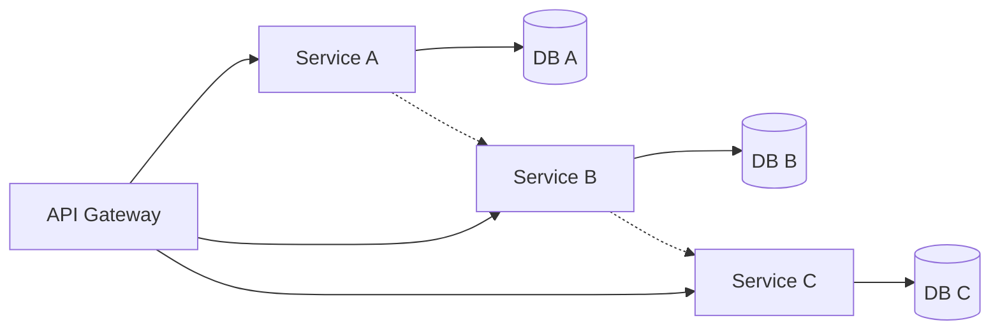
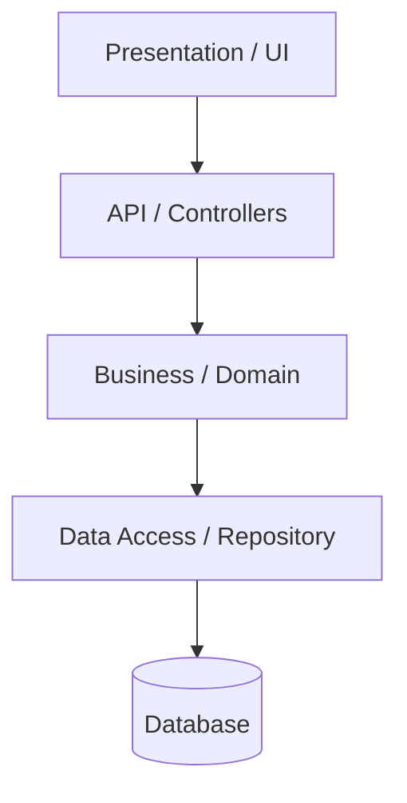
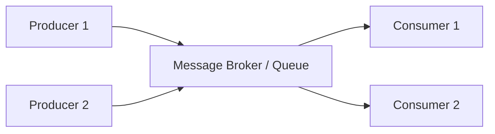
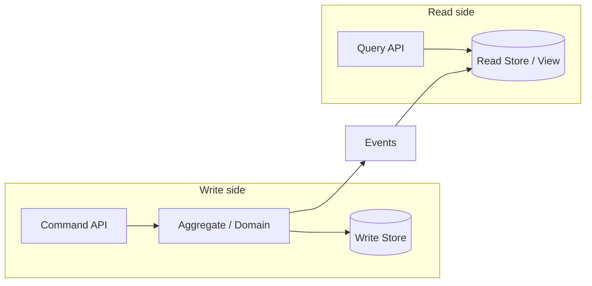

# Architecture Styles and Patterns

## Index

- [Monolith vs microservices vs modular monolith](#monolith-vs-microservices-vs-modular-monolith)
- [Layered architecture](#layered-architecture)
- [Event-driven architecture](#event-driven-architecture)
- [CQRS](#cqrs)
- [When to use which](#when-to-use-which)
- [See also](#see-also)

---

## Monolith vs microservices vs modular monolith

**Monolith:** One deployable unit containing all application logic and often one database. Simple to develop and deploy; scaling is horizontal by cloning the whole app. Drawbacks: tight coupling, hard to scale parts independently, and one bug can bring down everything.

**Microservices:** System split into many small services, each owning a bounded context and often its own data store. Services communicate via HTTP/gRPC or messaging. Enables independent scaling and deployment but adds operational and consistency complexity.

**Modular monolith:** Single deployable unit but with clear internal modules (packages/namespaces) and well-defined boundaries. Easier to evolve into microservices later (strangler pattern). Good default when you want structure without distributed system overhead.

**When to use:** Start with modular monolith or monolith unless you have clear needs for independent scaling, different tech stacks per domain, or separate teams owning services. Prefer microservices when those needs are real and you can operate them.

---

## Layered architecture

Classic structure: presentation → API → business logic → data access → database. Each layer depends only inward; no layer skips another (e.g. API does not call DB directly).

- **Presentation:** Web/mobile UI or API entry (validation, auth).
- **API:** Request routing, DTOs, calling domain.
- **Business:** Domain logic, transactions, orchestration.
- **Data access:** Queries, persistence, caching.

Use when you want clear separation and testability. Avoid when you need heavy cross-cutting or event-driven flows; then consider hexagonal or event-driven styles.

---

## Event-driven architecture

Components produce and consume events asynchronously via a message broker (e.g. Kafka, RabbitMQ). Loose coupling and natural scaling of consumers; eventual consistency and operational complexity (ordering, exactly-once, dead-letter) are the trade-offs.

**Pub/sub:** Multiple subscribers receive the same event. Good for fan-out (e.g. “order placed” → inventory, email, analytics).

**Point-to-point / queue:** One consumer per message. Good for load spreading and decoupling async work.

Use when you have natural async flows, multiple consumers, or need to buffer load. See [Data_And_Storage](Data_And_Storage.md) for replication and consistency implications.

---

## CQRS

**Command Query Responsibility Segregation:** Separate models (and often stores) for writes (commands) and reads (queries). Write side enforces invariants and publishes events; read side is optimized for queries (denormalized, indexed, possibly eventually consistent).

Use when read and write patterns differ strongly (e.g. many different read views, complex write validation). Avoid for simple CRUD; CQRS adds complexity and eventual consistency.

---

## When to use which

| Style | Prefer when | Avoid when |
|-------|-------------|------------|
| Monolith | Small team, single domain, simple scaling | Need independent scale or polyglot persistence |
| Modular monolith | Want clear boundaries, may split later | Already committed to many services |
| Microservices | Multiple teams, independent deploy/scale, bounded contexts | Small team, unclear boundaries, no SRE |
| Layered | Standard CRUD or API-centric app | Heavy eventing or many cross-cutting concerns |
| Event-driven | Async workflows, fan-out, buffering | Strong consistency and simple request/response |
| CQRS | Read/write asymmetry, many read models | Simple reads and writes, strong consistency required |

---

## See also

- [Data_And_Storage](Data_And_Storage.md) — storage choices and replication.
- [Reliability_And_Resilience](Reliability_And_Resilience.md) — failure handling in distributed services.
- [Example_Ecommerce_System](Example_Ecommerce_System.md) — mixed sync/async and service boundaries.
