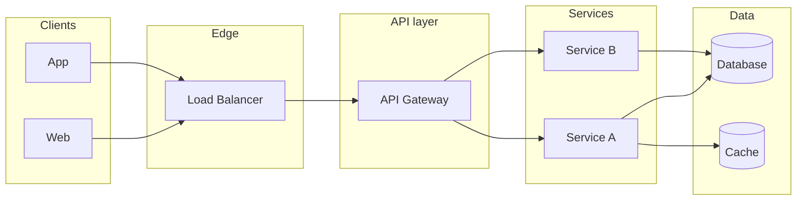

# System Design & Software Architecture — Concepts Overview

## Index

- [System design vs software architecture](#system-design-vs-software-architecture)
- [Main components of system design](#main-components-of-system-design)
- [High-level flow](#high-level-flow)
- [See also](#see-also)

---

## System design vs software architecture

**System design** is the activity of defining and building a system so it meets functional and non-functional goals. It answers: what does the system do, how do parts interact, where does data live, and how do we achieve scale, reliability, and security? It includes requirements clarification, component breakdown, data design, API design, and trade-off decisions.

**Software architecture** is the high-level structure of a system: the main building blocks (components, services, layers), their responsibilities, and the principles that guide how they are organized and how they evolve. It is the “skeleton” that system design fills in with concrete technology and implementation choices.

In practice they overlap: **architecture** is the structural view; **system design** is the process of creating and refining that structure (and its details). In interviews, “design system X” usually means both: propose an architecture and justify key design choices.

---

## Main components of system design

These are the main areas you will cover when designing a system (and when answering senior-level system design questions).

| # | Component / area | What it covers |
|---|-------------------|----------------|
| 1 | **Requirements** | Functional (features, user flows, APIs) and non-functional (scale, latency, availability, consistency, security, cost). |
| 2 | **High-level architecture** | Services, layers, deployment units (monolith vs microservices, API gateway, workers). |
| 3 | **Data design** | Data models, storage choices (relational, NoSQL, cache, queue), partitioning/sharding, replication, consistency. |
| 4 | **API / contracts** | REST, gRPC, or events; request/response shapes; versioning and backward compatibility. |
| 5 | **Scalability** | Horizontal vs vertical scaling, load balancing, statelessness, caching, capacity estimates. |
| 6 | **Reliability & resilience** | Failure modes, retries, timeouts, circuit breakers, idempotency, replication, DR. |
| 7 | **Security** | Authentication, authorization, encryption, secrets, rate limiting, input validation. |
| 8 | **Observability & operations** | Logging, metrics, tracing, health checks, deployment (blue/green, canary), rollbacks. |
| 9 | **Trade-offs & principles** | CAP, consistency vs availability, latency vs cost, simplicity (KISS, YAGNI), migration strategy. |

You do not need to go equally deep in every area for every question; scope according to the problem (e.g. focus on data and scale for a feed, on consistency and payments for e-commerce).

---

## High-level flow

A typical system has users or clients talking to an API layer, which then talks to one or more services and data stores. The diagram below is a generic view; actual systems add caches, queues, and more services.

- **Clients:** Web, mobile, or other clients send requests.
- **Load balancer:** Distributes traffic across API/gateway instances.
- **API gateway:** Auth, routing, rate limiting, sometimes aggregation.
- **Services:** Core business logic; may call each other or shared data.
- **Data:** Persistent store (DB) and optional cache for reads or sessions.

For more detail on each layer, see [Architecture_Styles_And_Patterns](Architecture_Styles_And_Patterns.md), [Data_And_Storage](Data_And_Storage.md), and [Scalability_And_Performance](Scalability_And_Performance.md).

---

## See also

- [Requirements_And_NFRs](Requirements_And_NFRs.md) — turning a vague prompt into clear requirements.
- [Architecture_Styles_And_Patterns](Architecture_Styles_And_Patterns.md) — monolith, microservices, event-driven.
- [README](README.md) — index of all concept and example docs.
