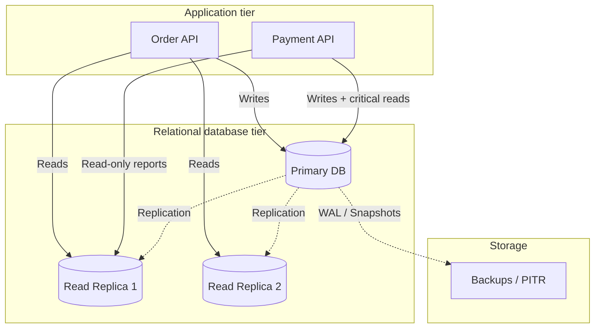
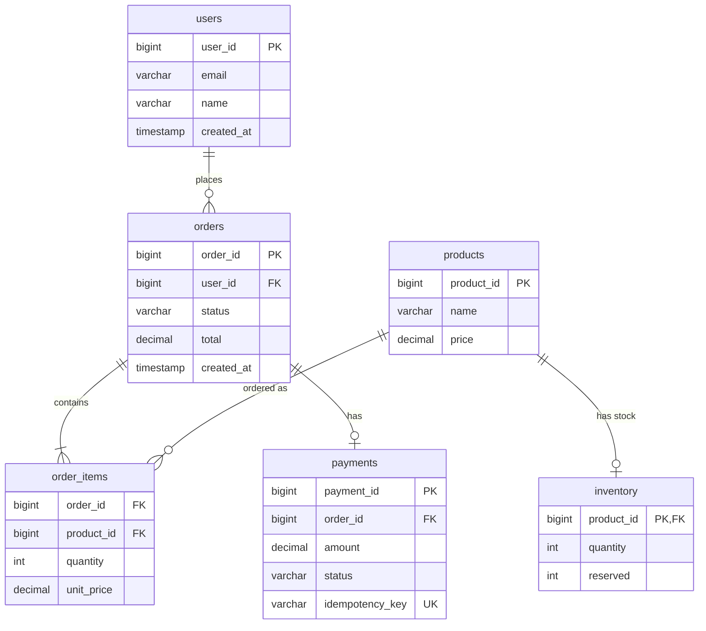
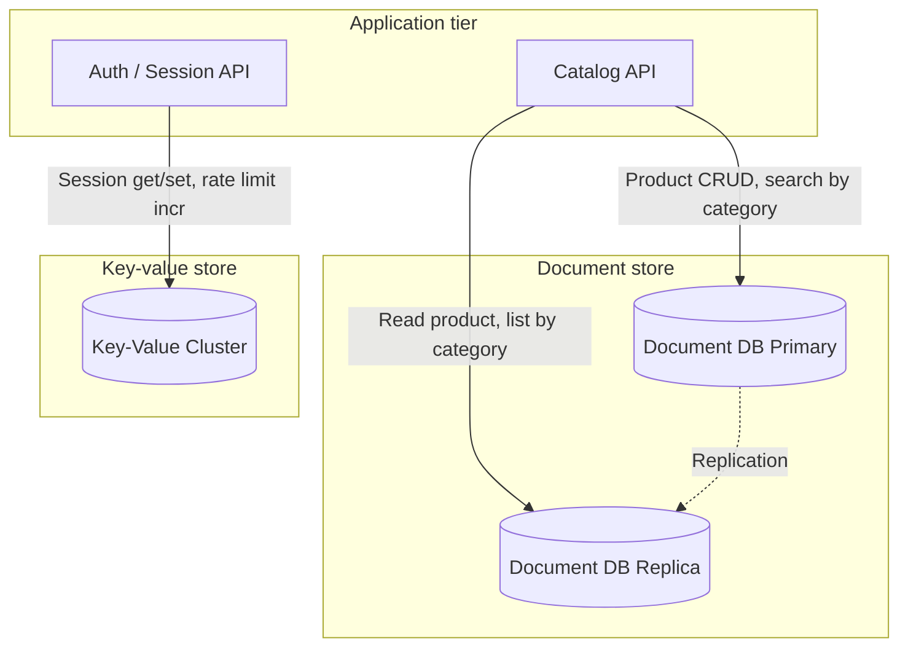

# Database Architecture for System Design — Two Examples

This document describes **database architecture** in system design with two full examples: one **relational** (order management) and one **non-relational** (product catalog + session store). Each covers data model, replication, scaling, consistency, and trade-offs.

## Index

- [Database architecture in system design](#database-architecture-in-system-design)
- [Example 1: Relational database architecture](#example-1-relational-database-architecture)
- [Example 2: Non-relational database architecture](#example-2-non-relational-database-architecture)
- [Comparison and when to use which](#comparison-and-when-to-use-which)
- [See also](#see-also)

---

## Database architecture in system design

**Database architecture** is how you structure storage for a system: which type of store (relational vs non-relational), how data is modeled, how it is replicated and partitioned, and what consistency and durability guarantees you get. Choices here drive scalability, latency, and complexity.

| Aspect | Relational (SQL) | Non-relational (NoSQL) |
|--------|------------------|-------------------------|
| **Model** | Tables, rows, columns; normalized or denormalized | Key-value, document, wide-column, graph |
| **Schema** | Fixed or additive (migrations) | Flexible or schema-less per document/row |
| **Consistency** | ACID, strong consistency common | Often eventual consistency; tune per store |
| **Scaling** | Vertical + read replicas; sharding possible but complex | Horizontal by design (partition key); many NoSQL systems are distributed |
| **Query** | Joins, aggregations, transactions | Key lookup, document query, scan; often no joins across partitions |

Below: one full **relational** example and one full **non-relational** example.

---

## Example 1: Relational database architecture

**Use case:** Order management system — orders, line items, payments, and inventory. Strong consistency and transactions are required (e.g. place order and deduct inventory in one logical unit).

### High-level architecture



- **Primary:** All writes and critical reads (e.g. balance check before payment).
- **Read replicas:** Offload read-heavy queries (order history, reports); eventual consistency with primary (replication lag).
- **Backups:** Point-in-time recovery (PITR), snapshots.

### Data model (normalized)

Core entities and relationships:



**Design choices:**

- **Normalization:** `orders` and `order_items` are separate; `order_items` stores `unit_price` snapshot (denormalized for history) to avoid joining to `products` for past orders. Referential integrity via foreign keys.
- **Idempotency:** `payments.idempotency_key` unique so duplicate requests do not create duplicate payments.
- **Inventory:** `quantity` and `reserved`; reserve on order create, release or commit on payment success/failure.

### Key operations and consistency

| Operation | How it uses the relational DB |
|-----------|------------------------------|
| **Place order** | Transaction: INSERT order, INSERT order_items, UPDATE inventory (reserve), then call payment service; on failure ROLLBACK. Strong consistency within one DB. |
| **Capture payment** | INSERT payment (with idempotency_key check); UPDATE order.status. Single transaction or saga if payment is external. |
| **Get order history** | SELECT from orders + order_items (join); can run on read replica (eventual consistency OK for history). |
| **Check inventory** | SELECT quantity, reserved FROM inventory WHERE product_id IN (...); use primary if you need up-to-date before reserve. |

### Replication and failover

- **Primary–replica:** Async (or semi-sync) replication from primary to replicas. Replicas serve read-only traffic.
- **Failover:** If primary fails, promote a replica to primary (manual or automated). Accept a short RPO (replication lag) and RTO (failover time).
- **Multi-AZ:** Primary and replica in different availability zones for availability.

### Scaling (when needed)

- **Vertical:** Larger primary for more write capacity.
- **Read scaling:** Add more read replicas.
- **Sharding (horizontal):** Partition by `user_id` or `order_id` range. Each shard is a primary + its replicas. Application or proxy routes by shard key. Cross-shard queries (e.g. “all orders across users”) are avoided or done in an aggregator layer.

### When this architecture fits

- You need **ACID transactions** across multiple tables (order + items + inventory).
- You need **joins** and **complex queries** (reports, order history with product names).
- Strong **consistency** is required for money and inventory.
- Write rate is moderate; read-heavy workload can be scaled with replicas.

---

## Example 2: Non-relational database architecture

**Use case:** Product catalog with flexible attributes + user sessions and rate-limiting. High read throughput, flexible schema for catalog, and simple key-based access for sessions.

### High-level architecture

Two non-relational stores work together:



- **Document store (e.g. MongoDB, DynamoDB document mode):** Product catalog — flexible schema (different product types have different attributes); query by category, ID, or attributes.
- **Key-value store (e.g. Redis, DynamoDB key-value):** Sessions (session_id → user data), rate-limit counters (key = user_id or IP, value = count).

### Data model — document store (catalog)

**Products** as documents; schema can vary by product type:

```json
{
  "_id": "prod_12345",
  "name": "Wireless Headphones",
  "category": "Electronics",
  "price": 99.99,
  "attributes": {
    "brand": "Acme",
    "color": "Black",
    "warranty_years": 2
  },
  "tags": ["audio", "wireless"],
  "created_at": "2024-01-15T10:00:00Z",
  "updated_at": "2024-02-01T14:30:00Z"
}
```

Another product type can have different `attributes` (e.g. "size", "material") without a schema change. **Indexes:** on `_id`, `category`, `price`, `attributes.brand`, `tags` for common queries (get by ID, list by category, filter by brand).

**Design choices:**

- **Denormalization:** All display fields in one document; no joins. Updates to “brand” or “category” require updating all affected documents (eventual consistency or batch job).
- **Embedding:** Attributes and tags embedded; good for read-heavy catalog. If “category” were a separate collection with many fields, you could reference by ID and accept a second read or cache.

### Data model — key-value store (sessions and rate limits)

| Key pattern | Value | TTL | Use |
|-------------|--------|-----|-----|
| `session:{session_id}` | `{ user_id, email, created_at }` (JSON or hash) | 24 h | User session; get/set on login and each request. |
| `ratelimit:api:{user_id}` | Counter (integer) | 1 hour | Rate limit: INCR per request; EXPIRE or sliding window. |
| `ratelimit:login:{ip}` | Counter | 15 min | Login attempt limit per IP. |

**Design choices:**

- **Sessions:** One key per session; O(1) read/write. No query “all sessions for user” unless you maintain a secondary index (e.g. set `user_sessions:{user_id}` with session_ids).
- **Rate limiting:** Increment counter; check against threshold; TTL resets the window. Optional: sliding window with sorted set or Lua script.

### Consistency and scaling

| Store | Consistency | Scaling |
|-------|-------------|---------|
| **Document** | Tunable: read-your-writes from primary; eventually consistent from replica. No multi-document transactions (or limited in some engines). | Shard by `_id` or `category`; distribute documents across nodes. Replica sets for read scaling. |
| **Key-value** | Per-key atomic; no cross-key transactions. Sessions and counters are single-key. | Partition by key (e.g. hash of session_id); cluster of nodes. Redis Cluster or DynamoDB partition key. |

### Key operations

| Operation | How it uses non-relational stores |
|-----------|-----------------------------------|
| **Get product** | Document store: get by `_id` or query by `category` with index. Read from replica for high throughput. |
| **Update product** | Document store: update one document by `_id`; eventually consistent to replicas. If “category” is denormalized elsewhere, async job or event to update. |
| **Get session** | Key-value: GET `session:{id}`; validate TTL. |
| **Set session** | Key-value: SET `session:{id}` with TTL. |
| **Rate limit check** | Key-value: INCR `ratelimit:api:{user_id}`; GET; if &gt; threshold return 429; EXPIRE key for window. |

### When this architecture fits

- **Catalog:** Flexible or evolving schema; read-heavy; query by ID, category, or attributes; joins not required.
- **Sessions / rate limits:** Simple key-based access; low latency; high throughput; TTL and counters are native.
- You can accept **eventual consistency** for catalog reads from replicas and **no cross-key transactions**.

---

## Comparison and when to use which

| Criterion | Relational (Example 1) | Non-relational (Example 2) |
|-----------|------------------------|----------------------------|
| **Use case** | Orders, payments, inventory — transactions and integrity | Catalog, sessions, rate limits — flexibility and throughput |
| **Schema** | Fixed, normalized; migrations for changes | Flexible per document; optional schema validation |
| **Consistency** | Strong (ACID) within DB | Tunable; often eventual for reads; per-key atomic in KV |
| **Joins** | Native; complex queries and reports | Avoid; denormalize or aggregate in app |
| **Scaling writes** | Vertical + replicas for reads; sharding is heavier | Horizontal by partition key; native in many NoSQL systems |
| **Operations** | Transactions, foreign keys, backups (PITR) | Single-doc or single-key ops; backups and point-in-time vary by product |

**In the same system:** Use **relational** for order and payment (Example 1 style) and **non-relational** for catalog and sessions (Example 2 style). See [Data_And_Storage](Data_And_Storage.md) and [Example_Ecommerce_System](Example_Ecommerce_System.md) for how both fit in one design.

---

## See also

- [Data_And_Storage](Data_And_Storage.md) — storage types, sharding, replication, caching.
- [Example_Ecommerce_System](Example_Ecommerce_System.md) — end-to-end design using both relational (orders, payments) and non-relational (catalog, cache) stores.
- [Tradeoffs_And_Principles](Tradeoffs_And_Principles.md) — CAP, consistency models.
- [README](README.md) — index of all system design docs.
