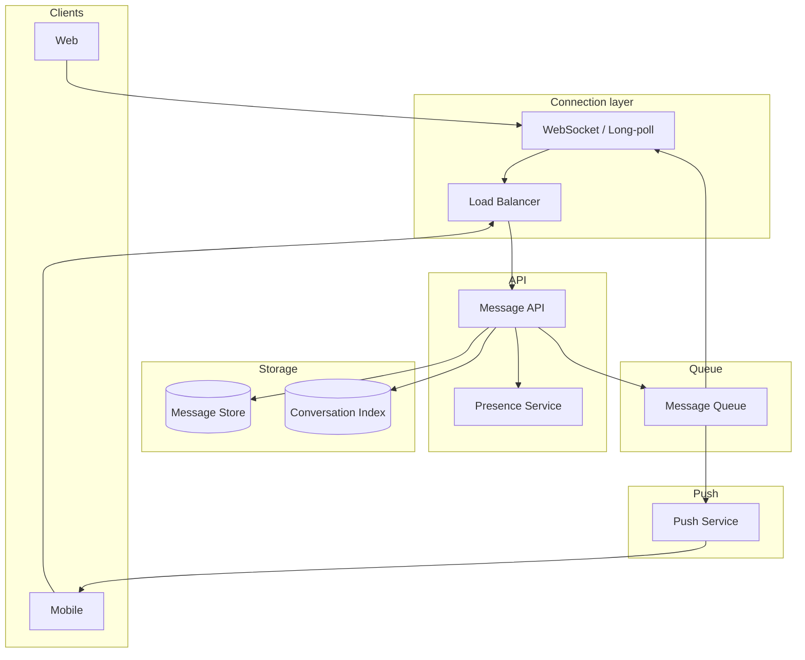

# Example: Chat / Messaging System Design

## Index

- [Requirements and assumptions](#requirements-and-assumptions)
- [High-level architecture](#high-level-architecture)
- [Data model](#data-model)
- [Real-time delivery](#real-time-delivery)
- [Message ordering and durability](#message-ordering-and-durability)
- [History and search](#history-and-search)
- [Online status and push notifications](#online-status-and-push-notifications)
- [How this maps to the concepts](#how-this-maps-to-the-concepts)
- [See also](#see-also)

---

## Requirements and assumptions

**Scope:** One-to-one and group chat; send/receive messages in real time; persist history; optional search; online/offline status; push when app is in background.

**Scale (example):** 20M DAU; 50M messages per day; average 50 chats per user; group size up to 500. Read-heavy (many more reads than writes when users scroll history).

**NFRs:** Message delivery to online users &lt; 100 ms; history load p99 &lt; 300 ms; at-least-once delivery with deduplication; ordering per conversation.

---

## High-level architecture

- **Connection layer:** WebSocket (or long-poll) for real-time; clients connect to a connection server (sticky or route by user_id). Load balancer routes to connection servers.
- **Message API:** Send message (validate, persist, enqueue for delivery); get history (paginated).
- **Message Store:** Messages by conversation; partitioned by conversation_id (or user_id for 1:1). Order by sequence or timestamp.
- **Message Queue:** Fan-out to online subscribers (connection servers) and to push service for offline users.
- **Presence:** Tracks who is online and which connection server; optional “last seen.”
- **Push Service:** Sends push notifications to mobile when user is offline.

---

## Data model

- **User:** user_id, etc.
- **Conversation:** conversation_id, type (1:1 or group), participants, created_at.
- **Message:** message_id, conversation_id, sender_id, content, sequence_or_ts, created_at. Stored in Message Store (e.g. wide-column or relational), partitioned by conversation_id.
- **Conversation index (per user):** user_id → list of (conversation_id, last_message_ts) for “chat list” and unread counts. Updated on new message.

---

## Real-time delivery

- **Online user:** Client holds WebSocket (or long-poll) to a connection server. When message is written, Message API publishes to queue; connection servers subscribed by user_id receive and push to the right WebSocket. Route by user_id so all connections for a user go to same server (or use a pub/sub topic per user).
- **Protocol:** Client sends “send message” over HTTP or WebSocket; server persists, returns ack, and delivers to recipients via their WebSocket (or push). Use sequence numbers or timestamps so client can dedupe and order.

---

## Message ordering and durability

- **Ordering:** Per conversation, assign a monotonic sequence (or use timestamp). Store in Message Store; deliver in order to recipients. Clients sort by sequence when displaying.
- **Durability:** Write to Message Store before ack to sender; then fan-out via queue. At-least-once: consumers dedupe by message_id when writing to recipient’s view or when delivering to client.
- **Idempotency:** Sender can retry with idempotency key; server returns same message_id and sequence so client does not create duplicates.

---

## History and search

- **History:** Paginated fetch by conversation_id, ordered by sequence (or time). Message Store partitioned by conversation_id supports efficient range queries. Cache recent messages per conversation in cache layer.
- **Search:** Optional: index messages in search engine (e.g. Elasticsearch) by conversation_id and content; search within user’s conversations. Can be eventually consistent (async indexer).

---

## Online status and push notifications

- **Presence:** When client connects (WebSocket), register with Presence Service (user_id, connection_server_id). Heartbeat to keep alive; on disconnect, mark offline and set last_seen. Other users’ “chat list” can show online/offline and last_seen by querying Presence.
- **Push:** When message is sent and recipient is offline (Presence says so), Push Service sends push notification (FCM/APNs). Payload: conversation_id, sender, snippet; app opens chat and fetches latest history.

---

## How this maps to the concepts

| Concept | Application here |
|--------|-------------------|
| [Requirements_And_NFRs](Requirements_And_NFRs.md) | Real-time and history latency; at-least-once delivery; ordering per conversation. |
| [Architecture_Styles_And_Patterns](Architecture_Styles_And_Patterns.md) | Event-driven delivery via queue; connection servers are stateful (WebSocket); API and storage are separate. |
| [Data_And_Storage](Data_And_Storage.md) | Message Store partitioned by conversation_id; conversation index per user; optional search index. |
| [Scalability_And_Performance](Scalability_And_Performance.md) | Connection servers scale by user; sticky or user-based routing; cache recent messages. |
| [Reliability_And_Resilience](Reliability_And_Resilience.md) | At-least-once + dedupe; idempotent send; queue retries; reconnection and replay of missed messages. |
| [Observability_And_Operations](Observability_And_Operations.md) | Trace message path from send to delivery; metrics on latency and queue depth. |

---

## See also

- [README](README.md) — index of all system design docs.
- [Example_Social_Network_Feed](Example_Social_Network_Feed.md) — different delivery and consistency model.
- [Data_And_Storage](Data_And_Storage.md) — partitioning and replication.
