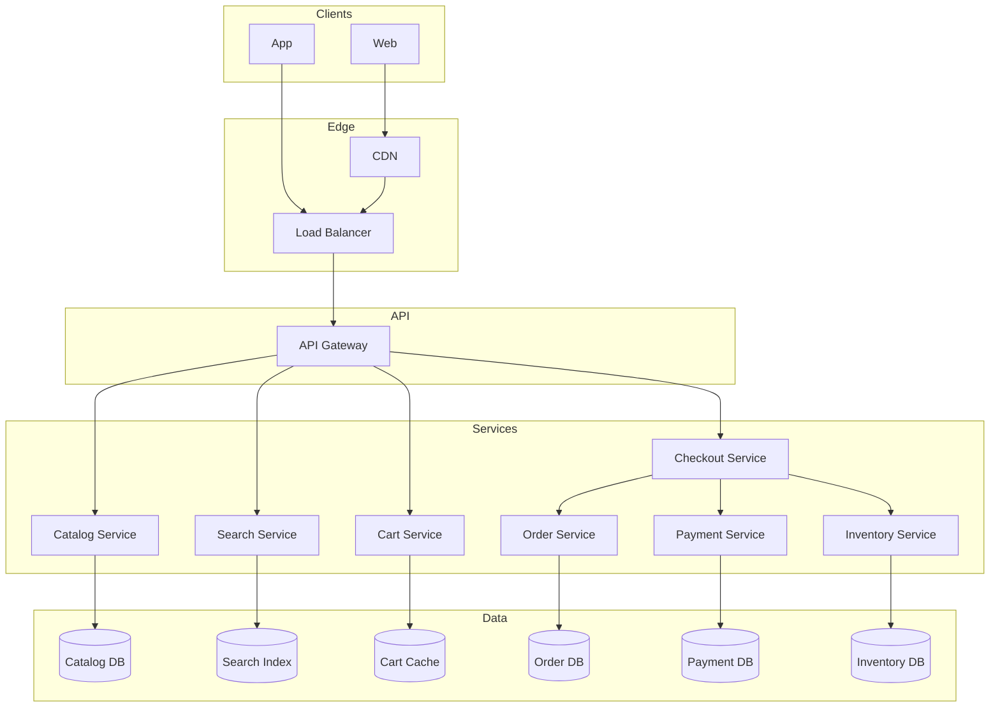

# Example: E-Commerce System Design

## Index

- [Requirements and assumptions](#requirements-and-assumptions)
- [High-level architecture](#high-level-architecture)
- [Data model](#data-model)
- [Key flows](#key-flows)
- [Scalability and reliability](#scalability-and-reliability)
- [Security](#security)
- [How this maps to the concepts](#how-this-maps-to-the-concepts)
- [See also](#see-also)

---

## Requirements and assumptions

**Scope:** Browse catalog, search products, cart, checkout, payment, order history. Out of scope: returns, reviews, recommendations (can be added later).

**Scale (example):** 10M DAU, 100K read QPS peak, 10K write QPS peak (cart + checkout). 100M orders, 10M products.

**NFRs:**

- Availability: 99.9% for checkout and payment.
- Latency: Product page p99 &lt; 200 ms; checkout p99 &lt; 500 ms.
- Consistency: Strong for inventory and payment; eventual for catalog and search.
- Security: PCI scope for payment; PII encrypted; auth on all user actions.

---

## High-level architecture

- **CDN:** Static assets and optionally cached product pages.
- **API Gateway:** Auth, rate limit, route to services.
- **Catalog:** Product details; read-heavy; cache + DB.
- **Search:** Full-text product search; separate search index (e.g. Elasticsearch).
- **Cart:** Per-user; short-lived; cache (e.g. Redis) with optional DB backup.
- **Checkout:** Orchestrates order, payment, inventory; coordinates consistency (saga or 2PC-style).
- **Order:** Persists orders; idempotent create.
- **Payment:** Integrates with payment gateway; idempotent; PCI-scoped.
- **Inventory:** Stock levels; strong consistency for checkout; reserve/release on order.

---

## Data model

**Core entities (simplified):**

- **User:** user_id, email, profile (PII encrypted).
- **Product:** product_id, name, description, price, category_id.
- **Inventory:** product_id, quantity, reserved; updated on order.
- **Cart:** user_id, items (product_id, qty); stored in cache + optional DB.
- **Order:** order_id, user_id, status, total, created_at; idempotency_key for create.
- **Order_item:** order_id, product_id, qty, price_snapshot.
- **Payment:** payment_id, order_id, amount, status, idempotency_key.

Catalog and product can be in relational DB; search index is a denormalized view (eventual consistency). Orders and payments in relational DB with transactions where needed.

---

## Key flows

**Browse / search:** Client → Gateway → Catalog or Search. Catalog reads from cache or DB; Search from search index. Cache product by ID with TTL; invalidate on product update (event-driven or TTL).

**Add to cart:** Client → Gateway → Cart. Cart service writes to cache (and optionally DB). No strong consistency required across services.

**Checkout (simplified):**  
1) Validate cart and inventory.  
2) Create order (idempotent with client idempotency key).  
3) Reserve inventory (or decrement with lock).  
4) Call payment service (idempotent); on success confirm order and release reservation or commit inventory.  
5) On any failure: compensate (release inventory, mark order failed, do not capture payment). Use saga or local transactions + compensating actions; ensure at-least-once semantics with idempotency so retries do not double-charge or double-create.

**Read path:** Order history from Order DB (by user_id); can cache recent orders per user.

---

## Scalability and reliability

- **Catalog / search:** Horizontal scaling; cache to reduce DB/index load; shard search index by category or product_id range if needed.
- **Cart:** Stateless service; Redis cluster for cart store; optional sharding by user_id.
- **Checkout / order / payment:** Stateless; Order DB sharded by order_id or user_id; replica for reads. Payment and inventory: strong consistency (single primary or careful saga).
- **Reliability:** Multi-AZ for DB and cache; idempotent order and payment creation; retries with backoff; circuit breaker to payment gateway. See [Reliability_And_Resilience](Reliability_And_Resilience.md).

---

## Security

- **Auth:** Every request authenticated (JWT or session); gateway validates and passes user_id to services.
- **AuthZ:** User can only access own cart, orders, and payment info.
- **Payment:** Payment service in restricted network; no card data in app DB; use gateway tokenization; encrypt PII at rest and in transit. See [Security_And_Multi_Tenancy](Security_And_Multi_Tenancy.md).

---

## How this maps to the concepts

| Concept | Application here |
|--------|-------------------|
| [Requirements_And_NFRs](Requirements_And_NFRs.md) | Scale and NFRs above drive service split, consistency choices, and redundancy. |
| [Architecture_Styles_And_Patterns](Architecture_Styles_And_Patterns.md) | Microservices per bounded context; sync for checkout flow; async events for catalog → search index. |
| [Data_And_Storage](Data_And_Storage.md) | Relational for orders/payment/inventory; cache for cart and catalog; search index for search; replication and strong vs eventual consistency as above. |
| [Scalability_And_Performance](Scalability_And_Performance.md) | Horizontal scaling, load balancing, caching, sharding by user_id/order_id. |
| [Reliability_And_Resilience](Reliability_And_Resilience.md) | Idempotency for order and payment; retries and circuit breaker; multi-AZ. |
| [Security_And_Multi_Tenancy](Security_And_Multi_Tenancy.md) | AuthN/AuthZ, PCI scope, encryption, no PII in logs. |
| [Tradeoffs_And_Principles](Tradeoffs_And_Principles.md) | Strong consistency for payment and inventory; eventual for catalog and search; KISS in service boundaries. |

---

## See also

- [README](README.md) — index of all system design docs.
- [Example_Social_Network_Feed](Example_Social_Network_Feed.md) — different read/write and consistency profile.
