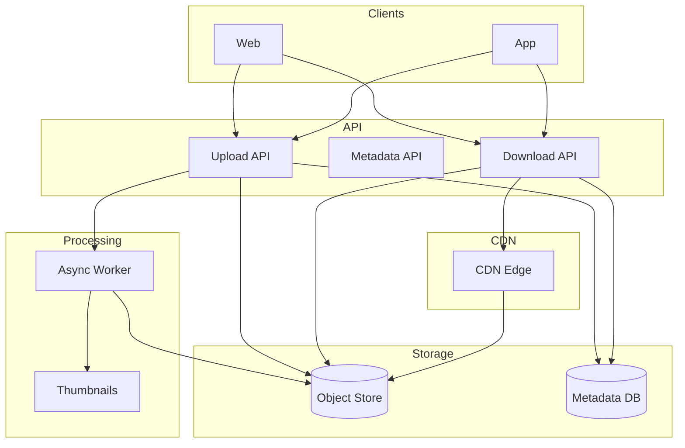

# Example: File Storage and CDN Design

## Index

- [Requirements and assumptions](#requirements-and-assumptions)
- [High-level architecture](#high-level-architecture)
- [Upload flow](#upload-flow)
- [Download and CDN](#download-and-cdn)
- [Access control and signed URLs](#access-control-and-signed-urls)
- [Versioning and metadata](#versioning-and-metadata)
- [How this maps to the concepts](#how-this-maps-to-the-concepts)
- [See also](#see-also)

---

## Requirements and assumptions

**Scope:** Users upload files (e.g. images, documents); files are stored durably; users and optionally public can download; support access control (private vs shared); optional image processing (resize, thumbnails); optional versioning.

**Scale (example):** 1M DAU; 10M uploads per day; average file size 2 MB; 500M files total; 50 GB/s read traffic at peak. Mix of small images and larger documents.

**NFRs:** Upload success durable (no loss); download latency p99 &lt; 200 ms for cache hit; private files only accessible to owner or explicitly shared; support large files (e.g. multipart upload).

---

## High-level architecture

- **Upload API:** Accepts file (or multipart); writes to Object Store; creates record in Metadata DB (file_id, owner_id, size, content_type, key/path, permissions). Optionally enqueues job for processing (thumbnails, virus scan).
- **Object Store:** S3-style or equivalent; durable, versioned optionally; key = file_id or path. Source of truth for bytes.
- **Metadata DB:** Relational or document; file metadata, ownership, sharing, version list. Used for authz and to resolve file_id → object key.
- **CDN:** Caches objects at edge; download can go CDN → origin (Object Store) on miss. Use for public or signed URLs.
- **Async Worker:** Generates thumbnails or other derivatives; writes back to Object Store; updates Metadata DB.

---

## Upload flow

1. **Client:** Requests upload (e.g. multipart init); API returns upload_id and presigned URLs for each part (or single presigned URL for small file).
2. **Client:** Uploads parts directly to Object Store (presigned URLs); then completes multipart (or single PUT).
3. **API:** On complete, creates metadata row (file_id, owner_id, object_key, size, content_type); optionally enqueues processing job.
4. **Durability:** Object Store provides durability (replication); metadata in DB with transaction. If metadata write fails after object write, use reconciliation job (orphan object cleanup or metadata repair).

For very large files, multipart upload reduces memory and allows resume; chunk size e.g. 5–100 MB.

---

## Download and CDN

- **Public file:** Client requests download with file_id (or slug). API checks metadata (public flag or shared); returns redirect to CDN URL or direct Object Store URL. CDN caches by URL; TTL per content type (e.g. images 1 day).
- **Private file:** Client must be authenticated. API verifies user can access file_id (owner or shared); generates **signed URL** (temporary, e.g. 1 h) for Object Store or CDN; returns redirect or signed URL. CDN can cache with short TTL or no cache for private; or use signed cookies for CDN.
- **Performance:** Hot content served from CDN; cold from origin. Reduce load on Object Store and latency for users.

---

## Access control and signed URLs

- **Metadata DB:** Stores owner_id, permissions (e.g. list of user_ids or “public”). On download, API checks auth and permissions; if allowed, issue signed URL.
- **Signed URL:** Cryptographically signed URL (HMAC or JWT) with expiry and object key; Object Store or CDN validates signature and serves. No need to store session for the download; reduces load on API.
- **Sharing:** Add rows in Metadata DB (file_id, shared_with_user_id, role). Check on download; optionally support share links (token in URL) that map to shared_with.

---

## Versioning and metadata

- **Versioning:** Object Store can version by key (same key, multiple versions); Metadata DB stores version_id or version list per file_id. Client requests “latest” or “version X”; API resolves to correct object key/version.
- **Metadata:** Store content_type, size, created_at, custom attributes (e.g. album_id). Used for listing (“my files”), search (if indexed), and access control.

---

## How this maps to the concepts

| Concept | Application here |
|--------|-------------------|
| [Requirements_And_NFRs](Requirements_And_NFRs.md) | Durability for uploads; latency for downloads via CDN; access control and scale. |
| [Architecture_Styles_And_Patterns](Architecture_Styles_And_Patterns.md) | Sync upload path; async processing (worker); separation of metadata and blob storage. |
| [Data_And_Storage](Data_And_Storage.md) | Object Store for blobs; Metadata DB (relational or document); CDN as read cache. |
| [Scalability_And_Performance](Scalability_And_Performance.md) | CDN for read scaling; multipart for large uploads; horizontal scaling of API and workers. |
| [Reliability_And_Resilience](Reliability_And_Resilience.md) | Object Store replication; idempotent upload (same key overwrite or version); retry on transient failure. |
| [Security_And_Multi_Tenancy](Security_And_Multi_Tenancy.md) | Authz on every download; signed URLs; encryption at rest in Object Store. |

---

## See also

- [README](README.md) — index of all system design docs.
- [Data_And_Storage](Data_And_Storage.md) — caching and storage types.
- [Scalability_And_Performance](Scalability_And_Performance.md) — CDN and caching strategies.
