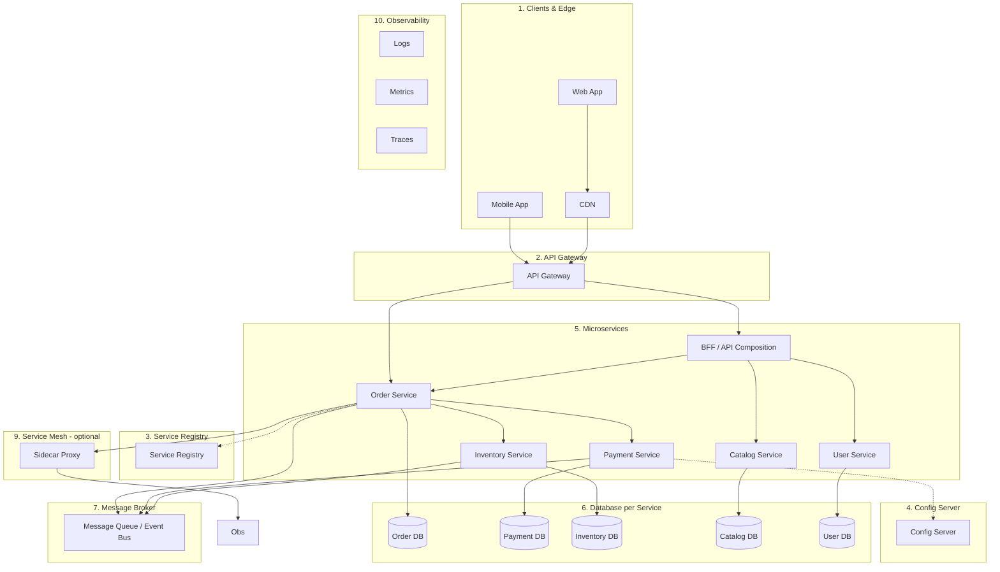
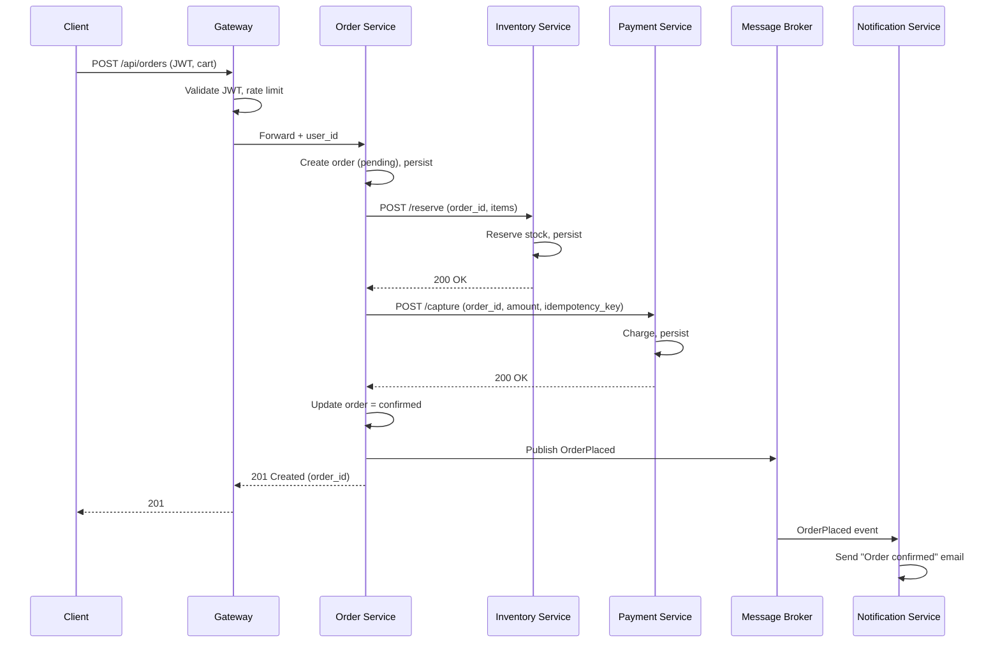

# Microservices Architecture — Detailed Example with Every Component

This document walks through a **full microservices architecture** using an e-commerce / order-management example. Every typical component is explained and shown in context.

## Index

- [What is microservices architecture](#what-is-microservices-architecture)
- [Component map](#component-map)
- [Component 1: Clients and edge](#component-1-clients-and-edge)
- [Component 2: API Gateway](#component-2-api-gateway)
- [Component 3: Service registry and discovery](#component-3-service-registry-and-discovery)
- [Component 4: Config server](#component-4-config-server)
- [Component 5: Microservices (domain services)](#component-5-microservices-domain-services)
- [Component 6: Database per service](#component-6-database-per-service)
- [Component 7: Message broker (async communication)](#component-7-message-broker-async-communication)
- [Component 8: API composition / BFF](#component-8-api-composition--bff)
- [Component 9: Sidecar / service mesh (optional)](#component-9-sidecar--service-mesh-optional)
- [Component 10: Observability and operations](#component-10-observability-and-operations)
- [End-to-end flow example](#end-to-end-flow-example)
- [Summary table and see also](#summary-table-and-see-also)

---

## What is microservices architecture

The system is split into **many small, deployable services**. Each service:

- Owns a **bounded context** (e.g. orders, payments, inventory).
- Has its **own data store** (database per service).
- Communicates via **APIs** (sync: HTTP/gRPC) or **events** (async: message broker).
- Can be **developed, deployed, and scaled independently** by a team.

Trade-offs: flexibility and scalability vs operational complexity, distributed tracing, eventual consistency, and failure handling across the network.

---

## Component map

High-level view of **every component** in a typical microservices system:

Below, each numbered component is described and tied to this example.

---

## Component 1: Clients and edge

| Element | Role |
|--------|------|
| **Web / Mobile app** | Send requests to the API Gateway (HTTPS). Mobile may use different endpoints or a separate BFF. |
| **CDN** | Caches static assets (JS, CSS, images) and optionally API responses (e.g. product catalog). Reduces latency and load on origin. |

**Example:** User opens the app → static content from CDN; API calls (e.g. “my orders”, “place order”) go to the API Gateway.

---

## Component 2: API Gateway

**What it is:** Single entry point for all client traffic. Routes requests to the right service(s), enforces cross-cutting concerns.

| Responsibility | Example |
|----------------|---------|
| **Routing** | `/api/orders/*` → Order Service; `/api/products/*` → Catalog Service. |
| **Authentication** | Validate JWT or API key; attach user/tenant identity to the request. |
| **Authorization** | Check coarse-grained access (e.g. “can call orders”). Fine-grained auth often in the service. |
| **Rate limiting** | Limit requests per user/IP/key; return 429 when exceeded. |
| **Request/response transformation** | Aggregate multiple backend responses (or delegate to BFF). |
| **TLS termination** | Terminate HTTPS at the gateway; optional mTLS to backends. |
| **Caching** | Cache read-only or idempotent GETs (e.g. product by ID) at gateway. |

**Example:** Client sends `POST /api/orders` with JWT. Gateway validates token, extracts `user_id`, forwards to Order Service with `user_id` in header. No direct client access to Order Service.

---

## Component 3: Service registry and discovery

**What it is:** A registry where services **register** their instance address (host:port) and **deregister** on shutdown. Other services or the gateway **discover** instances by service name instead of hardcoding URLs.

| Element | Role |
|--------|------|
| **Service registry** | Stores mapping: service name → list of instance URLs (and optional health). E.g. Consul, etcd, Eureka, or cloud load balancer. |
| **Registration** | Each service instance (or an agent/sidecar) registers on startup and sends heartbeats; deregisters on graceful shutdown. |
| **Discovery** | Order Service needs to call Payment Service: it asks the registry “where is payment-service?” and gets one or more URLs; then calls one (with client-side load balancing) or uses a load balancer in front. |

**Example:** Order Service calls Payment Service. It uses “payment-service” as logical name; registry returns `payment-svc-1:8080`, `payment-svc-2:8080`. Order Service (or sidecar) load-balances across them. When a new instance starts, it registers; when it stops, it’s removed from the list.

---

## Component 4: Config server

**What it is:** Central place for **configuration** (feature flags, DB URLs, feature toggles, per-environment settings). Services fetch config at startup or subscribe to changes so you don’t redeploy for a config change.

| Responsibility | Example |
|----------------|---------|
| **Environment-specific config** | Order Service gets `payment-service.url` and `order-db.connection-string` per env (dev, staging, prod). |
| **Secrets** | Passwords and API keys stored in a secrets store; config server or runtime injects them. Never in code or plain config in repo. |
| **Feature flags** | “new-checkout-enabled”: true/false per service or per tenant. |
| **Refresh** | Services can poll or subscribe (e.g. webhook or message) to reload config without restart (where supported). |

**Example:** Payment Service reads from Config Server: `payment-gateway.api-key`, `payment-db.url`, `circuit-breaker.threshold`. In prod, different values than in dev; no code change.

---

## Component 5: Microservices (domain services)

Each **microservice** owns one bounded context and its data. In our example:

| Service | Bounded context | Main operations | Owns data |
|---------|------------------|------------------|-----------|
| **Order Service** | Order lifecycle | Create order, get order, update status, cancel | Orders, order items |
| **Payment Service** | Payments | Authorize, capture, refund, get payment status | Payments, transactions |
| **Inventory Service** | Stock | Reserve, release, check availability, adjust stock | Inventory, reservations |
| **Catalog Service** | Products | Get product, search, list by category | Products, categories |
| **User Service** | Identity & profile | Login, profile, addresses | Users, sessions (or delegate to IdP) |

**Design rules:**

- **One database per service:** Order Service does not read Payment DB directly; it calls Payment Service API or reacts to events.
- **Sync vs async:** Sync (HTTP/gRPC) for “need answer now” (e.g. reserve inventory, capture payment). Async (events) for “eventually consistent” or fire-and-forget (e.g. order placed → send email, update analytics).
- **Failure handling:** Timeouts, retries, circuit breaker when calling another service. See [Reliability_And_Resilience](Reliability_And_Resilience.md).

**Example:** Place order flow: Order Service creates order, then calls Inventory Service (reserve) and Payment Service (capture) over HTTP. On success, it publishes `OrderPlaced` event to the message broker. Other services (e.g. notification, analytics) consume the event asynchronously.

---

## Component 6: Database per service

**What it is:** Each microservice has its **own database** (or schema). No other service accesses it directly; only through the service’s API or events. Enables independent deploy and schema evolution.

| Aspect | Example |
|--------|---------|
| **Ownership** | Order Service owns Order DB; Payment Service owns Payment DB. |
| **Technology** | Can differ per service: Order DB = PostgreSQL, Catalog search = Elasticsearch, Cart = Redis. |
| **Consistency** | Cross-service consistency is **eventual** unless you use distributed transactions (2PC/saga). Orders and payments are coordinated via saga or local transaction + events. |
| **Data duplication** | Some duplication is OK: Order Service may store “product_id, product_name_snapshot” so it doesn’t call Catalog on every read. Catalog is source of truth for product; order keeps a copy for history. |

**Example:** Order Service stores `orders`, `order_items` (with product_id and price snapshot). Payment Service stores `payments`, `transactions`. They do not share a DB; consistency between them is achieved by the “place order” saga and events.

---

## Component 7: Message broker (async communication)

**What it is:** Middleware for **asynchronous** messaging. Producers publish events/messages; consumers subscribe and process. Decouples services in time and supports scaling consumers independently.

| Responsibility | Example |
|----------------|---------|
| **Events** | Order Service publishes `OrderPlaced { order_id, user_id, total, items }`. Notification Service subscribes and sends email; Analytics Service subscribes and updates dashboards. |
| **Decoupling** | Order Service does not know about Notification or Analytics; it just publishes. New subscribers can be added without changing Order Service. |
| **Reliability** | Broker persists messages (e.g. Kafka, RabbitMQ); consumers ack after processing. At-least-once or exactly-once semantics with idempotent handling. |
| **Ordering** | Per-partition or per-queue ordering when needed (e.g. order events for same order_id in one partition). |

**Example:** On “order placed,” Order Service publishes to topic `order.events`. Notification Service consumes and sends “Order confirmed” email. Inventory Service consumes and may update “sold” metrics. Payment Service already did sync capture; event is for audit or downstream only.

---

## Component 8: API composition / BFF

**What it is:** When a client needs data from **multiple services** for one screen, you can:

- **Option A:** Client calls several APIs and composes (more round-trips, client complexity).
- **Option B:** A **Backend-for-Frontend (BFF)** or **API composition service** calls the services, aggregates, and returns one response.

| Role | Example |
|------|---------|
| **BFF** | “Order history” screen needs: orders (Order Service), product names (Catalog Service), user profile (User Service). BFF calls all three (or reads from caches), merges, returns a single DTO. |
| **Per client type** | Separate BFF for web vs mobile if their needs differ (e.g. mobile needs fewer fields, different pagination). |
| **Trade-off** | BFF adds a hop and can become a bottleneck; use caching and keep BFF thin. Alternative: backend services expose composed APIs where it makes sense. |

**Example:** Mobile calls `GET /bff/dashboard`. BFF calls Order Service (recent orders), Catalog Service (recommendations), User Service (profile). Returns one JSON. Gateway routes `/bff/*` to BFF service.

---

## Component 9: Sidecar / service mesh (optional)

**What it is:** A **sidecar proxy** runs next to each service instance and handles cross-cutting concerns: mTLS, retries, timeouts, metrics, distributed tracing. Control plane configures the proxies. Services stay unaware of the mesh.

| Responsibility | Example |
|----------------|---------|
| **TLS / mTLS** | All service-to-service traffic encrypted; sidecar terminates and originates. |
| **Retries and timeouts** | Sidecar retries failed calls with backoff; enforces timeout so a hung dependency doesn’t block the caller. |
| **Observability** | Sidecar reports metrics (request count, latency) and trace spans to the observability backend. |
| **Traffic policy** | Canary, blue/green at the mesh level (route % traffic to new version). |

**Example:** Order Service calls Payment Service. The call goes to the local sidecar; sidecar forwards to a Payment Service instance (discovery), records span and metrics, retries on 5xx. No tracing or retry code inside Order Service.

---

## Component 10: Observability and operations

| Element | Role |
|--------|------|
| **Logs** | Structured logs (with trace_id, service name) from each service; centralized in a log store. |
| **Metrics** | Latency, throughput, error rate per service and endpoint; dashboards and SLO alerts. |
| **Traces** | Distributed tracing: one request flows through Gateway → Order Service → Payment Service; one trace_id, multiple spans. |
| **Health** | Liveness (process up) and readiness (can take traffic: DB and dependencies OK). Used by load balancer and orchestrator (e.g. Kubernetes). |
| **Deployment** | CI/CD builds and deploys each service independently; blue/green or canary; feature flags for gradual rollout. |

**Example:** A failed “place order” is debugged by trace_id: see gateway → Order Service → Payment Service; which span failed (e.g. Payment timeout). Alerts fire when payment-service error rate or latency exceeds SLO.

---

## End-to-end flow example

**Place order (sync + async):**

**Components used:** Client → **API Gateway** (auth, route) → **Order Service** (orchestration). Order Service uses **service discovery** (or static config) to call **Inventory** and **Payment**; each uses its **own DB**. **Message broker** carries event; **Notification Service** consumes. **Observability** (logs, metrics, traces) is collected from gateway and services (directly or via **sidecar**).

---

## Summary table and see also

| # | Component | Purpose |
|---|-----------|---------|
| 1 | Clients & edge | Web/mobile apps, CDN for static and cacheable content |
| 2 | API Gateway | Single entry, auth, rate limit, route, TLS |
| 3 | Service registry & discovery | Dynamic instance lookup; no hardcoded URLs |
| 4 | Config server | Central config and secrets; per env |
| 5 | Microservices | Domain services, own data, sync/async APIs |
| 6 | Database per service | One DB (or schema) per service; no shared DB access |
| 7 | Message broker | Async events; decouple producers and consumers |
| 8 | API composition / BFF | Aggregate multiple services for one client response |
| 9 | Sidecar / service mesh | mTLS, retries, timeouts, metrics, tracing |
| 10 | Observability & operations | Logs, metrics, traces, health, deployment |

---

## See also

- [Architecture_Styles_And_Patterns](Architecture_Styles_And_Patterns.md) — when to choose microservices vs monolith.
- [Example_Ecommerce_System](Example_Ecommerce_System.md) — e-commerce flows and services.
- [Reliability_And_Resilience](Reliability_And_Resilience.md) — retries, circuit breaker, idempotency in a distributed system.
- [README](README.md) — index of all system design docs.
