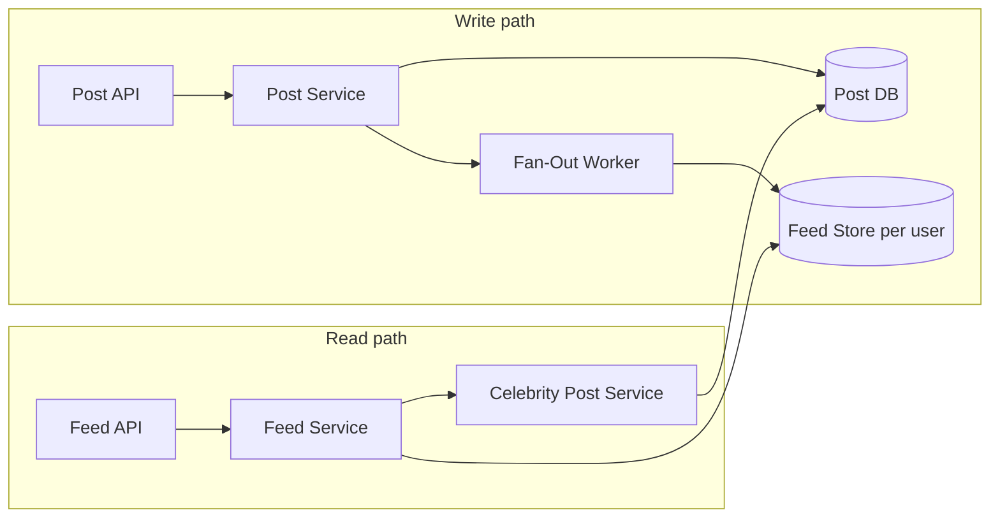

# Example: Social Network Feed (Newsfeed / Timeline) Design

## Index

- [Requirements and assumptions](#requirements-and-assumptions)
- [Fan-out on write vs fan-out on read](#fan-out-on-write-vs-fan-out-on-read)
- [High-level architecture](#high-level-architecture)
- [Data model](#data-model)
- [Key flows](#key-flows)
- [Hot users and celebrities](#hot-users-and-celebrities)
- [How this maps to the concepts](#how-this-maps-to-the-concepts)
- [See also](#see-also)

---

## Requirements and assumptions

**Scope:** Users follow other users; when someone posts, their followers see the post in a chronological (or ranked) feed. Likes and comments are secondary (counts on post; can load on demand).

**Scale (example):** 50M DAU; 500K posts per day; 10M follow relationships; feed read QPS 200K peak; average 200 follows per user; some “celebrity” users with millions of followers.

**NFRs:** Feed read p99 &lt; 300 ms; write (post) p99 &lt; 200 ms. Eventual consistency for feed is acceptable (e.g. new post appears within seconds). Availability 99.9%.

---

## Fan-out on write vs fan-out on read

**Fan-out on write (push):** When user A posts, we precompute and push the post into the feed cache/list of every follower of A. Read is a simple fetch of the user’s feed store (e.g. sorted by time).

- **Pros:** Fast reads; simple read path; good for most users.
- **Cons:** Expensive write for users with many followers (celebrity problem); storage cost (same post in many feeds).

**Fan-out on read (pull):** When user reads the feed, we fetch recent posts from all people they follow and merge/sort.

- **Pros:** Cheap writes; no duplicate storage per follower.
- **Cons:** Read is heavy for users who follow many people; hard to keep under 300 ms at scale.

**Hybrid:** Fan-out on write for normal users (e.g. &lt; 100K followers); for celebrities, do not push to all followers’ feeds. On read, merge: precomputed feed (from push) + recent posts from celebrities (pull). Balances read latency and write cost. See [Hot users and celebrities](#hot-users-and-celebrities).

---

## High-level architecture

- **Post flow:** Post API → Post Service → store post in Post DB; async Fan-Out Worker reads followers (from graph service), writes post reference into each follower’s Feed Store (only for non-celebrities or up to a cap).
- **Feed Store:** Per-user sorted structure (e.g. list or sorted set by timestamp); sharded by user_id. Can be cache (Redis) + DB for durability.
- **Read flow:** Feed API → Feed Service → read Feed Store for user; if hybrid, also fetch recent celebrity posts and merge.

---

## Data model

- **User:** user_id, handle, etc.
- **Follow:** follower_id, followee_id; stored in graph store or DB (for fan-out worker to query “who follows A”).
- **Post:** post_id, user_id, content, created_at.
- **Feed (per user):** list of (post_id, author_id, created_at, …) sorted by created_at; truncated to last N (e.g. 1000). Stored in Feed Store (e.g. Redis sorted set + DB backup).

For celebrities we do not materialize into every follower’s feed; we fetch on read from Post DB (indexed by user_id and created_at) and merge.

---

## Key flows

**Publish post:**  
1) Write post to Post DB.  
2) Publish event or enqueue job: “post_id, author_id.”  
3) Fan-out worker: load author’s followers (from graph); for each follower, if not celebrity and follower count &lt; threshold, insert post ref into follower’s Feed Store. Limit fan-out per post (e.g. 100K) or defer celebrities.

**Read feed:**  
1) Fetch user’s Feed Store (precomputed list).  
2) If hybrid: fetch recent posts from celebrities the user follows; merge and sort by time; apply limit (e.g. 50).  
3) Return merged feed; optionally hydrate (author info, like counts) from cache or DB.

---

## Hot users and celebrities

- **Definition:** Users with very large follower count (e.g. &gt; 100K).
- **Problem:** Fan-out on write would write millions of entries and delay the post; storage and write throughput explode.
- **Approach:** Do not push celebrity posts into individual feeds. On read, combine: (1) precomputed feed (from push), (2) recent posts from followed celebrities (pull). Cache celebrity posts by celebrity_id for a short TTL to avoid repeated DB hits. Optionally precompute a “celebrity feed” per user (e.g. merged list of last 100 posts from all celebrities they follow) updated asynchronously.

---

## How this maps to the concepts

| Concept | Application here |
|--------|-------------------|
| [Requirements_And_NFRs](Requirements_And_NFRs.md) | Read-heavy; latency target on feed; eventual consistency acceptable. |
| [Architecture_Styles_And_Patterns](Architecture_Styles_And_Patterns.md) | Event-driven fan-out worker; separate Post and Feed stores; CQRS-like (write post vs read feed). |
| [Data_And_Storage](Data_And_Storage.md) | Post DB; Feed Store (cache + DB); denormalized feed per user; eventual consistency for feed. |
| [Scalability_And_Performance](Scalability_And_Performance.md) | Fan-out workers scale with queue; Feed Store sharded by user_id; cache for celebrity posts. |
| [Reliability_And_Resilience](Reliability_And_Resilience.md) | Retries for fan-out; at-least-once processing; idempotent feed insert (dedupe by post_id per user). |
| [Tradeoffs_And_Principles](Tradeoffs_And_Principles.md) | Eventual consistency for feed; trade write cost for read latency; hybrid to handle celebrities. |

---

## See also

- [README](README.md) — index of all system design docs.
- [Example_Ecommerce_System](Example_Ecommerce_System.md) — strong consistency and payment flows.
- [Data_And_Storage](Data_And_Storage.md) — replication and consistency.
