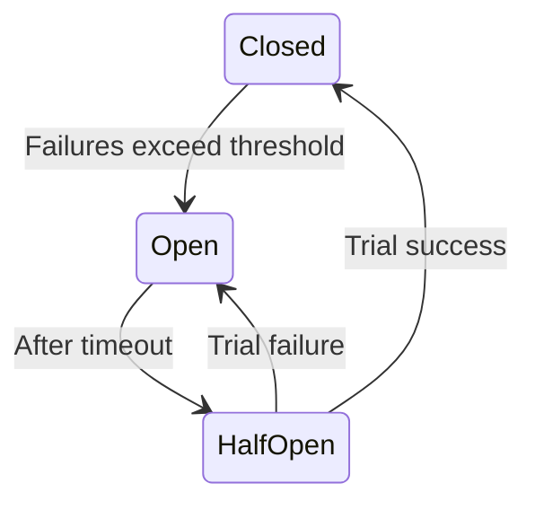

# Reliability and Resilience

## Index

- [Failure modes](#failure-modes)
- [Retries, timeouts, and backoff](#retries-timeouts-and-backoff)
- [Circuit breaker and bulkhead](#circuit-breaker-and-bulkhead)
- [Idempotency](#idempotency)
- [Availability targets](#availability-targets)
- [See also](#see-also)

---

## Failure modes

- **Network:** Latency, packet loss, partition. Design for timeouts and retries; assume the network is unreliable.
- **Process:** Crash, OOM, slow response. Use health checks, restart policy, and circuit breakers so one bad instance does not take down callers.
- **Storage:** DB or disk failure. Use replication, failover, and backups; understand RPO and RTO.
- **Region / datacenter:** Full AZ or region down. Multi-AZ or multi-region with failover and data replication.

For interviews: “If the payment service is down, we return a clear error and retry with exponential backoff; we do not double-charge because we use idempotent keys.”

---

## Retries, timeouts, and backoff

- **Timeout:** Every outbound call has a timeout so a hung dependency does not hang the whole system. Set per tier (e.g. 100 ms to cache, 500 ms to DB, 2 s to payment gateway).
- **Retry:** Transient failures (e.g. 503, network blip) can be retried. Limit retries (e.g. 3) and use **exponential backoff** (e.g. 100 ms, 200 ms, 400 ms) to avoid thundering herd.
- **Jitter:** Add random delay to backoff so many clients do not retry at the same time.

Use retries only for idempotent operations or when the receiver handles duplicates (e.g. idempotency key). See [Idempotency](#idempotency).

---

## Circuit breaker and bulkhead

**Circuit breaker:** Stop calling a failing dependency after a threshold (e.g. 5 failures in 10 s). After a cooldown, allow a trial request; if it succeeds, close the circuit and resume. Prevents cascading failure and gives the dependency time to recover.

**Bulkhead:** Isolate resources (e.g. thread pool or connection pool per dependency) so one slow or failing dependency does not exhaust all threads and block others.

---

## Idempotency

An operation is **idempotent** if performing it multiple times has the same effect as once (e.g. “set status to paid” with same idempotency key). Critical for payments and order creation: client or gateway may retry; you must not double-charge or double-create.

**Pattern:** Client sends an idempotency key (e.g. UUID) with the request. Server stores (key → result) for a window (e.g. 24 h). On duplicate key, return the stored result instead of re-executing. Use for: place order, capture payment, send notification.

---

## Availability targets

| Target | Downtime per year | Implication |
|--------|--------------------|-------------|
| 99% | ~3.65 days | Single instance, best effort |
| 99.9% (3 nines) | ~8.76 h | Redundancy, failover, monitoring |
| 99.95% | ~4.38 h | Multi-AZ, automated failover |
| 99.99% (4 nines) | ~52.6 min | Multi-region, tested DR, minimal single points of failure |

Higher availability usually means: redundancy, health checks, automated failover, and operational runbooks. Call out what you are designing for (e.g. “99.9% for checkout”) and what that implies (e.g. multi-AZ DB, idempotent retries).

---

## See also

- [Data_And_Storage](Data_And_Storage.md) — replication and consistency.
- [Observability_And_Operations](Observability_And_Operations.md) — health checks and alerting.
- [Example_Ecommerce_System](Example_Ecommerce_System.md) — payment and order reliability.
