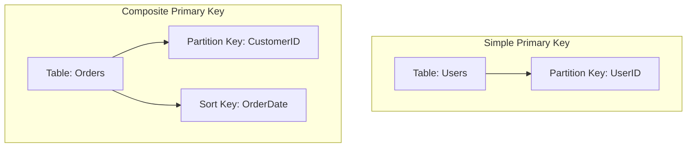
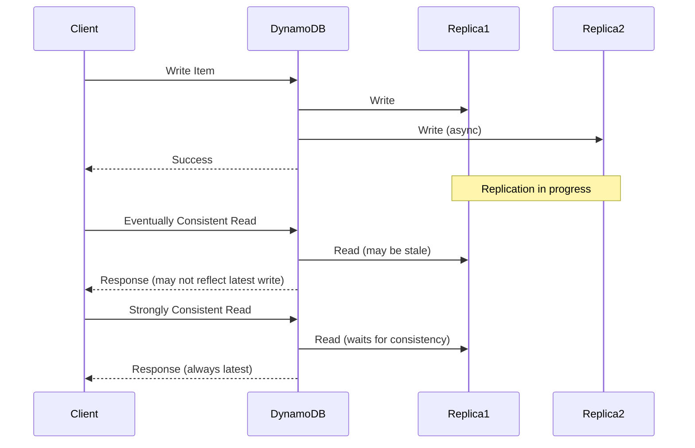
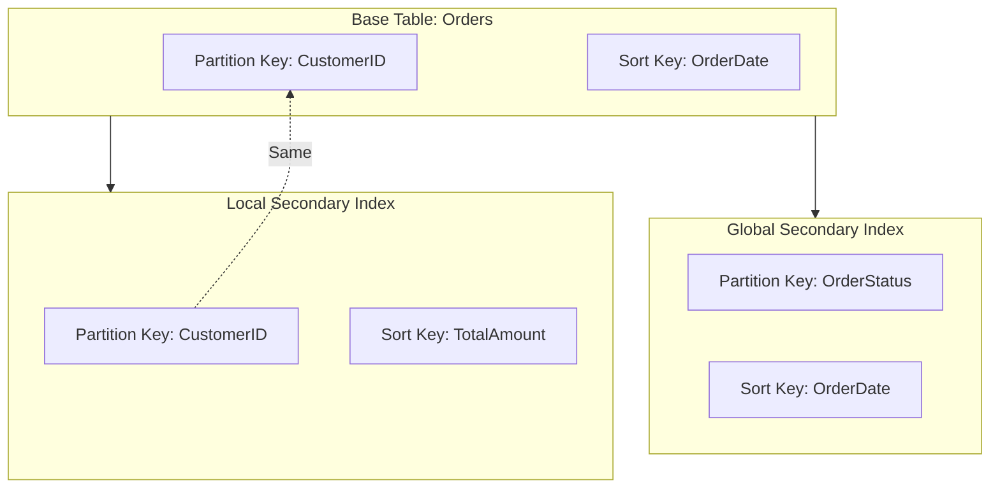
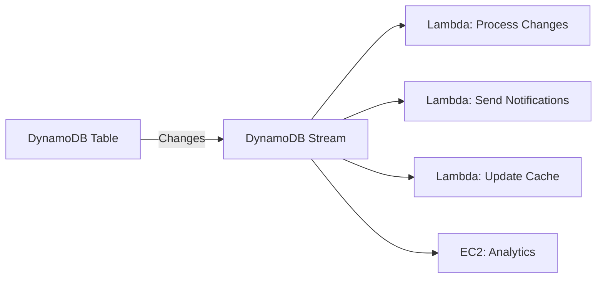
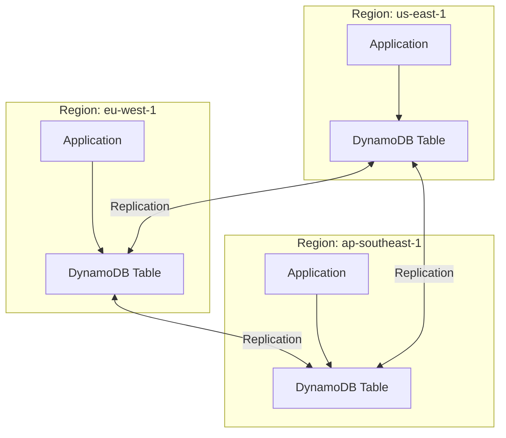
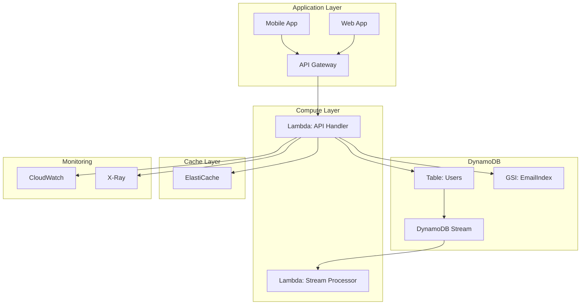
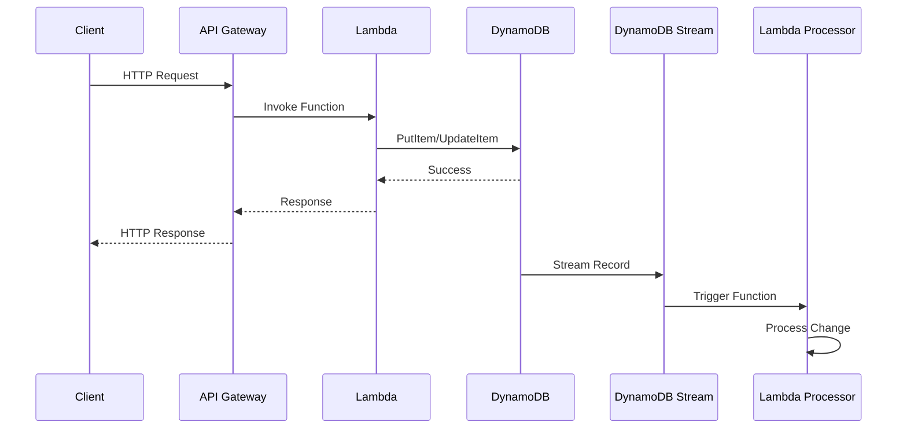
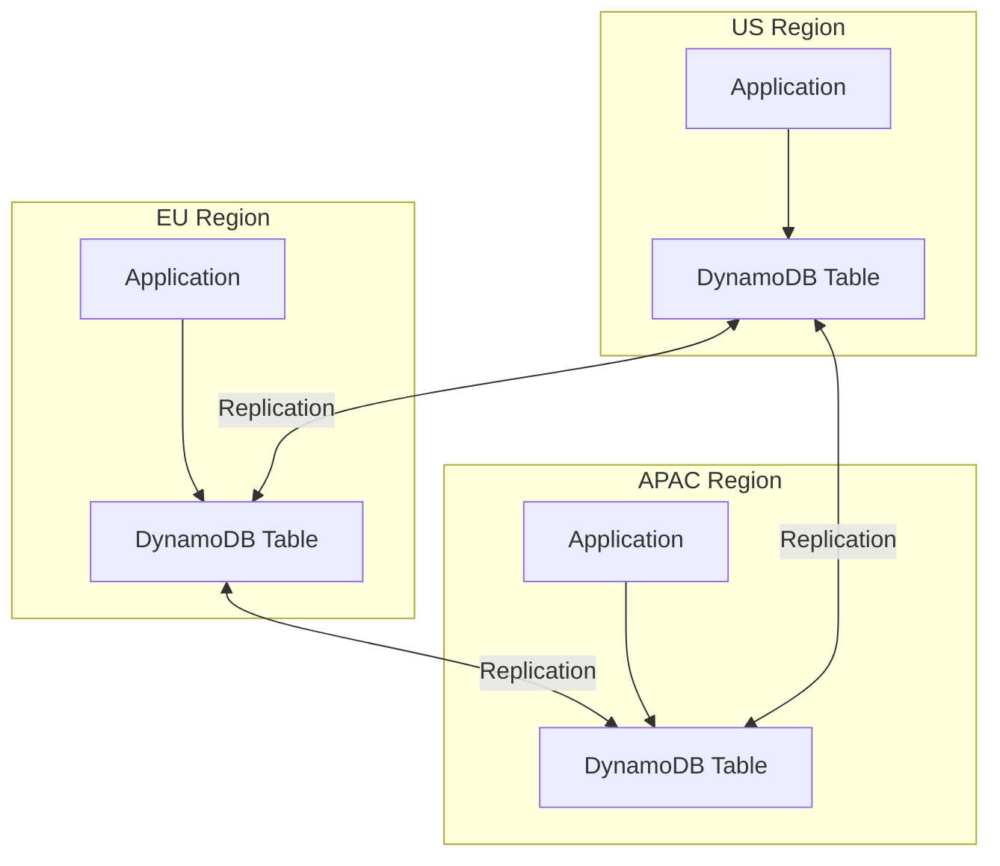

# AWS DynamoDB: Complete Guide

## Table of Contents
1. [What is DynamoDB?](#what-is-dynamodb)
2. [Key Concepts](#key-concepts)
3. [Core Components](#core-components)
4. [Data Model](#data-model)
5. [Primary Keys](#primary-keys)
6. [Read & Write Operations](#read--write-operations)
7. [Consistency Models](#consistency-models)
8. [Capacity Modes](#capacity-modes)
9. [Indexes](#indexes)
10. [Streams](#streams)
11. [Global Tables](#global-tables)
12. [Pricing Model](#pricing-model)
13. [Use Cases](#use-cases)
14. [Best Practices](#best-practices)
15. [Architecture Diagrams](#architecture-diagrams)

---

## What is DynamoDB?

**Amazon DynamoDB** is a **fully managed NoSQL database service** that provides fast and predictable performance with seamless scalability. It's designed to run high-performance applications at any scale.

### Key Characteristics

- **Fully Managed**: No servers to provision, patch, or manage
- **NoSQL Database**: Key-value and document database
- **Serverless**: Scales automatically based on demand
- **Fast Performance**: Single-digit millisecond latency
- **Highly Available**: Built-in replication across multiple Availability Zones
- **Durable**: Automatic backups and point-in-time recovery
- **Secure**: Encryption at rest and in transit, IAM integration

### DynamoDB vs Traditional Databases

| Aspect | Traditional RDS (SQL) | DynamoDB (NoSQL) |
|--------|----------------------|------------------|
| **Data Model** | Relational (tables with relationships) | Key-value/document (no relationships) |
| **Schema** | Fixed schema required | Schema-less (flexible) |
| **Scaling** | Vertical (bigger instance) | Horizontal (automatic) |
| **Query Language** | SQL | API calls (PutItem, GetItem, Query, Scan) |
| **Consistency** | ACID transactions | Eventually consistent (or strongly consistent) |
| **Use Case** | Complex queries, joins | Simple queries, high throughput |

---

## Key Concepts

### 1. **Table**
A collection of items (rows) in DynamoDB. Similar to a table in a relational database, but schema-less.

### 2. **Item**
A single record in a table. An item is a collection of attributes (columns). Each item can have different attributes.

### 3. **Attribute**
A data element in an item. Similar to a column in a relational database, but each item can have different attributes.

### 4. **Primary Key**
Uniquely identifies each item in a table. Two types:
- **Partition Key**: Simple primary key (single attribute)
- **Partition Key + Sort Key**: Composite primary key (two attributes)

### 5. **Partition**
A physical storage unit where DynamoDB stores data. Data is distributed across partitions based on the partition key.

### 6. **Throughput**
The rate at which you can read or write data:
- **Read Capacity Units (RCU)**: 1 RCU = 1 strongly consistent read of 4 KB per second
- **Write Capacity Units (WCU)**: 1 WCU = 1 write of 1 KB per second

---

## Core Components

### Table Structure

```
Table: Users
├── Primary Key: UserID (Partition Key)
├── Attributes: Name, Email, Age, Address, etc.
└── Items: Individual user records
```

### Example Item Structure

```json
{
  "UserID": "12345",
  "Name": "John Doe",
  "Email": "john@example.com",
  "Age": 30,
  "Address": {
    "Street": "123 Main St",
    "City": "Seattle",
    "State": "WA"
  },
  "CreatedAt": "2024-01-15T10:30:00Z"
}
```

---

## Data Model

### Attribute Types

DynamoDB supports multiple data types:

| Type | Description | Example |
|------|-------------|---------|
| **String** | Text data | "Hello World" |
| **Number** | Numeric data | 42, 3.14 |
| **Binary** | Binary data | Base64 encoded |
| **Boolean** | True/false | true, false |
| **Null** | Null value | null |
| **List** | Ordered collection | [1, 2, 3] |
| **Map** | Nested object | {"key": "value"} |
| **String Set** | Unique strings | ["red", "blue"] |
| **Number Set** | Unique numbers | [1, 2, 3] |
| **Binary Set** | Unique binaries | [binary1, binary2] |

### Schema-less Design

Unlike relational databases, DynamoDB doesn't require a fixed schema:

```json
// Item 1
{
  "UserID": "123",
  "Name": "John",
  "Email": "john@example.com"
}

// Item 2 (different attributes)
{
  "UserID": "456",
  "Name": "Jane",
  "Phone": "555-1234",
  "Age": 25
}
```

---

## Primary Keys

### 1. Simple Primary Key (Partition Key Only)

**Structure**: Single attribute that uniquely identifies each item.

**Example:**
```
Table: Users
Partition Key: UserID
```

**Use Case**: When you only need to access items by a single identifier.

### 2. Composite Primary Key (Partition Key + Sort Key)

**Structure**: Two attributes:
- **Partition Key**: Groups related items together
- **Sort Key**: Sorts items within the same partition

**Example:**
```
Table: Orders
Partition Key: CustomerID
Sort Key: OrderDate
```

**Use Case**: When you need to query items by partition key and optionally filter/sort by sort key.

**Query Examples:**
- Get all orders for CustomerID = "123"
- Get orders for CustomerID = "123" where OrderDate > "2024-01-01"
- Get orders for CustomerID = "123" sorted by OrderDate

### Diagram: Primary Key Types



---

## Read & Write Operations

### Write Operations

#### PutItem
Creates a new item or replaces an existing item entirely.

```javascript
// AWS SDK Example (Node.js)
await dynamodb.putItem({
  TableName: 'Users',
  Item: {
    UserID: { S: '12345' },
    Name: { S: 'John Doe' },
    Email: { S: 'john@example.com' }
  }
}).promise();
```

#### UpdateItem
Updates an existing item (partial update).

```javascript
await dynamodb.updateItem({
  TableName: 'Users',
  Key: { UserID: { S: '12345' } },
  UpdateExpression: 'SET Age = :age',
  ExpressionAttributeValues: {
    ':age': { N: '31' }
  }
}).promise();
```

#### DeleteItem
Deletes an item by primary key.

```javascript
await dynamodb.deleteItem({
  TableName: 'Users',
  Key: { UserID: { S: '12345' } }
}).promise();
```

#### BatchWriteItem
Writes up to 25 items in a single operation (more efficient).

### Read Operations

#### GetItem
Retrieves a single item by primary key (fastest read operation).

```javascript
const result = await dynamodb.getItem({
  TableName: 'Users',
  Key: { UserID: { S: '12345' } }
}).promise();
```

#### Query
Retrieves items with the same partition key. Can filter/sort by sort key.

```javascript
// Query all orders for a customer
const result = await dynamodb.query({
  TableName: 'Orders',
  KeyConditionExpression: 'CustomerID = :customerId',
  ExpressionAttributeValues: {
    ':customerId': { S: '12345' }
  }
}).promise();
```

**Query Features:**
- ✅ Very fast (uses partition key)
- ✅ Can filter by sort key
- ✅ Can sort results
- ✅ Can limit results

#### Scan
Examines every item in a table (slower, more expensive).

```javascript
const result = await dynamodb.scan({
  TableName: 'Users',
  FilterExpression: 'Age > :age',
  ExpressionAttributeValues: {
    ':age': { N: '25' }
  }
}).promise();
```

**Scan Limitations:**
- ⚠️ Examines every item (slow)
- ⚠️ Consumes full table capacity
- ⚠️ Use sparingly
- ✅ Use when you need to search across partitions

### Operation Comparison

| Operation | Speed | Use Case | Cost |
|-----------|-------|----------|------|
| **GetItem** | Fastest | Single item by primary key | Low |
| **Query** | Fast | Multiple items with same partition key | Low |
| **Scan** | Slow | Search across entire table | High |

---

## Consistency Models

### 1. Eventually Consistent Reads (Default)

- **Default behavior** for read operations
- May not reflect recent writes immediately
- **Cost**: 1 RCU per 4 KB
- **Use case**: When eventual consistency is acceptable

### 2. Strongly Consistent Reads

- Always reflects all successful writes
- **Cost**: 2 RCU per 4 KB (double the cost)
- **Use case**: When you need the latest data

### Example

```javascript
// Eventually consistent (default)
const result = await dynamodb.getItem({
  TableName: 'Users',
  Key: { UserID: { S: '12345' } }
}).promise();

// Strongly consistent
const result = await dynamodb.getItem({
  TableName: 'Users',
  Key: { UserID: { S: '12345' } },
  ConsistentRead: true
}).promise();
```

### Diagram: Consistency Models



---

## Capacity Modes

### 1. Provisioned Capacity Mode

**How it works:**
- You specify read and write capacity units
- DynamoDB reserves capacity for your table
- You pay for provisioned capacity (even if unused)

**Configuration:**
- **Read Capacity Units (RCU)**: Read throughput
- **Write Capacity Units (WCU)**: Write throughput
- **Auto Scaling**: Automatically adjusts capacity based on traffic

**Use Case:**
- Predictable, steady traffic
- Need guaranteed performance
- Cost optimization for steady workloads

**Pricing:**
- Pay for provisioned RCU/WCU per hour
- Can use auto-scaling to adjust automatically

### 2. On-Demand Capacity Mode

**How it works:**
- No capacity planning needed
- DynamoDB automatically scales up/down
- Pay only for what you use

**Use Case:**
- Unpredictable traffic patterns
- Spiky workloads
- New applications with unknown traffic

**Pricing:**
- Pay per request
- More expensive per request than provisioned mode
- No capacity planning overhead

### Capacity Mode Comparison

| Aspect | Provisioned | On-Demand |
|--------|-------------|-----------|
| **Planning** | Required | Not needed |
| **Scaling** | Manual or auto-scaling | Automatic |
| **Cost** | Lower for steady traffic | Lower for unpredictable traffic |
| **Performance** | Guaranteed | Scales automatically |
| **Best For** | Predictable workloads | Unpredictable workloads |

### Switching Between Modes

You can switch between modes **twice per day** per table.

---

## Indexes

Indexes allow you to query data using attributes other than the primary key.

### 1. Global Secondary Index (GSI)

**Characteristics:**
- Can have different partition key and sort key than base table
- Spans all partitions (hence "global")
- Can be created at any time
- Has its own throughput capacity

**Use Case:**
- Query by different attributes
- Different access patterns

**Example:**
```
Base Table: Users
- Partition Key: UserID

GSI: EmailIndex
- Partition Key: Email
- Query: Find user by email
```

### 2. Local Secondary Index (LSI)

**Characteristics:**
- Same partition key as base table
- Different sort key
- Must be created when creating the table (cannot add later)
- Shares throughput with base table

**Use Case:**
- Alternative sort orders within same partition
- Different query patterns on same partition key

**Example:**
```
Base Table: Orders
- Partition Key: CustomerID
- Sort Key: OrderDate

LSI: OrderStatusIndex
- Partition Key: CustomerID (same)
- Sort Key: Status (different)
- Query: Get orders by customer sorted by status
```

### Index Comparison

| Aspect | GSI | LSI |
|--------|-----|-----|
| **Partition Key** | Can be different | Must be same |
| **Sort Key** | Can be different | Can be different |
| **Creation** | Anytime | Only at table creation |
| **Throughput** | Separate capacity | Shares with table |
| **Consistency** | Eventually consistent only | Strongly or eventually consistent |

### Diagram: Index Types



---

## Streams

**DynamoDB Streams** capture time-ordered sequence of item-level changes (inserts, updates, deletes) in a table.

### How Streams Work

1. **Enable Streams** on a table
2. **Changes are captured** automatically
3. **Stream records** contain:
   - Item keys
   - Before/after images
   - Event type (INSERT, MODIFY, REMOVE)
4. **Consumers** (Lambda, EC2, etc.) process stream records

### Use Cases

- **Real-time processing**: React to data changes immediately
- **Data replication**: Sync to other systems
- **Audit logging**: Track all changes
- **Analytics**: Process changes for analytics
- **Notifications**: Trigger notifications on changes

### Stream View Types

| View Type | What's Included |
|-----------|----------------|
| **KEYS_ONLY** | Only key attributes |
| **NEW_IMAGE** | Entire item after change |
| **OLD_IMAGE** | Entire item before change |
| **NEW_AND_OLD_IMAGES** | Both before and after |

### Example: Lambda Processing Streams

```javascript
// Lambda function triggered by DynamoDB Stream
exports.handler = async (event) => {
  for (const record of event.Records) {
    if (record.eventName === 'INSERT') {
      const newItem = record.dynamodb.NewImage;
      // Process new item
      console.log('New item:', newItem);
    }
  }
};
```

### Diagram: DynamoDB Streams



---

## Global Tables

**DynamoDB Global Tables** provide multi-region, multi-active replication for global applications.

### Features

- **Multi-region replication**: Automatic replication across regions
- **Multi-active**: Read and write to any region
- **Low latency**: Read from nearest region
- **Automatic conflict resolution**: Last-write-wins
- **Eventual consistency**: Replication happens asynchronously

### Use Case

- Global applications with users worldwide
- Need low latency reads
- Disaster recovery and high availability

### Diagram: Global Tables



---

## Pricing Model

### Provisioned Capacity Mode

**Read Capacity Units (RCU):**
- 1 RCU = 1 strongly consistent read of 4 KB per second
- 1 RCU = 2 eventually consistent reads of 4 KB per second
- **Price**: ~$0.00013 per RCU-hour

**Write Capacity Units (WCU):**
- 1 WCU = 1 write of 1 KB per second
- **Price**: ~$0.00065 per WCU-hour

**Storage:**
- First 25 GB: FREE
- Additional: ~$0.25 per GB-month

### On-Demand Capacity Mode

**Pricing:**
- **Read requests**: ~$0.25 per million requests
- **Write requests**: ~$1.25 per million requests
- **Storage**: Same as provisioned mode

### Additional Costs

- **Backup storage**: ~$0.20 per GB-month
- **Data transfer**: Outbound data transfer charges apply
- **Global Tables**: Replication traffic charges
- **Streams**: No additional charge (but Lambda processing costs apply)

### Cost Optimization Tips

1. ✅ Use **on-demand** for unpredictable traffic
2. ✅ Use **provisioned** with auto-scaling for steady traffic
3. ✅ Use **eventually consistent reads** when possible (half the cost)
4. ✅ **Right-size** capacity (don't over-provision)
5. ✅ Use **GSI sparingly** (each GSI has its own capacity costs)
6. ✅ **Archive old data** to reduce storage costs

---

## Use Cases

### 1. **Web Applications**
- User sessions
- User profiles
- Shopping carts
- Product catalogs

### 2. **Gaming Applications**
- Player data
- Leaderboards
- Game state
- Real-time scoring

### 3. **IoT Applications**
- Device telemetry
- Sensor data
- Device state management

### 4. **Mobile Applications**
- User data
- App settings
- Offline sync support

### 5. **Real-time Analytics**
- Clickstream data
- Event tracking
- User behavior analytics

### 6. **Content Management**
- Blog posts
- Comments
- Media metadata

### 7. **Serverless Applications**
- Backend for Lambda functions
- API data storage
- Microservices data layer

---

## Best Practices

### 1. **Design for Access Patterns**
- ✅ Design table structure based on how you'll query data
- ✅ Use composite keys for complex queries
- ✅ Create GSIs for different access patterns
- ❌ Don't use Scan for frequent queries

### 2. **Partition Key Design**
- ✅ Choose partition key with high cardinality (many unique values)
- ✅ Distribute data evenly across partitions
- ❌ Avoid hot partitions (uneven distribution)

### 3. **Index Strategy**
- ✅ Create GSIs for different query patterns
- ✅ Keep GSI count low (each costs money)
- ✅ Use LSI when you need different sort orders

### 4. **Capacity Management**
- ✅ Use on-demand for unpredictable traffic
- ✅ Use provisioned with auto-scaling for steady traffic
- ✅ Monitor CloudWatch metrics
- ✅ Set up alarms for throttling

### 5. **Data Modeling**
- ✅ Store related data together (denormalize)
- ✅ Use composite keys for relationships
- ✅ Consider item size limits (400 KB max)
- ✅ Use sparse indexes (GSI with few items)

### 6. **Performance**
- ✅ Use Query instead of Scan
- ✅ Use batch operations (BatchGetItem, BatchWriteItem)
- ✅ Use eventually consistent reads when possible
- ✅ Implement caching (ElastiCache) for frequently accessed data

### 7. **Security**
- ✅ Use IAM roles and policies
- ✅ Enable encryption at rest
- ✅ Use VPC endpoints for private access
- ✅ Enable point-in-time recovery for critical data

### 8. **Monitoring**
- ✅ Monitor CloudWatch metrics:
  - ConsumedReadCapacityUnits
  - ConsumedWriteCapacityUnits
  - ThrottledRequests
  - UserErrors
- ✅ Set up alarms for throttling
- ✅ Use DynamoDB Streams for change tracking

---

## Architecture Diagrams

### Complete DynamoDB Architecture



### DynamoDB with Lambda Integration



### Multi-Region Global Table Architecture



---

## Quick Reference

| Concept | Description |
|---------|-------------|
| **Table** | Collection of items (like a database table) |
| **Item** | Single record in a table (like a row) |
| **Attribute** | Data element in an item (like a column) |
| **Partition Key** | Primary key that determines data distribution |
| **Sort Key** | Secondary key for sorting within partition |
| **RCU** | Read Capacity Unit (1 strongly consistent read of 4 KB/sec) |
| **WCU** | Write Capacity Unit (1 write of 1 KB/sec) |
| **GSI** | Global Secondary Index (different partition/sort key) |
| **LSI** | Local Secondary Index (same partition, different sort key) |
| **Streams** | Time-ordered sequence of table changes |
| **Global Tables** | Multi-region replication for global applications |
| **Provisioned** | Capacity mode with fixed throughput |
| **On-Demand** | Capacity mode that scales automatically |

---

## Summary

**Amazon DynamoDB** is a fully managed NoSQL database that provides fast, scalable, and reliable data storage. Key features include:

- ✅ **Serverless**: No infrastructure management
- ✅ **Scalable**: Handles millions of requests per second
- ✅ **Fast**: Single-digit millisecond latency
- ✅ **Flexible**: Schema-less design
- ✅ **Global**: Multi-region replication with Global Tables
- ✅ **Integrated**: Works seamlessly with Lambda, API Gateway, and other AWS services

Understanding DynamoDB's data model, access patterns, and best practices enables you to build highly scalable, performant applications.

---

*Document generated for AWS DynamoDB reference. For the latest limits, pricing, and features, refer to the official [AWS DynamoDB documentation](https://docs.aws.amazon.com/dynamodb/).*
