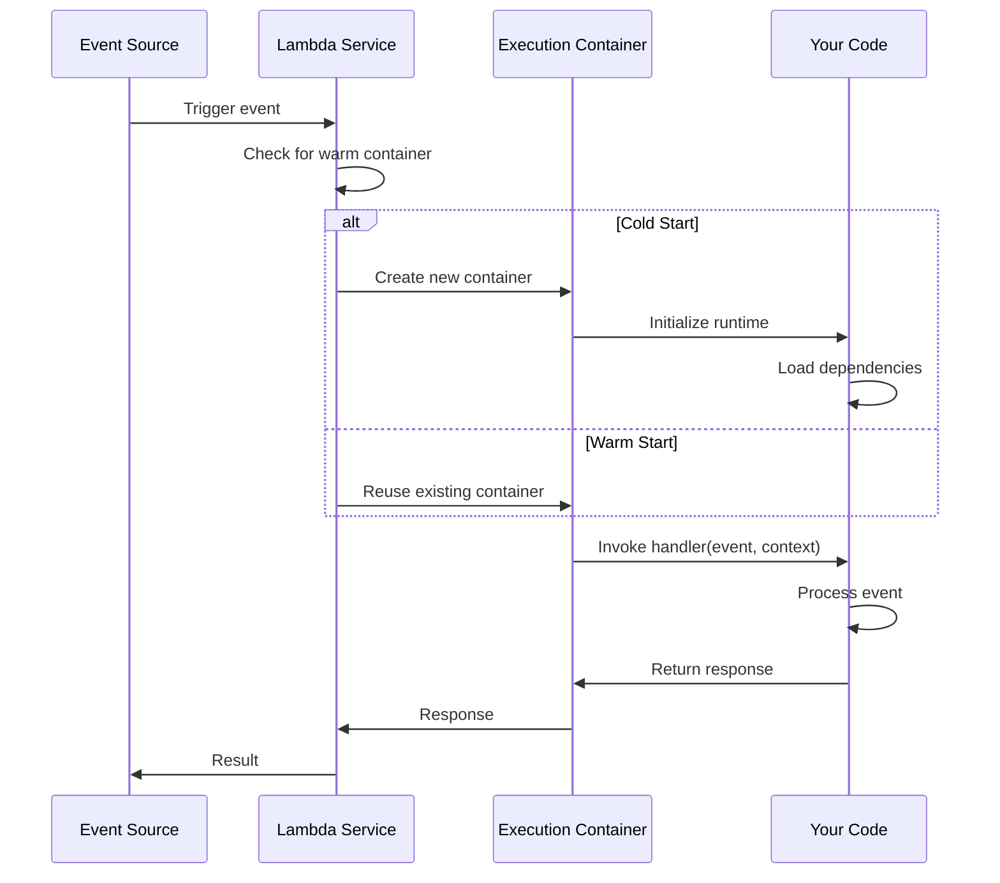
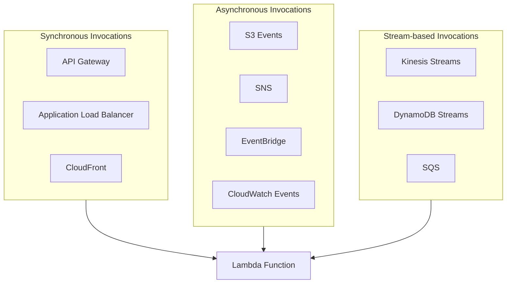
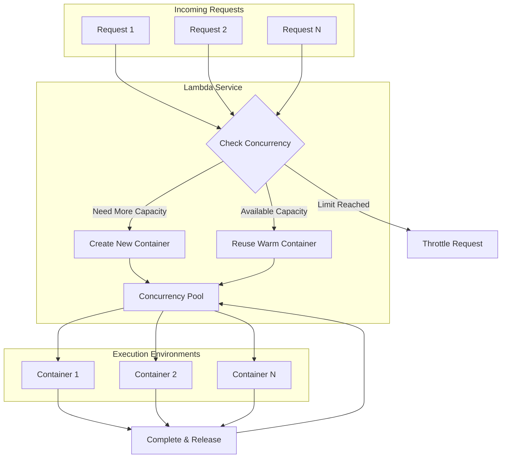
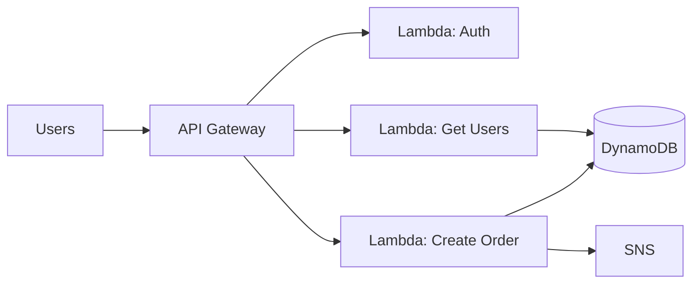
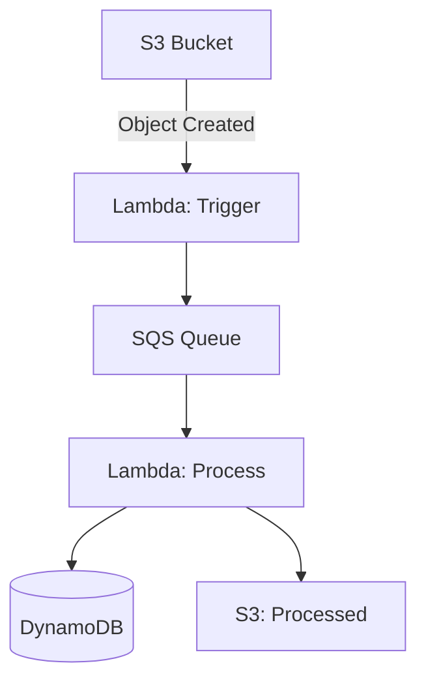
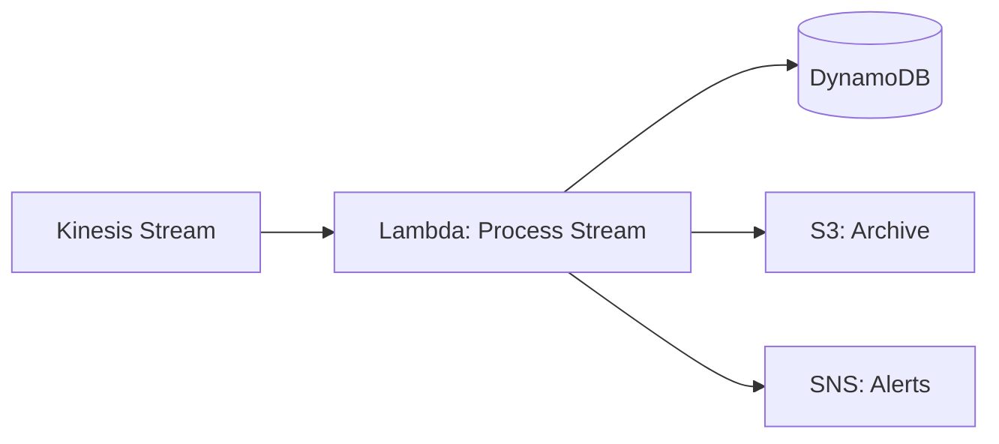
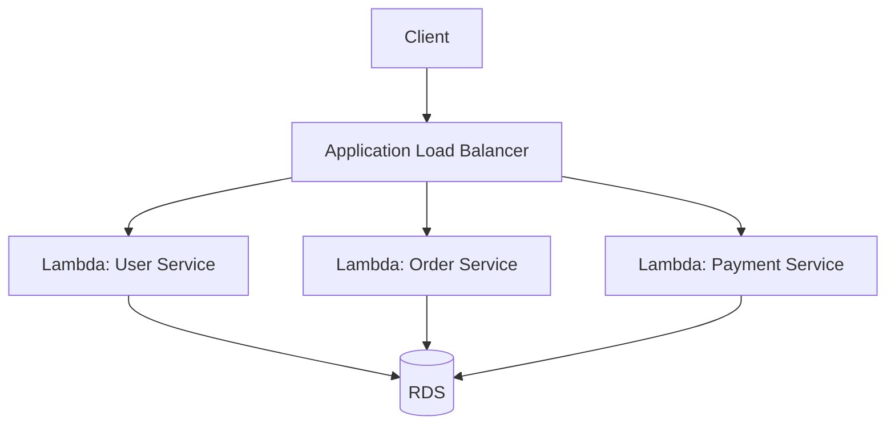
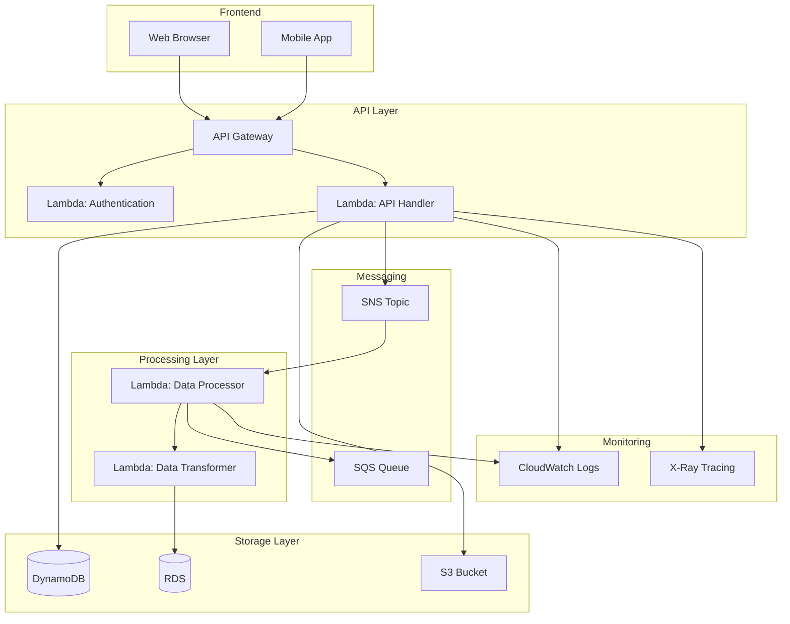
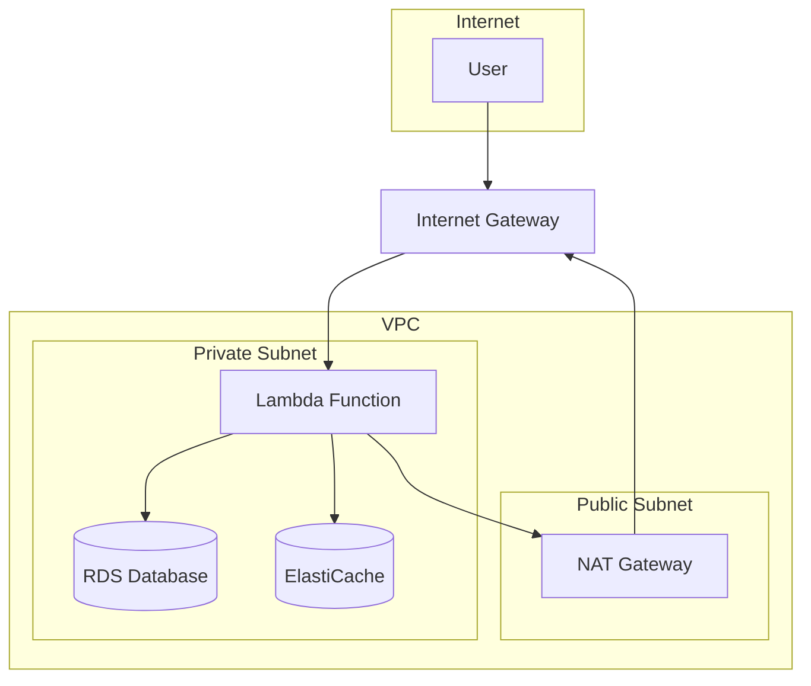

# AWS Lambda: Complete Guide

## Table of Contents
1. [What is AWS Lambda?](#what-is-aws-lambda)
2. [Key Concepts](#key-concepts)
3. [How Lambda Works](#how-lambda-works)
4. [Lambda Function Components](#lambda-function-components)
5. [Supported Runtimes](#supported-runtimes)
6. [Event Sources & Triggers](#event-sources--triggers)
7. [Configuration & Limits](#configuration--limits)
8. [Lambda Autoscaling & Concurrency](#lambda-autoscaling--concurrency)
9. [Pricing Model](#pricing-model)
10. [Use Cases](#use-cases)
11. [Architecture Patterns](#architecture-patterns)
12. [Best Practices](#best-practices)
13. [Architecture Diagrams](#architecture-diagrams)

---

## What is AWS Lambda?

**AWS Lambda** is a **serverless compute service** that lets you run code without provisioning or managing servers. You simply upload your code, and Lambda handles everything required to run and scale it with high availability.

### Key Characteristics

- **Serverless**: No servers to manage, patch, or maintain
- **Event-driven**: Functions execute in response to events
- **Auto-scaling**: Automatically scales from zero to thousands of concurrent executions
- **Pay-per-use**: You only pay for the compute time you consume
- **Fully managed**: AWS handles infrastructure, operating system, and runtime management

### Traditional vs Serverless

| Aspect | Traditional (EC2) | Serverless (Lambda) |
|--------|-------------------|---------------------|
| **Provisioning** | Manual server setup | Automatic |
| **Scaling** | Manual or auto-scaling groups | Automatic, instant |
| **Maintenance** | OS patches, security updates | Managed by AWS |
| **Cost** | Pay for running instances 24/7 | Pay per invocation and duration |
| **Cold starts** | Always running | May have cold start latency |
| **Use case** | Long-running, stateful apps | Event-driven, stateless functions |

---

## Key Concepts

### 1. **Function**
A Lambda function is your code (a single function or a collection of functions) that runs in response to events.

### 2. **Event**
An event is a JSON document that triggers your Lambda function. Examples:
- An S3 object upload
- An API Gateway HTTP request
- A message in an SQS queue
- A CloudWatch scheduled event

### 3. **Handler**
The handler is the entry point of your Lambda function. It's the function that Lambda calls when your code is invoked.

**Example (Node.js):**
```javascript
exports.handler = async (event, context) => {
    console.log('Event:', JSON.stringify(event));
    return {
        statusCode: 200,
        body: JSON.stringify('Hello from Lambda!')
    };
};
```

### 4. **Runtime**
The runtime is the programming language environment that executes your code. Lambda supports multiple runtimes (Node.js, Python, Java, Go, .NET, Ruby, etc.).

### 5. **Execution Environment**
The execution environment is a secure, isolated container where your Lambda function runs. Each execution environment can handle one request at a time.

### 6. **Cold Start vs Warm Start**
- **Cold Start**: First invocation or after idle period - Lambda needs to create a new execution environment (adds latency ~100ms-10s depending on runtime)
- **Warm Start**: Subsequent invocations reuse existing execution environment (faster, ~1-50ms)

---

## How Lambda Works

### Execution Flow



### Lifecycle

1. **Event arrives** → Lambda receives trigger from event source
2. **Container check** → Lambda checks for available warm container
3. **Cold start** (if needed) → Creates new container, initializes runtime, loads code
4. **Execution** → Invokes your handler function with event data
5. **Response** → Returns result to event source
6. **Idle** → Container stays warm for a few minutes, then may be recycled

---

## Lambda Function Components

### 1. **Function Code**
Your application code that processes events.

### 2. **Configuration**
- **Memory**: 128 MB to 10,240 MB (also affects CPU proportionally)
- **Timeout**: Maximum execution time (1 second to 15 minutes)
- **Environment variables**: Key-value pairs for configuration
- **VPC**: Optional VPC configuration for private resources
- **IAM Role**: Permissions your function needs

### 3. **Layers**
Layers are ZIP archives containing libraries, custom runtimes, or other function dependencies. They help:
- Reduce deployment package size
- Share code across multiple functions
- Keep deployment packages under 50MB (unzipped)

### 4. **Versioning & Aliases**
- **Versions**: Immutable snapshots of your function code and configuration
- **Aliases**: Pointers to function versions (e.g., `PROD`, `DEV`, `STAGING`)
- Useful for blue/green deployments and gradual rollouts

---

## Supported Runtimes

### Fully Managed Runtimes
- **Node.js**: 18.x, 20.x
- **Python**: 3.9, 3.10, 3.11, 3.12
- **Java**: 11, 17, 21
- **.NET**: 6, 8
- **Go**: 1.x (provided.al2)
- **Ruby**: 3.2
- **Rust**: Custom runtime

### Custom Runtimes
You can bring your own runtime using the Lambda Runtime API (e.g., PHP, Erlang, etc.).

---

## Event Sources & Triggers

### Synchronous Invocations
- **API Gateway**: HTTP/REST APIs
- **Application Load Balancer**: HTTP/HTTPS requests
- **CloudFront**: Lambda@Edge (at edge locations)
- **Cognito**: User pool triggers
- **Lex**: Chatbot interactions
- **Alexa**: Skills
- **Kinesis Data Firehose**: Data transformation

### Asynchronous Invocations
- **S3**: Object created/deleted events
- **SNS**: Topic notifications
- **SES**: Email events
- **CloudWatch Events/EventBridge**: Scheduled events, custom events
- **CodeCommit**: Repository events
- **CloudFormation**: Stack events
- **CloudWatch Logs**: Log group events

### Stream-based Invocations
- **Kinesis Data Streams**: Real-time data processing
- **DynamoDB Streams**: Database change events
- **SQS**: Queue messages (standard and FIFO)

### Diagram: Lambda Event Sources



---

## Configuration & Limits

### Resource Limits

| Resource | Limit |
|----------|-------|
| **Memory** | 128 MB - 10,240 MB (in 1 MB increments) |
| **Timeout** | 15 minutes (900 seconds) |
| **Deployment package** | 50 MB (zipped), 250 MB (unzipped) |
| **Layers** | 5 layers per function |
| **Environment variables** | 4 KB total |
| **Concurrent executions** | 1,000 per region (can request increase) |
| **Temporary disk space** | 512 MB - 10,240 MB (`/tmp`) |
| **Function URL payload** | 6 MB (synchronous), 256 KB (asynchronous) |

### Concurrent Executions

- **Reserved concurrency**: Limit how many instances of a function can run simultaneously
- **Provisioned concurrency**: Pre-warm containers to eliminate cold starts (costs extra)
- **Unreserved concurrency**: Shared pool across all functions in your account

---

## Lambda Autoscaling & Concurrency

### How Lambda Autoscaling Works

Lambda **automatically scales** your functions in response to incoming requests. You don't need to configure anything - it's built-in and automatic!

#### Scaling Behavior

1. **Automatic Scaling**: Lambda automatically creates new execution environments as requests arrive
2. **Instant Scaling**: Can scale from 0 to thousands of concurrent executions in seconds
3. **Per-Function Scaling**: Each function scales independently
4. **No Configuration Needed**: Autoscaling is enabled by default

### Concurrency Limits

#### Default Concurrency Limits

| Account Type | Default Limit | Maximum Limit |
|--------------|---------------|---------------|
| **New AWS Account** | 1,000 concurrent executions per region | Can request increase |
| **Existing Account** | Varies by account age and usage | Can request increase |

#### How Many Requests Can Lambda Handle?

**Per Function:**
- **Default**: Shares account-level concurrency pool (1,000)
- **With Reserved Concurrency**: Up to your reserved limit (e.g., 500, 1000, 5000)
- **Maximum**: Can request up to **tens of thousands** per function

**Per Account (Region):**
- **Default**: 1,000 concurrent executions
- **Can Request**: Up to **hundreds of thousands** (depends on use case)
- **Burst Capacity**: Initial burst of 3,000-5,000 concurrent executions

#### Burst Capacity

Lambda provides **initial burst capacity** beyond your account limit:

- **Initial Burst**: 3,000-5,000 concurrent executions (varies by region)
- **Sustained Scaling**: After burst, scales at 500 concurrent executions per minute
- **No Throttling**: If you stay within burst capacity, no throttling occurs

**Example Burst Behavior:**
```
Time 0s:  0 concurrent executions
Time 1s:  5,000 concurrent executions (burst)
Time 2s:  5,500 concurrent executions (+500/min)
Time 3s:  6,000 concurrent executions (+500/min)
```

### Types of Concurrency

#### 1. **Unreserved Concurrency** (Default)
- Shared pool across all functions in your account
- Default: 1,000 concurrent executions per region
- Functions compete for available concurrency
- **Use case**: General purpose, cost-effective

#### 2. **Reserved Concurrency**
- Dedicated concurrency for a specific function
- Prevents other functions from using this capacity
- Can be set from 0 to account limit
- **Use case**: Critical functions that need guaranteed capacity

**Example:**
```
Account Limit: 1,000 concurrent executions
Function A: Reserved = 300
Function B: Reserved = 200
Remaining: 500 for other functions
```

#### 3. **Provisioned Concurrency**
- Pre-warms execution environments (eliminates cold starts)
- Always-ready containers for your function
- Costs extra ($0.015 per GB-hour)
- **Use case**: Low-latency requirements, predictable traffic

**Note**: Provisioned concurrency counts toward reserved concurrency.

### How to Configure Autoscaling

#### Option 1: Default (No Configuration)
- Lambda autoscales automatically
- Uses unreserved concurrency pool
- Best for most use cases

#### Option 2: Set Reserved Concurrency

**Via AWS Console:**
1. Go to Lambda → Functions → Your Function
2. Configuration → Concurrency
3. Click "Edit"
4. Set "Reserved concurrency" (e.g., 500)
5. Save

**Via AWS CLI:**
```bash
aws lambda put-function-concurrency \
  --function-name my-function \
  --reserved-concurrent-executions 500
```

**Via CloudFormation:**
```yaml
MyFunction:
  Type: AWS::Lambda::Function
  Properties:
    FunctionName: my-function
    ReservedConcurrentExecutions: 500
```

#### Option 3: Set Provisioned Concurrency

**Via AWS Console:**
1. Go to Lambda → Functions → Your Function
2. Configuration → Provisioned concurrency
3. Click "Create version or alias"
4. Set provisioned concurrency (e.g., 10)
5. Save

**Via AWS CLI:**
```bash
aws lambda put-provisioned-concurrency-config \
  --function-name my-function \
  --qualifier PROD \
  --provisioned-concurrent-executions 10
```

### Requesting Concurrency Limit Increases

#### When to Request Increase

- You're hitting the 1,000 concurrent execution limit
- You need more than burst capacity (5,000+)
- You have predictable high-traffic events

#### How to Request Increase

**Via AWS Support:**
1. Go to AWS Support Center
2. Create a case: "Service Limit Increase"
3. Select "Lambda"
4. Specify:
   - Region
   - Desired concurrent execution limit
   - Use case and justification

**Via AWS CLI:**
```bash
aws service-quotas request-service-quota-increase \
  --service-code lambda \
  --quota-code L-B99A9384 \
  --desired-value 10000
```

**Typical Approval:**
- Small increases (up to 5,000): Usually automatic
- Large increases (10,000+): May require justification
- Very large (100,000+): Requires detailed use case

### Scaling Behavior by Event Source

#### Synchronous Invocations (API Gateway, ALB)
- **Scales immediately** with incoming requests
- Each request gets its own execution environment
- No batching - one request = one invocation
- **Throttling**: Returns 429 (Too Many Requests) if concurrency limit reached

#### Asynchronous Invocations (S3, SNS, EventBridge)
- **Scales gradually** - processes events in batches
- **Retry mechanism**: Failed invocations retried automatically
- **Dead Letter Queue**: Configure DLQ for failed events
- **Throttling**: Events queued internally, then retried

#### Stream-based Invocations (Kinesis, DynamoDB Streams)
- **Scales based on shards/partitions**
- **One execution per shard**: Each shard gets one concurrent execution
- **Parallel processing**: Multiple shards = parallel executions
- **Example**: 10 Kinesis shards = up to 10 concurrent Lambda executions

**Kinesis Scaling Formula:**
```
Concurrent Executions = Number of Shards × Batch Size
```

**DynamoDB Streams Scaling:**
```
Concurrent Executions = Number of Stream Partitions
```

#### SQS Invocations
- **Scales based on queue depth**
- **Batch processing**: Processes up to 10 messages per invocation
- **Concurrent executions**: Up to 1,000 per queue (can request increase)
- **Scaling formula**: 
  ```
  Concurrent Executions = min(Queue Depth / Batch Size, 1,000)
  ```

### Monitoring Concurrency & Scaling

#### Key Metrics in CloudWatch

1. **ConcurrentExecutions**
   - Current number of concurrent executions
   - Monitor to see if you're hitting limits

2. **Throttles**
   - Number of requests throttled due to concurrency limits
   - Should be 0 in normal operation

3. **Invocations**
   - Total number of function invocations
   - Helps understand traffic patterns

4. **Duration**
   - Execution time per invocation
   - Affects how quickly concurrency is released

#### Setting Up Alarms

**CloudWatch Alarm for Throttles:**
```bash
aws cloudwatch put-metric-alarm \
  --alarm-name lambda-throttles \
  --alarm-description "Alert when Lambda throttles occur" \
  --metric-name Throttles \
  --namespace AWS/Lambda \
  --statistic Sum \
  --period 60 \
  --threshold 1 \
  --comparison-operator GreaterThanThreshold \
  --evaluation-periods 1
```

### Autoscaling Best Practices

#### 1. **Monitor Concurrency**
- ✅ Set up CloudWatch alarms for throttles
- ✅ Monitor ConcurrentExecutions metric
- ✅ Track concurrency trends over time

#### 2. **Set Reserved Concurrency Wisely**
- ✅ Reserve concurrency for critical functions
- ✅ Leave headroom for other functions
- ✅ Don't reserve more than needed (wastes capacity)

#### 3. **Handle Throttling Gracefully**
- ✅ Implement retry logic with exponential backoff
- ✅ Use Dead Letter Queues for failed invocations
- ✅ Consider increasing concurrency limits if throttling persists

#### 4. **Optimize for Scaling**
- ✅ Keep functions stateless (scales better)
- ✅ Minimize cold start time
- ✅ Use provisioned concurrency for predictable traffic

#### 5. **Cost Optimization**
- ✅ Right-size memory (affects CPU and scaling efficiency)
- ✅ Optimize function duration (releases concurrency faster)
- ✅ Use reserved concurrency to prevent runaway costs

### Scaling Examples

#### Example 1: API Backend (Synchronous)

**Scenario**: API Gateway → Lambda, 10,000 requests/second

```
Requests/sec: 10,000
Avg Duration: 200ms
Concurrent Executions Needed: 10,000 × 0.2 = 2,000

Action: Request concurrency increase to 3,000 (with buffer)
```

#### Example 2: S3 Event Processing (Asynchronous)

**Scenario**: S3 uploads trigger Lambda, 1,000 files/minute

```
Files/min: 1,000
Avg Duration: 500ms
Concurrent Executions: ~8-10 (Lambda manages internally)

Action: Default concurrency sufficient (no configuration needed)
```

#### Example 3: Kinesis Stream Processing

**Scenario**: Kinesis stream with 50 shards

```
Shards: 50
Batch Size: 100 records
Max Concurrent Executions: 50 (one per shard)

Action: Ensure account limit ≥ 50, or set reserved concurrency
```

### Diagram: Lambda Autoscaling Flow



### Summary: Autoscaling & Concurrency

| Aspect | Details |
|--------|---------|
| **Default Limit** | 1,000 concurrent executions per region |
| **Burst Capacity** | 3,000-5,000 initial burst |
| **Scaling Rate** | 500 concurrent executions per minute (after burst) |
| **Maximum Limit** | Can request hundreds of thousands (with justification) |
| **Configuration** | Automatic (no config needed) or set reserved/provisioned |
| **Per Function** | Shares account pool or can reserve dedicated capacity |
| **Throttling** | Returns 429 (sync) or queues (async) when limit reached |

**Key Takeaway**: Lambda autoscales automatically and can handle massive scale. Monitor throttles and request limit increases when needed!

---

## Pricing Model

Lambda pricing has **three components**:

### 1. **Requests**
- **First 1 million requests per month**: FREE
- **After 1 million**: $0.20 per 1 million requests

### 2. **Compute Time**
- Charged per 100ms of execution time
- Price depends on memory allocated:
  - **128 MB**: $0.0000000021 per 100ms
  - **512 MB**: $0.0000000083 per 100ms
  - **1024 MB**: $0.0000000167 per 100ms
  - **10240 MB**: $0.0000001667 per 100ms

### 3. **Provisioned Concurrency** (optional)
- $0.015 per GB-hour of provisioned concurrency

### Example Cost Calculation

**Scenario**: 1 million requests, 512 MB memory, 200ms average duration

- **Requests**: 1M requests = FREE (within free tier)
- **Compute**: 
  - 1,000,000 requests × 200ms = 200,000,000 ms
  - 200,000,000 ms ÷ 100ms = 2,000,000 units
  - 2,000,000 × $0.0000000083 = **$0.0166**

**Total: ~$0.02** (extremely cost-effective!)

---

## Use Cases

### 1. **Web Applications**
- Backend API endpoints via API Gateway
- Serverless web applications
- Microservices architecture

### 2. **Data Processing**
- Transform data from S3
- Process streaming data from Kinesis
- ETL pipelines

### 3. **Real-time File Processing**
- Image/video processing on S3 upload
- Generate thumbnails
- Extract metadata

### 4. **Scheduled Tasks**
- CloudWatch Events/EventBridge cron jobs
- Database cleanup
- Report generation

### 5. **IoT Backend**
- Process IoT device data
- Real-time analytics
- Device state management

### 6. **Chatbots & Voice Assistants**
- Alexa skills
- Lex chatbots
- Natural language processing

### 7. **Automation**
- Infrastructure automation
- CI/CD pipelines
- Automated responses to events

---

## Architecture Patterns

### 1. **API Backend Pattern**



### 2. **Event-Driven Processing Pattern**



### 3. **Stream Processing Pattern**



### 4. **Microservices Pattern**



---

## Best Practices

### 1. **Function Design**
- ✅ Keep functions **small and focused** (single responsibility)
- ✅ Make functions **stateless** (don't rely on in-memory state)
- ✅ Use **environment variables** for configuration
- ✅ **Idempotent**: Same input should produce same output

### 2. **Performance**
- ✅ **Optimize cold starts**: Minimize dependencies, use layers, consider provisioned concurrency
- ✅ **Right-size memory**: More memory = more CPU (find optimal balance)
- ✅ **Reuse connections**: Initialize DB/HTTP clients outside handler
- ✅ **Use async/await**: Don't block the event loop

### 3. **Error Handling**
- ✅ **Retry logic**: Use dead-letter queues (DLQ) for failed invocations
- ✅ **Idempotency**: Handle duplicate events gracefully
- ✅ **Logging**: Use CloudWatch Logs effectively
- ✅ **Monitoring**: Set up CloudWatch alarms

### 4. **Security**
- ✅ **IAM roles**: Grant least privilege permissions
- ✅ **VPC**: Use VPC for private resources (adds cold start latency)
- ✅ **Secrets**: Use AWS Secrets Manager or Parameter Store
- ✅ **Encryption**: Encrypt environment variables at rest

### 5. **Cost Optimization**
- ✅ **Right-size memory**: Test different memory allocations
- ✅ **Optimize code**: Reduce execution time
- ✅ **Reserved concurrency**: Limit to prevent runaway costs
- ✅ **Monitor costs**: Use Cost Explorer and billing alerts

### 6. **Deployment**
- ✅ **Versioning**: Use versions and aliases
- ✅ **Layers**: Share common code via layers
- ✅ **CI/CD**: Automate deployments
- ✅ **Testing**: Test locally with SAM or Serverless Framework

---

## Architecture Diagrams

### Complete Serverless Application Architecture



### Lambda with VPC Architecture



**Note**: Lambda in VPC requires ENI (Elastic Network Interface) creation, which adds cold start latency (~1-3 seconds).

---

## Lambda Execution Context

### Context Object

The `context` object provides information about the execution environment:

```javascript
{
    functionName: 'my-function',
    functionVersion: '$LATEST',
    invokedFunctionArn: 'arn:aws:lambda:...',
    memoryLimitInMB: '512',
    awsRequestId: 'unique-request-id',
    logGroupName: '/aws/lambda/my-function',
    logStreamName: '2024/01/01/[$LATEST]...',
    getRemainingTimeInMillis: () => 5000  // Time remaining
}
```

### Handler Signature

**Node.js:**
```javascript
exports.handler = async (event, context) => {
    // event: Event data from trigger
    // context: Runtime information
    return response;
};
```

**Python:**
```python
def lambda_handler(event, context):
    # event: Event data from trigger
    # context: Runtime information
    return response
```

---

## Quick Reference

| Concept | Description |
|---------|-------------|
| **Lambda Function** | Your code that runs in response to events |
| **Handler** | Entry point function Lambda invokes |
| **Runtime** | Programming language environment |
| **Event** | JSON document that triggers function |
| **Cold Start** | First invocation (container creation) |
| **Warm Start** | Reusing existing container |
| **Concurrency** | Number of simultaneous executions |
| **Provisioned Concurrency** | Pre-warmed containers (no cold starts) |
| **Layer** | Shared code/dependencies archive |
| **Version** | Immutable snapshot of function |
| **Alias** | Pointer to function version |
| **Dead Letter Queue** | Queue for failed invocations |
| **Environment Variable** | Configuration key-value pairs |
| **VPC** | Private network for Lambda (adds latency) |

---

## Summary

**AWS Lambda** is a powerful serverless compute service that eliminates server management, automatically scales, and charges only for what you use. It's ideal for event-driven architectures, microservices, data processing, and API backends. Key benefits include:

- ✅ **No server management**
- ✅ **Automatic scaling**
- ✅ **Pay-per-use pricing**
- ✅ **Multiple language support**
- ✅ **Integration with 200+ AWS services**

Understanding Lambda's event-driven model, execution lifecycle, and best practices enables you to build scalable, cost-effective serverless applications.

---

*Document generated for AWS Lambda reference. For the latest limits, pricing, and features, refer to the official [AWS Lambda documentation](https://docs.aws.amazon.com/lambda/).*
