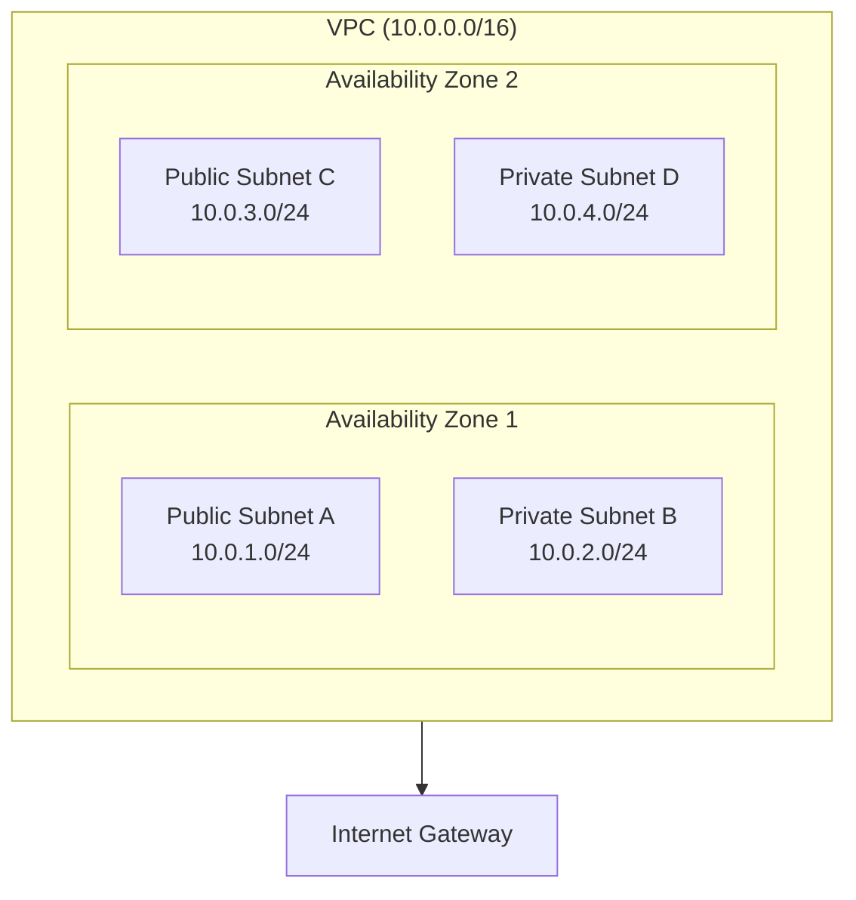
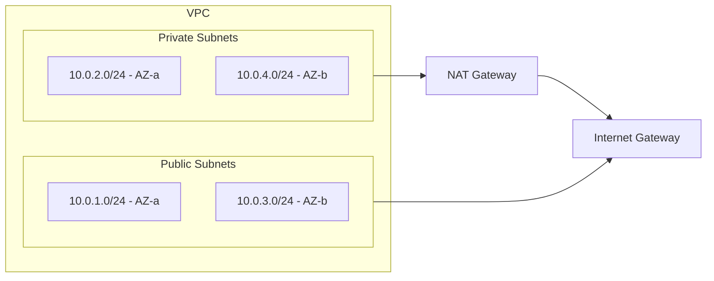
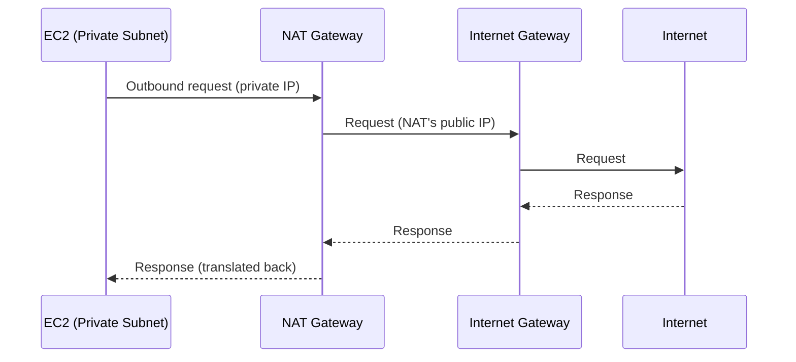
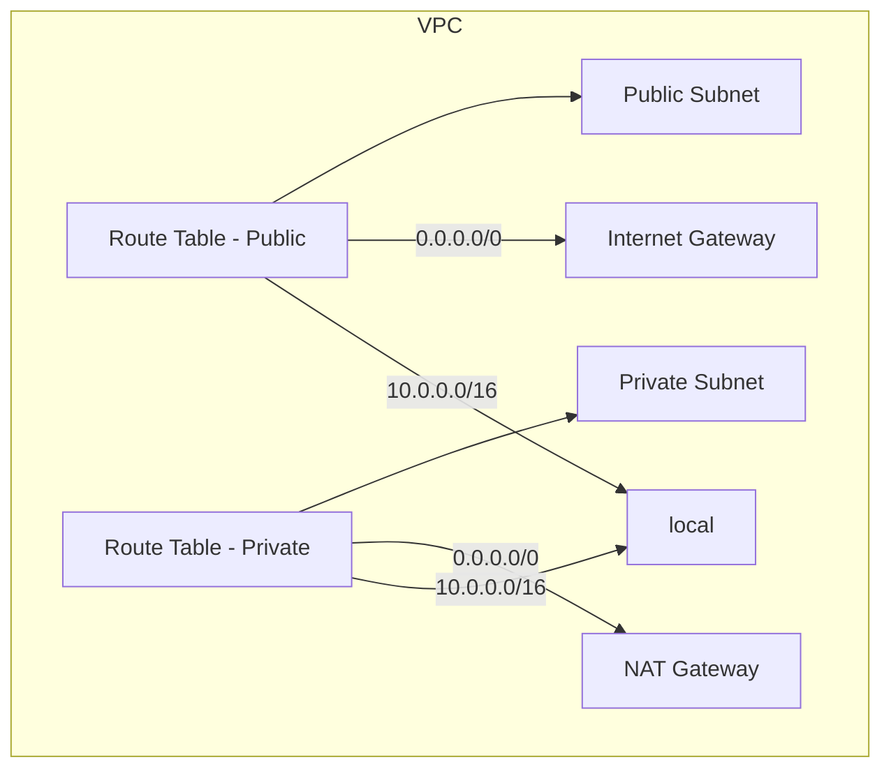
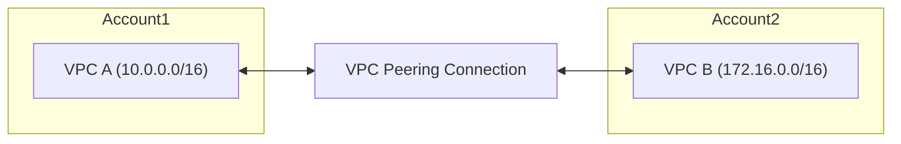
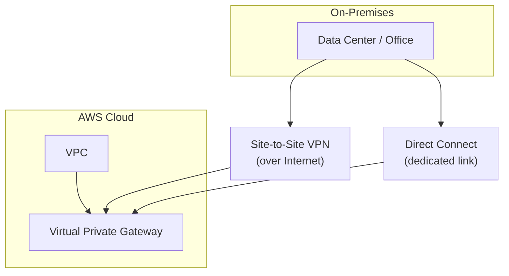
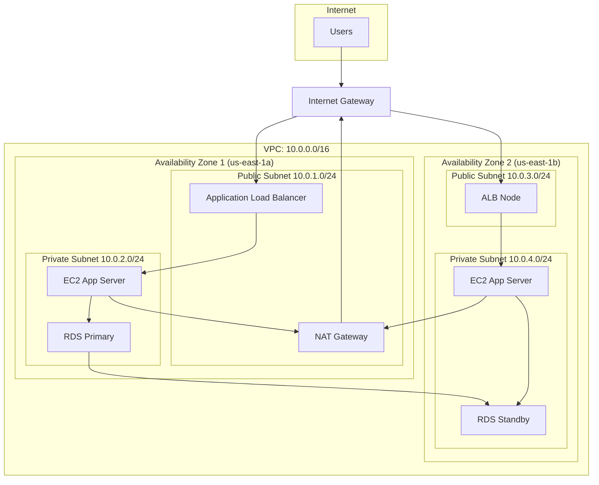

# AWS Networking: Complete Guide

## Table of Contents
1. [What is Networking in AWS?](#what-is-networking-in-aws)
2. [Virtual Private Cloud (VPC)](#virtual-private-cloud-vpc)
3. [Subnets](#subnets)
4. [Internet Gateway](#internet-gateway)
5. [NAT Gateway & NAT Instance](#nat-gateway--nat-instance)
6. [Route Tables](#route-tables)
7. [Security Groups](#security-groups)
8. [Network ACLs (NACLs)](#network-acls-nacls)
9. [Elastic IP](#elastic-ip)
10. [VPC Peering](#vpc-peering)
11. [VPN & Direct Connect](#vpn--direct-connect)
12. [Architecture Diagrams](#architecture-diagrams)

---

## What is Networking in AWS?

**AWS Networking** is the set of services and constructs that let you control how your resources (EC2 instances, RDS, Lambda, etc.) communicate with each other and with the internet. Unlike traditional data centers where you manage physical routers and cables, AWS provides a **software-defined network** that you configure through the AWS console or APIs.

### Key Principles
- **Isolation**: Your resources run in a logically isolated section of AWS (a VPC).
- **Scalability**: You can add subnets, IP ranges, and gateways without physical changes.
- **Security**: You control inbound/outbound traffic with security groups, NACLs, and routing.

---

## Virtual Private Cloud (VPC)

### Definition
A **VPC** is your own isolated virtual network in the AWS cloud. It is logically isolated from other virtual networks and gives you full control over:
- IP address ranges (CIDR blocks)
- Subnets
- Route tables
- Network gateways
- Security (security groups and NACLs)

### Default VPC
- Every AWS account has a **default VPC** in each region.
- It has a default subnet in each Availability Zone (AZ).
- All resources get a public and private IP by default.
- You can create additional **custom VPCs** for different projects or environments.

### VPC CIDR
- You assign a **CIDR block** (e.g. `10.0.0.0/16`) to the VPC.
- This defines the range of private IP addresses available in the VPC.
- Allowed size: between `/16` (65,536 IPs) and `/28` (16 IPs).
- You can add secondary CIDR blocks later (with some constraints).

### Diagram: VPC Overview

---

## Subnets

### Definition
A **subnet** is a segment of a VPC’s IP range that you place in a single **Availability Zone**. Subnets let you group resources and control access (e.g. public vs private).

### Public vs Private Subnets

| Type | Purpose | Has route to Internet? |
|------|---------|------------------------|
| **Public subnet** | Resources that need direct internet access (e.g. web servers, load balancers) | Yes, via Internet Gateway |
| **Private subnet** | Resources that should not be directly reachable from the internet (e.g. app servers, databases) | Outbound only via NAT Gateway/Instance (optional) |

### Subnet CIDR
- Subnet CIDR must be a subset of the VPC CIDR.
- AWS reserves 5 IPs in every subnet:
  - First: network address
  - Second: reserved for VPC router
  - Third: reserved for DNS (Amazon DNS server)
  - Fourth: reserved for future use
  - Last: broadcast address

Example: A `/24` subnet (256 addresses) gives you **251 usable IPs**.

### Diagram: Subnets in a VPC

---

## Internet Gateway

### Definition
An **Internet Gateway (IGW)** is a horizontally scaled, highly available VPC component that allows:
- **Outbound**: traffic from your VPC to the internet.
- **Inbound**: traffic from the internet to your VPC (e.g. to instances with public IPs).

### Key Points
- One IGW per VPC (attached to the VPC).
- It does **not** provide NAT; public IPs stay public.
- No bandwidth charges for the gateway itself; you pay for data transfer.
- Required for instances in **public subnets** to be reachable from the internet.

---

## NAT Gateway & NAT Instance

### Why NAT?
Resources in **private subnets** have no direct path to the internet. To allow them to make outbound requests (e.g. software updates, API calls), you use **NAT** (Network Address Translation).

### NAT Gateway (recommended)
- **Managed** by AWS; no OS to patch.
- **Highly available** in one AZ; for multi-AZ resilience you deploy one per AZ.
- Sits in a **public subnet** and has a public IP (or Elastic IP).
- Private subnet route: `0.0.0.0/0` → NAT Gateway.
- **Charges**: hourly + data processed.

### NAT Instance
- An EC2 instance running NAT AMI in a public subnet.
- You manage OS and scaling.
- Use when you need custom behavior or legacy requirements; otherwise prefer NAT Gateway.

### Diagram: NAT Flow

---

## Route Tables

### Definition
A **route table** contains a set of rules (**routes**) that determine where network traffic from your subnet (or gateway) is sent.

### Components of a Route
- **Destination**: CIDR (e.g. `0.0.0.0/0` for default, or `10.0.0.0/16` for local VPC).
- **Target**: Where to send the traffic (e.g. `igw-xxx`, `nat-xxx`, `local`).

### Default Route Table
- Every VPC has a **main route table**.
- New subnets are associated with the main route table unless you create and attach a custom one.
- The **local** route (`VPC CIDR` → `local`) is always present and allows traffic within the VPC.

### Example Route Tables

**Public subnet route table:**
| Destination   | Target        |
|---------------|---------------|
| 10.0.0.0/16   | local         |
| 0.0.0.0/0     | Internet Gateway |

**Private subnet route table:**
| Destination   | Target        |
|---------------|---------------|
| 10.0.0.0/16   | local         |
| 0.0.0.0/0     | NAT Gateway   |

### Diagram: Route Tables

---

## Security Groups

### Definition
**Security groups** act as virtual **stateful firewalls** at the instance (ENI) level. They control inbound and outbound traffic.

### Key Properties
- **Stateful**: If you allow inbound traffic, the response is automatically allowed out (and vice versa).
- **Allow only**: You define allow rules; there is no “deny” rule (implicit deny for what’s not allowed).
- **No “deny”**: You cannot block a specific IP inside a security group; use NACLs for that.
- **Applied to**: ENI (e.g. EC2 instance); one instance can have multiple security groups.
- **Default**: Default security group allows all outbound; default inbound is denied.

### Example Rules
- Inbound: Allow `TCP 443` from `0.0.0.0/0` (HTTPS from anywhere).
- Inbound: Allow `TCP 22` from `203.0.113.0/24` (SSH from office).
- Outbound: Allow all (or restrict to specific IPs/ports).

---

## Network ACLs (NACLs)

### Definition
**Network ACLs** are **stateless** firewalls at the **subnet** level. They evaluate both allow and deny rules in order.

### Key Properties
- **Stateless**: Inbound allow does not imply outbound allow; you must define both directions.
- **Subnet level**: One NACL can be attached to multiple subnets; each subnet has one NACL.
- **Allow and deny**: You can explicitly deny certain IPs or ports.
- **Rule numbers**: Processed in ascending order; first match wins.
- **Default NACL**: Allows all inbound and outbound; custom NACLs start with deny all until you add rules.

### Security Groups vs NACLs

| Aspect        | Security Group     | NACL                |
|---------------|--------------------|---------------------|
| Level         | Instance (ENI)     | Subnet              |
| State         | Stateful           | Stateless           |
| Rules         | Allow only         | Allow + Deny        |
| Evaluation    | All rules evaluated| First match wins    |
| Default       | Deny inbound       | Allow all (default NACL) |

---

## Elastic IP

### Definition
An **Elastic IP (EIP)** is a static, public IPv4 address that you allocate to your account and can associate with an instance or NAT Gateway.

### Use Cases
- Give an instance a fixed public IP that survives stop/start.
- Use as the public IP for a NAT Gateway so private subnets have a stable outbound IP.

### Notes
- Unassociated EIPs may incur charges; release them when not in use.
- One EIP per instance (or NAT Gateway) at a time.

---

## VPC Peering

### Definition
**VPC Peering** is a connection between two VPCs that allows you to route traffic between them using private IP addresses. No internet gateway or VPN is involved.

### Properties
- **Transitive peering is not supported**: If A peers with B and B with C, A cannot reach C through B. You must peer A with C directly.
- **Same or different accounts/regions**: Can peer across accounts and regions.
- **CIDR overlap**: The two VPCs cannot have overlapping CIDR blocks.
- You add routes in each VPC’s route tables pointing to the peering connection (`pcx-xxx`) for the other VPC’s CIDR.

### Diagram: VPC Peering

---

## VPN & Direct Connect

### Site-to-Site VPN
- Encrypted tunnel over the **internet** between your on-premises network and your VPC.
- Uses a **Virtual Private Gateway** (VGW) on the VPC side and **Customer Gateway** (CGW) on your side.
- **VPN Connection** links the two; you configure your on-premises device (e.g. firewall) with the tunnel details.

### AWS Direct Connect
- **Dedicated physical connection** from your data center (or colo) to an AWS Direct Connect location.
- No internet in the path; lower latency, more predictable performance.
- Can be used with a **Virtual Private Gateway** for VPC access, or with **Direct Connect Gateway** for multiple VPCs or VPN.

### Diagram: Hybrid Connectivity

---

## Architecture Diagrams

### Complete Multi-AZ VPC Architecture

### Traffic Flow Summary

| Source              | Destination   | Path                          |
|---------------------|-------------|-------------------------------|
| Internet → Web      | ALB         | IGW → Public Subnet → ALB     |
| ALB → App           | EC2         | ALB → Private Subnet → EC2    |
| EC2 → Internet      | Outbound    | EC2 → NAT Gateway → IGW       |
| EC2 → RDS           | Database    | Private subnet → RDS (local)  |
| EC2 → EC2 (same VPC)| Another EC2 | local route within VPC        |

---

## Quick Reference: Key Concepts

| Concept        | What it is |
|----------------|------------|
| **VPC**        | Your isolated virtual network in AWS (CIDR, subnets, routing). |
| **Subnet**     | A slice of VPC CIDR in one AZ; public (with IGW route) or private. |
| **Internet Gateway** | Allows bidirectional internet access for resources with public IPs. |
| **NAT Gateway**| Lets private subnet instances initiate outbound traffic to the internet. |
| **Route Table**| Defines where traffic from a subnet (or gateway) is sent. |
| **Security Group** | Stateful firewall at instance level (allow rules only). |
| **NACL**       | Stateless firewall at subnet level (allow + deny, rule order). |
| **Elastic IP** | Static public IPv4 you can attach to an instance or NAT Gateway. |
| **VPC Peering**| Private connectivity between two VPCs (no overlap, no transitive). |
| **VPN**        | Encrypted tunnel over internet (VGW + CGW + VPN Connection). |
| **Direct Connect** | Dedicated physical link from your site to AWS. |

---

## Summary

AWS networking is built around the **VPC**: your private network in the cloud. You divide it into **subnets** (public/private per AZ), control internet access with **Internet Gateway** and **NAT Gateway**, and steer traffic with **route tables**. **Security groups** and **NACLs** add security at instance and subnet level. For connecting to other VPCs or on-premises, you use **VPC Peering**, **Site-to-Site VPN**, or **Direct Connect**. Understanding these building blocks lets you design secure, scalable, and cost-effective architectures on AWS.

---

*Document generated for AWS Networking reference. For the latest limits and pricing, refer to the official [AWS VPC documentation](https://docs.aws.amazon.com/vpc/).*
