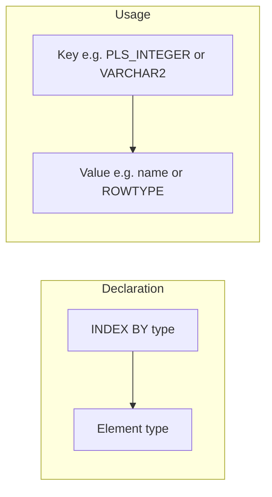
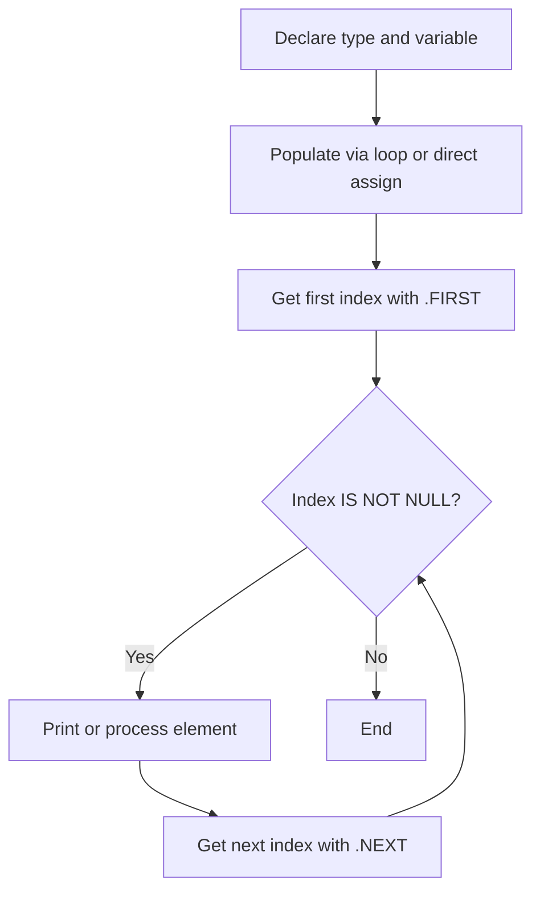

# Oracle PL/SQL: Associative Arrays

## Index

- [Overview](#overview)
- [Structure](#structure)
- [Execution flow](#execution-flow)
- [Prerequisites](#prerequisites)
- [Scripts](#scripts)
  - [Associative_array01.sql](#associative_array01sql)
  - [Associative_array02.sql](#associative_array02sql)
  - [Associative_array03.sql](#associative_array03sql)
  - [Associative_array04_employee_rowtype.sql](#associative_array04_employee_rowtypesql)
  - [Associative_array05_employee_explicit_type.sql](#associative_array05_employee_explicit_typesql)
  - [Associative_array06_delete_rows_display_reverse_order.sql](#associative_array06_delete_rows_display_reverse_ordersql)
  - [Associative_array07_insert_record_into_new_table.sql](#associative_array07_insert_record_into_new_tablesql)
- [See also](#see-also)

---

## Overview

An **associative array** (formerly "index-by table") is a PL/SQL collection type that maps a unique key to a value. Keys can be `PLS_INTEGER` or `VARCHAR2`. Elements are accessed by key, not position. Associative arrays are in-memory only (not stored in the database) and are useful for small to medium in-program lookups, caching query results, and building key-value structures.

**When to use:** Lookups by ID or string key, temporary buffers, passing collections between subprograms via parameters.

---

## Structure



## Execution flow



---

## Prerequisites

- Oracle database with HR (or equivalent) schema.
- Table `EMPLOYEES` with columns such as `employee_id`, `first_name`, `last_name`, `email`, `salary`.

**How to run:** In SQL*Plus or SQLcl, run `SET SERVEROUTPUT ON` before executing the block so `DBMS_OUTPUT` is visible.

---

## Scripts

### Associative_array01.sql

**Purpose:** Associative array indexed by `PLS_INTEGER`, populated from `EMPLOYEES` (IDs 100–110), then iterated with `.FIRST` and `.NEXT`.

**Code:**

```sql
declare
    type e_list is table of employees.first_name%type index by pls_integer;
    emps e_list;
    idx pls_integer;
begin
    for x in 100..110 loop
        select first_name into emps(x) from employees where employee_id = x;
    end loop;
    idx := emps.first;
    while idx is not null loop
        dbms_output.put_line(emps(idx));
        idx := emps.next(idx);
    end loop;
end;
```

**Example output:**

```
Steven
Neena
Lex
Alexander
Bruce
David
Valli
Diana
...
```

(One first name per line for employee_id 100 through 110.)

---

### Associative_array02.sql

**Purpose:** Direct assignment into an associative array (no query); keys 100 and 120; iteration with `.FIRST` and `.NEXT`.

**Code:**

```sql
declare
    type e_list is table of employees.first_name%type index by pls_integer;
    emps e_list;
    idx pls_integer;
begin
    emps(100) := 'Bob';
    emps(120) := 'Sue';
    idx := emps.first;
    while idx is not null loop
        dbms_output.put_line(emps(idx));
        idx := emps.next(idx);
    end loop;
end;
```

**Example output:**

```
Bob
Sue
```

---

### Associative_array03.sql

**Purpose:** Associative array indexed by **email** (`VARCHAR2`); key is email, value is first name; shows string indexing.

**Code:**

```sql
declare
    type e_list is table of employees.first_name%type index by employees.email%type;
    emps e_list;
    idx employees.email%type;
    v_email employees.email%type;
    v_first_name employees.first_name%type;
begin
    for x in 100..110 loop
        select first_name, email into v_first_name, v_email from employees where employee_id = x;
        emps(v_email) := v_first_name;
    end loop;
    idx := emps.first;
    while idx is not null loop
        dbms_output.put_line('The email of ' || emps(idx) || ' is : ' || idx);
        idx := emps.next(idx);
    end loop;
end;
```

**Example output:**

```
The email of Steven is : SKING
The email of Neena is : NKOCHHAR
...
```

---

### Associative_array04_employee_rowtype.sql

**Purpose:** Associative array of `employees%ROWTYPE` indexed by email; full row per element.

**Code:** See [Associative_array04_employee_rowtype.sql](../Associative_array04_employee_rowtype.sql). The script selects each row into a variable `v_row` and uses `emps(v_row.email) := v_row` so the index type matches (email).

**Example output:**

```
The email of Steven King is : SKING
The email of Neena Kochhar is : NKOCHHAR
...
```

---

### Associative_array05_employee_explicit_type.sql

**Purpose:** Same idea as 04 but element type is an explicit RECORD (first_name, last_name, email) indexed by email.

**Code:** See [Associative_array05_employee_explicit_type.sql](../Associative_array05_employee_explicit_type.sql). The script uses a variable `v_row` of type `e_type` and assigns with `emps(v_row.email) := v_row`.

**Example output:** Same style as 04: "The email of &lt;first_name&gt; &lt;last_name&gt; is : &lt;email&gt;".

---

### Associative_array06_delete_rows_display_reverse_order.sql

**Purpose:** Demonstrates `.LAST`, `.PRIOR`, and `.DELETE` on an associative array (explicit record type, indexed by email). Populates by email key, prints ascending then descending, then deletes four entries by email key and prints again.

**Code:** See [Associative_array06_delete_rows_display_reverse_order.sql](../Associative_array06_delete_rows_display_reverse_order.sql). Delete uses email keys (e.g. first four emails collected during the first loop).

**Example output (conceptual):**

```
----------- Ascending order Before Deleting -----------
The email of Steven King is : SKING
...
----------- Descending order Before Deleting -----------
...
----------- After Deleting -----------
...
```

---

### Associative_array07_insert_record_into_new_table.sql

**Purpose:** Uses an associative array of `employees_salary_history%ROWTYPE` (indexed by `PLS_INTEGER`) to bulk rows, increase salary by 20%, and insert into `employees_salary_history`. Requires table created as in the script.

**Code:** See `Associative_array07_insert_record_into_new_table.sql` (includes `CREATE TABLE` and `ALTER TABLE`).

**Example output:**

```
The employee Steven is inserted into the history table
The employee Neena is inserted into the history table
...
```

---

## See also

- [Cursors](Cursors.md) — row-by-row processing.
- [Composite Datatypes](Composite_Datatypes.md) — records and nested structures.
- [Collections In Tables](Collections_In_Tables.md) — nested tables and storing collections in the database.
