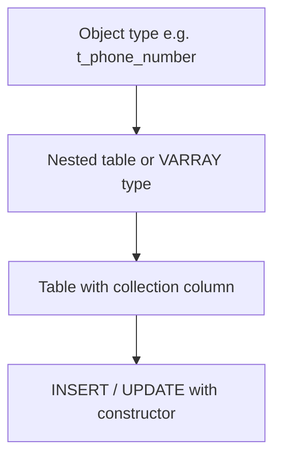

# Oracle PL/SQL: Nested Tables and Collections in Tables

## Index

- [Overview](#overview)
- [Structure](#structure)
- [Prerequisites](#prerequisites)
- [Scripts](#scripts)
  - [table_example1_hardcoded_value.sql](#table_example1_hardcoded_valuesql)
  - [table_example2_databaseread.sql](#table_example2_databasereadsql)
  - [table_example3_database_remove.sql](#table_example3_database_removesql)
  - [storing_collections_in_tables.sql](#storing_collections_in_tablessql)
  - [stroing_collection_in_nested_table.sql](#stroing_collection_in_nested_tablesql)
  - [storing_collections_in_tables_script2.sql](#storing_collections_in_tables_script2sql)
- [See also](#see-also)

---

## Overview

**Nested tables** and **varrays** can be stored as columns in database tables. You define the collection type with `CREATE TYPE`, then use it in a table definition. Nested tables use `NESTED TABLE ... STORE AS`; varrays are stored inline or in a LOB. Scripts in this topic use both in-PL/SQL collections (table of varchar2) and database types (object + table/varray) in tables.

**When to use:** One-to-many data in a single row (e.g. phone numbers per employee), flexible or bounded lists in the database.

---

## Structure



---

## Prerequisites

- `CREATE TYPE` privilege; for scripts using `employees`: HR schema. Scripts that reference `emps_with_phones2` require running the type and table creation from `storing_collections_in_tables.sql` or `stroing_collection_in_nested_table.sql` first.

**How to run:** Run CREATE TYPE and CREATE TABLE scripts first; then run DML and anonymous blocks. `SET SERVEROUTPUT ON` where applicable.

---

## Scripts

### table_example1_hardcoded_value.sql

**Purpose:** PL/SQL nested table (not in DB): `table of varchar2(50)`; initialize with constructor, EXTEND, assign fourth element, loop and print.

**Code:** `emps := e_list('Alex', 'Bruce', 'John'); emps.extend; emps(4) := 'Bob';` then loop by count().

**Example output:**

```
Alex
Bruce
John
Bob
```

---

### table_example2_databaseread.sql

**Purpose:** Same type of nested table; empty constructor, extend in loop and select first_name from `employees` (100–110) into each element; print.

**Example output:** First names for employee_id 100 through 110.

---

### table_example3_database_remove.sql

**Purpose:** Same as 02 plus DELETE(3) to remove one element; print count and then iterate with EXISTS(i) to skip gaps.

**Example output:** Count 10; names for existing indices (3 missing).

---

### storing_collections_in_tables.sql

**Purpose:** Create object type `t_phone_number`, varray type `v_phone_numbers`, table `emps_with_phones` with varray column; INSERT rows with constructor; query using TABLE() to unnest.

**Code:** CREATE TYPEs, CREATE TABLE, INSERTs, and `SELECT e.first_name, e.last_name, p.p_type, p.p_number FROM emps_with_phones e, TABLE(e.phone_number) p`.

**Example output (query):** Rows like Alex, Brown, HOME, 1111111; Alex, Brown, WORK, 2222222; etc.

---

### stroing_collection_in_nested_table.sql

**Purpose:** Object type `t_phone_number`, **nested table** type `n_phone_numbers`, table `emps_with_phones2` with `NESTED TABLE phone_number STORE AS phone_numbers_table`; INSERT/UPDATE; SELECT with TABLE().

**Example output:** Similar to varray version but nested table allows more than 3 phones per row.

---

### storing_collections_in_tables_script2.sql

**Purpose:** Read nested table column from `emps_with_phones2` into a PL/SQL variable, EXTEND, add a new element (FAX), UPDATE the column back.

**Code:** SELECT phone_number INTO variable; variable.EXTEND; variable(5) := t_phone_number('FAX', '9999999'); UPDATE ... SET phone_number = variable.

**Example output:** No DBMS_OUTPUT; table updated so employee 11 has an extra phone (FAX).

---

## See also

- [Varrays](Varrays.md) — varray definition and in-PL/SQL usage.
- [Associative Arrays](Associative_Arrays.md) — in-memory key-value collection.
- [Composite Datatypes](Composite_Datatypes.md) — records and ROWTYPE.
