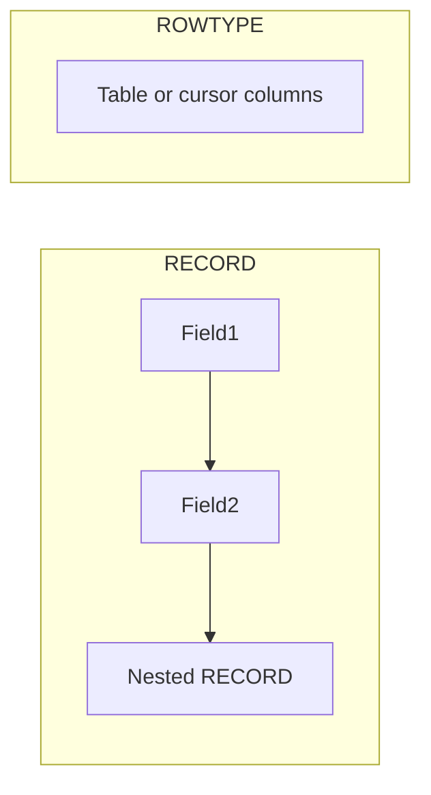

# Oracle PL/SQL: Composite Datatypes

## Index

- [Overview](#overview)
- [Structure](#structure)
- [Prerequisites](#prerequisites)
- [Scripts](#scripts)
  - [composite_datatype1.sql](#composite_datatype1sql)
  - [composite_dateype2.sql](#composite_dateype2sql)
  - [composite_datatype3.sql](#composite_datatype3sql)
  - [composite_dateype4.sql](#composite_dateype4sql)
- [See also](#see-also)

---

## Overview

**Composite datatypes** group related data into a single unit. The main kinds are **RECORD** (one row of fields) and **%ROWTYPE** (a record that matches a table or cursor row). Records can contain scalars, other records, and nested structures.

**When to use:** Hold a row from a SELECT, pass multiple values as one parameter, or structure in-memory data (e.g. employee + department + education).

---

## Structure



---

## Prerequisites

- HR schema: `EMPLOYEES`, `DEPARTMENTS`.

**How to run:** `SET SERVEROUTPUT ON` before running blocks.

---

## Scripts

### composite_datatype1.sql

**Purpose:** Use `employees%ROWTYPE` to select a full row, print fields, then change salary in memory and print again (no UPDATE).

**Code:** Select into `r_emp`, print first_name, last_name, salary, hire_date; set `r_emp.salary := 20000` and print again.

**Example output:**

```
Neena Kochhar earns 17000 and hired at : 21-SEP-89
Neena Kochhar earns 20000 and hired at : 21-SEP-89
```

---

### composite_dateype2.sql

**Purpose:** User-defined RECORD type `t_emp` (first_name, last_name, salary, hire_date); assign values manually and print. `last_name` is left NULL.

**Example output:**

```
Alex  earns 20000 and hired at : 01-JAN-20
```

---

### composite_datatype3.sql

**Purpose:** Same RECORD type as 02; select one row from `employees` (employee_id 101) into the record and print.

**Example output:** One line with that employee's first_name, last_name, salary, hire_date.

---

### composite_dateype4.sql

**Purpose:** Nested records: `t_edu` (schools, university, graduate date) and `t_emp` containing `education t_edu` and `department departments%ROWTYPE`. Select employee 146 into record, select department into `r_emp.department`, set education fields, then print.

**Example output:**

```
John Russell earns ... and hired at : ...
She graduated from Oxford at 01-JAN-13
Her department name is : Sales
```

---

## See also

- [Associative Arrays](Associative_Arrays.md) — collections of scalar or record types.
- [Cursors](Cursors.md) — cursor%ROWTYPE for fetch.
- [DML And Records](DML_And_Records.md) — INSERT/UPDATE with records.
