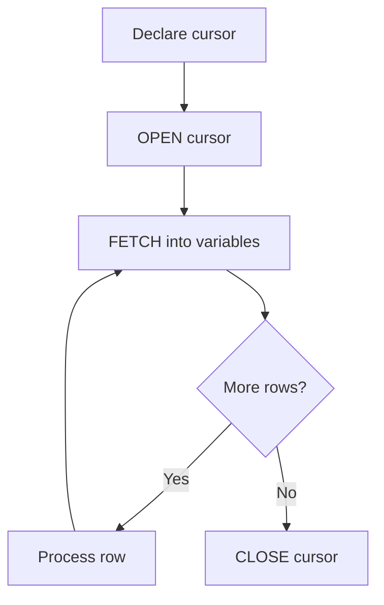

# Oracle PL/SQL: Cursors

## Index

- [Overview](#overview)
- [Cursor lifecycle](#cursor-lifecycle)
- [Prerequisites](#prerequisites)
- [Scripts](#scripts)
  - [cursor_01.sql](#cursor_01sql)
  - [cursor_with_normal_loop_01.sql](#cursor_with_normal_loop_01sql)
  - [cursor_with_while_loop_02.sql](#cursor_with_while_loop_02sql)
  - [cursor_with_for_in_loop_03.sql](#cursor_with_for_in_loop_03sql)
  - [cursor_with_for_in_select_loop_04.sql](#cursor_with_for_in_select_loop_04sql)
  - [Cursor_with_parameter_01.sql](#cursor_with_parameter_01sql)
  - [cursor_with_input_parameter_02.sql](#cursor_with_input_parameter_02sql)
  - [cursor_with_multiple_input_parameter_example_03.sql](#cursor_with_multiple_input_parameter_example_03sql)
  - [cursor_with_records_02.sql](#cursor_with_records_02sql)
  - [cursor_rowtype_03.sql](#cursor_rowtype_03sql)
  - [cursor_table_rowtype_03.sql](#cursor_table_rowtype_03sql)
  - [cursor_attributes.sql](#cursor_attributessql)
- [See also](#see-also)

---

## Overview

A **cursor** is a pointer to a result set of a query. PL/SQL uses cursors to process rows one at a time. You declare a cursor, open it, fetch rows (into variables or records), and close it. Cursors can be parameterized and support attributes such as `%NOTFOUND`, `%FOUND`, `%ROWCOUNT`, and `%ISOPEN`.

**When to use:** Row-by-row processing, updates/deletes with `WHERE CURRENT OF`, or when you need explicit control over the fetch loop.

---

## Cursor lifecycle



---

## Prerequisites

- Oracle database with HR schema: `EMPLOYEES`, `DEPARTMENTS` (and optionally `employees_copy` for some scripts).

**How to run:** `SET SERVEROUTPUT ON` in SQL*Plus/SQLcl before running blocks that use `DBMS_OUTPUT`.

---

## Scripts

### cursor_01.sql

**Purpose:** Basic cursor: open, fetch one row, print, close.

**Code:**

```sql
declare
    cursor c_emps is select first_name, last_name, department_name
      from employees join departments using (department_id)
      where department_id between 30 and 60;
    v_first_name employees.first_name%type;
    v_last_name employees.last_name%type;
    v_department_name departments.department_name%type;
begin
    open c_emps;
    fetch c_emps into v_first_name, v_last_name, v_department_name;
    dbms_output.put_line(v_first_name || ' ' || v_last_name || ' in the department of ' || v_department_name);
    close c_emps;
end;
```

**Example output:**

```
Alexander Hunold in the department of IT
```

(Only the first row of the result set is printed.)

---

### cursor_with_normal_loop_01.sql

**Purpose:** Process all rows with a simple LOOP; exit when `%NOTFOUND`.

**Code:** Cursor on `employees` where `department_id = 30`; fetch into `c_emps%ROWTYPE`; loop until `c_emps%NOTFOUND`.

**Example output:**

```
114 Den Raphaely
115 Alexander Khoo
116 Shelli Baida
...
```

---

### cursor_with_while_loop_02.sql

**Purpose:** Same result set as 01 but using a WHILE loop with `%FOUND` and fetch at start of loop.

**Example output:** Same as 01 (one line per employee in department 30).

---

### cursor_with_for_in_loop_03.sql

**Purpose:** Cursor FOR loop — no explicit OPEN/FETCH/CLOSE; loop variable holds the row.

**Code:**

```sql
declare
    cursor c_emps is select * from employees where department_id = 30;
begin
    for emp in c_emps loop
        dbms_output.put_line(emp.employee_id || ' ' || emp.first_name || ' ' || emp.last_name);
    end loop;
end;
```

**Example output:** Same as 01/02 (employee_id, first_name, last_name per line).

---

### cursor_with_for_in_select_loop_04.sql

**Purpose:** Inline cursor — FOR loop over a SELECT without declaring a named cursor.

**Code:**

```sql
begin
    for emp in (select * from employees where department_id = 30) loop
        dbms_output.put_line(emp.employee_id || ' ' || emp.first_name || ' ' || emp.last_name);
    end loop;
end;
```

**Example output:** Same as 03.

---

### Cursor_with_parameter_01.sql

**Purpose:** Parameterized cursor; open with `OPEN c_emps(20)` and process department 20.

**Code:** Cursor `c_emps(p_dept_id number)`; open with literal 20; loop and print first_name, last_name.

**Example output:**

```
The employees in department of Marketing are :
Michael Hartstein
Pat Fay
```

---

### cursor_with_input_parameter_02.sql

**Purpose:** Same as 01 but uses bind variables `:b_dept_id` and `:b_dept_id2` when opening the cursor (e.g. from SQL*Plus or a client).

**Example output:** Depends on bind variable values; format same as 01.

---

### cursor_with_multiple_input_parameter_example_03.sql

**Purpose:** Cursor with two parameters: department ID and job_id; open with `c_emps(50, 'ST_MAN')` and `c_emps(80, 'SA_MAN')`.

**Example output:**

```
Alexander Hunold
...
-----
John Russell
...
```

---

### cursor_with_records_02.sql

**Purpose:** Fetch into a user-defined RECORD type (fields match cursor columns).

**Code:** Type `r_emp` with `v_first_name`, `v_last_name`; cursor selects first_name, last_name; fetch into `v_emp` of type `r_emp`.

**Example output:** First row only, e.g. `Ellen Abel`.

---

### cursor_rowtype_03.sql

**Purpose:** Fetch into a variable declared as `c_emps%ROWTYPE`; access columns by name (e.g. `v_emp.first_name`).

**Example output:** First employee row, e.g. `Ellen Abel`.

---

### cursor_table_rowtype_03.sql

**Purpose:** Fetch into `employees%ROWTYPE`; only first_name and last_name are selected, so only those fields are populated.

**Example output:** Same style as cursor_rowtype_03.

---

### cursor_attributes.sql

**Purpose:** Demonstrates `%ISOPEN`, `%ROWCOUNT`; fetches rows and exits after 5 rows or when no more data.

**Code:** Opens cursor, checks `%ISOPEN`, fetches and prints `%ROWCOUNT` and row data; second loop limits to 5 rows with `c_emps%rowcount > 5`.

**Example output:**

```
hello
0
1
1
2
1  David Austin
2  Valli Pataballa
...
```

---

## See also

- [Associative Arrays](Associative_Arrays.md) — in-memory collections.
- [Procedures](Procedures.md) — procedures that may use cursors (e.g. INCREASE_SALARIES).
- [Composite Datatypes](Composite_Datatypes.md) — records and types used with cursors.
