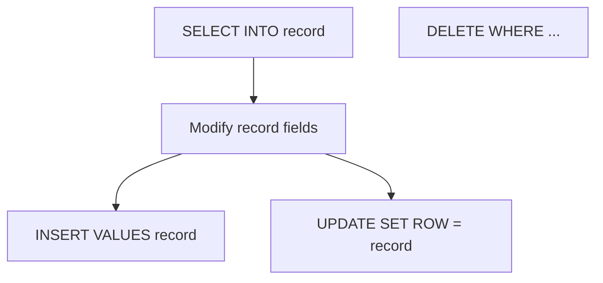

# Oracle PL/SQL: DML and Records

## Index

- [Overview](#overview)
- [Structure](#structure)
- [Prerequisites](#prerequisites)
- [Scripts](#scripts)
  - [dml_operations.sql](#dml_operationssql)
  - [dml_with_records.sql](#dml_with_recordssql)
  - [select_database_sql.sql](#select_database_sqlsql)
- [See also](#see-also)

---

## Overview

**DML** (INSERT, UPDATE, DELETE) can be executed from PL/SQL. You can use record variables with `INSERT ... VALUES record`, `UPDATE ... SET ROW = record`, and select into a record then modify and write back. This topic covers scripts that perform DML and use records with the database.

**When to use:** Bulk or row-by-row updates, copying rows between tables, maintaining history or copy tables.

---

## Structure



---

## Prerequisites

- HR schema: `EMPLOYEES`. For scripts that modify data: `employees_copy`, `retired_employees` (create as needed, e.g. `CREATE TABLE ... AS SELECT * FROM employees WHERE 1=2`).

**How to run:** `SET SERVEROUTPUT ON` when using `DBMS_OUTPUT`. Ensure target tables exist and you have INSERT/UPDATE/DELETE privileges.

---

## Scripts

### dml_operations.sql

**Purpose:** Loop over employee_id 217..226 and DELETE from `employees_copy` (INSERT/UPDATE are commented out). Demonstrates running DML in a loop.

**Code:** CREATE TABLE employees_copy AS SELECT * FROM employees; block with FOR i IN 217..226 LOOP ... DELETE FROM employees_copy WHERE employee_id = i; END LOOP; then SELECT * FROM employees_copy.

**Example output:** Deleted rows; query shows remaining rows in employees_copy.

---

### dml_with_records.sql

**Purpose:** Insert a full row from `employees` (employee_id 104) into `retired_employees` using a record; then set salary and commission to 10 and 0, insert again, and UPDATE retired_employees SET ROW = record.

**Code:** Select into `r_emp`, INSERT INTO retired_employees VALUES r_emp; modify r_emp; INSERT again; UPDATE retired_employees SET ROW = r_emp WHERE employee_id = 104.

**Example output:** Two rows inserted for 104 (first full copy, second with modified salary/commission); then one row updated. Table state depends on order of operations.

---

### select_database_sql.sql

**Purpose:** Simple SELECT INTO two variables (concatenated name, salary) and print. No DML; demonstrates reading from the database.

**Code:** SELECT first_name || ' ' || last_name, salary INTO v_name, v_salary FROM employees WHERE employee_id = 110; then DBMS_OUTPUT.

**Example output:**

```
The salary of John Chen is : 8200
```

(Note: original has typo `first_name || ' ' last_name` — missing comma; correct is `first_name || ' ' || last_name` for concatenation.)

---

## See also

- [Composite Datatypes](Composite_Datatypes.md) — %ROWTYPE and RECORD.
- [Sequences](Sequences.md) — generating IDs for INSERT.
- [Procedures](Procedures.md) — procedures that perform DML.
- [Associative Arrays](Associative_Arrays.md) — e.g. Associative_array07 inserts from a collection.
