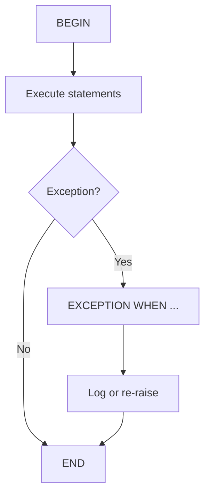

# Oracle PL/SQL: Exceptions

## Index

- [Overview](#overview)
- [Exception flow](#exception-flow)
- [Prerequisites](#prerequisites)
- [Scripts](#scripts)
  - [exceptions.sql](#exceptionssql)
  - [exception_non_predefined.sql](#exception_non_predefinedsql)
- [See also](#see-also)

---

## Overview

**Exceptions** handle run-time errors in PL/SQL. You can catch predefined exceptions (`NO_DATA_FOUND`, `TOO_MANY_ROWS`, etc.), define your own exception names and tie them to error codes with `PRAGMA EXCEPTION_INIT`, or use `WHEN OTHERS` for any unexpected error. `SQLCODE` and `SQLERRM` provide the error code and message.

**When to use:** Validate data, avoid unhandled errors, and return clear messages to the caller.

---

## Exception flow



---

## Prerequisites

- Table `EMPLOYEES` (and optionally `employees_copy` for update examples).

**How to run:** `SET SERVEROUTPUT ON` before running blocks so `DBMS_OUTPUT` is visible.

---

## Scripts

### exceptions.sql

**Purpose:** Nested blocks and multiple exception handlers: inner block catches `TOO_MANY_ROWS` and sets a placeholder; outer block catches `NO_DATA_FOUND`, `TOO_MANY_ROWS`, and `OTHERS` and prints messages plus `SQLCODE`/`SQLERRM` where relevant.

**Code:**

```sql
declare
    v_name varchar2(100);
    v_department_name varchar2(100);
begin
    select first_name into v_name from employees where employee_id = 105;
    begin
        select department_id into v_department_name from employees where first_name = v_name;
    exception
        when too_many_rows then
            v_department_name := 'Error in department name';
    end;
    dbms_output.put_line('Hello ' || v_name || ' . Your department id is : ' || v_department_name);
exception
    when no_data_found then
        dbms_output.put_line('There is no employee with the selected id');
    when too_many_rows then
        dbms_output.put_line('There are more than one employee with the name ' || v_name);
        dbms_output.put_line(sqlcode || ' --> ' || sqlerrm);
    when others then
        dbms_output.put_line('An unexpected error happened. Connect with the programmer');
        dbms_output.put_line(sqlcode || ' --> ' || sqlerrm);
end;
```

**Example output:** If employee 105 exists and multiple rows have that first name, inner block sets `v_department_name` to 'Error in department name'; then outer prints e.g. `Hello David . Your department id is : Error in department name`. If no employee with id 105: `There is no employee with the selected id`.

---

### exception_non_predefined.sql

**Purpose:** User-defined exception name tied to ORA-01407 (cannot update to NULL) via `PRAGMA EXCEPTION_INIT`; procedure attempts to set `email = null` and catches the named exception.

**Code:**

```sql
declare
    cannot_update_to_null exception;
    pragma exception_init(cannot_update_to_null, -01407);
begin
    update employees_copy set email = null where employee_id = 100;
exception
    when cannot_update_to_null then
        dbms_output.put_line('You cannot update with a null value!');
end;
```

**Example output:**

```
You cannot update with a null value!
```

---

## See also

- [Procedures](Procedures.md) — procedures often include exception handlers.
- [Cursors](Cursors.md) — cursor loops and exception handling.
