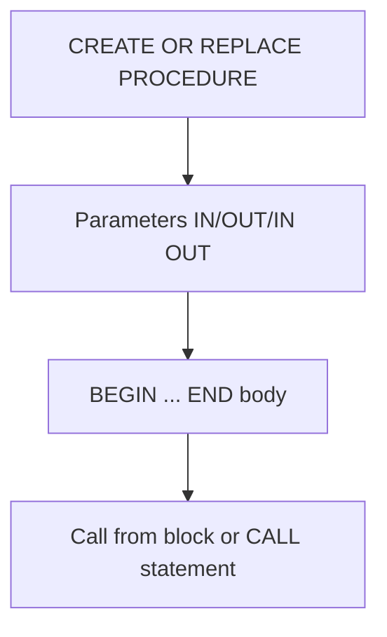

# Oracle PL/SQL: Procedures

## Index

- [Overview](#overview)
- [Procedure flow](#procedure-flow)
- [Prerequisites](#prerequisites)
- [Scripts](#scripts)
  - [procedure_01.sql (INCREASE_SALARIES)](#procedure_01sql-increase_salaries)
  - [procedure_02_new_line.sql](#procedure_02_new_linesql)
  - [INCREASE_SALARIES2.sql](#increase_salaries2sql)
  - [call_proceedure.sql](#call_proceeduresql)
- [See also](#see-also)

---

## Overview

A **procedure** is a named PL/SQL block stored in the database. It can take parameters (IN, OUT, IN OUT) and contain SQL and procedural logic. Procedures are invoked with `CALL` or from anonymous blocks.

**When to use:** Reusable logic, batch updates, operations that need to be called from multiple sessions or applications.

---

## Procedure flow



---

## Prerequisites

- Table `employees_copy` (copy of `EMPLOYEES`) for procedures that update salaries. Create with:
  `CREATE TABLE employees_copy AS SELECT * FROM employees;`

**How to run:** Compile the procedure with the script, then run an anonymous block or `CALL` that invokes it. Use `SET SERVEROUTPUT ON` for `DBMS_OUTPUT`.

---

## Scripts

### procedure_01.sql (INCREASE_SALARIES)

**Purpose:** Procedure with no parameters; cursor on `employees_copy` with `FOR UPDATE`; increases salary by 10% plus commission and updates each row with `WHERE CURRENT OF`.

**Code:**

```sql
create or replace procedure INCREASE_SALARIES as
    cursor c_emps is select * from employees_copy for update;
    v_salary_increase pls_integer := 1.10;
    v_old_salary pls_integer;
begin
    for r_emp in c_emps loop
        v_old_salary := r_emp.salary;
        r_emp.salary := r_emp.salary * v_salary_increase + r_emp.salary * nvl(r_emp.commission_pct, 0);
        update employees_copy set row = r_emp where current of c_emps;
        dbms_output.put_line('The salary of : ' || r_emp.employee_id || ' is increased from ' ||
            v_old_salary || ' to ' || r_emp.salary);
    end loop;
end;
```

**Example output:** One line per employee, e.g.:
```
The salary of : 100 is increased from 24000 to 26400
...
```

---

### procedure_02_new_line.sql

**Purpose:** Empty package placeholder (no public members). No executable logic.

---

### INCREASE_SALARIES2.sql

**Purpose:** Parameterized procedure: salary increase factor and department ID; updates only `employees_copy` rows in that department. Cursor uses `FOR UPDATE` and `WHERE CURRENT OF`.

**Code:** `INCREASE_SALARIES2(v_salary_increase IN number, v_department_id pls_integer)`. Cursor uses `v_department_id` to filter by department.

**Example output:**

```
The salary of : 114 is increased from ... to ...
...
PROCEDURE FINISHED EXECUTING!...
```

---

### call_proceedure.sql

**Purpose:** Anonymous block that calls a procedure `INCREASE_SALARIES3(v_sal_inc, 90, v_aff_emp_count)` with IN and OUT parameters. Prints affected count and average increase.

**Note:** `INCREASE_SALARIES3` is not provided in the listed scripts; ensure it exists in your schema or adapt to call `INCREASE_SALARIES`/`INCREASE_SALARIES2`.

**Example output (conceptual):**

```
SALARY INCREASE STARTED..
The affected employee count is : ...
The average salary increase is : 1.2 percent
SALARY INCREASE FINISHED..
```

---

## See also

- [Cursors](Cursors.md) — used inside procedures for row-by-row processing.
- [Exceptions](Exceptions.md) — error handling in procedures.
