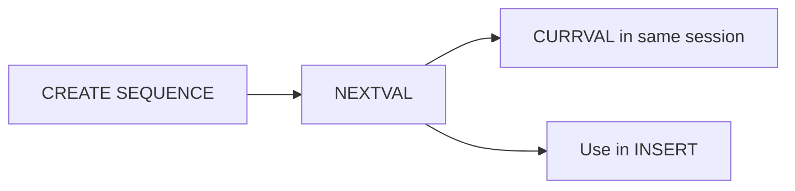

# Oracle PL/SQL: Sequences

## Index

- [Overview](#overview)
- [Structure](#structure)
- [Prerequisites](#prerequisites)
- [Scripts](#scripts)
  - [sequence1.sql](#sequence1sql)
  - [sequence2.sql](#sequence2sql)
- [See also](#see-also)

---

## Overview

A **sequence** is a database object that generates unique integers, typically for primary keys. You use `sequence_name.NEXTVAL` to get the next value and optionally `CURRVAL` in the same session after NEXTVAL.

**When to use:** Auto-generated IDs for INSERT, surrogate keys, unique ticket numbers.

---

## Structure



---

## Prerequisites

- Privilege to create sequences and to select from them. Scripts that insert into `employees_copy` assume that table exists (e.g. `CREATE TABLE employees_copy AS SELECT * FROM employees`).

**How to run:** Run CREATE SEQUENCE once; then use the sequence in PL/SQL or SQL.

---

## Scripts

### sequence1.sql

**Purpose:** Create sequence `employee_id_seq` starting at 207, increment 1.

**Code:**

```sql
create sequence employee_id_seq
start with 207
increment by 1;
```

**Example output:** Sequence created.

---

### sequence2.sql

**Purpose:** Create `employees_copy`, then loop 1..10 and INSERT rows using `employee_id_seq.NEXTVAL` for employee_id and for part of the name. Demonstrates using a sequence in PL/SQL.

**Code:** Inserts into employees_copy with nextval for employee_id and 'employee#' || employee_id_seq.nextval (note: each nextval advances, so name and id may not match). Then SELECT * FROM employees_copy.

**Example output (query):** New rows in employees_copy with IDs from the sequence and names like employee#207, etc.

---

## See also

- [DML And Records](DML_And_Records.md) — INSERT/UPDATE/DELETE in PL/SQL.
- [Procedures](Procedures.md) — procedures that may use sequences.
