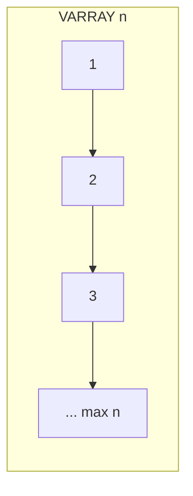

# Oracle PL/SQL: Varrays

## Index

- [Overview](#overview)
- [Structure](#structure)
- [Prerequisites](#prerequisites)
- [Scripts](#scripts)
  - [varray1.sql](#varray1sql)
  - [varray2.sql](#varray2sql)
  - [varray3_create_or_update_type.sql](#varray3_create_or_update_typesql)
- [See also](#see-also)

---

## Overview

A **VARRAY** (variable-size array) is a collection type with a maximum size. Elements are ordered and accessed by index (1 to N). Varrays can be defined in PL/SQL only or created as a database type and stored in table columns.

**When to use:** Fixed or bounded lists (e.g. up to 5 phone types), when order matters and size is limited.

---

## Structure



---

## Prerequisites

- For database varray type: `CREATE TYPE` privileges. For scripts that query `employees`: HR schema.

**How to run:** `SET SERVEROUTPUT ON` for blocks that use `DBMS_OUTPUT`.

---

## Scripts

### varray1.sql

**Purpose:** PL/SQL-only varray of up to 5 varchar2(50); constructor initializes 4 names; iterate with EXISTS, COUNT, FIRST/LAST, and LIMIT.

**Code:**

```sql
declare
    type e_list is varray(5) of varchar2(50);
    employees e_list;
begin
    employees := e_list('Alex', 'Bruce', 'John', 'Bob');
    -- loops using exists(i), count(), first()..last(), limit()
end;
```

**Example output:**

```
Display Employee Data using index and exist()
Alex
Bruce
...
Display Employee Data using with count()
...
employees limit using limit()5
```

---

### varray2.sql

**Purpose:** Varray(15) populated from `employees` (IDs 100–110) using EXTEND and a loop; then print by index 1..count().

**Example output:** One first name per line for employees 100–110.

---

### varray3_create_or_update_type.sql

**Purpose:** Create or replace a **database** type `e_list` as VARRAY(20) of VARCHAR2(100); drop type and run anonymous block that uses the type (same pattern as varray2). Shows creating/changing the type at schema level.

**Note:** Script contains CREATE/REPLACE TYPE, DROP TYPE, and block; run parts as needed. DROP TYPE fails if type is in use.

**Example output:** Same as varray2 (first names 100–110).

---

## See also

- [Associative Arrays](Associative_Arrays.md) — key-based, no fixed limit.
- [Collections In Tables](Collections_In_Tables.md) — nested tables and varrays in table columns.
