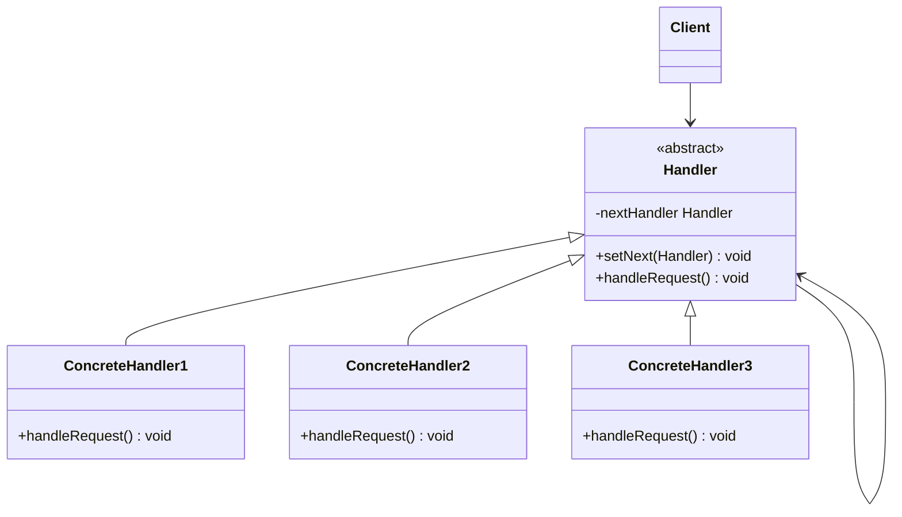
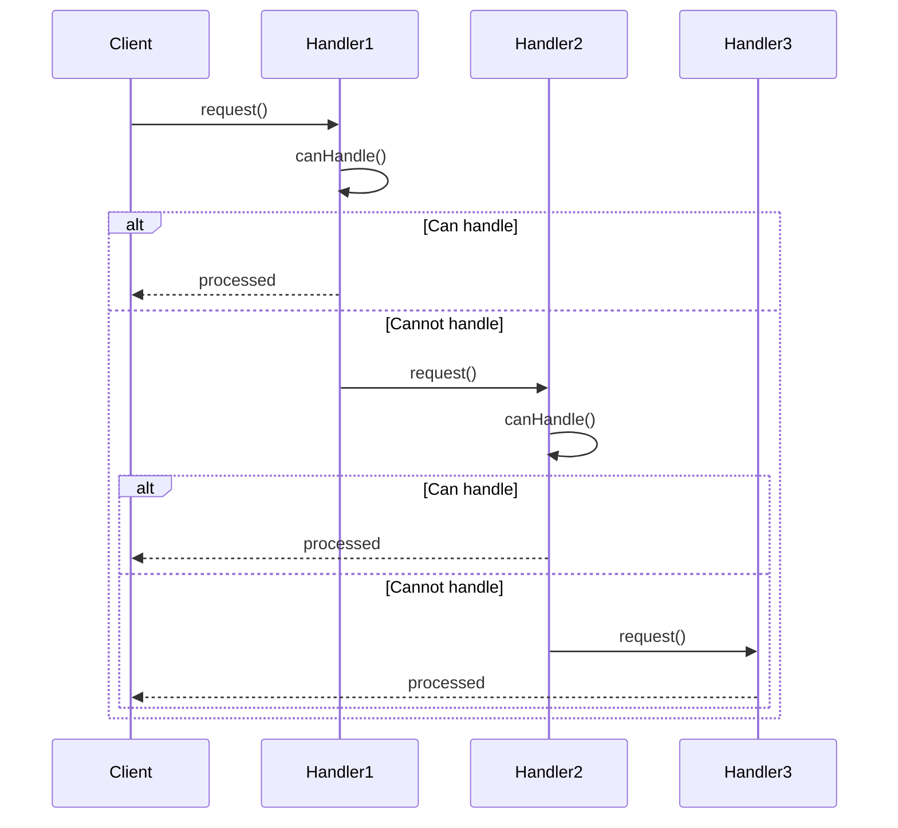
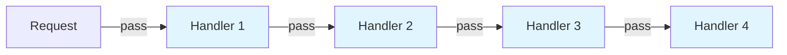

# Chain of Responsibility Pattern

## Overview

## Diagram Images


The Chain of Responsibility pattern passes a request along a chain of handlers. Upon receiving a request, each handler decides either to process the request or to pass it to the next handler in the chain.

## Intent

- Avoid coupling sender and receiver
- Allow multiple objects to handle a request
- Build a chain of handler objects
- Dynamic chain composition

## Type

**Behavioral Pattern** - Manages request handling through a chain.

## Problem

You want to issue a request to one of several handler objects without explicitly specifying which one. You want multiple objects to have a chance to handle the request.

## Solution

Create a chain of handler objects. Each handler checks if it can handle the request. If not, it passes the request to the next handler in the chain.

## UML Class Diagram



## Sequence Diagram



## Structure

### Components

1. **Handler** - Defines an interface for handling requests, optionally implements successor link
2. **ConcreteHandler** - Handles requests it's responsible for, can access its successor
3. **Client** - Initiates request to first handler in chain

## When to Use

- More than one object may handle a request
- Handler set is specified dynamically
- Want to issue request without specifying receiver explicitly
- Avoid coupling sender and receiver

## Examples in This Repository

### Example 1: Logger Chain
- **Handler**: `Logger` abstract class
- **ConcreteHandlers**: `ConsoleLogger`, `FileLogger`, `ErrorLogger`
- **Use Case**: Different loggers handle different log levels in a chain

### Example 2: Approval Chain
- **Handler**: `ApprovalHandler` abstract class
- **ConcreteHandlers**: `Manager`, `Director`, `CEO`
- **Use Case**: Different management levels approve different amounts

## System Architecture



## Pros

- **Decoupling**: Decouples sender and receiver
- **Dynamic Composition**: Can add/remove handlers at runtime
- **Flexibility**: Can change chain structure dynamically
- **Single Responsibility**: Each handler handles one type of request

## Cons

- **No Guarantee**: Request might not be handled
- **Performance**: May traverse entire chain
- **Debugging**: Hard to debug request flow

## Real-World Applications

- **Event Handling**: GUI event propagation
- **Exception Handling**: Exception handling chains
- **Middleware**: Web framework middleware chains
- **Approval Workflows**: Multi-level approval systems

## Code Example

```java
// Handler
public abstract class Logger {
    protected Logger nextLogger;
    
    public void setNextLogger(Logger nextLogger) {
        this.nextLogger = nextLogger;
    }
    
    public void logMessage(int level, String message) {
        if (this.level <= level) {
            write(message);
        }
        if (nextLogger != null) {
            nextLogger.logMessage(level, message);
        }
    }
    
    protected abstract void write(String message);
}
```

## Source Code

### `ApprovalHandler.java`

```java
package com.cursor.designpatterns.behavioral.chainofresponsibility;

/**
 * Approval Handler abstract class (Handler for second example).
 * 
 * @author Design Patterns
 * @version 1.0
 * @since 1.0
 */
public abstract class ApprovalHandler {
    
    protected ApprovalHandler nextHandler;
    
    /**
     * Sets the next handler in the chain.
     * 
     * @param handler the next handler
     */
    public void setNext(ApprovalHandler handler) {
        this.nextHandler = handler;
    }
    
    /**
     * Processes the approval request.
     * 
     * @param amount the amount to approve
     */
    public abstract void handleRequest(double amount);
}
```

### `CEO.java`

```java
package com.cursor.designpatterns.behavioral.chainofresponsibility;

/**
 * CEO approval handler (Concrete Handler for second example).
 * 
 * @author Design Patterns
 * @version 1.0
 * @since 1.0
 */
public class CEO extends ApprovalHandler {
    
    @Override
    public void handleRequest(double amount) {
        System.out.println("CEO approved: $" + amount);
    }
}
```

### `ChainOfResponsibilityDemo.java`

```java
package com.cursor.designpatterns.behavioral.chainofresponsibility;

/**
 * Demo class to demonstrate Chain of Responsibility pattern.
 * 
 * <p>This demo shows two examples:</p>
 * <ol>
 *   <li>Logger Chain - Different loggers handling different log levels</li>
 *   <li>Approval Chain - Different levels of management approving requests</li>
 * </ol>
 * 
 * <p><strong>Chain of Responsibility Pattern Benefits:</strong></p>
 * <ul>
 *   <li>Decouples senders and receivers</li>
 *   <li>Allows dynamic chain composition</li>
 *   <li>Gives multiple objects a chance to handle a request</li>
 * </ul>
 * 
 * @author Design Patterns
 * @version 1.0
 * @since 1.0
 */
public class ChainOfResponsibilityDemo {
    
    private static Logger getChainOfLoggers() {
        Logger errorLogger = new ErrorLogger(Logger.ERROR);
        Logger fileLogger = new FileLogger(Logger.DEBUG);
        Logger consoleLogger = new ConsoleLogger(Logger.INFO);
        
        errorLogger.setNextLogger(fileLogger);
        fileLogger.setNextLogger(consoleLogger);
        
        return errorLogger;
    }
    
    public static void main(String[] args) {
        System.out.println("=== Chain of Responsibility Pattern Demo ===\n");
        
        // Example 1: Logger Chain
        System.out.println("Example 1: Logger Chain");
        System.out.println("------------------------");
        
        Logger loggerChain = getChainOfLoggers();
        
        loggerChain.logMessage(Logger.INFO, "This is an information.");
        System.out.println();
        
        loggerChain.logMessage(Logger.DEBUG, "This is a debug level information.");
        System.out.println();
        
        loggerChain.logMessage(Logger.ERROR, "This is an error information.");
        System.out.println();
        
        // Example 2: Approval Chain
        System.out.println("Example 2: Approval Chain");
        System.out.println("--------------------------");
        
        ApprovalHandler manager = new Manager();
        ApprovalHandler director = new Director();
        ApprovalHandler ceo = new CEO();
        
        manager.setNext(director);
        director.setNext(ceo);
        
        manager.handleRequest(500);
        System.out.println();
        
        manager.handleRequest(2500);
        System.out.println();
        
        manager.handleRequest(10000);
    }
}
```

### `ConsoleLogger.java`

```java
package com.cursor.designpatterns.behavioral.chainofresponsibility;

/**
 * Console Logger (Concrete Handler).
 * 
 * @author Design Patterns
 * @version 1.0
 * @since 1.0
 */
public class ConsoleLogger extends Logger {
    
    public ConsoleLogger(int level) {
        this.level = level;
    }
    
    @Override
    protected void write(String message) {
        System.out.println("Console Logger: " + message);
    }
}
```

### `Director.java`

```java
package com.cursor.designpatterns.behavioral.chainofresponsibility;

/**
 * Director approval handler (Concrete Handler for second example).
 * 
 * @author Design Patterns
 * @version 1.0
 * @since 1.0
 */
public class Director extends ApprovalHandler {
    
    private static final double MAX_AMOUNT = 5000.0;
    
    @Override
    public void handleRequest(double amount) {
        if (amount <= MAX_AMOUNT) {
            System.out.println("Director approved: $" + amount);
        } else if (nextHandler != null) {
            System.out.println("Director cannot approve $" + amount + ", forwarding to next level");
            nextHandler.handleRequest(amount);
        } else {
            System.out.println("No one can approve: $" + amount);
        }
    }
}
```

### `ErrorLogger.java`

```java
package com.cursor.designpatterns.behavioral.chainofresponsibility;

/**
 * Error Logger (Concrete Handler).
 * 
 * @author Design Patterns
 * @version 1.0
 * @since 1.0
 */
public class ErrorLogger extends Logger {
    
    public ErrorLogger(int level) {
        this.level = level;
    }
    
    @Override
    protected void write(String message) {
        System.err.println("Error Logger: " + message);
    }
}
```

### `FileLogger.java`

```java
package com.cursor.designpatterns.behavioral.chainofresponsibility;

/**
 * File Logger (Concrete Handler).
 * 
 * @author Design Patterns
 * @version 1.0
 * @since 1.0
 */
public class FileLogger extends Logger {
    
    public FileLogger(int level) {
        this.level = level;
    }
    
    @Override
    protected void write(String message) {
        System.out.println("File Logger: " + message);
    }
}
```

### `Logger.java`

```java
package com.cursor.designpatterns.behavioral.chainofresponsibility;

/**
 * Abstract Logger class (Handler in Chain of Responsibility pattern).
 * 
 * <p>The Chain of Responsibility pattern passes a request along a chain of handlers.
 * Each handler decides either to process the request or pass it to the next handler.</p>
 * 
 * @author Design Patterns
 * @version 1.0
 * @since 1.0
 */
public abstract class Logger {
    
    public static int INFO = 1;
    public static int DEBUG = 2;
    public static int ERROR = 3;
    
    protected int level;
    protected Logger nextLogger;
    
    /**
     * Sets the next logger in the chain.
     * 
     * @param nextLogger the next logger
     */
    public void setNextLogger(Logger nextLogger) {
        this.nextLogger = nextLogger;
    }
    
    /**
     * Logs a message if the level matches, otherwise passes to next logger.
     * 
     * @param level the log level
     * @param message the message to log
     */
    public void logMessage(int level, String message) {
        if (this.level <= level) {
            write(message);
        }
        if (nextLogger != null) {
            nextLogger.logMessage(level, message);
        }
    }
    
    /**
     * Writes the log message (to be implemented by subclasses).
     * 
     * @param message the message to write
     */
    protected abstract void write(String message);
}
```

### `Manager.java`

```java
package com.cursor.designpatterns.behavioral.chainofresponsibility;

/**
 * Manager approval handler (Concrete Handler for second example).
 * 
 * @author Design Patterns
 * @version 1.0
 * @since 1.0
 */
public class Manager extends ApprovalHandler {
    
    private static final double MAX_AMOUNT = 1000.0;
    
    @Override
    public void handleRequest(double amount) {
        if (amount <= MAX_AMOUNT) {
            System.out.println("Manager approved: $" + amount);
        } else if (nextHandler != null) {
            System.out.println("Manager cannot approve $" + amount + ", forwarding to next level");
            nextHandler.handleRequest(amount);
        } else {
            System.out.println("No one can approve: $" + amount);
        }
    }
}
```
