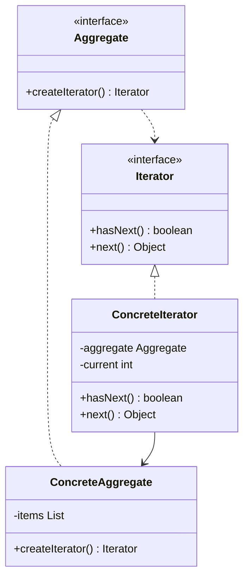
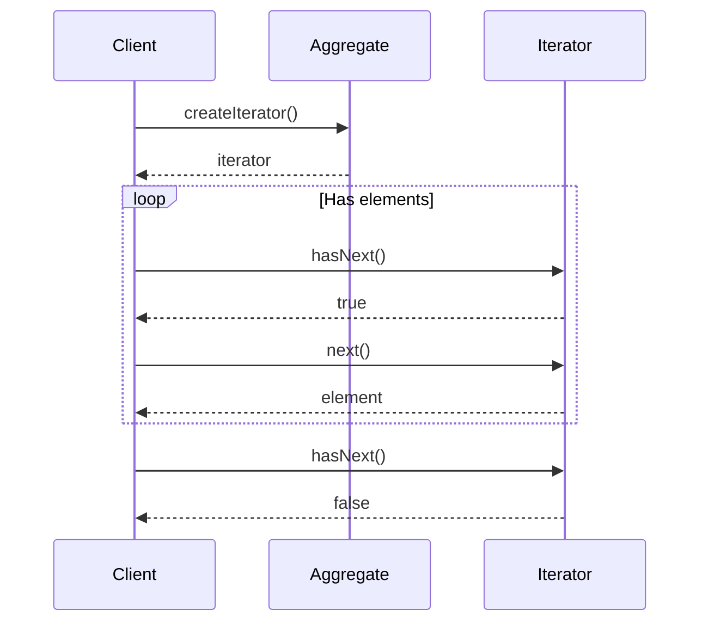

# Iterator Pattern

## Overview

## Diagram Images


The Iterator pattern provides a way to access elements of an aggregate object sequentially without exposing its underlying representation.

## Intent

- Provide sequential access to elements
- Hide underlying representation
- Support multiple traversal methods
- Uniform traversal interface

## Type

**Behavioral Pattern** - Provides traversal mechanism.

## Problem

You need to access elements of a collection without knowing its internal structure. Different collections may have different ways of storing and accessing elements.

## Solution

Encapsulate traversal logic in an iterator object. The iterator provides a uniform interface for accessing elements regardless of collection type.

## UML Class Diagram



## Sequence Diagram



## When to Use

- Access aggregate object contents without exposing representation
- Support multiple traversals of aggregates
- Provide uniform interface for traversing different aggregates

## Examples in This Repository

### Name Repository Iterator
- **Aggregate**: `NameRepository` (container)
- **Iterator**: `NameIterator` (internal class)
- **Use Case**: Iterating through names without exposing internal array structure

## Pros

- **Uniform Interface**: Provides uniform way to traverse collections
- **Multiple Traversals**: Supports multiple simultaneous traversals
- **Encapsulation**: Hides internal structure
- **Flexibility**: Easy to add new traversal methods

## Cons

- **Complexity**: Adds complexity for simple collections
- **Performance**: May have slight overhead
- **Limited Access**: Only sequential access

## Code Example

```java
// Iterator Interface
public interface Iterator<T> {
    boolean hasNext();
    T next();
}

// Aggregate
public interface Container<T> {
    Iterator<T> getIterator();
}

// Concrete Aggregate
public class NameRepository implements Container<String> {
    private String[] names = {"Robert", "John", "Julie"};
    
    @Override
    public Iterator<String> getIterator() {
        return new NameIterator();
    }
    
    private class NameIterator implements Iterator<String> {
        private int index;
        
        @Override
        public boolean hasNext() {
            return index < names.length;
        }
        
        @Override
        public String next() {
            if (hasNext()) {
                return names[index++];
            }
            return null;
        }
    }
}
```

## Source Code

### `Container.java`

```java
package com.cursor.designpatterns.behavioral.iterator;

/**
 * Container interface (Aggregate).
 * 
 * @param <T> the type of elements
 * @author Design Patterns
 * @version 1.0
 * @since 1.0
 */
public interface Container<T> {
    
    /**
     * Returns an iterator for this container.
     * 
     * @return an iterator
     */
    Iterator<T> getIterator();
}
```

### `Iterator.java`

```java
package com.cursor.designpatterns.behavioral.iterator;

/**
 * Iterator interface.
 * 
 * <p>The Iterator pattern provides a way to access elements of an aggregate
 * object sequentially without exposing its underlying representation.</p>
 * 
 * @param <T> the type of elements
 * @author Design Patterns
 * @version 1.0
 * @since 1.0
 */
public interface Iterator<T> {
    
    /**
     * Checks if there are more elements.
     * 
     * @return true if there are more elements
     */
    boolean hasNext();
    
    /**
     * Returns the next element.
     * 
     * @return the next element
     */
    T next();
}
```

### `IteratorDemo.java`

```java
package com.cursor.designpatterns.behavioral.iterator;

/**
 * Demo class to demonstrate Iterator pattern.
 * 
 * <p><strong>Iterator Pattern Benefits:</strong></p>
 * <ul>
 *   <li>Provides a uniform way to traverse different collections</li>
 *   <li>Hides the underlying implementation</li>
 *   <li>Supports multiple traversals simultaneously</li>
 * </ul>
 * 
 * @author Design Patterns
 * @version 1.0
 * @since 1.0
 */
public class IteratorDemo {
    
    public static void main(String[] args) {
        System.out.println("=== Iterator Pattern Demo ===\n");
        
        NameRepository namesRepository = new NameRepository();
        
        Iterator<String> iterator = namesRepository.getIterator();
        while (iterator.hasNext()) {
            String name = iterator.next();
            System.out.println("Name: " + name);
        }
    }
}
```

### `NameRepository.java`

```java
package com.cursor.designpatterns.behavioral.iterator;

/**
 * Name Repository (Concrete Aggregate).
 * 
 * @author Design Patterns
 * @version 1.0
 * @since 1.0
 */
public class NameRepository implements Container<String> {
    
    private String[] names = {"Robert", "John", "Julie", "Lora"};
    
    @Override
    public Iterator<String> getIterator() {
        return new NameIterator();
    }
    
    private class NameIterator implements Iterator<String> {
        private int index;
        
        @Override
        public boolean hasNext() {
            return index < names.length;
        }
        
        @Override
        public String next() {
            if (this.hasNext()) {
                return names[index++];
            }
            return null;
        }
    }
}
```
