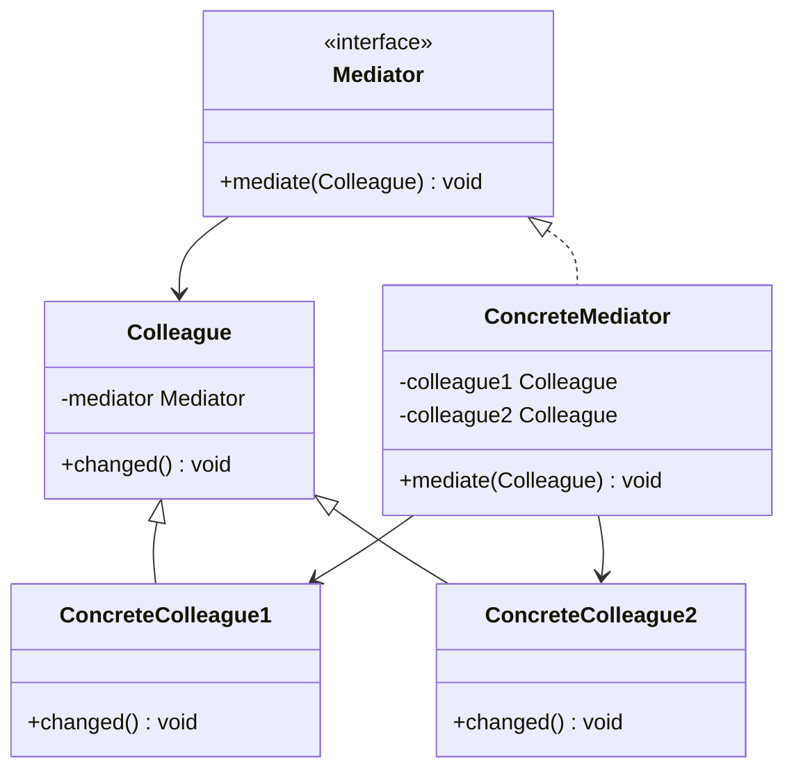
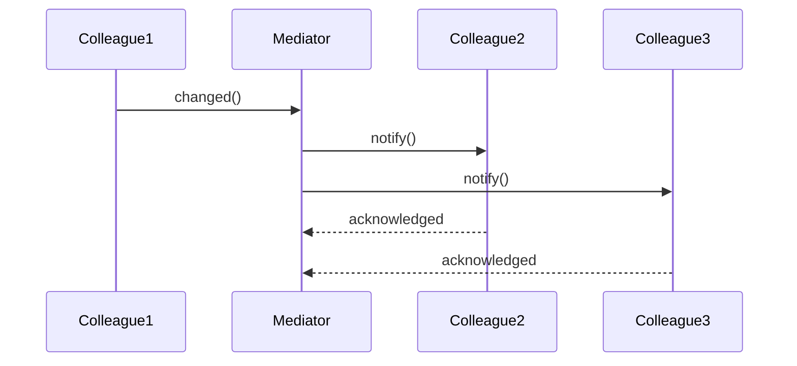

# Mediator Pattern

## Overview

## Diagram Images


The Mediator pattern defines an object that encapsulates how a set of objects interact. Mediator promotes loose coupling by keeping objects from referring to each other explicitly.

## Intent

- Define how objects interact
- Encapsulate object interactions
- Promote loose coupling
- Centralize communication logic

## Type

**Behavioral Pattern** - Manages object interactions.

## Problem

When objects communicate directly, they become tightly coupled. Changing one object may require changing many others. The communication logic becomes scattered.

## Solution

Introduce a mediator object that encapsulates how objects interact. Objects communicate through the mediator instead of directly with each other.

## UML Class Diagram



## Sequence Diagram



## When to Use

- Set of objects communicate in complex ways
- Reusing objects is difficult due to tight coupling
- Behavior distributed across classes should be customizable

## Examples in This Repository

### Chat Room Mediator
- **Mediator**: `ChatMediator` interface
- **ConcreteMediator**: `ChatMediatorImpl`
- **Colleagues**: `ChatUser` objects
- **Use Case**: Users communicate through chat room mediator

## Pros

- **Loose Coupling**: Reduces coupling between objects
- **Centralized Control**: Centralizes interaction logic
- **Reusability**: Makes objects more reusable
- **Simplifies Communication**: Simplifies many-to-many communication

## Cons

- **Mediator Complexity**: Mediator can become complex
- **God Object**: Risk of creating a god object
- **Performance**: May impact performance with many objects

## Code Example

```java
// Mediator
public interface ChatMediator {
    void sendMessage(String message, User user);
    void addUser(User user);
}

// Concrete Mediator
public class ChatMediatorImpl implements ChatMediator {
    private List<User> users;
    
    @Override
    public void sendMessage(String message, User user) {
        for (User u : users) {
            if (u != user) {
                u.receive(message);
            }
        }
    }
}

// Colleague
public abstract class User {
    protected ChatMediator mediator;
    
    public void send(String message) {
        mediator.sendMessage(message, this);
    }
    
    public abstract void receive(String message);
}
```

## Source Code

### `ChatMediator.java`

```java
package com.cursor.designpatterns.behavioral.mediator;

/**
 * Chat Mediator interface.
 * 
 * <p>The Mediator pattern defines an object that encapsulates how a set of
 * objects interact. It promotes loose coupling by keeping objects from referring
 * to each other explicitly.</p>
 * 
 * @author Design Patterns
 * @version 1.0
 * @since 1.0
 */
public interface ChatMediator {
    
    /**
     * Sends a message.
     * 
     * @param message the message to send
     * @param user the user sending the message
     */
    void sendMessage(String message, User user);
    
    /**
     * Adds a user to the chat.
     * 
     * @param user the user to add
     */
    void addUser(User user);
}
```

### `ChatMediatorImpl.java`

```java
package com.cursor.designpatterns.behavioral.mediator;

import java.util.ArrayList;
import java.util.List;

/**
 * Chat Mediator Implementation (Concrete Mediator).
 * 
 * @author Design Patterns
 * @version 1.0
 * @since 1.0
 */
public class ChatMediatorImpl implements ChatMediator {
    
    private List<User> users;
    
    public ChatMediatorImpl() {
        this.users = new ArrayList<>();
    }
    
    @Override
    public void addUser(User user) {
        this.users.add(user);
    }
    
    @Override
    public void sendMessage(String message, User user) {
        for (User u : users) {
            if (u != user) {
                u.receive(message);
            }
        }
    }
}
```

### `ChatUser.java`

```java
package com.cursor.designpatterns.behavioral.mediator;

/**
 * Chat User (Concrete Colleague).
 * 
 * @author Design Patterns
 * @version 1.0
 * @since 1.0
 */
public class ChatUser extends User {
    
    public ChatUser(ChatMediator mediator, String name) {
        super(mediator, name);
    }
    
    @Override
    public void send(String message) {
        System.out.println(this.name + " sends: " + message);
        mediator.sendMessage(message, this);
    }
    
    @Override
    public void receive(String message) {
        System.out.println(this.name + " receives: " + message);
    }
}
```

### `MediatorDemo.java`

```java
package com.cursor.designpatterns.behavioral.mediator;

/**
 * Demo class to demonstrate Mediator pattern.
 * 
 * <p><strong>Mediator Pattern Benefits:</strong></p>
 * <ul>
 *   <li>Reduces coupling between objects</li>
 *   <li>Centralizes control logic</li>
 *   <li>Makes interaction easier to understand</li>
 * </ul>
 * 
 * @author Design Patterns
 * @version 1.0
 * @since 1.0
 */
public class MediatorDemo {
    
    public static void main(String[] args) {
        System.out.println("=== Mediator Pattern Demo ===\n");
        
        ChatMediator mediator = new ChatMediatorImpl();
        
        User user1 = new ChatUser(mediator, "Alice");
        User user2 = new ChatUser(mediator, "Bob");
        User user3 = new ChatUser(mediator, "Charlie");
        
        mediator.addUser(user1);
        mediator.addUser(user2);
        mediator.addUser(user3);
        
        user1.send("Hi everyone!");
        System.out.println();
        user2.send("Hello!");
    }
}
```

### `User.java`

```java
package com.cursor.designpatterns.behavioral.mediator;

/**
 * User abstract class (Colleague).
 * 
 * @author Design Patterns
 * @version 1.0
 * @since 1.0
 */
public abstract class User {
    
    protected ChatMediator mediator;
    protected String name;
    
    public User(ChatMediator mediator, String name) {
        this.mediator = mediator;
        this.name = name;
    }
    
    public abstract void send(String message);
    public abstract void receive(String message);
    
    public String getName() {
        return name;
    }
}
```
