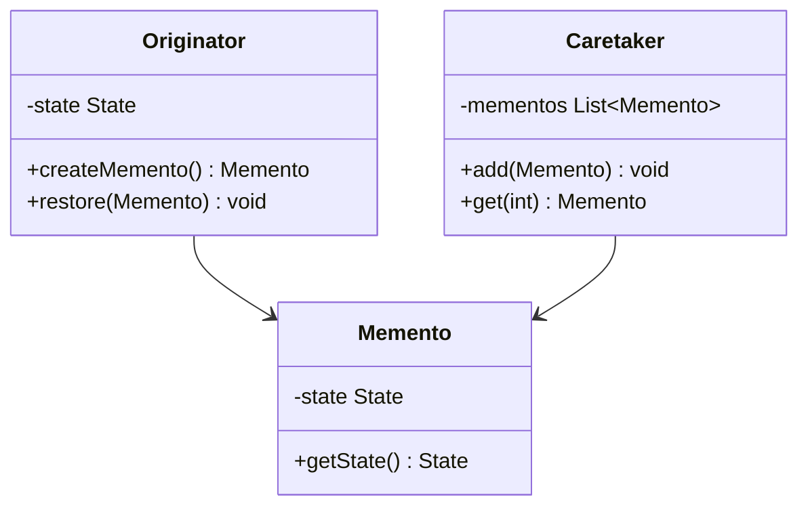
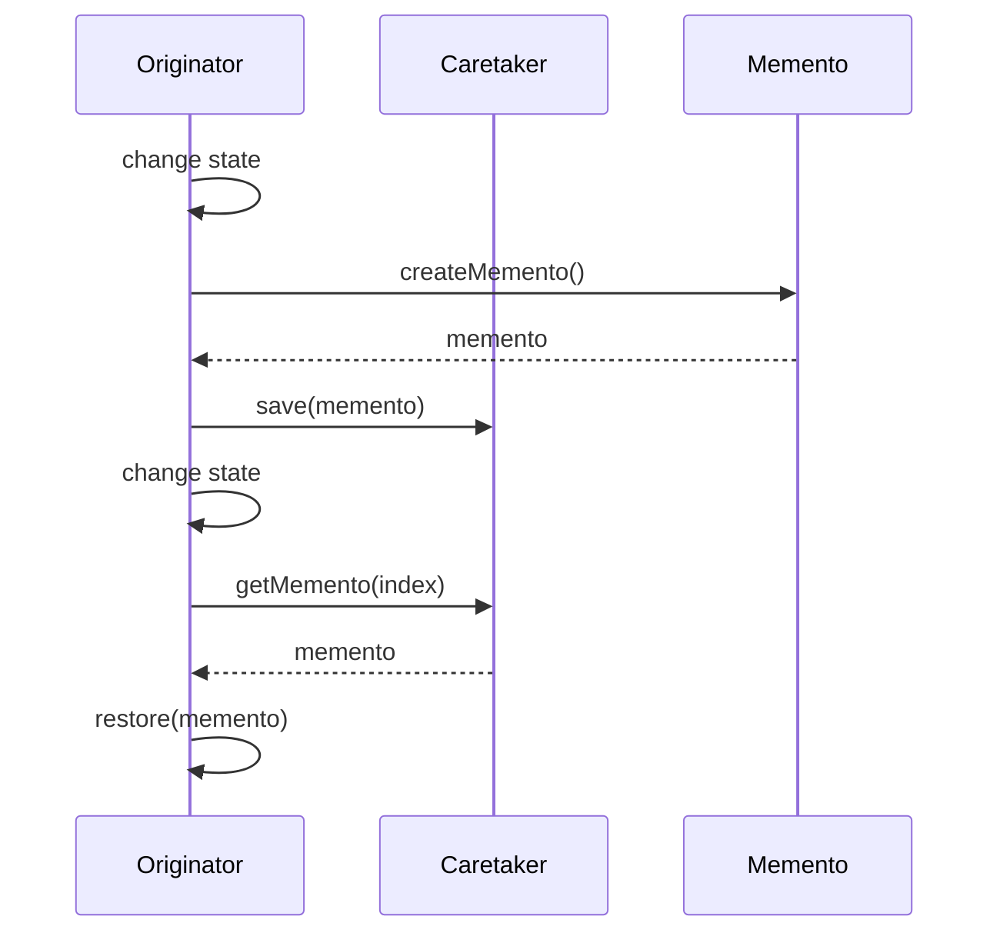

# Memento Pattern

## Overview

## Diagram Images


The Memento pattern captures and externalizes an object's internal state so that it can be restored later, all without violating encapsulation.

## Intent

- Capture object state
- Externalize state for restoration
- Preserve encapsulation
- Support undo/redo functionality

## Type

**Behavioral Pattern** - Manages object state.

## Problem

You need to save and restore an object's state. Direct access to object's internal state would violate encapsulation.

## Solution

Create a memento object that stores the object's state. Only the originator can create and use mementos.

## UML Class Diagram



## Sequence Diagram



## When to Use

- Need to save object state
- Direct state access would violate encapsulation
- Want undo/redo functionality
- Need checkpoint/rollback capability

## Examples in This Repository

### Text Editor Memento
- **Originator**: Document or editor state
- **Memento**: Snapshot of document state
- **Caretaker**: Undo/redo manager
- **Use Case**: Text editor with undo functionality

## Pros

- **Encapsulation**: Preserves encapsulation boundaries
- **Simplifies Originator**: Simplifies originator
- **Undo Support**: Easy to implement undo
- **State Management**: Centralizes state management

## Cons

- **Memory Usage**: Can use significant memory
- **Memento Size**: Large mementos can be expensive
- **Caretaker Overhead**: Caretaker may become complex

## Code Example

```java
// Memento
public class Memento {
    private String state;
    
    public Memento(String state) {
        this.state = state;
    }
    
    public String getState() {
        return state;
    }
}

// Originator
public class Originator {
    private String state;
    
    public Memento saveStateToMemento() {
        return new Memento(state);
    }
    
    public void getStateFromMemento(Memento memento) {
        state = memento.getState();
    }
}

// Caretaker
public class Caretaker {
    private List<Memento> mementoList = new ArrayList<>();
    
    public void add(Memento state) {
        mementoList.add(state);
    }
    
    public Memento get(int index) {
        return mementoList.get(index);
    }
}
```

## Source Code

### `CareTaker.java`

```java
package com.cursor.designpatterns.behavioral.memento;

import java.util.ArrayList;
import java.util.List;

/**
 * CareTaker class.
 * 
 * <p>Manages and stores mementos.</p>
 * 
 * @author Design Patterns
 * @version 1.0
 * @since 1.0
 */
public class CareTaker {
    
    private List<Memento> mementoList = new ArrayList<>();
    
    public void add(Memento state) {
        mementoList.add(state);
    }
    
    public Memento get(int index) {
        return mementoList.get(index);
    }
    
    public int size() {
        return mementoList.size();
    }
}
```

### `Memento.java`

```java
package com.cursor.designpatterns.behavioral.memento;

/**
 * Memento class.
 * 
 * <p>The Memento pattern captures and externalizes an object's internal state
 * so that it can be restored later without violating encapsulation.</p>
 * 
 * @author Design Patterns
 * @version 1.0
 * @since 1.0
 */
public class Memento {
    
    private String state;
    
    public Memento(String state) {
        this.state = state;
    }
    
    public String getState() {
        return state;
    }
}
```

### `MementoDemo.java`

```java
package com.cursor.designpatterns.behavioral.memento;

/**
 * Demo class to demonstrate Memento pattern.
 * 
 * <p><strong>Memento Pattern Benefits:</strong></p>
 * <ul>
 *   <li>Provides undo functionality</li>
 *   <li>Preserves encapsulation</li>
 *   <li>Allows state restoration</li>
 * </ul>
 * 
 * @author Design Patterns
 * @version 1.0
 * @since 1.0
 */
public class MementoDemo {
    
    public static void main(String[] args) {
        System.out.println("=== Memento Pattern Demo ===\n");
        
        Originator originator = new Originator();
        CareTaker careTaker = new CareTaker();
        
        originator.setState("State #1");
        careTaker.add(originator.saveStateToMemento());
        
        originator.setState("State #2");
        careTaker.add(originator.saveStateToMemento());
        
        originator.setState("State #3");
        System.out.println("Current State: " + originator.getState());
        
        originator.getStateFromMemento(careTaker.get(0));
        System.out.println("First saved State: " + originator.getState());
        
        originator.getStateFromMemento(careTaker.get(1));
        System.out.println("Second saved State: " + originator.getState());
    }
}
```

### `Originator.java`

```java
package com.cursor.designpatterns.behavioral.memento;

/**
 * Originator class.
 * 
 * <p>Creates and uses mementos to save and restore its state.</p>
 * 
 * @author Design Patterns
 * @version 1.0
 * @since 1.0
 */
public class Originator {
    
    private String state;
    
    public void setState(String state) {
        System.out.println("Setting state to: " + state);
        this.state = state;
    }
    
    public String getState() {
        return state;
    }
    
    public Memento saveStateToMemento() {
        return new Memento(state);
    }
    
    public void getStateFromMemento(Memento memento) {
        state = memento.getState();
        System.out.println("State restored to: " + state);
    }
}
```
