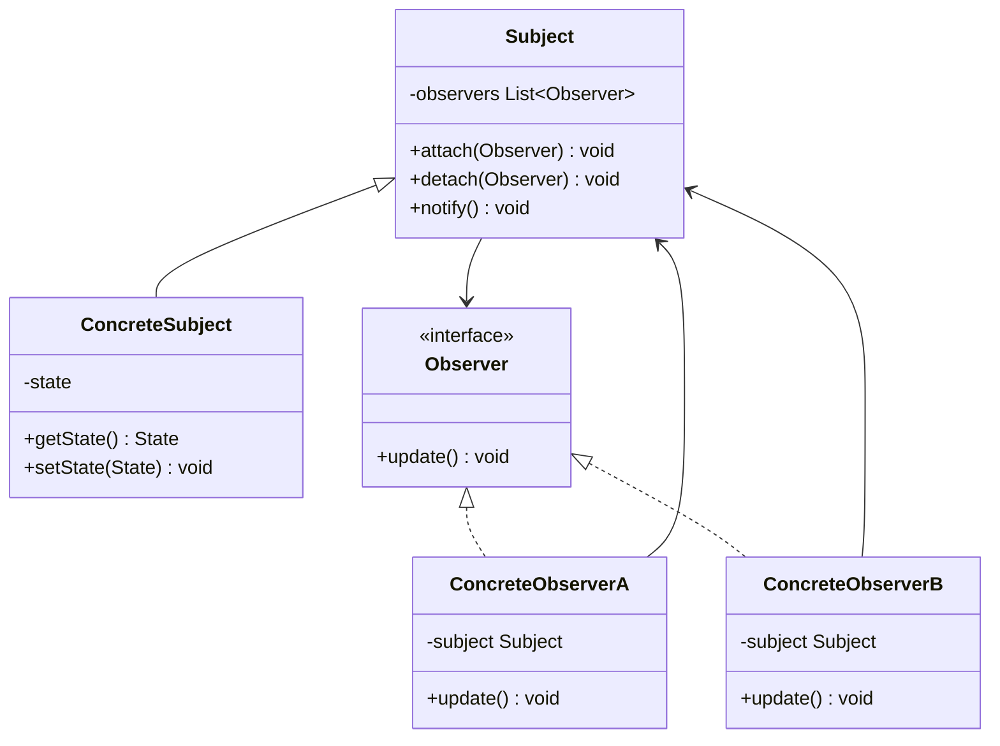
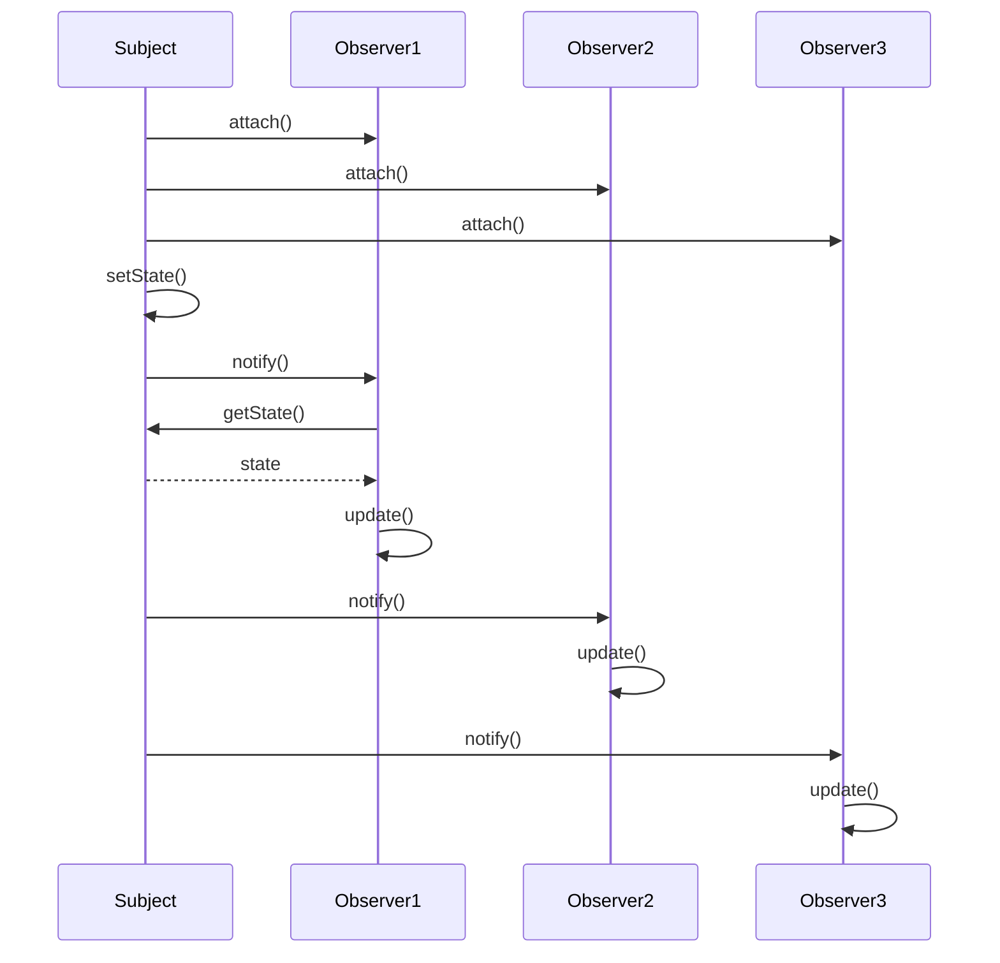
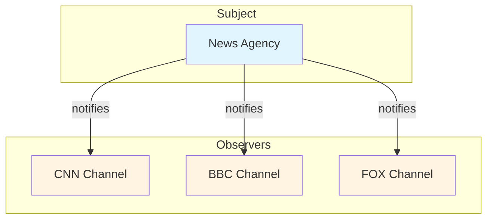

# Observer Pattern

## Overview

## Diagram Images


The Observer pattern defines a one-to-many dependency between objects so that when one object changes state, all its dependents are notified and updated automatically. It's also known as the Publish-Subscribe pattern.

## Intent

- Define a one-to-many dependency between objects
- When one object changes state, all dependents are notified automatically
- Decouple subjects and observers
- Support broadcast communication

## Type

**Behavioral Pattern** - Defines how objects communicate and interact.

## Problem

You have an object (subject) that needs to notify multiple objects (observers) about state changes. You want to maintain loose coupling between the subject and observers.

## Solution

Define a dependency relationship where observers register with the subject and are notified automatically when the subject's state changes.

## UML Class Diagram



## Sequence Diagram



## Structure

### Components

1. **Subject** - Knows its observers and provides an interface for attaching/detaching observers
2. **Observer** - Defines an updating interface for objects that should be notified
3. **ConcreteSubject** - Stores state and notifies observers when state changes
4. **ConcreteObserver** - Maintains reference to subject and implements update interface

## When to Use

- Change to one object requires changing multiple dependent objects
- Object should notify other objects without making assumptions about who those objects are
- Abstraction has two aspects that depend on each other
- You want to reduce coupling between subject and observers

## Examples in This Repository

### Example: News Agency Observer
- **Subject**: `NewsAgency` class
- **Observers**: `NewsChannel` classes (CNN, BBC, FOX)
- **Use Case**: News agency broadcasts news to multiple channels simultaneously

## System Architecture



## Pros

- **Loose Coupling**: Subject and observers are loosely coupled
- **Dynamic Relationships**: Can add/remove observers at runtime
- **Broadcast Communication**: Supports one-to-many communication
- **Open/Closed Principle**: Can add new observers without modifying subject

## Cons

- **Unexpected Updates**: Observers may be notified of changes they don't care about
- **Performance**: Notifying many observers can be expensive
- **Update Order**: No guarantee of update order
- **Circular Dependencies**: Can lead to circular updates

## Real-World Applications

### Software Development
- **Model-View-Controller (MVC)**: Views observe model changes
- **Event Handling**: GUI event listeners
- **Reactive Programming**: Reactive streams and observables
- **Distributed Systems**: Event-driven architectures

### Specific Examples
- **Stock Market**: Stock prices notify multiple subscribers
- **Weather Stations**: Weather data broadcasts to displays
- **UI Frameworks**: Widget updates based on data changes
- **News Feeds**: News updates to subscribers
- **Social Media**: Followers notified of posts

## Related Patterns

- **Mediator**: Encapsulates how objects interact, Observer defines one-to-many dependency
- **Chain of Responsibility**: Passes request along chain, Observer broadcasts to all
- **MVC**: Observer is used in MVC pattern

## Implementation Variations

### Push Model
- Subject sends detailed information to observers
- Observers receive all information whether needed or not

### Pull Model
- Subject sends minimal notification
- Observers query subject for needed information
- More flexible but requires observers to know subject interface

## Code Example

```java
// Observer Interface
public interface Observer {
    void update(String message);
}

// Subject
public class NewsAgency implements Subject {
    private List<Observer> observers = new ArrayList<>();
    private String news;
    
    @Override
    public void attach(Observer observer) {
        observers.add(observer);
    }
    
    @Override
    public void notifyObservers() {
        for (Observer observer : observers) {
            observer.update(news);
        }
    }
    
    public void setNews(String news) {
        this.news = news;
        notifyObservers();
    }
}

// Concrete Observer
public class NewsChannel implements Observer {
    private String name;
    
    @Override
    public void update(String message) {
        System.out.println(name + " received: " + message);
    }
}
```

## Thread Safety Considerations

- **Synchronization**: Need to synchronize observer list modifications
- **Notification Order**: Consider thread-safe notification mechanisms
- **Deadlocks**: Be careful with locks during notification
- **Concurrent Modifications**: Handle concurrent observer list modifications

## Performance Considerations

- **Batch Updates**: Consider batching multiple updates
- **Lazy Updates**: Update observers only when necessary
- **Filtering**: Allow observers to filter relevant updates
- **Async Updates**: Consider asynchronous notifications for better performance

## Source Code

### `NewsAgency.java`

```java
package com.cursor.designpatterns.behavioral.observer;

import java.util.ArrayList;
import java.util.List;

/**
 * News Agency (Concrete Subject).
 * 
 * @author Design Patterns
 * @version 1.0
 * @since 1.0
 */
public class NewsAgency implements Subject {
    
    private List<Observer> observers = new ArrayList<>();
    private String news;
    
    @Override
    public void attach(Observer observer) {
        observers.add(observer);
    }
    
    @Override
    public void detach(Observer observer) {
        observers.remove(observer);
    }
    
    @Override
    public void notifyObservers() {
        for (Observer observer : observers) {
            observer.update(news);
        }
    }
    
    public void setNews(String news) {
        this.news = news;
        notifyObservers();
    }
}
```

### `NewsChannel.java`

```java
package com.cursor.designpatterns.behavioral.observer;

/**
 * News Channel (Concrete Observer).
 * 
 * @author Design Patterns
 * @version 1.0
 * @since 1.0
 */
public class NewsChannel implements Observer {
    
    private String name;
    private String news;
    
    public NewsChannel(String name) {
        this.name = name;
    }
    
    @Override
    public void update(String news) {
        this.news = news;
        System.out.println(name + " received news: " + news);
    }
    
    public String getNews() {
        return news;
    }
}
```

### `Observer.java`

```java
package com.cursor.designpatterns.behavioral.observer;

/**
 * Observer interface.
 * 
 * @author Design Patterns
 * @version 1.0
 * @since 1.0
 */
public interface Observer {
    
    void update(String message);
}
```

### `ObserverDemo.java`

```java
package com.cursor.designpatterns.behavioral.observer;

/**
 * Demo class to demonstrate Observer pattern.
 * 
 * <p><strong>Observer Pattern Benefits:</strong></p>
 * <ul>
 *   <li>Loose coupling between subject and observers</li>
 *   <li>Dynamic relationship between objects</li>
 *   <li>Broadcast communication</li>
 * </ul>
 * 
 * @author Design Patterns
 * @version 1.0
 * @since 1.0
 */
public class ObserverDemo {
    
    public static void main(String[] args) {
        System.out.println("=== Observer Pattern Demo ===\n");
        
        NewsAgency agency = new NewsAgency();
        
        Observer channel1 = new NewsChannel("CNN");
        Observer channel2 = new NewsChannel("BBC");
        Observer channel3 = new NewsChannel("FOX");
        
        agency.attach(channel1);
        agency.attach(channel2);
        agency.attach(channel3);
        
        agency.setNews("Breaking: New design pattern discovered!");
        System.out.println();
        
        agency.detach(channel2);
        agency.setNews("Update: Pattern implementation completed!");
    }
}
```

### `Subject.java`

```java
package com.cursor.designpatterns.behavioral.observer;

/**
 * Subject interface.
 * 
 * <p>The Observer pattern defines a one-to-many dependency between objects so
 * that when one object changes state, all its dependents are notified automatically.</p>
 * 
 * @author Design Patterns
 * @version 1.0
 * @since 1.0
 */
public interface Subject {
    
    void attach(Observer observer);
    void detach(Observer observer);
    void notifyObservers();
}
```
