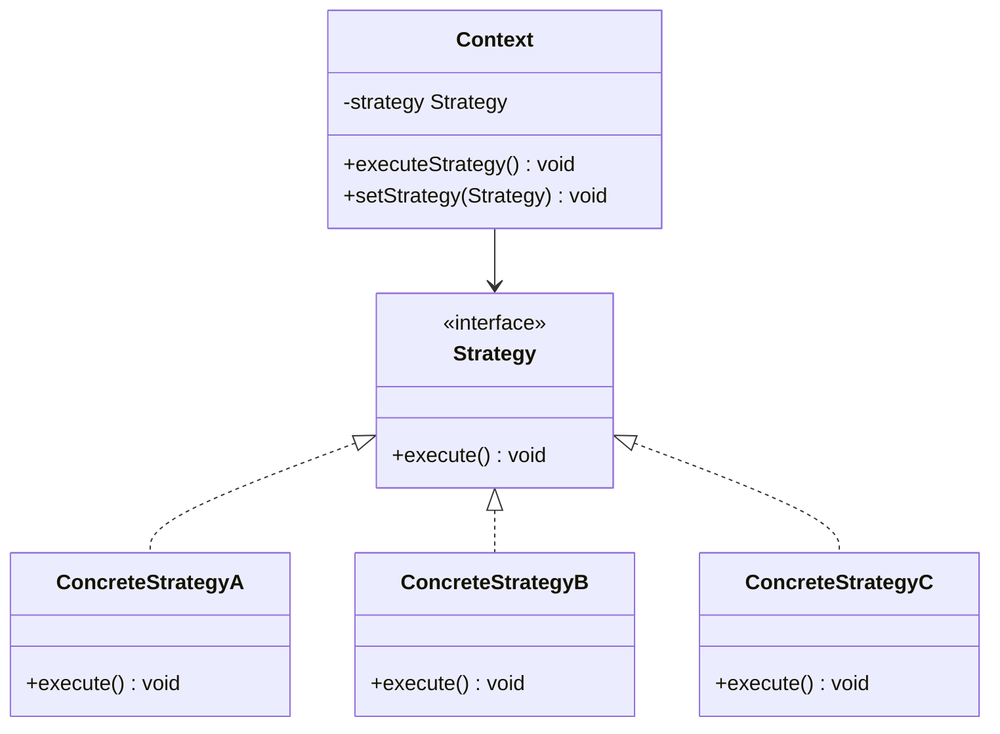
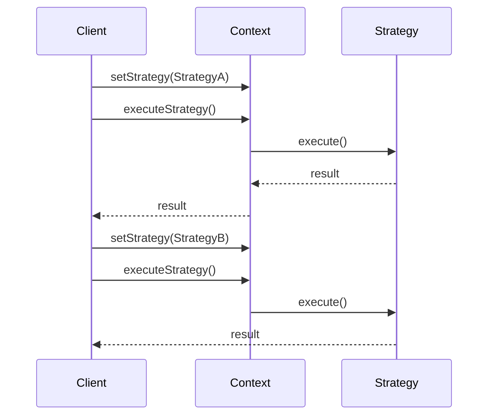
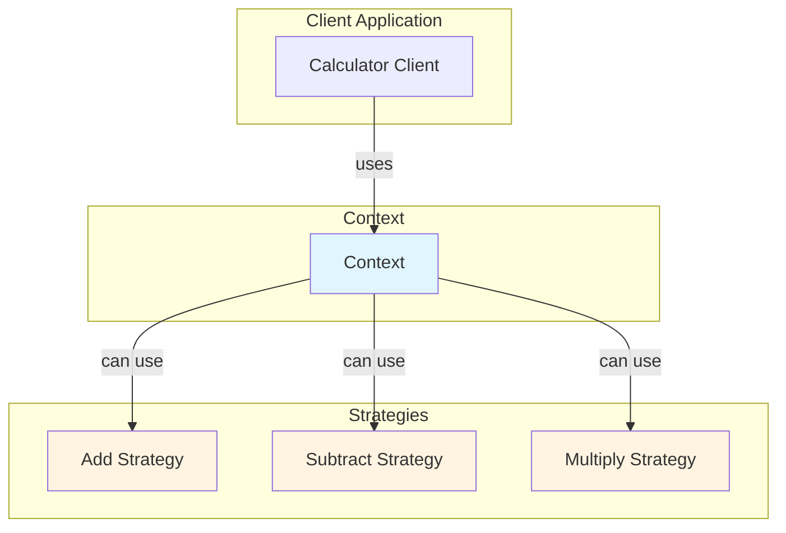

# Strategy Pattern

## Overview

## Diagram Images


The Strategy pattern defines a family of algorithms, encapsulates each one, and makes them interchangeable. Strategy lets the algorithm vary independently from clients that use it.

## Intent

- Define a family of algorithms
- Encapsulate each algorithm
- Make algorithms interchangeable
- Let the algorithm vary independently from clients

## Type

**Behavioral Pattern** - Focuses on algorithms and responsibilities.

## Problem

You have multiple ways to perform a task, and you want to choose the algorithm at runtime. Using conditional statements makes the code complex and harder to maintain.

## Solution

Define each algorithm in a separate class and make them interchangeable through a common interface.

## UML Class Diagram



## Sequence Diagram



## Structure

### Components

1. **Strategy** - Declares an interface common to all supported algorithms
2. **ConcreteStrategy** - Implements the algorithm using the Strategy interface
3. **Context** - Maintains a reference to a Strategy object and uses it to execute the algorithm

## When to Use

- Many related classes differ only in their behavior
- You need different variants of an algorithm
- Algorithm should be selected at runtime
- Avoid exposing algorithm-specific data structures
- Eliminate conditional statements for selecting algorithms

## Examples in This Repository

### Example: Calculation Strategies
- **Strategy**: `Strategy` interface (doOperation method)
- **ConcreteStrategies**: `AddStrategy`, `SubtractStrategy`, `MultiplyStrategy`
- **Context**: `Context` class that uses strategies
- **Use Case**: Different calculation operations that can be swapped at runtime

## System Architecture



## Pros

- **Flexibility**: Easy to add new strategies
- **Eliminates Conditionals**: Removes if-else/switch statements
- **Open/Closed Principle**: Open for extension, closed for modification
- **Testability**: Each strategy can be tested independently
- **Runtime Selection**: Can change algorithm at runtime

## Cons

- **Increased Objects**: Creates more objects
- **Client Awareness**: Client must know about different strategies
- **Communication Overhead**: Strategy interface may not fit all algorithms

## Real-World Applications

### Software Development
- **Sorting Algorithms**: Different sorting strategies (quick sort, merge sort)
- **Payment Processing**: Different payment methods (credit card, PayPal)
- **Compression**: Different compression algorithms (ZIP, RAR)
- **Navigation**: Different route calculation algorithms

### Specific Examples
- **E-commerce**: Different shipping calculation strategies
- **Games**: Different AI behavior strategies
- **Compilers**: Different code generation strategies
- **Validation**: Different validation strategies

## Related Patterns

- **State**: Similar structure but Strategy focuses on algorithms
- **Template Method**: Defines algorithm skeleton, Strategy encapsulates entire algorithm
- **Command**: Encapsulates requests, Strategy encapsulates algorithms

## Code Example

```java
// Strategy Interface
public interface Strategy {
    int doOperation(int num1, int num2);
}

// Concrete Strategy
public class AddStrategy implements Strategy {
    @Override
    public int doOperation(int num1, int num2) {
        return num1 + num2;
    }
}

// Context
public class Context {
    private Strategy strategy;
    
    public Context(Strategy strategy) {
        this.strategy = strategy;
    }
    
    public int executeStrategy(int num1, int num2) {
        return strategy.doOperation(num1, num2);
    }
    
    public void setStrategy(Strategy strategy) {
        this.strategy = strategy;
    }
}
```

## Comparison with State Pattern

| Aspect | Strategy | State |
|--------|----------|-------|
| Purpose | Encapsulate algorithms | Encapsulate state-specific behavior |
| Selection | Client chooses | State changes automatically |
| Focus | Algorithm variation | State transitions |

## Best Practices

1. **Strategy Interface**: Keep strategy interface simple and focused
2. **Context Configuration**: Allow runtime strategy selection
3. **Strategy Creation**: Consider using factory for strategy creation
4. **Shared State**: Be careful with shared state between strategies

## Source Code

### `AddStrategy.java`

```java
package com.cursor.designpatterns.behavioral.strategy;

/**
 * Add Strategy (Concrete Strategy).
 * 
 * @author Design Patterns
 * @version 1.0
 * @since 1.0
 */
public class AddStrategy implements Strategy {
    
    @Override
    public int doOperation(int num1, int num2) {
        return num1 + num2;
    }
}
```

### `Context.java`

```java
package com.cursor.designpatterns.behavioral.strategy;

/**
 * Context class.
 * 
 * @author Design Patterns
 * @version 1.0
 * @since 1.0
 */
public class Context {
    
    private Strategy strategy;
    
    public Context(Strategy strategy) {
        this.strategy = strategy;
    }
    
    public int executeStrategy(int num1, int num2) {
        return strategy.doOperation(num1, num2);
    }
}
```

### `MultiplyStrategy.java`

```java
package com.cursor.designpatterns.behavioral.strategy;

/**
 * Multiply Strategy (Concrete Strategy).
 * 
 * @author Design Patterns
 * @version 1.0
 * @since 1.0
 */
public class MultiplyStrategy implements Strategy {
    
    @Override
    public int doOperation(int num1, int num2) {
        return num1 * num2;
    }
}
```

### `Strategy.java`

```java
package com.cursor.designpatterns.behavioral.strategy;

/**
 * Strategy interface.
 * 
 * <p>The Strategy pattern defines a family of algorithms, encapsulates each one,
 * and makes them interchangeable. Strategy lets the algorithm vary independently
 * from clients that use it.</p>
 * 
 * @author Design Patterns
 * @version 1.0
 * @since 1.0
 */
public interface Strategy {
    
    int doOperation(int num1, int num2);
}
```

### `StrategyDemo.java`

```java
package com.cursor.designpatterns.behavioral.strategy;

/**
 * Demo class to demonstrate Strategy pattern.
 * 
 * <p><strong>Strategy Pattern Benefits:</strong></p>
 * <ul>
 *   <li>Encapsulates algorithms</li>
 *   <li>Makes algorithms interchangeable</li>
 *   <li>Eliminates conditional statements</li>
 * </ul>
 * 
 * @author Design Patterns
 * @version 1.0
 * @since 1.0
 */
public class StrategyDemo {
    
    public static void main(String[] args) {
        System.out.println("=== Strategy Pattern Demo ===\n");
        
        Context context = new Context(new AddStrategy());
        System.out.println("10 + 5 = " + context.executeStrategy(10, 5));
        
        context = new Context(new SubtractStrategy());
        System.out.println("10 - 5 = " + context.executeStrategy(10, 5));
        
        context = new Context(new MultiplyStrategy());
        System.out.println("10 * 5 = " + context.executeStrategy(10, 5));
    }
}
```

### `SubtractStrategy.java`

```java
package com.cursor.designpatterns.behavioral.strategy;

/**
 * Subtract Strategy (Concrete Strategy).
 * 
 * @author Design Patterns
 * @version 1.0
 * @since 1.0
 */
public class SubtractStrategy implements Strategy {
    
    @Override
    public int doOperation(int num1, int num2) {
        return num1 - num2;
    }
}
```
