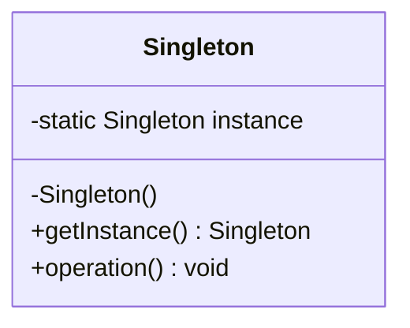
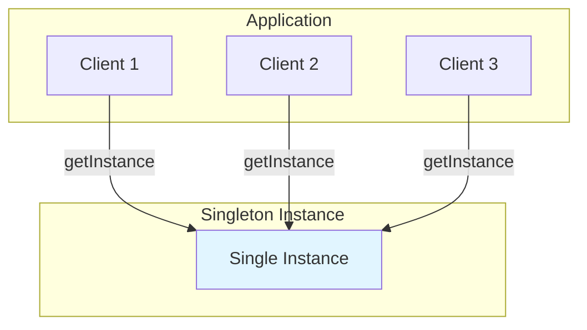
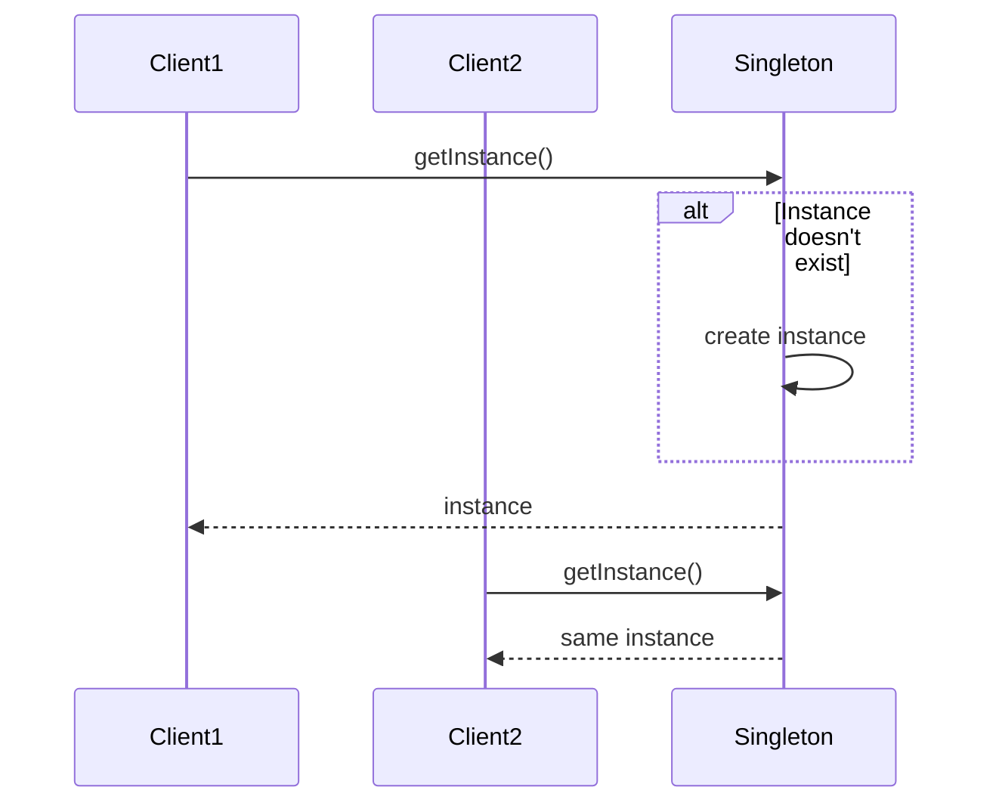

# Singleton Pattern

## Overview

## Diagram Images


The Singleton pattern ensures a class has only one instance and provides a global point of access to it. This is useful when exactly one object is needed to coordinate actions across the system.

## Intent

- Ensure a class has only one instance
- Provide global access to that instance
- Control access to shared resources

## UML Class Diagram



## Structure

1. **Singleton Class**: Contains a private static instance of itself
2. **Private Constructor**: Prevents external instantiation
3. **Static Getter Method**: Returns the single instance

## When to Use

- When exactly one instance of a class is required
- When you need global access to a shared resource
- For logging, database connections, thread pools, etc.

## Implementation Variations

### 1. Eager Initialization
- Instance created at class loading time
- Thread-safe by default
- May waste resources if never used

### 2. Lazy Initialization
- Instance created on first access
- Not thread-safe by default
- Memory efficient

### 3. Thread-Safe Lazy Initialization
- Uses synchronization or double-checked locking
- Thread-safe and memory efficient
- Slightly more complex

### 4. Enum Singleton (Recommended)
- Simplest and most elegant
- Thread-safe, serialization-safe, reflection-safe
- Recommended by Joshua Bloch

## Examples in This Repository

1. **EagerSingleton** - Basic eager initialization
2. **LazySingleton** - Basic lazy initialization (not thread-safe)
3. **ThreadSafeLazySingleton** - Thread-safe lazy initialization
4. **EnumSingleton** - Enum-based singleton (recommended)
5. **DatabaseConnection** - Real-world database connection example
6. **Logger** - Real-world logger example

## Pros

- Controlled access to sole instance
- Reduced namespace pollution
- Permits refinement of operations and representation
- Permits a variable number of instances
- More flexible than class operations

## Cons

- Violates Single Responsibility Principle
- Can mask bad design
- Requires special handling in multithreaded environments
- Difficult to unit test
- May cause issues if objects need to be extended

## Real-World Applications

- Database connection pools
- Logger implementations
- Configuration managers
- Cache implementations
- Thread pools

## Related Patterns

- **Factory Method**: Can be used to create singleton instances
- **Abstract Factory**: May use singletons for factories
- **Facade**: Often implemented as a singleton

## System Architecture



## Sequence Diagram



## Implementation Comparison

| Implementation | Thread-Safe | Lazy Loading | Performance | Complexity |
|----------------|-------------|--------------|-------------|------------|
| Eager | Yes | No | Fast | Low |
| Lazy | No | Yes | Fast | Low |
| Thread-Safe Lazy | Yes | Yes | Medium | Medium |
| Enum | Yes | No | Fast | Low |

## Code Example

```java
// Enum Singleton (Recommended)
public enum EnumSingleton {
    INSTANCE;
    
    public void showMessage(String message) {
        System.out.println(message);
    }
}

// Usage
EnumSingleton.INSTANCE.showMessage("Hello");

// Thread-Safe Lazy Singleton
public class ThreadSafeLazySingleton {
    private static volatile ThreadSafeLazySingleton instance;
    
    private ThreadSafeLazySingleton() {}
    
    public static ThreadSafeLazySingleton getInstance() {
        if (instance == null) {
            synchronized (ThreadSafeLazySingleton.class) {
                if (instance == null) {
                    instance = new ThreadSafeLazySingleton();
                }
            }
        }
        return instance;
    }
}
```

## Testing Considerations

### Challenges
- **Static State**: Makes unit testing difficult
- **Hidden Dependencies**: Dependencies are not explicit
- **Test Isolation**: Tests may interfere with each other
- **Mocking**: Hard to mock or replace in tests

### Solutions
- Use dependency injection when possible
- Make singleton testable by allowing test override
- Use interfaces to allow mocking
- Consider using test doubles

## Thread Safety Considerations

### Eager Initialization
- **Thread-Safe**: Yes, by default
- **Why**: JVM guarantees class initialization is thread-safe

### Lazy Initialization
- **Thread-Safe**: No
- **Problem**: Multiple threads can create multiple instances
- **Solution**: Use synchronization or double-checked locking

### Double-Checked Locking
- **Thread-Safe**: Yes
- **Requirement**: Instance variable must be `volatile`
- **Why**: Prevents compiler optimizations that could break thread-safety

## Memory Considerations

- **Eager**: Instance created even if never used
- **Lazy**: Instance created only when needed
- **Memory Leaks**: Be careful with references in singletons
- **Cleanup**: Consider providing cleanup methods for resource management

## Design Considerations

### When NOT to Use Singleton
- When you might need multiple instances later
- When testing requires multiple instances
- When you need polymorphism
- When you want to subclass the singleton

### Alternatives
- **Dependency Injection**: Better for testability
- **Factory**: For controlled instance creation
- **Static Classes**: When no state is needed

## Source Code

### `DatabaseConnection.java`

```java
package com.cursor.designpatterns.creational.singleton;

/**
 * Database Connection Singleton Example
 * 
 * <p>Real-world example of singleton pattern: Database connection management.
 * This ensures only one database connection exists throughout the application,
 * which is essential for connection pooling and resource management.</p>
 * 
 * <p>This implementation uses eager initialization for database connections,
 * as the connection is typically needed early in application lifecycle.</p>
 * 
 * @author Design Patterns
 * @version 1.0
 * @since 1.0
 */
public class DatabaseConnection {
    
    private static final DatabaseConnection instance = new DatabaseConnection();
    private String connectionString;
    private boolean isConnected;
    
    /**
     * Private constructor to prevent external instantiation.
     */
    private DatabaseConnection() {
        this.connectionString = "jdbc:mysql://localhost:3306/mydb";
        this.isConnected = false;
        System.out.println("DatabaseConnection singleton created");
    }
    
    /**
     * Returns the singleton instance of DatabaseConnection.
     * 
     * @return the singleton database connection instance
     */
    public static DatabaseConnection getInstance() {
        return instance;
    }
    
    /**
     * Connects to the database.
     * 
     * @return true if connection successful, false otherwise
     */
    public boolean connect() {
        if (!isConnected) {
            // Simulate database connection
            System.out.println("Connecting to database: " + connectionString);
            isConnected = true;
            return true;
        }
        System.out.println("Already connected to database");
        return false;
    }
    
    /**
     * Disconnects from the database.
     */
    public void disconnect() {
        if (isConnected) {
            System.out.println("Disconnecting from database");
            isConnected = false;
        } else {
            System.out.println("Not connected to database");
        }
    }
    
    /**
     * Executes a query on the database.
     * 
     * @param query the SQL query to execute
     * @return query result as string (simulated)
     */
    public String executeQuery(String query) {
        if (!isConnected) {
            throw new IllegalStateException("Not connected to database. Call connect() first.");
        }
        System.out.println("Executing query: " + query);
        return "Query result for: " + query;
    }
    
    /**
     * Checks if currently connected to the database.
     * 
     * @return true if connected, false otherwise
     */
    public boolean isConnected() {
        return isConnected;
    }
    
    /**
     * Gets the connection string.
     * 
     * @return the database connection string
     */
    public String getConnectionString() {
        return connectionString;
    }
}
```

### `EagerSingleton.java`

```java
package com.cursor.designpatterns.creational.singleton;

/**
 * Eager Singleton Pattern Implementation
 * 
 * <p>This implementation creates the singleton instance eagerly at class loading time.
 * It is thread-safe by default since the instance is created during class initialization,
 * which is guaranteed to be thread-safe in Java.</p>
 * 
 * <p><strong>Pros:</strong></p>
 * <ul>
 *   <li>Thread-safe without synchronization overhead</li>
 *   <li>Simple and straightforward</li>
 * </ul>
 * 
 * <p><strong>Cons:</strong></p>
 * <ul>
 *   <li>Instance is created even if never used</li>
 *   <li>Cannot handle exceptions during instance creation</li>
 * </ul>
 * 
 * @author Design Patterns
 * @version 1.0
 * @since 1.0
 */
public class EagerSingleton {
    
    /**
     * The single instance of this class, created eagerly at class loading time.
     */
    private static final EagerSingleton instance = new EagerSingleton();
    
    /**
     * Private constructor to prevent instantiation from outside the class.
     */
    private EagerSingleton() {
        System.out.println("EagerSingleton instance created");
    }
    
    /**
     * Returns the singleton instance of EagerSingleton.
     * 
     * @return the singleton instance
     */
    public static EagerSingleton getInstance() {
        return instance;
    }
    
    /**
     * Example method to demonstrate singleton functionality.
     * 
     * @param message the message to display
     */
    public void showMessage(String message) {
        System.out.println("EagerSingleton: " + message);
    }
}
```

### `EnumSingleton.java`

```java
package com.cursor.designpatterns.creational.singleton;

/**
 * Enum Singleton Pattern Implementation
 * 
 * <p>This is the recommended approach for implementing singletons in Java.
 * Enum singletons are guaranteed to be singleton by the JVM and are inherently
 * thread-safe, serialization-safe, and reflection-safe.</p>
 * 
 * <p><strong>Pros:</strong></p>
 * <ul>
 *   <li>Simplest and most elegant implementation</li>
 *   <li>Thread-safe by default</li>
 *   <li>Serialization-safe</li>
 *   <li>Reflection-safe (cannot be instantiated via reflection)</li>
 *   <li>Recommended by Joshua Bloch in "Effective Java"</li>
 * </ul>
 * 
 * <p><strong>Cons:</strong></p>
 * <ul>
 *   <li>Cannot extend a class (enums cannot extend classes)</li>
 *   <li>Eager initialization (but acceptable for most use cases)</li>
 * </ul>
 * 
 * <p><strong>Usage Example:</strong></p>
 * <pre>{@code
 * EnumSingleton instance = EnumSingleton.INSTANCE;
 * instance.showMessage("Hello");
 * }</pre>
 * 
 * @author Design Patterns
 * @version 1.0
 * @since 1.0
 */
public enum EnumSingleton {
    
    /**
     * The single instance of the singleton.
     */
    INSTANCE;
    
    /**
     * Private constructor for the enum (implicitly private).
     * This is automatically called when INSTANCE is first accessed.
     */
    EnumSingleton() {
        System.out.println("EnumSingleton instance created");
    }
    
    /**
     * Example method to demonstrate singleton functionality.
     * 
     * @param message the message to display
     */
    public void showMessage(String message) {
        System.out.println("EnumSingleton: " + message);
    }
    
    /**
     * Returns the singleton instance.
     * This is provided for consistency with other singleton implementations.
     * 
     * @return the singleton instance (INSTANCE)
     */
    public static EnumSingleton getInstance() {
        return INSTANCE;
    }
}
```

### `LazySingleton.java`

```java
package com.cursor.designpatterns.creational.singleton;

/**
 * Lazy Singleton Pattern Implementation
 * 
 * <p>This implementation creates the singleton instance lazily, i.e., only when
 * it is first requested. This saves memory if the instance is never used.</p>
 * 
 * <p><strong>Note:</strong> This implementation is NOT thread-safe.
 * For thread-safe lazy initialization, use ThreadSafeLazySingleton.</p>
 * 
 * <p><strong>Pros:</strong></p>
 * <ul>
 *   <li>Instance is created only when needed</li>
 *   <li>Memory efficient</li>
 * </ul>
 * 
 * <p><strong>Cons:</strong></p>
 * <ul>
 *   <li>Not thread-safe</li>
 *   <li>Multiple instances can be created in multi-threaded environments</li>
 * </ul>
 * 
 * @author Design Patterns
 * @version 1.0
 * @since 1.0
 */
public class LazySingleton {
    
    /**
     * The single instance of this class, initialized lazily.
     */
    private static LazySingleton instance;
    
    /**
     * Private constructor to prevent instantiation from outside the class.
     */
    private LazySingleton() {
        System.out.println("LazySingleton instance created");
    }
    
    /**
     * Returns the singleton instance of LazySingleton.
     * Creates the instance if it doesn't exist (lazy initialization).
     * 
     * <p><strong>Warning:</strong> This method is not thread-safe!</p>
     * 
     * @return the singleton instance
     */
    public static LazySingleton getInstance() {
        if (instance == null) {
            instance = new LazySingleton();
        }
        return instance;
    }
    
    /**
     * Example method to demonstrate singleton functionality.
     * 
     * @param message the message to display
     */
    public void showMessage(String message) {
        System.out.println("LazySingleton: " + message);
    }
}
```

### `Logger.java`

```java
package com.cursor.designpatterns.creational.singleton;

import java.io.FileWriter;
import java.io.IOException;
import java.time.LocalDateTime;
import java.time.format.DateTimeFormatter;

/**
 * Logger Singleton Example
 * 
 * <p>Real-world example of singleton pattern: Application logging.
 * A single logger instance ensures all log messages are written to the same
 * log file and maintains consistent logging behavior throughout the application.</p>
 * 
 * <p>This implementation uses thread-safe lazy initialization since logging
 * may not be needed immediately and file operations can be expensive.</p>
 * 
 * @author Design Patterns
 * @version 1.0
 * @since 1.0
 */
public class Logger {
    
    private static volatile Logger instance;
    private static final String LOG_FILE = "application.log";
    private FileWriter fileWriter;
    
    /**
     * Private constructor to prevent external instantiation.
     */
    private Logger() {
        try {
            this.fileWriter = new FileWriter(LOG_FILE, true);
            System.out.println("Logger singleton created, log file: " + LOG_FILE);
        } catch (IOException e) {
            System.err.println("Failed to create log file: " + e.getMessage());
        }
    }
    
    /**
     * Returns the singleton instance of Logger.
     * 
     * @return the singleton logger instance
     */
    public static Logger getInstance() {
        if (instance == null) {
            synchronized (Logger.class) {
                if (instance == null) {
                    instance = new Logger();
                }
            }
        }
        return instance;
    }
    
    /**
     * Logs an info message.
     * 
     * @param message the message to log
     */
    public void info(String message) {
        log("INFO", message);
    }
    
    /**
     * Logs an error message.
     * 
     * @param message the error message to log
     */
    public void error(String message) {
        log("ERROR", message);
    }
    
    /**
     * Logs a warning message.
     * 
     * @param message the warning message to log
     */
    public void warn(String message) {
        log("WARN", message);
    }
    
    /**
     * Logs a debug message.
     * 
     * @param message the debug message to log
     */
    public void debug(String message) {
        log("DEBUG", message);
    }
    
    /**
     * Internal method to write log messages to file.
     * 
     * @param level the log level
     * @param message the message to log
     */
    private void log(String level, String message) {
        if (fileWriter != null) {
            try {
                String timestamp = LocalDateTime.now()
                    .format(DateTimeFormatter.ofPattern("yyyy-MM-dd HH:mm:ss"));
                String logEntry = String.format("[%s] [%s] %s%n", timestamp, level, message);
                fileWriter.write(logEntry);
                fileWriter.flush();
                System.out.print(logEntry);
            } catch (IOException e) {
                System.err.println("Failed to write to log file: " + e.getMessage());
            }
        }
    }
    
    /**
     * Closes the logger and file writer.
     * Should be called when application shuts down.
     */
    public void close() {
        if (fileWriter != null) {
            try {
                fileWriter.close();
                System.out.println("Logger closed");
            } catch (IOException e) {
                System.err.println("Failed to close logger: " + e.getMessage());
            }
        }
    }
}
```

### `SingletonDemo.java`

```java
package com.cursor.designpatterns.creational.singleton;

/**
 * Demo class to demonstrate various Singleton pattern implementations.
 * 
 * <p>This demo shows different ways to implement the Singleton pattern:</p>
 * <ul>
 *   <li>Eager Singleton - Instance created at class loading</li>
 *   <li>Lazy Singleton - Instance created on first access (not thread-safe)</li>
 *   <li>Thread-Safe Lazy Singleton - Thread-safe lazy initialization</li>
 *   <li>Enum Singleton - Recommended approach using enum</li>
 *   <li>Real-world examples: Database Connection and Logger</li>
 * </ul>
 * 
 * @author Design Patterns
 * @version 1.0
 * @since 1.0
 */
public class SingletonDemo {
    
    public static void main(String[] args) {
        System.out.println("=== Singleton Pattern Demo ===\n");
        
        // 1. Eager Singleton
        System.out.println("1. Eager Singleton:");
        EagerSingleton eager1 = EagerSingleton.getInstance();
        EagerSingleton eager2 = EagerSingleton.getInstance();
        eager1.showMessage("First call");
        eager2.showMessage("Second call");
        System.out.println("Same instance? " + (eager1 == eager2) + "\n");
        
        // 2. Lazy Singleton
        System.out.println("2. Lazy Singleton:");
        LazySingleton lazy1 = LazySingleton.getInstance();
        LazySingleton lazy2 = LazySingleton.getInstance();
        lazy1.showMessage("First call");
        lazy2.showMessage("Second call");
        System.out.println("Same instance? " + (lazy1 == lazy2) + "\n");
        
        // 3. Thread-Safe Lazy Singleton
        System.out.println("3. Thread-Safe Lazy Singleton:");
        ThreadSafeLazySingleton threadSafe1 = ThreadSafeLazySingleton.getInstance();
        ThreadSafeLazySingleton threadSafe2 = ThreadSafeLazySingleton.getInstance();
        threadSafe1.showMessage("First call");
        threadSafe2.showMessage("Second call");
        System.out.println("Same instance? " + (threadSafe1 == threadSafe2) + "\n");
        
        // 4. Enum Singleton
        System.out.println("4. Enum Singleton:");
        EnumSingleton enum1 = EnumSingleton.getInstance();
        EnumSingleton enum2 = EnumSingleton.INSTANCE;
        enum1.showMessage("First call");
        enum2.showMessage("Second call");
        System.out.println("Same instance? " + (enum1 == enum2) + "\n");
        
        // 5. Database Connection Example
        System.out.println("5. Database Connection Example:");
        DatabaseConnection db1 = DatabaseConnection.getInstance();
        DatabaseConnection db2 = DatabaseConnection.getInstance();
        System.out.println("Same instance? " + (db1 == db2));
        db1.connect();
        db1.executeQuery("SELECT * FROM users");
        db2.executeQuery("SELECT * FROM products");
        db1.disconnect();
        System.out.println();
        
        // 6. Logger Example
        System.out.println("6. Logger Example:");
        Logger logger1 = Logger.getInstance();
        Logger logger2 = Logger.getInstance();
        System.out.println("Same instance? " + (logger1 == logger2));
        logger1.info("Application started");
        logger2.debug("Debug message");
        logger1.warn("Warning message");
        logger2.error("Error occurred");
        logger1.close();
    }
}
```

### `ThreadSafeLazySingleton.java`

```java
package com.cursor.designpatterns.creational.singleton;

/**
 * Thread-Safe Lazy Singleton Pattern Implementation
 * 
 * <p>This implementation creates the singleton instance lazily with thread-safety
 * using synchronized keyword. The double-checked locking pattern ensures that
 * synchronization overhead is minimized after the first instance is created.</p>
 * 
 * <p><strong>Pros:</strong></p>
 * <ul>
 *   <li>Thread-safe</li>
 *   <li>Instance created only when needed</li>
 *   <li>Reduced synchronization overhead with double-checked locking</li>
 * </ul>
 * 
 * <p><strong>Cons:</strong></p>
 * <ul>
 *   <li>Slightly more complex than eager initialization</li>
 *   <li>Requires volatile keyword for proper double-checked locking</li>
 * </ul>
 * 
 * @author Design Patterns
 * @version 1.0
 * @since 1.0
 */
public class ThreadSafeLazySingleton {
    
    /**
     * The single instance of this class, initialized lazily.
     * Volatile ensures visibility of changes across threads.
     */
    private static volatile ThreadSafeLazySingleton instance;
    
    /**
     * Private constructor to prevent instantiation from outside the class.
     */
    private ThreadSafeLazySingleton() {
        System.out.println("ThreadSafeLazySingleton instance created");
    }
    
    /**
     * Returns the singleton instance of ThreadSafeLazySingleton.
     * Uses double-checked locking for thread-safety with minimal synchronization overhead.
     * 
     * @return the singleton instance
     */
    public static ThreadSafeLazySingleton getInstance() {
        if (instance == null) {
            synchronized (ThreadSafeLazySingleton.class) {
                if (instance == null) {
                    instance = new ThreadSafeLazySingleton();
                }
            }
        }
        return instance;
    }
    
    /**
     * Example method to demonstrate singleton functionality.
     * 
     * @param message the message to display
     */
    public void showMessage(String message) {
        System.out.println("ThreadSafeLazySingleton: " + message);
    }
}
```
