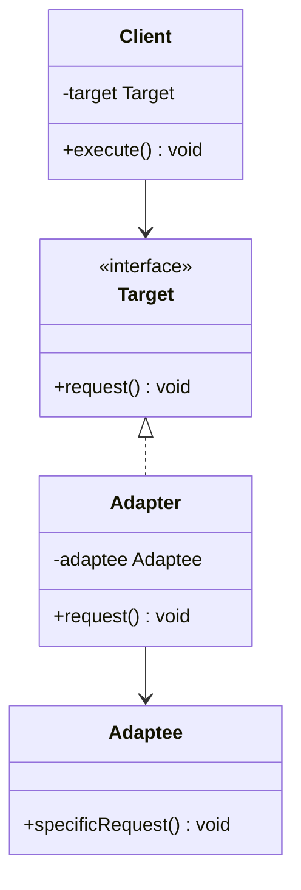
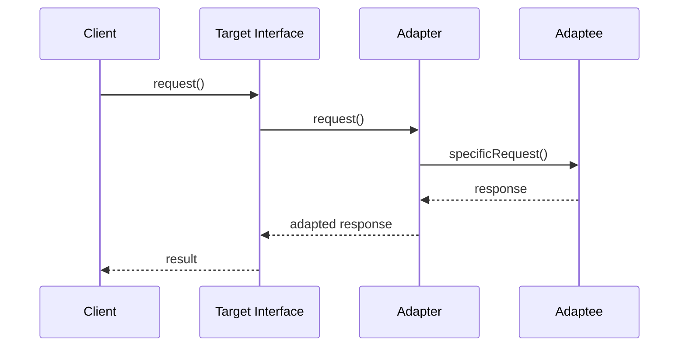
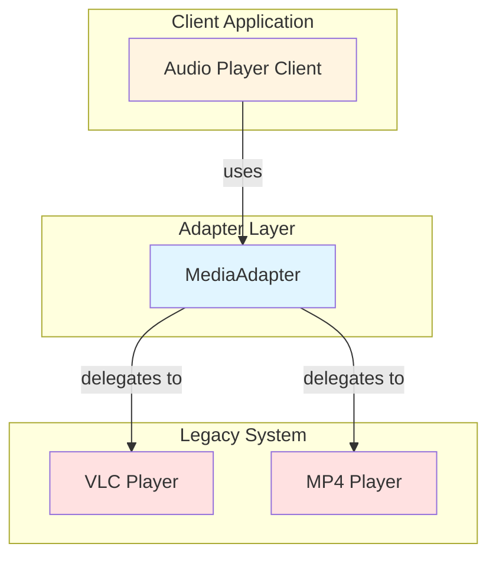

# Adapter Pattern

## Overview

## Diagram Images


The Adapter pattern allows incompatible interfaces to work together. It acts as a bridge between two incompatible interfaces by wrapping an object with an adapter that makes it compatible with another class.

## Intent

- Convert the interface of a class into another interface clients expect
- Allow classes to work together that couldn't otherwise because of incompatible interfaces
- Wrap an existing class with a new interface

## Type

**Structural Pattern** - Concerned with how classes and objects are composed.

## Problem

You want to use an existing class, but its interface doesn't match what you need. You could modify the class, but that would break existing code, or the class might be part of a library you can't modify.

## Solution

Create an adapter class that acts as a translator between your code and the legacy class. The adapter implements the interface your code expects, and internally delegates calls to the legacy object.

## UML Class Diagram



## Sequence Diagram



## Structure

### Components

1. **Target** - The domain-specific interface that Client uses
2. **Adapter** - Adapts the Adaptee interface to Target interface
3. **Adaptee** - The existing interface that needs adapting
4. **Client** - Collaborates with objects conforming to Target interface

### Implementation Approaches

#### 1. Class Adapter (Inheritance-based)
- Uses multiple inheritance to adapt interfaces
- Inherits both Target and Adaptee
- Not possible in Java (single inheritance)

#### 2. Object Adapter (Composition-based)
- Uses composition to adapt interfaces
- Contains Adaptee instance
- More flexible and recommended approach

## When to Use

- You want to use an existing class, but its interface doesn't match what you need
- You want to create a reusable class that cooperates with unrelated classes
- You need to integrate incompatible interfaces
- You want to wrap legacy code with a new interface

## Examples in This Repository

### Example 1: Media Player Adapter
- **Target**: `MediaPlayer` interface
- **Adaptee**: `AdvancedMediaPlayer` interface (VLC, MP4 players)
- **Adapter**: `MediaAdapter` - adapts advanced players to basic player interface
- **Use Case**: Support multiple media formats without modifying existing player code

### Example 2: Payment Adapter
- **Target**: `PaymentProcessor` interface
- **Adaptee**: `ThirdPartyPaymentGateway` class
- **Adapter**: `PaymentAdapter` - adapts third-party gateway to standard interface
- **Use Case**: Integrate third-party payment systems without changing client code

## Detailed Code Flow

### Media Player Example

```
1. Client creates AudioPlayer (implements MediaPlayer)
2. Client calls play("mp4", "video.mp4")
3. AudioPlayer detects unsupported format
4. AudioPlayer creates MediaAdapter("mp4")
5. MediaAdapter creates Mp4Player internally
6. MediaAdapter delegates to Mp4Player.playMp4()
7. Result is returned through the adapter chain
```

## Pros

- **Separation of Concerns**: Interface conversion logic is isolated
- **Single Responsibility**: Adapter has one job - conversion
- **Open/Closed Principle**: Can introduce new adapters without breaking existing code
- **Reusability**: Can reuse existing classes with incompatible interfaces
- **Flexibility**: Object adapter can work with Adaptee subclasses

## Cons

- **Complexity**: Introduces additional layer of indirection
- **Performance**: Small overhead from extra method calls
- **Code Volume**: Need to write adapter code for each incompatible interface

## Real-World Applications

### Software Development
- **Legacy System Integration**: Adapting old system interfaces to new requirements
- **Third-Party Library Integration**: Wrapping libraries with incompatible APIs
- **API Versioning**: Adapting old API versions to new client code

### Specific Examples
- **Database Drivers**: JDBC adapters for different database systems
- **Payment Gateways**: Adapting various payment processor APIs
- **Media Players**: Supporting multiple format codecs
- **Legacy Code Wrappers**: Modernizing old codebases

## Related Patterns

- **Bridge**: Both separate interface from implementation, but Bridge is designed up-front
- **Decorator**: Enhances objects, while Adapter converts interfaces
- **Facade**: Provides simplified interface, while Adapter converts to expected interface
- **Proxy**: Controls access, while Adapter changes interface

## Comparison with Similar Patterns

| Pattern | Purpose | Focus |
|---------|---------|-------|
| **Adapter** | Converts interface | Interface compatibility |
| **Bridge** | Separates abstraction | Decoupling |
| **Decorator** | Adds responsibilities | Behavior extension |
| **Facade** | Simplifies interface | Ease of use |

## Implementation Considerations

### Best Practices

1. **Use Object Adapter**: More flexible than class adapter
2. **Keep Adapters Thin**: Minimal logic, just conversion
3. **Document Adaptations**: Clearly document what the adapter does
4. **Handle Edge Cases**: Consider null values and error conditions
5. **Test Thoroughly**: Adapters can hide bugs from incompatible interfaces

### Common Pitfalls

1. **Over-engineering**: Don't create adapters for trivial conversions
2. **Leaking Adaptee**: Avoid exposing Adaptee methods through adapter
3. **Too Much Logic**: Keep conversion logic minimal
4. **Missing Error Handling**: Handle incompatible method calls gracefully

## Code Example

```java
// Target interface
public interface MediaPlayer {
    void play(String audioType, String filename);
}

// Adaptee interface
public interface AdvancedMediaPlayer {
    void playVlc(String filename);
    void playMp4(String filename);
}

// Adapter
public class MediaAdapter implements MediaPlayer {
    private AdvancedMediaPlayer advancedPlayer;
    
    public MediaAdapter(String audioType) {
        if (audioType.equalsIgnoreCase("vlc")) {
            advancedPlayer = new VlcPlayer();
        } else if (audioType.equalsIgnoreCase("mp4")) {
            advancedPlayer = new Mp4Player();
        }
    }
    
    @Override
    public void play(String audioType, String filename) {
        if (audioType.equalsIgnoreCase("vlc")) {
            advancedPlayer.playVlc(filename);
        } else if (audioType.equalsIgnoreCase("mp4")) {
            advancedPlayer.playMp4(filename);
        }
    }
}
```

## System Architecture



## Testing Strategy

1. **Unit Tests**: Test adapter conversion logic
2. **Integration Tests**: Test adapter with real Adaptee objects
3. **Mock Tests**: Use mocks to test adapter in isolation
4. **Compatibility Tests**: Ensure adapter handles all Adaptee methods

## Performance Considerations

- **Overhead**: Minimal - usually just one method call
- **Memory**: Additional adapter object per Adaptee instance
- **Optimization**: Can cache adapter instances if expensive to create

## Source Code

### `AdapterDemo.java`

```java
package com.cursor.designpatterns.structural.adapter;

/**
 * Demo class to demonstrate Adapter pattern.
 * 
 * <p>This demo shows two examples of Adapter pattern:</p>
 * <ol>
 *   <li>Media Player Adapter - Adapting advanced media players to basic player interface</li>
 *   <li>Payment Adapter - Adapting third-party payment gateway to standard interface</li>
 * </ol>
 * 
 * <p><strong>Adapter Pattern Benefits:</strong></p>
 * <ul>
 *   <li>Allows incompatible interfaces to work together</li>
 *   <li>Reuses existing classes without modifying them</li>
 *   <li>Provides a way to integrate legacy code</li>
 * </ul>
 * 
 * @author Design Patterns
 * @version 1.0
 * @since 1.0
 */
public class AdapterDemo {
    
    public static void main(String[] args) {
        System.out.println("=== Adapter Pattern Demo ===\n");
        
        // Example 1: Media Player Adapter
        System.out.println("Example 1: Media Player Adapter");
        System.out.println("--------------------------------");
        
        AudioPlayer audioPlayer = new AudioPlayer();
        audioPlayer.play("mp3", "song.mp3");
        audioPlayer.play("mp4", "video.mp4");
        audioPlayer.play("vlc", "movie.vlc");
        audioPlayer.play("avi", "file.avi");
        
        System.out.println();
        
        // Example 2: Payment Adapter
        System.out.println("Example 2: Payment Adapter");
        System.out.println("---------------------------");
        
        ThirdPartyPaymentGateway gateway = new ThirdPartyPaymentGateway();
        PaymentAdapter paymentAdapter = new PaymentAdapter(gateway);
        
        PaymentProcessor processor = paymentAdapter;
        processor.processPayment(100.50);
        processor.processPayment(250.75);
    }
}
```

### `AdvancedMediaPlayer.java`

```java
package com.cursor.designpatterns.structural.adapter;

/**
 * Advanced Media Player interface (Adaptee interface).
 * 
 * <p>This interface represents an existing system that has a different
 * interface than what the client expects. An adapter will be needed to
 * make this compatible with MediaPlayer.</p>
 * 
 * @author Design Patterns
 * @version 1.0
 * @since 1.0
 */
public interface AdvancedMediaPlayer {
    
    /**
     * Plays a VLC file.
     * 
     * @param filename the filename to play
     */
    void playVlc(String filename);
    
    /**
     * Plays an MP4 file.
     * 
     * @param filename the filename to play
     */
    void playMp4(String filename);
}
```

### `AudioPlayer.java`

```java
package com.cursor.designpatterns.structural.adapter;

/**
 * Audio Player implementation (Client using the adapter).
 * 
 * <p>This class uses the MediaAdapter to play different audio formats.
 * It can play MP3 natively, and uses the adapter for VLC and MP4 formats.</p>
 * 
 * @author Design Patterns
 * @version 1.0
 * @since 1.0
 */
public class AudioPlayer implements MediaPlayer {
    
    private MediaAdapter mediaAdapter;
    
    @Override
    public void play(String audioType, String filename) {
        // Built-in support for MP3
        if (audioType.equalsIgnoreCase("mp3")) {
            System.out.println("Playing MP3 file: " + filename);
        }
        // Use adapter for other formats
        else if (audioType.equalsIgnoreCase("vlc") || audioType.equalsIgnoreCase("mp4")) {
            mediaAdapter = new MediaAdapter(audioType);
            mediaAdapter.play(audioType, filename);
        } else {
            System.out.println("Invalid media type: " + audioType);
        }
    }
}
```

### `MediaAdapter.java`

```java
package com.cursor.designpatterns.structural.adapter;

/**
 * Media Adapter (Adapter class).
 * 
 * <p>This adapter class implements the MediaPlayer interface and uses
 * AdvancedMediaPlayer objects to play the required format. It acts as a
 * bridge between MediaPlayer and AdvancedMediaPlayer.</p>
 * 
 * <p><strong>Adapter Pattern:</strong></p>
 * <ul>
 *   <li>Target: MediaPlayer</li>
 *   <li>Adapter: MediaAdapter (this class)</li>
 *   <li>Adaptee: AdvancedMediaPlayer</li>
 * </ul>
 * 
 * @author Design Patterns
 * @version 1.0
 * @since 1.0
 */
public class MediaAdapter implements MediaPlayer {
    
    private AdvancedMediaPlayer advancedMediaPlayer;
    
    /**
     * Creates a MediaAdapter for the specified audio type.
     * 
     * @param audioType the type of audio (vlc or mp4)
     */
    public MediaAdapter(String audioType) {
        if (audioType.equalsIgnoreCase("vlc")) {
            advancedMediaPlayer = new VlcPlayer();
        } else if (audioType.equalsIgnoreCase("mp4")) {
            advancedMediaPlayer = new Mp4Player();
        }
    }
    
    @Override
    public void play(String audioType, String filename) {
        if (audioType.equalsIgnoreCase("vlc")) {
            advancedMediaPlayer.playVlc(filename);
        } else if (audioType.equalsIgnoreCase("mp4")) {
            advancedMediaPlayer.playMp4(filename);
        }
    }
}
```

### `MediaPlayer.java`

```java
package com.cursor.designpatterns.structural.adapter;

/**
 * Media Player interface (Target interface).
 * 
 * <p>This is the target interface that clients expect to use.
 * The Adapter pattern allows incompatible interfaces to work together.</p>
 * 
 * @author Design Patterns
 * @version 1.0
 * @since 1.0
 */
public interface MediaPlayer {
    
    /**
     * Plays a media file.
     * 
     * @param audioType the type of audio file
     * @param filename the name of the file to play
     */
    void play(String audioType, String filename);
}
```

### `Mp4Player.java`

```java
package com.cursor.designpatterns.structural.adapter;

/**
 * MP4 Player implementation (Concrete Adaptee).
 * 
 * @author Design Patterns
 * @version 1.0
 * @since 1.0
 */
public class Mp4Player implements AdvancedMediaPlayer {
    
    @Override
    public void playVlc(String filename) {
        // Do nothing - MP4 player doesn't support VLC in this example
    }
    
    @Override
    public void playMp4(String filename) {
        System.out.println("Playing MP4 file: " + filename);
    }
}
```

### `PaymentAdapter.java`

```java
package com.cursor.designpatterns.structural.adapter;

/**
 * Payment Adapter (Adapter for second example).
 * 
 * <p>This adapter adapts ThirdPartyPaymentGateway to work with PaymentProcessor interface.</p>
 * 
 * @author Design Patterns
 * @version 1.0
 * @since 1.0
 */
public class PaymentAdapter implements PaymentProcessor {
    
    private ThirdPartyPaymentGateway paymentGateway;
    
    /**
     * Creates a PaymentAdapter with the specified gateway.
     * 
     * @param paymentGateway the third-party payment gateway to adapt
     */
    public PaymentAdapter(ThirdPartyPaymentGateway paymentGateway) {
        this.paymentGateway = paymentGateway;
    }
    
    @Override
    public boolean processPayment(double amount) {
        if (paymentGateway.validate(amount)) {
            return paymentGateway.pay(amount);
        }
        return false;
    }
}
```

### `PaymentProcessor.java`

```java
package com.cursor.designpatterns.structural.adapter;

/**
 * Payment Processor interface (Target interface for second example).
 * 
 * <p>This interface represents the payment processor that clients expect to use.</p>
 * 
 * @author Design Patterns
 * @version 1.0
 * @since 1.0
 */
public interface PaymentProcessor {
    
    /**
     * Processes a payment.
     * 
     * @param amount the amount to pay
     * @return true if payment successful
     */
    boolean processPayment(double amount);
}
```

### `ThirdPartyPaymentGateway.java`

```java
package com.cursor.designpatterns.structural.adapter;

/**
 * Third Party Payment Gateway (Adaptee for second example).
 * 
 * <p>This represents an existing third-party payment system with a different interface.
 * The adapter will make this compatible with PaymentProcessor.</p>
 * 
 * @author Design Patterns
 * @version 1.0
 * @since 1.0
 */
public class ThirdPartyPaymentGateway {
    
    /**
     * Makes a payment using the third-party gateway.
     * 
     * @param dollars the amount in dollars
     * @return true if payment successful
     */
    public boolean pay(double dollars) {
        System.out.println("Processing payment of $" + dollars + " via third-party gateway");
        return true;
    }
    
    /**
     * Validates the payment.
     * 
     * @param amount the amount to validate
     * @return true if valid
     */
    public boolean validate(double amount) {
        return amount > 0;
    }
}
```

### `VlcPlayer.java`

```java
package com.cursor.designpatterns.structural.adapter;

/**
 * VLC Player implementation (Concrete Adaptee).
 * 
 * @author Design Patterns
 * @version 1.0
 * @since 1.0
 */
public class VlcPlayer implements AdvancedMediaPlayer {
    
    @Override
    public void playVlc(String filename) {
        System.out.println("Playing VLC file: " + filename);
    }
    
    @Override
    public void playMp4(String filename) {
        // Do nothing - VLC player doesn't support MP4 in this example
    }
}
```

## References

- Gang of Four Design Patterns Book
- Java Design Patterns Tutorials
- Refactoring Guru - Adapter Pattern
