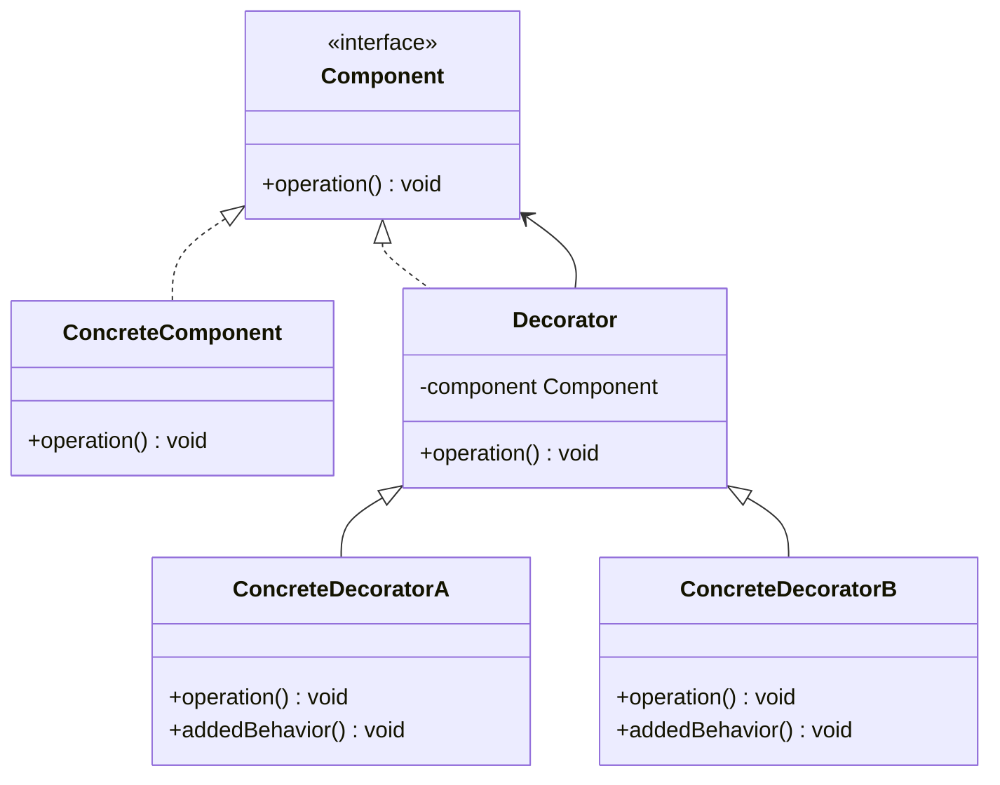
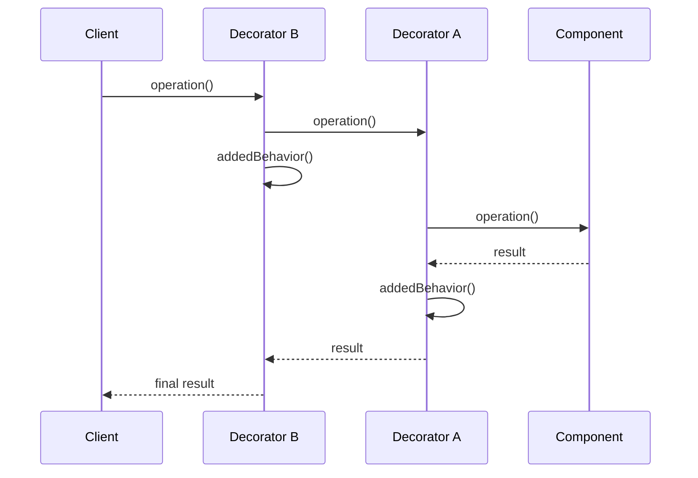
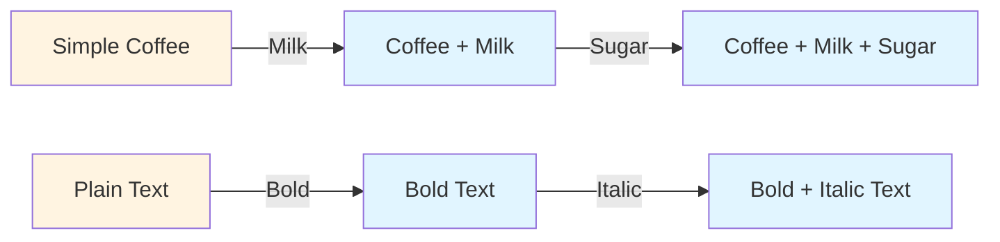

# Decorator Pattern

## Overview

## Diagram Images


The Decorator pattern allows behavior to be added to individual objects dynamically without affecting the behavior of other objects from the same class. It provides a flexible alternative to subclassing for extending functionality.

## Intent

- Attach additional responsibilities to objects dynamically
- Provide a flexible alternative to subclassing
- Extend functionality without modifying existing code
- Compose behaviors at runtime

## Type

**Structural Pattern** - Focuses on adding responsibilities to objects dynamically.

## Problem

You need to add responsibilities to objects dynamically and transparently. Subclassing would require creating multiple subclasses for every combination of responsibilities, leading to an explosion of classes.

## Solution

Wrap the original object with decorator objects that add responsibilities. Decorators can be stacked to add multiple responsibilities.

## UML Class Diagram



## Sequence Diagram



## Structure

### Components

1. **Component** - Defines the interface for objects that can have responsibilities added dynamically
2. **ConcreteComponent** - Defines an object to which additional responsibilities can be attached
3. **Decorator** - Maintains a reference to a Component and defines an interface that conforms to Component's interface
4. **ConcreteDecorator** - Adds responsibilities to the component

## When to Use

- Add responsibilities to objects dynamically and transparently
- Remove responsibilities dynamically
- Extend functionality by subclassing is impractical (too many combinations)
- You want to add features in a modular way

## Examples in This Repository

### Example 1: Coffee Decorator
- **Component**: `Coffee` interface
- **ConcreteComponent**: `SimpleCoffee` class
- **Decorators**: `MilkDecorator`, `SugarDecorator`
- **Use Case**: Add milk, sugar, and other ingredients to coffee dynamically

### Example 2: Text Decorator
- **Component**: `TextComponent` interface
- **ConcreteComponent**: `PlainText` class
- **Decorators**: `BoldDecorator`, `ItalicDecorator`
- **Use Case**: Apply formatting (bold, italic) to text dynamically

## System Architecture



## Pros

- **Flexible**: More flexible than static inheritance
- **Dynamic Composition**: Can mix and match responsibilities at runtime
- **Single Responsibility**: Each decorator has a single responsibility
- **Open/Closed**: Extend functionality without modifying existing code
- **Transparent**: Decorators can be applied and removed transparently

## Cons

- **Complexity**: Can be complex with many decorators
- **Order Dependency**: Order of decorators may matter
- **Debugging**: Hard to debug with multiple decorators
- **Performance**: Multiple layers of indirection

## Real-World Applications

### Software Development
- **I/O Streams**: Java InputStream decorators (BufferedInputStream, DataInputStream)
- **GUI Components**: Adding scrollbars, borders to components
- **Web Frameworks**: Middleware decorators in web frameworks
- **Text Processing**: Adding formatting, validation to text

### Specific Examples
- **Coffee Shop System**: Adding condiments to beverages
- **Text Editors**: Applying formatting styles
- **Image Processing**: Adding filters and effects
- **HTTP Middleware**: Adding authentication, logging, compression

## Related Patterns

- **Adapter**: Changes interface, Decorator enhances object
- **Composite**: Decorator can be viewed as a degenerate composite
- **Strategy**: Encapsulates algorithms, Decorator adds responsibilities

## Code Example

```java
// Component
public interface Coffee {
    String getDescription();
    double getCost();
}

// Concrete Component
public class SimpleCoffee implements Coffee {
    @Override
    public String getDescription() {
        return "Simple Coffee";
    }
    
    @Override
    public double getCost() {
        return 2.0;
    }
}

// Decorator
public abstract class CoffeeDecorator implements Coffee {
    protected Coffee coffee;
    
    public CoffeeDecorator(Coffee coffee) {
        this.coffee = coffee;
    }
}

// Concrete Decorator
public class MilkDecorator extends CoffeeDecorator {
    public MilkDecorator(Coffee coffee) {
        super(coffee);
    }
    
    @Override
    public String getDescription() {
        return coffee.getDescription() + ", Milk";
    }
    
    @Override
    public double getCost() {
        return coffee.getCost() + 0.5;
    }
}
```

## Source Code

### `BoldDecorator.java`

```java
package com.cursor.designpatterns.structural.decorator;

/**
 * Bold Decorator (Concrete Decorator for second example).
 * 
 * @author Design Patterns
 * @version 1.0
 * @since 1.0
 */
public class BoldDecorator extends TextDecorator {
    
    public BoldDecorator(TextComponent textComponent) {
        super(textComponent);
    }
    
    @Override
    public String format() {
        return "<b>" + textComponent.format() + "</b>";
    }
}
```

### `Coffee.java`

```java
package com.cursor.designpatterns.structural.decorator;

/**
 * Coffee interface (Component).
 * 
 * <p>The Decorator pattern allows behavior to be added to individual objects
 * dynamically without affecting other objects. This interface represents the
 * component that can be decorated.</p>
 * 
 * @author Design Patterns
 * @version 1.0
 * @since 1.0
 */
public interface Coffee {
    
    /**
     * Gets the description of the coffee.
     * 
     * @return the coffee description
     */
    String getDescription();
    
    /**
     * Gets the cost of the coffee.
     * 
     * @return the coffee cost
     */
    double getCost();
}
```

### `CoffeeDecorator.java`

```java
package com.cursor.designpatterns.structural.decorator;

/**
 * Coffee Decorator abstract class (Decorator).
 * 
 * <p>This abstract decorator class implements the Coffee interface and maintains
 * a reference to a Coffee object. Concrete decorators will extend this class.</p>
 * 
 * @author Design Patterns
 * @version 1.0
 * @since 1.0
 */
public abstract class CoffeeDecorator implements Coffee {
    
    protected Coffee coffee;
    
    /**
     * Creates a CoffeeDecorator that wraps the given Coffee.
     * 
     * @param coffee the coffee to decorate
     */
    public CoffeeDecorator(Coffee coffee) {
        this.coffee = coffee;
    }
    
    @Override
    public String getDescription() {
        return coffee.getDescription();
    }
    
    @Override
    public double getCost() {
        return coffee.getCost();
    }
}
```

### `DecoratorDemo.java`

```java
package com.cursor.designpatterns.structural.decorator;

/**
 * Demo class to demonstrate Decorator pattern.
 * 
 * <p>This demo shows two examples of Decorator pattern:</p>
 * <ol>
 *   <li>Coffee Decorator - Adding features to coffee dynamically</li>
 *   <li>Text Decorator - Adding formatting to text dynamically</li>
 * </ol>
 * 
 * <p><strong>Decorator Pattern Benefits:</strong></p>
 * <ul>
 *   <li>Adds responsibilities to objects dynamically</li>
 *   <li>More flexible than inheritance for extending functionality</li>
 *   <li>Allows composition of behaviors</li>
 * </ul>
 * 
 * @author Design Patterns
 * @version 1.0
 * @since 1.0
 */
public class DecoratorDemo {
    
    public static void main(String[] args) {
        System.out.println("=== Decorator Pattern Demo ===\n");
        
        // Example 1: Coffee Decorator
        System.out.println("Example 1: Coffee Decorator");
        System.out.println("----------------------------");
        
        Coffee simpleCoffee = new SimpleCoffee();
        System.out.println(simpleCoffee.getDescription() + " - $" + simpleCoffee.getCost());
        
        Coffee milkCoffee = new MilkDecorator(new SimpleCoffee());
        System.out.println(milkCoffee.getDescription() + " - $" + milkCoffee.getCost());
        
        Coffee sweetCoffee = new SugarDecorator(new SimpleCoffee());
        System.out.println(sweetCoffee.getDescription() + " - $" + sweetCoffee.getCost());
        
        Coffee fullCoffee = new MilkDecorator(new SugarDecorator(new SimpleCoffee()));
        System.out.println(fullCoffee.getDescription() + " - $" + fullCoffee.getCost());
        
        System.out.println();
        
        // Example 2: Text Decorator
        System.out.println("Example 2: Text Decorator");
        System.out.println("--------------------------");
        
        TextComponent plainText = new PlainText("Hello World");
        System.out.println("Plain: " + plainText.format());
        
        TextComponent boldText = new BoldDecorator(new PlainText("Hello World"));
        System.out.println("Bold: " + boldText.format());
        
        TextComponent italicText = new ItalicDecorator(new PlainText("Hello World"));
        System.out.println("Italic: " + italicText.format());
        
        TextComponent boldItalicText = new BoldDecorator(new ItalicDecorator(new PlainText("Hello World")));
        System.out.println("Bold + Italic: " + boldItalicText.format());
    }
}
```

### `ItalicDecorator.java`

```java
package com.cursor.designpatterns.structural.decorator;

/**
 * Italic Decorator (Concrete Decorator for second example).
 * 
 * @author Design Patterns
 * @version 1.0
 * @since 1.0
 */
public class ItalicDecorator extends TextDecorator {
    
    public ItalicDecorator(TextComponent textComponent) {
        super(textComponent);
    }
    
    @Override
    public String format() {
        return "<i>" + textComponent.format() + "</i>";
    }
}
```

### `MilkDecorator.java`

```java
package com.cursor.designpatterns.structural.decorator;

/**
 * Milk Decorator (Concrete Decorator).
 * 
 * <p>Adds milk to the coffee.</p>
 * 
 * @author Design Patterns
 * @version 1.0
 * @since 1.0
 */
public class MilkDecorator extends CoffeeDecorator {
    
    public MilkDecorator(Coffee coffee) {
        super(coffee);
    }
    
    @Override
    public String getDescription() {
        return coffee.getDescription() + ", Milk";
    }
    
    @Override
    public double getCost() {
        return coffee.getCost() + 0.5;
    }
}
```

### `PlainText.java`

```java
package com.cursor.designpatterns.structural.decorator;

/**
 * Plain Text implementation (Concrete Component for second example).
 * 
 * @author Design Patterns
 * @version 1.0
 * @since 1.0
 */
public class PlainText implements TextComponent {
    
    private String text;
    
    /**
     * Creates a PlainText with the specified text.
     * 
     * @param text the text content
     */
    public PlainText(String text) {
        this.text = text;
    }
    
    @Override
    public String format() {
        return text;
    }
}
```

### `SimpleCoffee.java`

```java
package com.cursor.designpatterns.structural.decorator;

/**
 * Simple Coffee implementation (Concrete Component).
 * 
 * @author Design Patterns
 * @version 1.0
 * @since 1.0
 */
public class SimpleCoffee implements Coffee {
    
    @Override
    public String getDescription() {
        return "Simple Coffee";
    }
    
    @Override
    public double getCost() {
        return 2.0;
    }
}
```

### `SugarDecorator.java`

```java
package com.cursor.designpatterns.structural.decorator;

/**
 * Sugar Decorator (Concrete Decorator).
 * 
 * <p>Adds sugar to the coffee.</p>
 * 
 * @author Design Patterns
 * @version 1.0
 * @since 1.0
 */
public class SugarDecorator extends CoffeeDecorator {
    
    public SugarDecorator(Coffee coffee) {
        super(coffee);
    }
    
    @Override
    public String getDescription() {
        return coffee.getDescription() + ", Sugar";
    }
    
    @Override
    public double getCost() {
        return coffee.getCost() + 0.2;
    }
}
```

### `TextComponent.java`

```java
package com.cursor.designpatterns.structural.decorator;

/**
 * Text Component interface (Component for second example).
 * 
 * @author Design Patterns
 * @version 1.0
 * @since 1.0
 */
public interface TextComponent {
    
    /**
     * Formats and returns the text.
     * 
     * @return the formatted text
     */
    String format();
}
```

### `TextDecorator.java`

```java
package com.cursor.designpatterns.structural.decorator;

/**
 * Text Decorator abstract class (Decorator for second example).
 * 
 * @author Design Patterns
 * @version 1.0
 * @since 1.0
 */
public abstract class TextDecorator implements TextComponent {
    
    protected TextComponent textComponent;
    
    /**
     * Creates a TextDecorator that wraps the given TextComponent.
     * 
     * @param textComponent the text component to decorate
     */
    public TextDecorator(TextComponent textComponent) {
        this.textComponent = textComponent;
    }
    
    @Override
    public String format() {
        return textComponent.format();
    }
}
```
