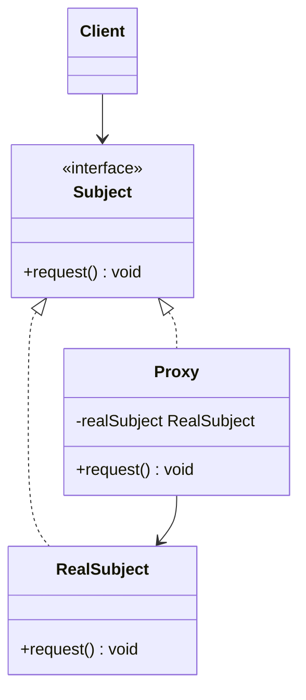
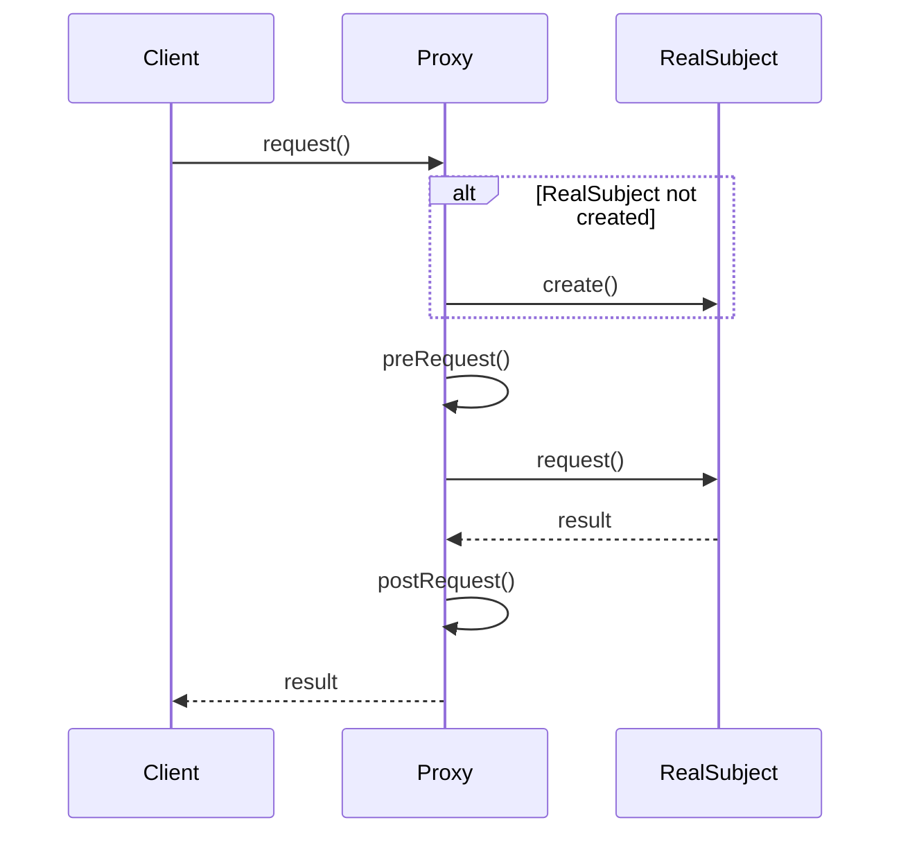
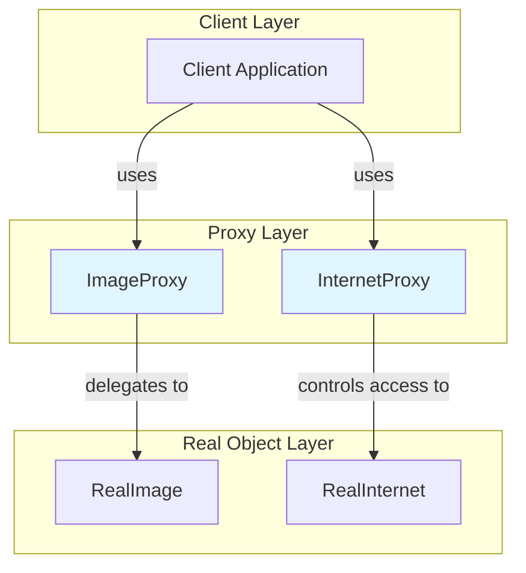

# Proxy Pattern

## Overview

## Diagram Images


The Proxy pattern provides a surrogate or placeholder for another object to control access to it. A proxy acts as an intermediary between the client and the real object.

## Intent

- Provide a surrogate or placeholder for another object
- Control access to the real object
- Add functionality before/after accessing the real object
- Implement lazy loading, access control, logging, caching

## Type

**Structural Pattern** - Controls access to objects through a surrogate.

## Problem

You need to control access to an object. Direct access may be expensive, require special permissions, or need additional functionality like lazy loading or caching.

## Solution

Create a proxy object that has the same interface as the real object. The proxy forwards requests to the real object but can add functionality before or after.

## UML Class Diagram



## Sequence Diagram



## Structure

### Components

1. **Subject** - Defines the common interface for RealSubject and Proxy
2. **RealSubject** - Defines the real object that the proxy represents
3. **Proxy** - Maintains a reference to RealSubject and controls access to it

## Proxy Types

### 1. Virtual Proxy (Lazy Loading)
- Creates expensive objects on demand
- Example: Loading images only when needed

### 2. Protection Proxy (Access Control)
- Controls access to the real subject
- Example: Checking permissions before access

### 3. Remote Proxy
- Represents an object in a different address space
- Example: RMI, CORBA stubs

### 4. Smart Reference Proxy
- Adds additional functionality when accessing object
- Example: Reference counting, loading persistent objects

## When to Use

- Need to control access to an object
- Implement lazy loading of expensive objects
- Add access control or security
- Add logging, monitoring, or caching
- Represent remote objects locally

## Examples in This Repository

### Example 1: Image Proxy (Virtual Proxy)
- **Subject**: `Image` interface
- **RealSubject**: `RealImage` class (expensive to create)
- **Proxy**: `ImageProxy` class (creates RealImage on demand)
- **Use Case**: Lazy loading of images to improve initial load time

### Example 2: Internet Proxy (Protection Proxy)
- **Subject**: `Internet` interface
- **RealSubject**: `RealInternet` class
- **Proxy**: `InternetProxy` class (blocks certain sites)
- **Use Case**: Access control and content filtering

## System Architecture



## Pros

- **Control Access**: Can control access to the real subject
- **Lazy Loading**: Can delay expensive object creation
- **Separation of Concerns**: Adds functionality without modifying real subject
- **Security**: Can add security checks
- **Performance**: Can add caching, logging, monitoring

## Cons

- **Complexity**: Adds an extra layer of indirection
- **Performance**: May introduce slight performance overhead
- **Maintenance**: Need to keep proxy and real subject in sync

## Real-World Applications

### Software Development
- **Image Loading**: Lazy loading of images in web browsers
- **Database Access**: Connection pooling, query caching
- **Remote Method Invocation**: RMI stubs and skeletons
- **Access Control**: Security proxies, authentication

### Specific Examples
- **Web Proxies**: HTTP proxies for caching and filtering
- **ORM Frameworks**: Lazy loading of database entities
- **Virtual Memory**: OS virtual memory management
- **CDN**: Content delivery network proxies

## Related Patterns

- **Adapter**: Changes interface, Proxy provides same interface
- **Decorator**: Adds responsibilities, Proxy controls access
- **Facade**: Simplifies interface, Proxy provides same interface

## Code Example

```java
// Subject
public interface Image {
    void display();
}

// Real Subject
public class RealImage implements Image {
    private String filename;
    
    public RealImage(String filename) {
        this.filename = filename;
        loadFromDisk(); // Expensive operation
    }
    
    @Override
    public void display() {
        System.out.println("Displaying: " + filename);
    }
    
    private void loadFromDisk() {
        System.out.println("Loading from disk: " + filename);
    }
}

// Proxy
public class ImageProxy implements Image {
    private String filename;
    private RealImage realImage;
    
    public ImageProxy(String filename) {
        this.filename = filename;
    }
    
    @Override
    public void display() {
        if (realImage == null) {
            realImage = new RealImage(filename); // Lazy loading
        }
        realImage.display();
    }
}
```

## Source Code

### `Image.java`

```java
package com.cursor.designpatterns.structural.proxy;

/**
 * Image interface (Subject).
 * 
 * <p>The Proxy pattern provides a surrogate or placeholder for another object
 * to control access to it. This interface represents the subject that both
 * RealImage and ImageProxy implement.</p>
 * 
 * @author Design Patterns
 * @version 1.0
 * @since 1.0
 */
public interface Image {
    
    /**
     * Displays the image.
     */
    void display();
}
```

### `ImageProxy.java`

```java
package com.cursor.designpatterns.structural.proxy;

/**
 * Image Proxy class (Proxy).
 * 
 * <p>This proxy controls access to the RealImage object. It delays the
 * creation of the expensive RealImage until it's actually needed (lazy loading).</p>
 * 
 * <p><strong>Proxy Pattern Benefits:</strong></p>
 * <ul>
 *   <li>Controls access to the real object</li>
 *   <li>Can add functionality before/after accessing the real object</li>
 *   <li>Implements lazy loading for expensive objects</li>
 * </ul>
 * 
 * @author Design Patterns
 * @version 1.0
 * @since 1.0
 */
public class ImageProxy implements Image {
    
    private String filename;
    private RealImage realImage;
    
    /**
     * Creates an ImageProxy for the specified filename.
     * The actual image is not loaded until display() is called.
     * 
     * @param filename the image filename
     */
    public ImageProxy(String filename) {
        this.filename = filename;
        System.out.println("ImageProxy created for: " + filename + " (image not loaded yet)");
    }
    
    @Override
    public void display() {
        // Lazy loading: create RealImage only when needed
        if (realImage == null) {
            realImage = new RealImage(filename);
        }
        realImage.display();
    }
}
```

### `Internet.java`

```java
package com.cursor.designpatterns.structural.proxy;

/**
 * Internet interface (Subject for second example).
 * 
 * @author Design Patterns
 * @version 1.0
 * @since 1.0
 */
public interface Internet {
    
    /**
     * Connects to the specified URL.
     * 
     * @param url the URL to connect to
     * @return the response from the URL
     */
    String connectTo(String url);
}
```

### `InternetProxy.java`

```java
package com.cursor.designpatterns.structural.proxy;

import java.util.ArrayList;
import java.util.List;

/**
 * Internet Proxy class (Proxy for second example - Access Control).
 * 
 * <p>This proxy controls access to the internet by blocking certain websites.
 * It demonstrates the protection proxy variant of the Proxy pattern.</p>
 * 
 * @author Design Patterns
 * @version 1.0
 * @since 1.0
 */
public class InternetProxy implements Internet {
    
    private Internet realInternet;
    private List<String> blockedSites;
    
    /**
     * Creates an InternetProxy with a list of blocked sites.
     */
    public InternetProxy() {
        this.realInternet = new RealInternet();
        this.blockedSites = new ArrayList<>();
        this.blockedSites.add("facebook.com");
        this.blockedSites.add("twitter.com");
        this.blockedSites.add("instagram.com");
    }
    
    @Override
    public String connectTo(String url) {
        // Access control: check if site is blocked
        if (blockedSites.contains(url.toLowerCase())) {
            return "Access Denied: " + url + " is blocked";
        }
        // Allow access to real internet
        return realInternet.connectTo(url);
    }
}
```

### `ProxyDemo.java`

```java
package com.cursor.designpatterns.structural.proxy;

/**
 * Demo class to demonstrate Proxy pattern.
 * 
 * <p>This demo shows two examples of Proxy pattern:</p>
 * <ol>
 *   <li>Image Proxy - Lazy loading of expensive image objects</li>
 *   <li>Internet Proxy - Access control and filtering</li>
 * </ol>
 * 
 * <p><strong>Proxy Pattern Benefits:</strong></p>
 * <ul>
 *   <li>Controls access to the real object</li>
 *   <li>Implements lazy loading</li>
 *   <li>Can add security, logging, or caching</li>
 * </ul>
 * 
 * @author Design Patterns
 * @version 1.0
 * @since 1.0
 */
public class ProxyDemo {
    
    public static void main(String[] args) {
        System.out.println("=== Proxy Pattern Demo ===\n");
        
        // Example 1: Image Proxy (Lazy Loading)
        System.out.println("Example 1: Image Proxy (Lazy Loading)");
        System.out.println("---------------------------------------");
        
        Image image1 = new ImageProxy("photo1.jpg");
        Image image2 = new ImageProxy("photo2.jpg");
        Image image3 = new ImageProxy("photo3.jpg");
        
        System.out.println("\nImages created (not loaded yet)");
        
        // Image is loaded only when display() is called
        System.out.println("\nDisplaying image1:");
        image1.display();
        
        System.out.println("\nDisplaying image1 again (already loaded):");
        image1.display();
        
        System.out.println("\nDisplaying image2:");
        image2.display();
        
        System.out.println();
        
        // Example 2: Internet Proxy (Access Control)
        System.out.println("Example 2: Internet Proxy (Access Control)");
        System.out.println("--------------------------------------------");
        
        Internet proxy = new InternetProxy();
        
        System.out.println(proxy.connectTo("google.com"));
        System.out.println(proxy.connectTo("facebook.com"));
        System.out.println(proxy.connectTo("twitter.com"));
        System.out.println(proxy.connectTo("github.com"));
    }
}
```

### `RealImage.java`

```java
package com.cursor.designpatterns.structural.proxy;

/**
 * Real Image class (Real Subject).
 * 
 * <p>Represents the actual image object that performs expensive operations.
 * The proxy will control access to this object.</p>
 * 
 * @author Design Patterns
 * @version 1.0
 * @since 1.0
 */
public class RealImage implements Image {
    
    private String filename;
    
    /**
     * Creates a RealImage and loads it from disk (expensive operation).
     * 
     * @param filename the image filename
     */
    public RealImage(String filename) {
        this.filename = filename;
        loadFromDisk();
    }
    
    /**
     * Loads the image from disk (simulated expensive operation).
     */
    private void loadFromDisk() {
        System.out.println("Loading image from disk: " + filename);
        // Simulate loading delay
        try {
            Thread.sleep(1000);
        } catch (InterruptedException e) {
            Thread.currentThread().interrupt();
        }
    }
    
    @Override
    public void display() {
        System.out.println("Displaying image: " + filename);
    }
}
```

### `RealInternet.java`

```java
package com.cursor.designpatterns.structural.proxy;

/**
 * Real Internet class (Real Subject for second example).
 * 
 * @author Design Patterns
 * @version 1.0
 * @since 1.0
 */
public class RealInternet implements Internet {
    
    @Override
    public String connectTo(String url) {
        System.out.println("Connecting to: " + url);
        return "Content from " + url;
    }
}
```
