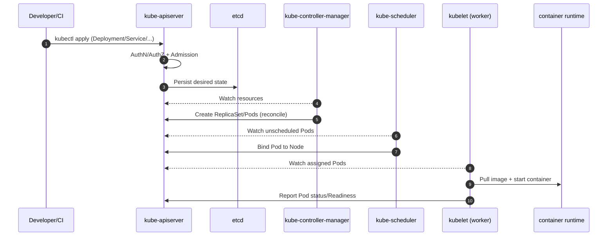
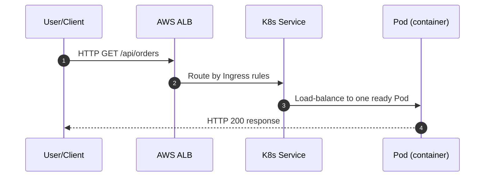
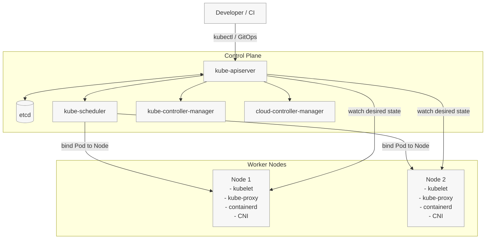
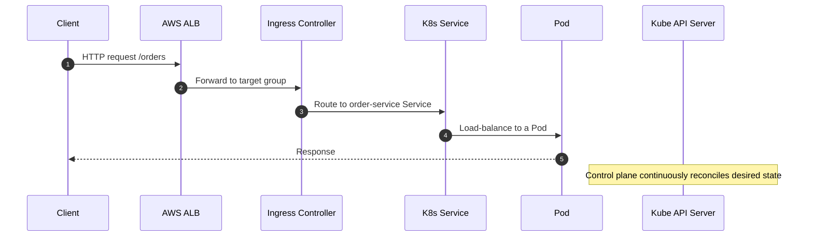

# Kubernetes Guide (Architecture + Diagrams) + Spring Boot Microservices + MySQL + AWS EKS


## Table of Contents

- [1) Introduction](#1-introduction)
- [2) Why Kubernetes is required](#2-why-kubernetes-is-required)
- [3) Core features](#3-core-features)
- [4) Advantages](#4-advantages)
- [5) Disadvantages / tradeoffs](#5-disadvantages-tradeoffs)
- [6) Kubernetes terminology (quick)](#6-kubernetes-terminology-quick)
- [7) Kubernetes architecture (Control Plane / “Master Node”) and Worker Nodes](#7-kubernetes-architecture-control-plane-master-node-and-worker-nodes)
  - [7.1 What is the master node?](#7-1-what-is-the-master-node)
  - [7.2 How Kubernetes works (request flow)](#7-2-how-kubernetes-works-request-flow)
    - [7.2.1 Cluster management flow (kubectl apply -> Pods running)](#7-2-1-cluster-management-flow-kubectl-apply-pods-running)
    - [7.2.2 Application traffic flow (end user -> Ingress/Service -> Pod)](#7-2-2-application-traffic-flow-end-user-ingress-service-pod)
  - [7.3 Architecture diagram](#7-3-architecture-diagram)
  - [7.4 Control plane components (master components)](#7-4-control-plane-components-master-components)
  - [7.4.1 Control plane components diagram](#7-4-1-control-plane-components-diagram)
  - [7.4.2 kube-apiserver (Kubernetes API Server)](#7-4-2-kube-apiserver-kubernetes-api-server)
  - [7.4.3 etcd](#7-4-3-etcd)
  - [7.4.4 kube-scheduler](#7-4-4-kube-scheduler)
  - [7.4.5 kube-controller-manager](#7-4-5-kube-controller-manager)
  - [7.4.6 cloud-controller-manager](#7-4-6-cloud-controller-manager)
  - [7.5 Worker node components](#7-5-worker-node-components)
    - [7.5.1 kubelet](#7-5-1-kubelet)
    - [7.5.2 kube-proxy](#7-5-2-kube-proxy)
    - [7.5.3 Container runtime (containerd)](#7-5-3-container-runtime-containerd)
    - [7.5.4 CNI plugin (Pod networking)](#7-5-4-cni-plugin-pod-networking)
- [8) Kubernetes objects you will use in microservices](#8-kubernetes-objects-you-will-use-in-microservices)
  - [8.1 Deployment](#8-1-deployment)
  - [8.2 Service](#8-2-service)
  - [8.3 Ingress](#8-3-ingress)
  - [8.4 ConfigMap and Secret](#8-4-configmap-and-secret)
- [9) Example: Spring Boot 3 microservices (2 services) + AWS RDS MySQL](#9-example-spring-boot-3-microservices-2-services-aws-rds-mysql)
  - [9.1 Suggested package structure (both services)](#9-1-suggested-package-structure-both-services)
  - [9.2 Dependencies (pom.xml snippets)](#9-2-dependencies-pom-xml-snippets)
  - [9.3 Order Service code (Controller + Service + Repository)](#9-3-order-service-code-controller-service-repository)
    - [Entity](#entity)
    - [Repository](#repository)
    - [Service](#service)
    - [Controller](#controller)
  - [9.4 Delivery Service code (Controller + Service + Repository)](#9-4-delivery-service-code-controller-service-repository)
    - [Entity](#entity)
    - [Repository](#repository)
    - [Service (includes an order existence check via REST)](#service-includes-an-order-existence-check-via-rest)
    - [Controller](#controller)
  - [9.5 application.yml (both services) for RDS](#9-5-application-yml-both-services-for-rds)
- [10) Containerization (Dockerfile)](#10-containerization-dockerfile)
- [11) AWS EKS Deployment (ECR + Kubernetes manifests + ALB Ingress)](#11-aws-eks-deployment-ecr-kubernetes-manifests-alb-ingress)
  - [11.1 Prerequisites](#11-1-prerequisites)
  - [11.2 Push images to Amazon ECR (high-level)](#11-2-push-images-to-amazon-ecr-high-level)
- [12) Create an EKS cluster (Method A: eksctl)](#12-create-an-eks-cluster-method-a-eksctl)
- [13) Create an EKS cluster (Method B: Terraform baseline)](#13-create-an-eks-cluster-method-b-terraform-baseline)
- [14) AWS RDS MySQL setup (recommended)](#14-aws-rds-mysql-setup-recommended)
- [15) Kubernetes manifests (Namespace, ConfigMap, Secret, Deployments, Services, Ingress)](#15-kubernetes-manifests-namespace-configmap-secret-deployments-services-ingress)
  - [15.1 Namespace](#15-1-namespace)
  - [15.2 ConfigMap (non-sensitive)](#15-2-configmap-non-sensitive)
  - [15.3 Secret (sensitive)](#15-3-secret-sensitive)
  - [15.4 Order Service Deployment + Service](#15-4-order-service-deployment-service)
  - [15.5 Delivery Service Deployment + Service](#15-5-delivery-service-deployment-service)
- [16) ALB Ingress (AWS Load Balancer Controller)](#16-alb-ingress-aws-load-balancer-controller)
  - [16.1 What it does](#16-1-what-it-does)
  - [16.2 Install AWS Load Balancer Controller (high-level)](#16-2-install-aws-load-balancer-controller-high-level)
  - [16.3 Ingress resource example](#16-3-ingress-resource-example)
- [17) Apply manifests (deployment order)](#17-apply-manifests-deployment-order)
- [18) Kubernetes architecture diagram (expanded “how traffic flows”)](#18-kubernetes-architecture-diagram-expanded-how-traffic-flows)
- [19) Master vs Worker nodes (summary)](#19-master-vs-worker-nodes-summary)
- [20) Common production considerations (short)](#20-common-production-considerations-short)


---

## 1) Introduction
Kubernetes (K8s) is an open-source container orchestration platform that automates the deployment, scaling, and management of containerized applications.

At a high level, you:
- Build a container image for your app
- Tell Kubernetes the *desired state* (how many instances, what resources, how to expose it)
- Kubernetes continuously works to keep the actual state matching that desired state


## 2) Why Kubernetes is required
Kubernetes is typically introduced when you outgrow “single server + docker compose” deployments.

Common reasons:
- **High availability**: if a container or node fails, Kubernetes reschedules workloads.
- **Scaling**: increase/decrease replicas based on load.
- **Operational consistency**: same deployment model across dev/stage/prod.
- **Service discovery + networking**: stable service names even when pods change.
- **Release management**: rolling updates, canary-style patterns (with extra tooling), and quick rollback.
- **Infrastructure abstraction**: run on-prem or cloud (EKS/GKE/AKS) with similar primitives.


## 3) Core features
- **Declarative configuration**: YAML manifests define desired state.
- **Self-healing**: restarts crashed containers, replaces Pods, reschedules on healthy nodes.
- **Horizontal scaling**: scale Pods manually or automatically (HPA).
- **Service discovery & load balancing**: `Service` provides a stable virtual IP/DNS.
- **Storage orchestration**: attach persistent storage with PV/PVC.
- **Automated rollouts/rollbacks**: `Deployment` updates with health checks.
- **Configuration management**: `ConfigMap` and `Secret`.
- **Observability hooks**: readiness/liveness probes, events, metrics integrations.


## 4) Advantages
- **Reliability** through self-healing and replica management.
- **Scalability** at service and cluster level.
- **Portability** across clouds and environments.
- **Strong ecosystem**: ingress controllers, service meshes, operators.
- **Standardization**: common primitives for most distributed systems.


## 5) Disadvantages / tradeoffs
- **Operational complexity**: cluster management, networking, security, upgrades.
- **Learning curve**: many concepts (Pods, Deployments, Services, Ingress, RBAC, etc.).
- **Debugging complexity**: distributed issues, networking policies, DNS.
- **Cost**: worker nodes, load balancers, NAT gateways, observability stack.
- **Not always required**: small apps may be simpler on App Runner/Elastic Beanstalk/EC2.


## 6) Kubernetes terminology (quick)
- **Cluster**: a set of nodes managed by a control plane.
- **Node**: a machine (VM/instance) that runs workloads.
- **Pod**: smallest deployable unit; usually one container (sometimes sidecars).
- **Deployment**: manages Pods via ReplicaSets; supports rolling updates.
- **Service**: stable networking endpoint for a set of Pods.
- **Ingress**: HTTP/HTTPS routing to Services (requires an Ingress Controller).
- **ConfigMap/Secret**: configuration and sensitive values.
- **Namespace**: logical partitioning inside a cluster.
- **HPA**: Horizontal Pod Autoscaler.


## 7) Kubernetes architecture (Control Plane / “Master Node”) and Worker Nodes
### 7.1 What is the master node?
Historically, Kubernetes used the term **master node** to describe nodes running control-plane components.

In modern Kubernetes and managed services (like **AWS EKS**), you usually talk about:
- **Control Plane**: managed by AWS (EKS) or self-hosted.
- **Worker Nodes**: where your Pods run.

### 7.2 How Kubernetes works (request flow)

There are two common “request flows” you should understand:
- **Cluster management flow** (when you apply YAML / change desired state)
- **Application traffic flow** (when an end user calls your API)

#### 7.2.1 Cluster management flow (kubectl apply -> Pods running)
1. You apply YAML (`kubectl apply -f ...`).
2. The request hits the **kube-apiserver**.
3. The API server runs:
   - Authentication/Authorization (RBAC)
   - Admission controllers (validate/mutate)
4. The API server persists the desired state into **etcd**.
5. Controllers (inside **kube-controller-manager**) detect changes and create/update dependent objects.
   - Example: a `Deployment` leads to a `ReplicaSet`, which leads to `Pod` objects.
6. The **kube-scheduler** watches for Pods with no assigned node and selects the best worker node.
7. The scheduler writes a **binding** back through the API server (Pod -> Node).
8. The **kubelet** on the chosen worker node watches the API server, pulls the image, and starts containers via the container runtime.
9. The **Service/EndpointSlice controllers** update Service endpoints as Pods become Ready.
10. Kubernetes keeps reconciling continuously (self-healing): if a Pod dies or a node becomes unhealthy, controllers recreate/reschedule.



#### 7.2.2 Application traffic flow (end user -> Ingress/Service -> Pod)
For a typical AWS EKS setup with **ALB Ingress**:
1. A client sends an HTTP request to your domain.
2. AWS **ALB** receives the request and forwards it to Kubernetes targets (Pods) based on Ingress rules.
3. The Ingress controller (AWS Load Balancer Controller) ensures ALB listeners/rules/target groups match your Kubernetes `Ingress` resources.
4. Inside the cluster, Kubernetes `Service` provides stable discovery and load-balancing across matching Pods.
5. The chosen Pod handles the request and returns the response.



### 7.3 Architecture diagram


### 7.4 Control plane components (master components)

The **control plane** (often referred to as the “master node” in older terminology) is required because Kubernetes needs a *central place* to:
- Accept and validate requests (the API)
- Persist the desired state reliably
- Decide where workloads should run
- Continuously reconcile actual state back to desired state

### 7.4.1 Control plane components diagram
```mermaid
flowchart LR
  client[Developer / CI\n(kubectl, GitOps)] --> apiserver[kube-apiserver]

  apiserver <--> etcd[(etcd)]
  apiserver --> scheduler[kube-scheduler]
  apiserver --> kcm[kube-controller-manager]
  apiserver --> ccm[cloud-controller-manager]

  scheduler -->|bind Pod to Node| apiserver
  kcm -->|create/update objects\n(ReplicaSets, Endpoints...)| apiserver
  ccm -->|provision cloud resources\n(LB, routes, nodes)| cloud[(AWS APIs)]

  apiserver -->|watch desired state| kubelet[kubelet (on worker nodes)]
```

### 7.4.2 kube-apiserver (Kubernetes API Server)
- **What it is**
  - The **front door** of the Kubernetes control plane.
  - Everything (kubectl, controllers, scheduler, kubelets, operators) talks to the cluster through the API server.
- **Core responsibilities**
  - **Authentication** (who are you?)
  - **Authorization** (are you allowed?) via RBAC/ABAC
  - **Admission control** (mutate/validate requests, enforce policies)
  - **Validation** of object specs and API versions
  - **Persistence coordination** by writing the final desired state into `etcd`
  - **Watch/notify**: clients and controllers watch resources via the API server
- **Why it’s required**
  - Kubernetes needs a single, consistent API endpoint so every actor uses the same source of truth and policies.

### 7.4.3 etcd
- **What it is**
  - A distributed, strongly consistent key-value store used by Kubernetes to store **all cluster state**.
- **Core responsibilities**
  - Stores objects like Deployments, Pods, Services, Secrets, ConfigMaps, Node info, and more.
  - Provides **consistency and durability** for desired state.
  - Enables watch semantics (through the API server) because changes are persisted.
- **Why it’s required**
  - Without a reliable state store, Kubernetes cannot reconcile desired vs actual state, recover from failures, or coordinate controllers.

### 7.4.4 kube-scheduler
- **What it is**
  - The component that chooses **which worker node** should run each unscheduled Pod.
- **Core responsibilities**
  - Watches for Pods that need scheduling.
  - Scores/filter nodes based on:
    - CPU/memory availability (requests)
    - Node selectors/labels
    - Taints and tolerations
    - Affinity/anti-affinity rules
    - Topology spread constraints
  - Writes the Pod-to-Node binding back via the API server.
- **Why it’s required**
  - In a multi-node cluster, Kubernetes needs a centralized placement decision-maker to ensure efficient and policy-compliant workload distribution.

### 7.4.5 kube-controller-manager
- **What it is**
  - A process that runs many **controllers**, each responsible for a specific reconciliation loop.
- **Core responsibilities**
  - Controllers continuously compare **desired state** to **actual state** and take action.
  - Examples of controllers you rely on daily:
    - **Deployment/ReplicaSet controller**: ensures desired replica count
    - **Node controller**: monitors node health and reacts to node loss
    - **Endpoints/EndpointSlice controller**: keeps Service endpoints updated as Pods change
    - **Job controller**: ensures batch jobs run to completion
- **Why it’s required**
  - This is the “automation engine” that makes Kubernetes self-healing and declarative. Without controllers, Kubernetes would not converge to the desired state.

### 7.4.6 cloud-controller-manager
- **What it is**
  - A controller set that integrates Kubernetes with the underlying **cloud provider**.
- **Core responsibilities**
  - Manages cloud-specific resources, commonly:
    - **Load balancers** for `Service` type `LoadBalancer` and Ingress controllers (depending on setup)
    - **Node lifecycle** (cloud instance metadata, node addresses)
    - **Routes** (in some environments)
    - **Volumes** (often via CSI drivers now, but still cloud-integrated)
- **Why it’s required**
  - Kubernetes is cloud-agnostic by design; this component provides the glue so Kubernetes objects can map to real AWS resources.

### 7.5 Worker node components

A **worker node** is the machine (VM/EC2 instance) where your **Pods actually run**. The control plane decides *what should run and where*, and worker nodes do the *execution*.

Worker nodes are required because Kubernetes separates:
- **Decision and coordination** (control plane)
- **Workload execution** (worker nodes)

#### 7.5.1 kubelet
- **What it is**
  - The **node agent** that runs on every worker node.
- **Core responsibilities**
  - Watches the API server for Pods scheduled to this node.
  - Uses the container runtime to:
    - Pull images
    - Create/start/stop containers
  - Manages Pod lifecycle:
    - Mount volumes
    - Run init containers
    - Restart containers based on restart policy
  - Runs health checks:
    - **Readiness probes** (should traffic be sent?)
    - **Liveness probes** (should container be restarted?)
  - Reports node and Pod status back to the API server.
- **Why it’s required**
  - Kubernetes needs a per-node “executor” to turn desired state into running containers and to continuously report actual state.
- **When it’s called / invoked**
  - When the scheduler binds a Pod to the node (kubelet observes it).
  - When a Deployment scales up/down (new Pods appear/disappear).
  - During rollouts/rollbacks (new ReplicaSet Pods are created).
  - Continuously, to run probes and report status.

#### 7.5.2 kube-proxy
- **What it is**
  - A networking component that implements Kubernetes **Service** virtual IP behavior on each node.
- **Core responsibilities**
  - Programs node networking rules (iptables/IPVS) so that:
    - Traffic to a `Service` ClusterIP is forwarded to one of the backing Pod IPs.
    - `NodePort` and certain load-balancing paths work correctly.
- **Why it’s required**
  - Pods are ephemeral and their IPs change. Services must remain stable; kube-proxy enables that stable service abstraction.
- **When it’s called / invoked**
  - Whenever Services/Endpoints/EndpointSlices change (kube-proxy watches API server and updates rules).
  - On every request that targets a Service VIP, the programmed rules route traffic to a Pod.

#### 7.5.3 Container runtime (containerd)
- **What it is**
  - The software that actually runs containers (on most modern clusters: **containerd**).
- **Core responsibilities**
  - Pull images and manage image caches.
  - Create/start/stop containers.
  - Manage low-level container isolation via the OS kernel (namespaces/cgroups).
- **Why it’s required**
  - Kubernetes itself does not run containers directly; it delegates to a standard runtime via CRI.
- **When it’s called / invoked**
  - When kubelet needs to start/stop a Pod’s containers (scale up/down, rollouts, failures).

#### 7.5.4 CNI plugin (Pod networking)
- **What it is**
  - The plugin responsible for giving Pods network connectivity and IP addresses.
  - On EKS the default is **Amazon VPC CNI**.
- **Core responsibilities**
  - Assigns IPs to Pods and connects them to the cluster network.
  - Ensures Pods can reach:
    - Other Pods
    - Services
    - External endpoints (like AWS RDS), depending on routing/NAT setup
- **Why it’s required**
  - Without a CNI, Pods would not have routable IPs or consistent connectivity across nodes.
- **When it’s called / invoked**
  - When a Pod is created and needs networking set up.
  - When Pods are deleted and IPs/routes need cleanup.


## 8) Kubernetes objects you will use in microservices
### 8.1 Deployment
- Defines desired replicas, Pod template, rolling update strategy.

### 8.2 Service
- Stable endpoint for Pods.
- Common types:
  - `ClusterIP` (internal)
  - `NodePort`
  - `LoadBalancer` (cloud LB)

### 8.3 Ingress
- Layer 7 HTTP routing.
- Requires an Ingress Controller.
- On AWS, common approach is **AWS Load Balancer Controller** to create an **ALB**.

### 8.4 ConfigMap and Secret
- `ConfigMap`: non-sensitive config.
- `Secret`: passwords/tokens/keys.


## 9) Example: Spring Boot 3 microservices (2 services) + AWS RDS MySQL
This example shows 2 microservices:
- **order-service**: CRUD orders (stored in MySQL).
- **delivery-service**: CRUD deliveries (stored in MySQL) and calls order-service to validate order existence.

### 9.1 Suggested package structure (both services)
- `controller` layer: REST endpoints
- `service` layer: business logic
- `repository` layer: Spring Data JPA
- `entity` layer: JPA entities

### 9.2 Dependencies (pom.xml snippets)
Use Java 17 (or higher) with Spring Boot 3.

**Order Service** dependencies:
```xml
<dependencies>
  <dependency>
    <groupId>org.springframework.boot</groupId>
    <artifactId>spring-boot-starter-web</artifactId>
  </dependency>
  <dependency>
    <groupId>org.springframework.boot</groupId>
    <artifactId>spring-boot-starter-data-jpa</artifactId>
  </dependency>
  <dependency>
    <groupId>com.mysql</groupId>
    <artifactId>mysql-connector-j</artifactId>
    <scope>runtime</scope>
  </dependency>
  <dependency>
    <groupId>org.springframework.boot</groupId>
    <artifactId>spring-boot-starter-actuator</artifactId>
  </dependency>
</dependencies>
```

**Delivery Service** dependencies (plus `RestClient` support):
```xml
<dependencies>
  <dependency>
    <groupId>org.springframework.boot</groupId>
    <artifactId>spring-boot-starter-web</artifactId>
  </dependency>
  <dependency>
    <groupId>org.springframework.boot</groupId>
    <artifactId>spring-boot-starter-data-jpa</artifactId>
  </dependency>
  <dependency>
    <groupId>com.mysql</groupId>
    <artifactId>mysql-connector-j</artifactId>
    <scope>runtime</scope>
  </dependency>
  <dependency>
    <groupId>org.springframework.boot</groupId>
    <artifactId>spring-boot-starter-actuator</artifactId>
  </dependency>
</dependencies>
```

### 9.3 Order Service code (Controller + Service + Repository)
#### Entity
```java
package com.example.orders.entity;

import jakarta.persistence.*;

@Entity
@Table(name = "orders")
public class Order {
  @Id
  @GeneratedValue(strategy = GenerationType.IDENTITY)
  private Long id;

  @Column(nullable = false)
  private String customerName;

  @Column(nullable = false)
  private String status; // e.g. CREATED, CONFIRMED, DELIVERED

  // getters/setters
}
```

#### Repository
```java
package com.example.orders.repository;

import com.example.orders.entity.Order;
import org.springframework.data.jpa.repository.JpaRepository;

public interface OrderRepository extends JpaRepository<Order, Long> {}
```

#### Service
```java
package com.example.orders.service;

import com.example.orders.entity.Order;
import com.example.orders.repository.OrderRepository;
import org.springframework.stereotype.Service;

import java.util.List;

@Service
public class OrderService {
  private final OrderRepository repo;

  public OrderService(OrderRepository repo) {
    this.repo = repo;
  }

  public Order create(Order order) {
    order.setStatus(order.getStatus() == null ? "CREATED" : order.getStatus());
    return repo.save(order);
  }

  public Order getById(Long id) {
    return repo.findById(id).orElseThrow(() -> new IllegalArgumentException("Order not found: " + id));
  }

  public List<Order> list() {
    return repo.findAll();
  }
}
```

#### Controller
```java
package com.example.orders.controller;

import com.example.orders.entity.Order;
import com.example.orders.service.OrderService;
import org.springframework.web.bind.annotation.*;

import java.util.List;

@RestController
@RequestMapping("/api/orders")
public class OrderController {
  private final OrderService service;

  public OrderController(OrderService service) {
    this.service = service;
  }

  @PostMapping
  public Order create(@RequestBody Order order) {
    return service.create(order);
  }

  @GetMapping("/{id}")
  public Order get(@PathVariable Long id) {
    return service.getById(id);
  }

  @GetMapping
  public List<Order> list() {
    return service.list();
  }
}
```

### 9.4 Delivery Service code (Controller + Service + Repository)
#### Entity
```java
package com.example.delivery.entity;

import jakarta.persistence.*;

@Entity
@Table(name = "deliveries")
public class Delivery {
  @Id
  @GeneratedValue(strategy = GenerationType.IDENTITY)
  private Long id;

  @Column(nullable = false)
  private Long orderId;

  @Column(nullable = false)
  private String courierName;

  @Column(nullable = false)
  private String status; // ASSIGNED, PICKED_UP, DELIVERED

  // getters/setters
}
```

#### Repository
```java
package com.example.delivery.repository;

import com.example.delivery.entity.Delivery;
import org.springframework.data.jpa.repository.JpaRepository;

public interface DeliveryRepository extends JpaRepository<Delivery, Long> {}
```

#### Service (includes an order existence check via REST)
Use service discovery inside Kubernetes via DNS name: `http://order-service:8080`.

```java
package com.example.delivery.service;

import com.example.delivery.entity.Delivery;
import com.example.delivery.repository.DeliveryRepository;
import org.springframework.beans.factory.annotation.Value;
import org.springframework.stereotype.Service;
import org.springframework.web.client.RestClient;

import java.util.List;

@Service
public class DeliveryService {
  private final DeliveryRepository repo;
  private final RestClient restClient;

  private final String orderServiceBaseUrl;

  public DeliveryService(DeliveryRepository repo,
                         RestClient.Builder restClientBuilder,
                         @Value("${services.order.base-url}") String orderServiceBaseUrl) {
    this.repo = repo;
    this.restClient = restClientBuilder.build();
    this.orderServiceBaseUrl = orderServiceBaseUrl;
  }

  public Delivery create(Delivery delivery) {
    // Validate order exists
    restClient.get()
        .uri(orderServiceBaseUrl + "/api/orders/" + delivery.getOrderId())
        .retrieve()
        .toBodilessEntity();

    delivery.setStatus(delivery.getStatus() == null ? "ASSIGNED" : delivery.getStatus());
    return repo.save(delivery);
  }

  public Delivery getById(Long id) {
    return repo.findById(id).orElseThrow(() -> new IllegalArgumentException("Delivery not found: " + id));
  }

  public List<Delivery> list() {
    return repo.findAll();
  }
}
```

#### Controller
```java
package com.example.delivery.controller;

import com.example.delivery.entity.Delivery;
import com.example.delivery.service.DeliveryService;
import org.springframework.web.bind.annotation.*;

import java.util.List;

@RestController
@RequestMapping("/api/deliveries")
public class DeliveryController {
  private final DeliveryService service;

  public DeliveryController(DeliveryService service) {
    this.service = service;
  }

  @PostMapping
  public Delivery create(@RequestBody Delivery delivery) {
    return service.create(delivery);
  }

  @GetMapping("/{id}")
  public Delivery get(@PathVariable Long id) {
    return service.getById(id);
  }

  @GetMapping
  public List<Delivery> list() {
    return service.list();
  }
}
```

### 9.5 application.yml (both services) for RDS
Each service should typically have its own database/schema. Example values:

**order-service `application.yml`**:
```yaml
server:
  port: 8080

spring:
  datasource:
    url: jdbc:mysql://${DB_HOST}:${DB_PORT}/${DB_NAME}?useSSL=true&requireSSL=true
    username: ${DB_USER}
    password: ${DB_PASSWORD}
  jpa:
    hibernate:
      ddl-auto: update

management:
  endpoints:
    web:
      exposure:
        include: health,info
```

**delivery-service `application.yml`**:
```yaml
server:
  port: 8080

services:
  order:
    base-url: ${ORDER_SERVICE_BASE_URL:http://order-service:8080}

spring:
  datasource:
    url: jdbc:mysql://${DB_HOST}:${DB_PORT}/${DB_NAME}?useSSL=true&requireSSL=true
    username: ${DB_USER}
    password: ${DB_PASSWORD}
  jpa:
    hibernate:
      ddl-auto: update

management:
  endpoints:
    web:
      exposure:
        include: health,info
```


## 10) Containerization (Dockerfile)
Use a multi-stage build for smaller images.

```dockerfile
# ---- build stage ----
FROM maven:3.9-eclipse-temurin-17 AS build
WORKDIR /app
COPY pom.xml .
COPY src ./src
RUN mvn -q -DskipTests package

# ---- runtime stage ----
FROM eclipse-temurin:17-jre
WORKDIR /app
COPY --from=build /app/target/*.jar app.jar
EXPOSE 8080
ENTRYPOINT ["java", "-jar", "/app/app.jar"]
```


## 11) AWS EKS Deployment (ECR + Kubernetes manifests + ALB Ingress)
### 11.1 Prerequisites
- AWS account + IAM permissions
- AWS CLI configured (`aws configure`)
- `kubectl`
- `eksctl` (for the eksctl method)
- (Optional) Terraform installed (for Terraform method)

### 11.2 Push images to Amazon ECR (high-level)
Steps:
- Create ECR repositories: `order-service` and `delivery-service`
- Build docker images
- Login to ECR and push

Example commands (replace placeholders):
```bash
aws ecr create-repository --repository-name order-service
aws ecr create-repository --repository-name delivery-service

aws ecr get-login-password --region <region> | docker login --username AWS --password-stdin <accountId>.dkr.ecr.<region>.amazonaws.com

docker build -t order-service:1.0.0 .
docker tag order-service:1.0.0 <accountId>.dkr.ecr.<region>.amazonaws.com/order-service:1.0.0
docker push <accountId>.dkr.ecr.<region>.amazonaws.com/order-service:1.0.0
```


## 12) Create an EKS cluster (Method A: eksctl)
Example `eksctl` command:
```bash
eksctl create cluster \
  --name demo-microservices \
  --region ap-south-1 \
  --version 1.29 \
  --managed \
  --nodes 2 \
  --node-type t3.medium
```
Update kubeconfig:
```bash
aws eks update-kubeconfig --region ap-south-1 --name demo-microservices
```


## 13) Create an EKS cluster (Method B: Terraform baseline)
A minimal Terraform setup usually includes:
- VPC (or use an existing one)
- EKS cluster
- Managed node group

Skeleton snippet (illustrative; you should adapt for your org/VPC standards):
```hcl
terraform {
  required_providers {
    aws = {
      source  = "hashicorp/aws"
      version = "~> 5.0"
    }
  }
}

provider "aws" {
  region = "ap-south-1"
}

module "eks" {
  source  = "terraform-aws-modules/eks/aws"
  version = "~> 20.0"

  cluster_name    = "demo-microservices"
  cluster_version = "1.29"

  vpc_id     = var.vpc_id
  subnet_ids = var.subnet_ids

  eks_managed_node_groups = {
    default = {
      instance_types = ["t3.medium"]
      desired_size   = 2
      min_size       = 2
      max_size       = 4
    }
  }
}
```


## 14) AWS RDS MySQL setup (recommended)
High-level steps:
- Create an RDS MySQL instance.
- Ensure network access:
  - The RDS instance should be reachable from EKS worker nodes.
  - Most commonly: RDS in private subnets, EKS nodes in same VPC; allow inbound MySQL (3306) from node security group.
- Create separate databases:
  - `orders_db` and `delivery_db` (recommended)

You will use the RDS endpoint as `DB_HOST`.


## 15) Kubernetes manifests (Namespace, ConfigMap, Secret, Deployments, Services, Ingress)
Below is a practical baseline. You will replace:
- ECR image URLs
- DB host/user/password
- certificate/domain info (optional)

### 15.1 Namespace
```yaml
apiVersion: v1
kind: Namespace
metadata:
  name: demo
```

### 15.2 ConfigMap (non-sensitive)
```yaml
apiVersion: v1
kind: ConfigMap
metadata:
  name: app-config
  namespace: demo
data:
  DB_PORT: "3306"
  ORDER_SERVICE_BASE_URL: "http://order-service.demo.svc.cluster.local:8080"
```

### 15.3 Secret (sensitive)
```yaml
apiVersion: v1
kind: Secret
metadata:
  name: db-secret
  namespace: demo
type: Opaque
stringData:
  DB_HOST: "<rds-endpoint-without-port>"
  DB_USER: "<db-user>"
  DB_PASSWORD: "<db-password>"
```

### 15.4 Order Service Deployment + Service
```yaml
apiVersion: apps/v1
kind: Deployment
metadata:
  name: order-service
  namespace: demo
spec:
  replicas: 2
  selector:
    matchLabels:
      app: order-service
  template:
    metadata:
      labels:
        app: order-service
    spec:
      containers:
        - name: order-service
          image: <accountId>.dkr.ecr.<region>.amazonaws.com/order-service:1.0.0
          ports:
            - containerPort: 8080
          env:
            - name: DB_PORT
              valueFrom:
                configMapKeyRef:
                  name: app-config
                  key: DB_PORT
            - name: DB_HOST
              valueFrom:
                secretKeyRef:
                  name: db-secret
                  key: DB_HOST
            - name: DB_USER
              valueFrom:
                secretKeyRef:
                  name: db-secret
                  key: DB_USER
            - name: DB_PASSWORD
              valueFrom:
                secretKeyRef:
                  name: db-secret
                  key: DB_PASSWORD
            - name: DB_NAME
              value: "orders_db"
          readinessProbe:
            httpGet:
              path: /actuator/health
              port: 8080
            initialDelaySeconds: 20
            periodSeconds: 10
          livenessProbe:
            httpGet:
              path: /actuator/health
              port: 8080
            initialDelaySeconds: 60
            periodSeconds: 20
---
apiVersion: v1
kind: Service
metadata:
  name: order-service
  namespace: demo
spec:
  type: ClusterIP
  selector:
    app: order-service
  ports:
    - name: http
      port: 8080
      targetPort: 8080
```

### 15.5 Delivery Service Deployment + Service
```yaml
apiVersion: apps/v1
kind: Deployment
metadata:
  name: delivery-service
  namespace: demo
spec:
  replicas: 2
  selector:
    matchLabels:
      app: delivery-service
  template:
    metadata:
      labels:
        app: delivery-service
    spec:
      containers:
        - name: delivery-service
          image: <accountId>.dkr.ecr.<region>.amazonaws.com/delivery-service:1.0.0
          ports:
            - containerPort: 8080
          env:
            - name: DB_PORT
              valueFrom:
                configMapKeyRef:
                  name: app-config
                  key: DB_PORT
            - name: ORDER_SERVICE_BASE_URL
              valueFrom:
                configMapKeyRef:
                  name: app-config
                  key: ORDER_SERVICE_BASE_URL
            - name: DB_HOST
              valueFrom:
                secretKeyRef:
                  name: db-secret
                  key: DB_HOST
            - name: DB_USER
              valueFrom:
                secretKeyRef:
                  name: db-secret
                  key: DB_USER
            - name: DB_PASSWORD
              valueFrom:
                secretKeyRef:
                  name: db-secret
                  key: DB_PASSWORD
            - name: DB_NAME
              value: "delivery_db"
          readinessProbe:
            httpGet:
              path: /actuator/health
              port: 8080
            initialDelaySeconds: 20
            periodSeconds: 10
          livenessProbe:
            httpGet:
              path: /actuator/health
              port: 8080
            initialDelaySeconds: 60
            periodSeconds: 20
---
apiVersion: v1
kind: Service
metadata:
  name: delivery-service
  namespace: demo
spec:
  type: ClusterIP
  selector:
    app: delivery-service
  ports:
    - name: http
      port: 8080
      targetPort: 8080
```


## 16) ALB Ingress (AWS Load Balancer Controller)
### 16.1 What it does
AWS Load Balancer Controller watches Kubernetes Ingress resources and provisions an **Application Load Balancer** (ALB) on AWS.

### 16.2 Install AWS Load Balancer Controller (high-level)
Typical steps:
- Associate IAM OIDC provider with the cluster
- Create IAM policy + IAM role for service account
- Install controller (usually via Helm)

Because these steps require AWS-specific values, follow AWS docs for the exact commands for your region/cluster.

### 16.3 Ingress resource example
This routes:
- `/orders` -> order-service
- `/deliveries` -> delivery-service

```yaml
apiVersion: networking.k8s.io/v1
kind: Ingress
metadata:
  name: demo-ingress
  namespace: demo
  annotations:
    kubernetes.io/ingress.class: alb
    alb.ingress.kubernetes.io/scheme: internet-facing
    alb.ingress.kubernetes.io/target-type: ip
    alb.ingress.kubernetes.io/listen-ports: '[{"HTTP":80}]'
spec:
  rules:
    - http:
        paths:
          - path: /orders
            pathType: Prefix
            backend:
              service:
                name: order-service
                port:
                  number: 8080
          - path: /deliveries
            pathType: Prefix
            backend:
              service:
                name: delivery-service
                port:
                  number: 8080
```

If you want your public API paths to match your controllers (`/api/orders`), you can:
- Either call `/orders/api/orders` externally
- Or adjust Ingress paths to `/api/orders` and `/api/deliveries`


## 17) Apply manifests (deployment order)
```bash
kubectl apply -f namespace.yaml
kubectl apply -f configmap.yaml
kubectl apply -f secret.yaml
kubectl apply -f order-service.yaml
kubectl apply -f delivery-service.yaml
kubectl apply -f ingress.yaml
```

Useful checks:
```bash
kubectl -n demo get pods
kubectl -n demo get svc
kubectl -n demo get ingress
kubectl -n demo describe ingress demo-ingress
```


## 18) Kubernetes architecture diagram (expanded “how traffic flows”)



## 19) Master vs Worker nodes (summary)
- **Master/Control Plane**
  - Accepts and validates requests
  - Stores cluster state
  - Schedules workloads
  - Runs controllers
- **Worker Nodes**
  - Run Pods
  - Provide networking and service routing
  - Report node/pod status back to control plane


## 20) Common production considerations (short)
- **Resource requests/limits** for CPU/memory.
- **Autoscaling** (HPA) based on CPU/memory or custom metrics.
- **Security**: RBAC, network policies, secrets management.
- **Database credentials**: consider AWS Secrets Manager + external-secrets.
- **Observability**: logs, metrics (Prometheus), tracing (OpenTelemetry).
- **Config strategy**: GitOps (Argo CD/Flux).

